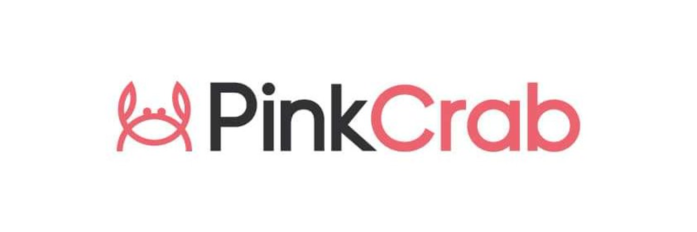

# Perique Framework 

The Perique Framework offers a highly extendable platform for building WordPress Plugins and themes in a MVC inspired style. At its heart the base of Perique is a lightweight system that allows developers to build their Plugins with the use of Composer Packages with the power of Dependency Injection and an internal registration process which removes the need for hook files and less than ideal static **Plugin::init()** methods.

## Core Components

At its heart the Perique Framework offers a DI Container, Hook Loader, Custom class loader, View and Config. These can be used be custom plugins in any style or structure you wish.

* ### DI Container (DICE)
* ### Hook Loader
* ### Registration (class loader)
* ### View
* ### App Config

## Setup 

Setup is fairly easy, you can make use of out boilerplate packages or just roll the framework into your own Plugin or Theme using composer  
```$ composer require xx```

Read the full setup instruction here

## Configuration

The core Application can take 3 configuration arrays. You can define these as you wish, either directly in your plugin.php file or by using external files. Throughout these docs we will be using example of using external files held in `config/{file}.php` but you are free to do this however works for you.

Read configuration guide here

## Extendability

While out of the box Perique comes with DICE for Dependency Injection and a basic PHP View Engine, these can replaced to make use of Blade, Mustache, Pimple or any other packages. We make use of various Interfaces throughout the Framework, so its just a case of writing a bridge to use any implementation you wish. 

Click here to find more about writing custom implementations for internal interfaces

On top of these low level changes, Perique makes use of custom **Registration_Middleware** allowing you to hook in the initial class loader and run additional processes. Out of the box we include the **Hookable** interface which allows for the creation of controllers, but we also offer additional Modules and its easy to create your own implementations too.

Click here for details on the **Registration** process and extending via **Registration Middleware**.

As this is WordPress we are working with, we have a number of hooks (Actions and Filters) which are fired during the initialisation process. This allows you to create a **CORE** application which other plugins can hook into.

Click here for more information about the hooks we use.

## Dependencies

The Core of Perique is very slim and makes use of a few dependencies either our own or via . For the sake of completeness these Dependencies are documented here.

* **Hook_Loader** - The primary loader used to registering all Actions and Filters throughout the framework (Read more)
* **DICE** - An externally developed, light weight Dependency Injection Container created by [Tom Butler](https://r.je/dice). (Read More) ([DICE GitHub](https://github.com/Level-2/Dice))
* **PSR11 (Container)** - The PHP-FIG interface for Containers, we use this as a base to our own DI_Container interface ([Read More](https://www.php-fig.org/psr/psr-11/))
* **Collection** A class based Collection for making working with arrays/lists cleaner. Comes with the ability to create simple typed collections. 
## Modules 

While you can extend Perique to do anything you need, we also have a collection of Modules created to give access commonly used functionality. In the years we have been using Perique (and predecessors), these are modules we have used over and over. In previous versions, these modules were a part of the core package.

* **Registerables** - This small module gives access easy to create, object based implementations for Post_Types, Taxonomies, Meta and Meta Boxes. (Read more)
* **Ajax** Ajax calls are an integral part of most Wordpress projects and can be verbose to create every time. This module allows you to create simple and PSR7 compliant Ajax calls using WP_Ajax (Read more)
* **BladeOne** - Out of the box we only offer a basic PHP based view engine, but this module allows the use of Blade via the BladeOne package, along with its BladeOne HTML module included. 
* **Hook_Subscriber** - Sometimes creating entire Controllers is a bit excessive, especially if you only want to trigger on a single action. The Hook_Subscriber modules allows you to create single subscribers with the ability to delay the registration of callbacks to specific actions. (Read more)

* **Admin_Menu** - This small module allows for the creation of OOP menu pages and groups. With ease of enqueueing and triggering pre-load actions. Can be used with BladeOne to create Blade driven templates.

## License 

MIT License
[http://www.opensource.org/licenses/mit-license.html](http://www.opensource.org/licenses/mit-license.html)