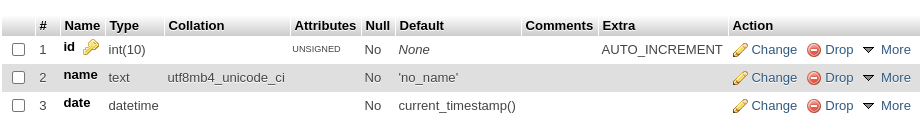

# Examples

> **Related Pages**
>
> » [Schema](Schema.md)
> 
> » [Index](Table_Index.md)
> 
> » [Foreign_Key](Foreign_Key.md) 
> 
> » [Examples](examples.md)

### Simple Table

``` php
use PinkCrab\Modules\Table_Builder\Table_Schema;
use PinkCrab\Modules\Table_Builder\Builders\DB_Delta;

// Define the table (Indvidual method calls)
$schema = new Schema( 'simple_table' );

// Columns
$schema->column( 'id' )->unsigned_int(10)->auto_increment();
$schema->column( 'name' )->text()->default( 'no_name' );	
$schema->column( 'date' )->datetime( 'CURRENT_TIMESTAMP' );

// Set a primary key.
$schema->index('id')->primary();

			
// Construct builder.
global $wpdb;
$engine  = new DB_Delta_Engine($wpdb);
$builder = new Builder($engine);

// Build table.
$builder->create_table($table);
```



### Simple Table with Unique Indexes

Using the TableIndex class, you can define if a column is unique, full\_text and even using hashing if enabled with mysql.

All users are unique, without any duplicated emails or user ids. The 2 are set as named, indexes

``` php
use PinkCrab\Modules\Table_Builder\Table_Index;
use PinkCrab\Modules\Table_Builder\Table_Schema;
use PinkCrab\Modules\Table_Builder\Builders\DB_Delta;

// Define the table (Chained)
$parent_table = new Schema('unique_users', function(Schema $schema){		
	$schema->column( 'id' )->unsigned_int(10)->auto_increment();			
	$schema->column( 'user_id' )->varchar( 16 );	
	$schema->column( 'user_email' )->varchar( 256 );			
	$schema->column( 'created_on' )->datetime( 'CURRENT_TIMESTAMP');
	$schema->column( 'last_updated' )->datetime('CURRENT_TIMESTAMP');
	
	$schema->index('user_id')->unique();
	$schema->index('user_email')->unique();
});	
// Construct builder.
global $wpdb;
$builder = new DB_Delta($wpdb); 

// Build table.
$table->create_table($builder);
```


### Parent with Children References.

We can create cross-referenced Parent/Child indexes. This is fairly limited to this example and the simpler indexes above but is more than suitable for the majority of WordPress Plugins and Themes. 

``` php
// Define the table schema

$parent_table = new Schema('parent_table', function(Schema $schema){		
	$schema->column( 'id' )->unsigned_int(16)->auto_increment();
	$schema->column( 'name' )->varchar(256);		
	
	$schema->index('id')->primary();
});	
	
$child_table = new Schema('child_table', function(Schema $schema){	
	$schema->column( 'id' )->unsigned_int(16)->auto_increment();
	$schema->column( 'name' )->varchar(256);
	$schema->column( 'parent' )->unsigned_int(16);
	
	$schema->index('id')->primary();

	$schema->foreign_key('parent', 'parent')
        ->reference('parent_table', 'id')
		->on_delete( 'CASCADE' );
	);
});
			
// Construct builder.
global $wpdb;
$engine  = new DB_Delta_Engine($wpdb);
$builder = new Builder($engine);

// Build tables.
$builder->create_table($parent_table);
$builder->create_table($child_table);
```


