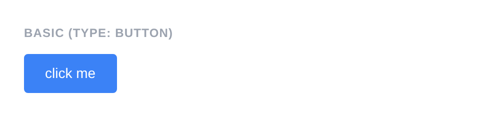
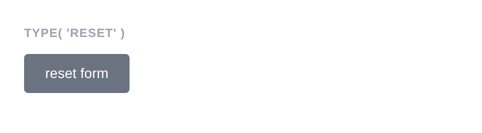
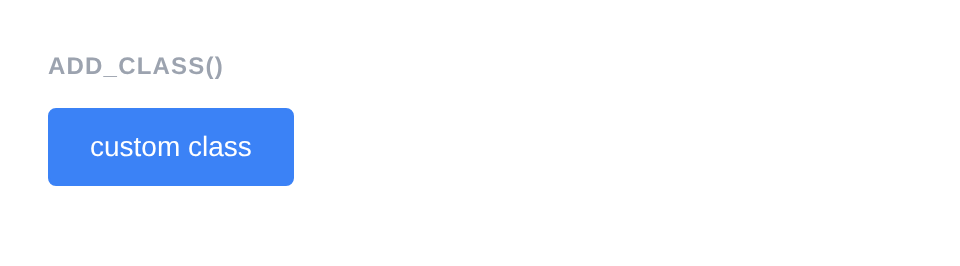

# Button

Renders a `<button>` element. Unlike form fields, Button extends `Element` directly and does not extend `Field`.

**Class:** `PinkCrab\Form_Components\Element\Button`  
**Component:** `PinkCrab\Form_Components\Component\Field\Button_Component`  
**Make helper:** `Make::button( 'name', fn(Button $f) => $f->... )`

---

## Basic Usage

```php
$this->component( new Button_Component(
		Button::make( 'btn' )
			->type( 'button' )
			->text( 'Click Me' )
	) )
```



<details markdown="1">
<summary>Generated HTML</summary>

```html
<div id="form-buttonbtn" class="pc-form__element pc-form__element--button">
    <button type="button" name="btn" class="pc-form__button" >click me</button>
    </div>
```
</details>

---

## Using Make Helper

```php
use PinkCrab\Form_Components\Util\Make;

$this->component( Make::button( 'save', fn( $f ) => $f
    ->type( 'submit' )
    ->text( 'Save Changes' )
) );
```

---

## Methods

### type( string $type )

Sets the button type. Common values: `button` (default), `submit`, `reset`.

```php
Button::make( 'submit_btn' )
			->type( 'submit' )
			->text( 'Submit Form' )
```


<details markdown="1">
<summary>Generated HTML</summary>

```html
<div id="form-buttonsubmit_btn" class="pc-form__element pc-form__element--button">
    <button type="submit" name="submit_btn" class="pc-form__button" >submit form</button>
    </div>
```
</details>

```php
Button::make( 'reset_btn' )
			->type( 'reset' )
			->text( 'Reset Form' )
```



<details markdown="1">
<summary>Generated HTML</summary>

```html
<div id="form-buttonreset_btn" class="pc-form__element pc-form__element--button">
    <button type="reset" name="reset_btn" class="pc-form__button" >reset form</button>
    </div>
```
</details>

### text( string $text )

Sets the visible text inside the button. Text is lowercased in the rendered output.

```php
Button::make( 'action' )
    ->text( 'Click Me' )
```

<details markdown="1">
<summary>Generated HTML</summary>

```html
<div id="form-buttonaction" class="pc-form__element pc-form__element--button">
    <button type="button" name="action"
        class="pc-form__button"
    >click me</button>
</div>
```
</details>

### disabled( bool $disabled = true )

Disables the button. It is visible but cannot be clicked.

```php
Button::make( 'disabled_btn' )
			->type( 'button' )
			->text( 'Disabled' )
			->disabled( true )
```


<details markdown="1">
<summary>Generated HTML</summary>

```html
<div id="form-buttondisabled_btn" class="pc-form__element pc-form__element--button">
    <button type="button" name="disabled_btn" disabled="" class="pc-form__button" >disabled</button>
    </div>
```
</details>

### before( string $html ) / after( string $html )

HTML content before or after the button within the wrapper.

```php
Button::make( 'wrapped_btn' )
			->type( 'button' )
			->text( 'Wrapped Button' )
			->before( '<span style="color:#6b7280;font-size:13px;">Action:</span>' )
			->after( '<span style="color:#6b7280;font-size:13px;">Click to proceed</span>' )
```


<details markdown="1">
<summary>Generated HTML</summary>

```html
<div id="form-buttonwrapped_btn" class="pc-form__element pc-form__element--button">
    <span style="color:#6b7280;font-size:13px">Action:</span>
        <button type="button" name="wrapped_btn" class="pc-form__button" >wrapped button</button>
            <span style="color:#6b7280;font-size:13px">Click to proceed</span>
            </div>
```
</details>

### id( string $id )

Sets a custom HTML `id` on the button element.

```php
Button::make( 'save' )
    ->text( 'Save' )
    ->id( 'my-custom-button-id' )
```

<details markdown="1">
<summary>Generated HTML</summary>

```html
<div id="form-buttonsave" class="pc-form__element pc-form__element--button">
    <button type="button" name="save" id="my-custom-button-id"
        class="pc-form__button"
    >save</button>
</div>
```
</details>

### wrapper_id( string $id )

Sets a custom HTML `id` on the wrapper div.

```php
Button::make( 'save' )
    ->text( 'Save' )
    ->wrapper_id( 'my-custom-wrapper-id' )
```

<details markdown="1">
<summary>Generated HTML</summary>

```html
<div id="my-custom-wrapper-id" class="pc-form__element pc-form__element--button">
    <button type="button" name="save"
        class="pc-form__button"
    >save</button>
</div>
```
</details>

### data( string $key, string $value )

Adds a `data-*` attribute to the button element.

```php
Button::make( 'action_btn' )
			->type( 'button' )
			->text( 'Save Draft' )
			->data( 'action', 'save-draft' )
			->data( 'target', 'form-1' )
```


<details markdown="1">
<summary>Generated HTML</summary>

```html
<div id="form-buttonaction_btn" class="pc-form__element pc-form__element--button">
    <button type="button" name="action_btn" data-action="save-draft" data-target="form-1" class="pc-form__button" >save draft</button>
    </div>
```
</details>

### wrapper_data( string $key, string $value )

Adds a `data-*` attribute to the wrapper div.

```php
Button::make( 'save' )
    ->text( 'Save' )
    ->wrapper_data( 'section', 'actions' )
```

<details markdown="1">
<summary>Generated HTML</summary>

```html
<div id="form-buttonsave" class="pc-form__element pc-form__element--button" data-section="actions">
    <button type="button" name="save"
        class="pc-form__button"
    >save</button>
</div>
```
</details>

### add_class( string $class )

Adds a CSS class to the button element.

```php
Button::make( 'styled_btn' )
			->type( 'button' )
			->text( 'Custom Class' )
			->add_class( 'my-button-class' )
```



<details markdown="1">
<summary>Generated HTML</summary>

```html
<div id="form-buttonstyled_btn" class="pc-form__element pc-form__element--button">
    <button type="button" name="styled_btn" class="pc-form__button pc-form__button my-button-class" >custom class</button>
    </div>
```
</details>

### add_wrapper_class( string $class )

Adds a CSS class to the wrapper div.

```php
Button::make( 'save' )
    ->text( 'Save' )
    ->add_wrapper_class( 'my-wrapper-class' )
```

<details markdown="1">
<summary>Generated HTML</summary>

```html
<div id="form-buttonsave" class="pc-form__element pc-form__element--button my-wrapper-class">
    <button type="button" name="save"
        class="pc-form__button"
    >save</button>
</div>
```
</details>

### attribute( string $key, mixed $value )

Sets an arbitrary HTML attribute on the button element.

```php
Button::make( 'save' )
    ->text( 'Save' )
    ->attribute( 'aria-label', 'Save all changes' )
```

<details markdown="1">
<summary>Generated HTML</summary>

```html
<div id="form-buttonsave" class="pc-form__element pc-form__element--button">
    <button type="button" name="save"
        class="pc-form__button"
        aria-label="Save all changes"
    >save</button>
</div>
```
</details>

### attributes( array $attrs )

Sets multiple arbitrary HTML attributes at once.

```php
Button::make( 'save' )
    ->text( 'Save' )
    ->attributes( array(
        'title'    => 'Save all changes',
        'tabindex' => '10',
    ) )
```

<details markdown="1">
<summary>Generated HTML</summary>

```html
<div id="form-buttonsave" class="pc-form__element pc-form__element--button">
    <button type="button" name="save"
        class="pc-form__button"
        title="Save all changes" tabindex="10"
    >save</button>
</div>
```
</details>

### style( Style $style )

Sets a custom style on the button, overriding the default.

```php
use PinkCrab\Form_Components\Style\Default_Style;

Button::make( 'save' )
    ->text( 'Save' )
    ->style( new Default_Style() )
```

<details markdown="1">
<summary>Generated HTML</summary>

```html
<div id="form-buttonsave" class="pc-form__element pc-form__element--button">
    <button type="button" name="save"
        class="pc-form__button"
    >save</button>
</div>
```
</details>

---

## Traits

| Trait | Methods |
|-------|---------|
| Attributes | `attribute()`, `attributes()`, `get_attribute()`, `get_attributes()`, `has_attribute()`, `add_class()`, `remove_class()`, `id()`, `data()` |
| Element_Wrap | `before()`, `after()`, `get_before()`, `get_after()`, `has_before()`, `has_after()` |
| Wrapper_Attributes | `wrapper_attribute()`, `wrapper_attributes()`, `get_wrapper_attribute()`, `get_wrapper_attributes()`, `wrapper_id()`, `wrapper_data()`, `add_wrapper_class()` |
| Form_Style | `style()`, `get_style()`, `has_explicit_style()` |
| Disabled | `disabled()`, `is_disabled()` |
