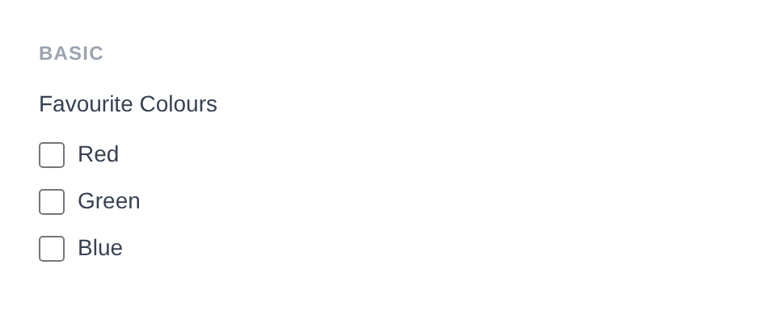
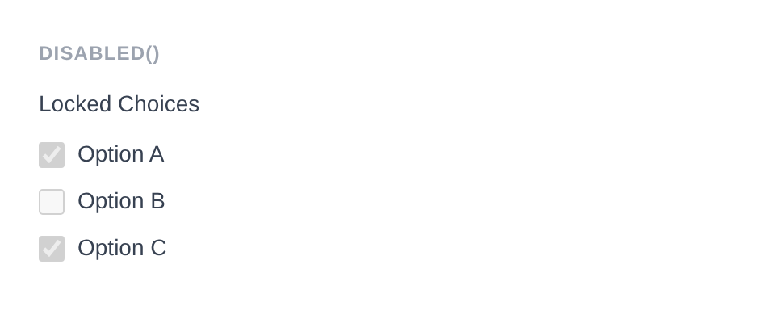
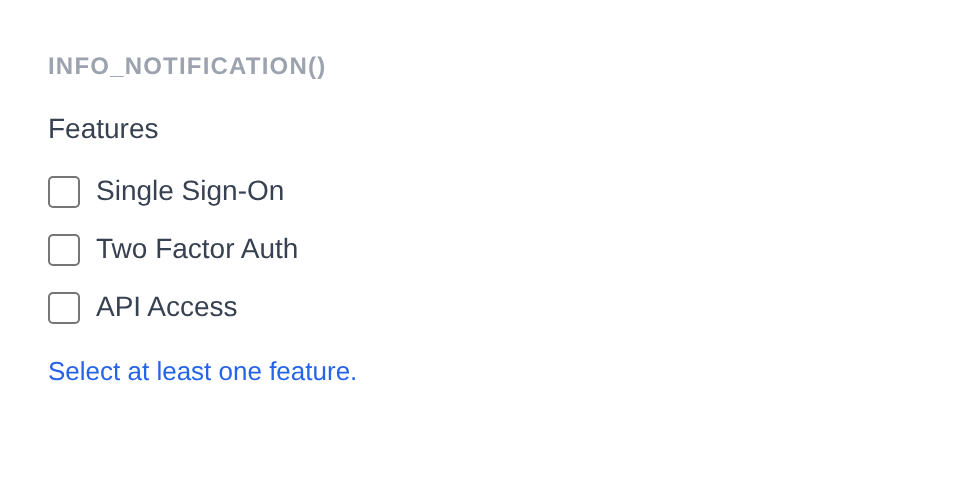

# Checkbox Group

Renders a group of `<input type="checkbox">` elements from an options array, allowing multiple selections. Uses `<legend>` for the label instead of `<label>`.

**Class:** `PinkCrab\Form_Components\Element\Field\Group\Checkbox_Group`  
**Make helper:** `Make::checkbox_group( 'name', fn(Checkbox_Group $f) => $f->... )`

---

## Basic Usage

```php
$this->component( new Checkbox_Group_Component(
		Checkbox_Group::make( 'colours' )
			->label( 'Favourite Colours' )
			->options( array(
				'red'   => 'Red',
				'green' => 'Green',
				'blue'  => 'Blue',
			) )
	) )
```



<details>
<summary>Generated HTML</summary>

```html
<div id="form-field_colours" class="pc-form__element pc-form__element--checkbox_group">
    <legend>Favourite Colours</legend>
        <label class="checkbox-group__option">
            <input type="checkbox" name="colours[]" value="red" /> Red </label>
            <label class="checkbox-group__option">
                <input type="checkbox" name="colours[]" value="green" /> Green </label>
                <label class="checkbox-group__option">
                    <input type="checkbox" name="colours[]" value="blue" /> Blue </label>
                </div>
```
</details>

---

## Using Make Helper

```php
use PinkCrab\Form_Components\Util\Make;

$this->component( Make::checkbox_group( 'interests', fn( $f ) => $f
    ->label( 'Interests' )
    ->options( array(
        'coding'  => 'Coding',
        'design'  => 'Design',
        'music'   => 'Music',
    ) )
) );
```

---

## Methods

### label( string $label )

Sets the visible label text above the checkbox group. Rendered as a `<legend>` element.

```php
Checkbox_Group::make( 'interests' )->label( 'Your Interests' )
```

<details>
<summary>Generated HTML</summary>

```html
<div id="form-field_interests" class="pc-form__element pc-form__element--checkbox_group">
    <legend>Your Interests</legend>
</div>
```
</details>

### options( array $options )

Sets the available checkboxes as a `value => label` associative array.

```php
Checkbox_Group::make( 'interests' )
    ->label( 'Interests' )
    ->options( array(
        'coding'  => 'Coding',
        'design'  => 'Design',
        'music'   => 'Music',
        'gaming'  => 'Gaming',
    ) )
```

<details>
<summary>Generated HTML</summary>

```html
<div id="form-field_interests" class="pc-form__element pc-form__element--checkbox_group">
    <legend>Interests</legend>
    <label class="checkbox-group__option">
        <input type="checkbox" name="interests[]" value="coding" />
        Coding
    </label>
    <label class="checkbox-group__option">
        <input type="checkbox" name="interests[]" value="design" />
        Design
    </label>
    <label class="checkbox-group__option">
        <input type="checkbox" name="interests[]" value="music" />
        Music
    </label>
    <label class="checkbox-group__option">
        <input type="checkbox" name="interests[]" value="gaming" />
        Gaming
    </label>
</div>
```
</details>

### selected( array $selected )

Sets which checkboxes are checked by passing an array of values.

```php
Checkbox_Group::make( 'languages' )
			->label( 'Languages' )
			->options( array(
				'php'  => 'PHP',
				'js'   => 'JavaScript',
				'go'   => 'Go',
				'rust' => 'Rust',
			) )
			->selected( array( 'php', 'js' ) )
```


<details>
<summary>Generated HTML</summary>

```html
<div id="form-field_languages" class="pc-form__element pc-form__element--checkbox_group">
    <legend>Languages</legend>
        <label class="checkbox-group__option">
            <input type="checkbox" name="languages[]" value="php" checked /> PHP </label>
            <label class="checkbox-group__option">
                <input type="checkbox" name="languages[]" value="js" checked /> JavaScript </label>
                <label class="checkbox-group__option">
                    <input type="checkbox" name="languages[]" value="go" /> Go </label>
                    <label class="checkbox-group__option">
                        <input type="checkbox" name="languages[]" value="rust" /> Rust </label>
                    </div>
```
</details>

### set_existing( mixed $value )

Sets the selected values from existing data. Accepts an array of values.

```php
Checkbox_Group::make( 'interests' )
    ->label( 'Interests' )
    ->options( array(
        'coding'  => 'Coding',
        'design'  => 'Design',
        'music'   => 'Music',
    ) )
    ->set_existing( array( 'coding', 'design' ) )
```

<details>
<summary>Generated HTML</summary>

```html
<div id="form-field_interests" class="pc-form__element pc-form__element--checkbox_group">
    <legend>Interests</legend>
    <label class="checkbox-group__option">
        <input type="checkbox" name="interests[]" value="coding" checked />
        Coding
    </label>
    <label class="checkbox-group__option">
        <input type="checkbox" name="interests[]" value="design" checked />
        Design
    </label>
    <label class="checkbox-group__option">
        <input type="checkbox" name="interests[]" value="music" />
        Music
    </label>
</div>
```
</details>

### is_selected( string $value )

Check if a specific checkbox value is currently selected.

```php
$group = Checkbox_Group::make( 'interests' )
    ->options( array( 'coding' => 'Coding', 'design' => 'Design' ) )
    ->selected( array( 'coding' ) );

$group->is_selected( 'coding' ); // true
$group->is_selected( 'design' ); // false
```

### disabled( bool $disabled = true )

Disables the entire checkbox group. Each individual checkbox receives the `disabled` attribute.

```php
Checkbox_Group::make( 'locked_choices' )
			->label( 'Locked Choices' )
			->options( array(
				'a' => 'Option A',
				'b' => 'Option B',
				'c' => 'Option C',
			) )
			->selected( array( 'a', 'c' ) )
			->disabled( true )
```



<details>
<summary>Generated HTML</summary>

```html
<div id="form-field_locked_choices" class="pc-form__element pc-form__element--checkbox_group">
    <legend>Locked Choices</legend>
        <label class="checkbox-group__option">
            <input type="checkbox" name="locked_choices[]" value="a" checked disabled /> Option A </label>
            <label class="checkbox-group__option">
                <input type="checkbox" name="locked_choices[]" value="b" disabled /> Option B </label>
                <label class="checkbox-group__option">
                    <input type="checkbox" name="locked_choices[]" value="c" checked disabled /> Option C </label>
                </div>
```
</details>

### error_notification( string $message )

Displays an error message below the group.

```php
Checkbox_Group::make( 'features' )
			->label( 'Features' )
			->options( array(
				'sso'  => 'Single Sign-On',
				'2fa'  => 'Two Factor Auth',
				'api'  => 'API Access',
			) )
			->info_notification( 'Select at least one feature.' )
```



<details>
<summary>Generated HTML</summary>

```html
<div id="form-field_features" class="pc-form__element pc-form__element--checkbox_group pc-form__element pc-form__element--checkbox_group notification-info">
    <legend>Features</legend>
        <label class="checkbox-group__option">
            <input type="checkbox" name="features[]" value="sso" /> Single Sign-On </label>
            <label class="checkbox-group__option">
                <input type="checkbox" name="features[]" value="2fa" /> Two Factor Auth </label>
                <label class="checkbox-group__option">
                    <input type="checkbox" name="features[]" value="api" /> API Access </label>
                    <div class="pc-form__notification pc-form__notification--info">Select at least one feature.</div>
                    </div>
```
</details>

### warning_notification( string $message )

Displays a warning message below the group.

```php
Checkbox_Group::make( 'interests' )
    ->label( 'Interests' )
    ->options( array( 'coding' => 'Coding', 'design' => 'Design' ) )
    ->warning_notification( 'Your selections will be public.' )
```

<details>
<summary>Generated HTML</summary>

```html
<div id="form-field_interests" class="pc-form__element pc-form__element--checkbox_group notification-warning">
    <legend>Interests</legend>
    <label class="checkbox-group__option">
        <input type="checkbox" name="interests[]" value="coding" />
        Coding
    </label>
    <label class="checkbox-group__option">
        <input type="checkbox" name="interests[]" value="design" />
        Design
    </label>
    <div class="pc-form__notification pc-form__notification--warning">Your selections will be public.</div>
</div>
```
</details>

### success_notification( string $message )

Displays a success message below the group.

```php
Checkbox_Group::make( 'interests' )
    ->label( 'Interests' )
    ->options( array( 'coding' => 'Coding', 'design' => 'Design' ) )
    ->selected( array( 'coding' ) )
    ->success_notification( 'Interests saved.' )
```

<details>
<summary>Generated HTML</summary>

```html
<div id="form-field_interests" class="pc-form__element pc-form__element--checkbox_group notification-success">
    <legend>Interests</legend>
    <label class="checkbox-group__option">
        <input type="checkbox" name="interests[]" value="coding" checked />
        Coding
    </label>
    <label class="checkbox-group__option">
        <input type="checkbox" name="interests[]" value="design" />
        Design
    </label>
    <div class="pc-form__notification pc-form__notification--success">Interests saved.</div>
</div>
```
</details>

### info_notification( string $message )

Displays an info message below the group.

```php
Checkbox_Group::make( 'interests' )
    ->label( 'Interests' )
    ->options( array( 'coding' => 'Coding', 'design' => 'Design' ) )
    ->info_notification( 'Select all that apply.' )
```

<details>
<summary>Generated HTML</summary>

```html
<div id="form-field_interests" class="pc-form__element pc-form__element--checkbox_group notification-info">
    <legend>Interests</legend>
    <label class="checkbox-group__option">
        <input type="checkbox" name="interests[]" value="coding" />
        Coding
    </label>
    <label class="checkbox-group__option">
        <input type="checkbox" name="interests[]" value="design" />
        Design
    </label>
    <div class="pc-form__notification pc-form__notification--info">Select all that apply.</div>
</div>
```
</details>

### pre_description( string $description )

Sets a description or hint displayed before the checkbox options.

```php
Checkbox_Group::make( 'interests' )
    ->label( 'Interests' )
    ->pre_description( 'Select all that apply.' )
```

### post_description( string $description )

Sets a description or help text displayed after the checkbox options, before any notification.

```php
Checkbox_Group::make( 'interests' )
    ->label( 'Interests' )
    ->post_description( 'You can change these later.' )
```

### before( string $html ) / after( string $html )

HTML content before or after the checkbox group within the wrapper.

```php
Checkbox_Group::make( 'topics' )
			->label( 'Topics' )
			->options( array(
				'tech'    => 'Technology',
				'science' => 'Science',
				'art'     => 'Art',
			) )
			->before( '<span style="color:#6b7280;font-size:13px;">Choose your interests:</span>' )
			->after( '<span style="color:#6b7280;font-size:13px;">You can change these later.</span>' )
```


<details>
<summary>Generated HTML</summary>

```html
<div id="form-field_topics" class="pc-form__element pc-form__element--checkbox_group">
    <span style="color:#6b7280;font-size:13px">Choose your interests:</span>
        <legend>Topics</legend>
            <label class="checkbox-group__option">
                <input type="checkbox" name="topics[]" value="tech" /> Technology </label>
                <label class="checkbox-group__option">
                    <input type="checkbox" name="topics[]" value="science" /> Science </label>
                    <label class="checkbox-group__option">
                        <input type="checkbox" name="topics[]" value="art" /> Art </label>
                        <span style="color:#6b7280;font-size:13px">You can change these later.</span>
                        </div>
```
</details>

### id( string $id )

Sets a custom HTML `id` on the checkbox group element.

```php
Checkbox_Group::make( 'interests' )
    ->id( 'my-custom-group-id' )
```

<details>
<summary>Generated HTML</summary>

```html
<div id="form-field_interests" class="pc-form__element pc-form__element--checkbox_group">
</div>
```
</details>

### wrapper_id( string $id )

Sets a custom HTML `id` on the wrapper div.

```php
Checkbox_Group::make( 'interests' )
    ->wrapper_id( 'my-custom-wrapper-id' )
```

<details>
<summary>Generated HTML</summary>

```html
<div id="my-custom-wrapper-id" class="pc-form__element pc-form__element--checkbox_group">
</div>
```
</details>

### data( string $key, string $value )

Adds a `data-*` attribute to the checkbox group element.

```php
Checkbox_Group::make( 'interests' )
    ->data( 'max-selections', '3' )
```

<details>
<summary>Generated HTML</summary>

```html
<div id="form-field_interests" class="pc-form__element pc-form__element--checkbox_group">
</div>
```
</details>

### wrapper_data( string $key, string $value )

Adds a `data-*` attribute to the wrapper div.

```php
Checkbox_Group::make( 'interests' )
    ->wrapper_data( 'section', 'preferences' )
```

<details>
<summary>Generated HTML</summary>

```html
<div id="form-field_interests" class="pc-form__element pc-form__element--checkbox_group" data-section="preferences">
</div>
```
</details>

### add_class( string $class )

Adds a CSS class to the checkbox group element.

```php
Checkbox_Group::make( 'interests' )
    ->add_class( 'my-group-class' )
```

<details>
<summary>Generated HTML</summary>

```html
<div id="form-field_interests" class="pc-form__element pc-form__element--checkbox_group">
</div>
```
</details>

### add_wrapper_class( string $class )

Adds a CSS class to the wrapper div.

```php
Checkbox_Group::make( 'interests' )
    ->add_wrapper_class( 'my-wrapper-class' )
```

<details>
<summary>Generated HTML</summary>

```html
<div id="form-field_interests" class="pc-form__element pc-form__element--checkbox_group my-wrapper-class">
</div>
```
</details>

### show_wrapper( bool $show = true )

Controls whether the wrapping `<div>` is rendered.

```php
Checkbox_Group::make( 'interests' )
    ->options( array( 'coding' => 'Coding', 'design' => 'Design' ) )
    ->show_wrapper( false )
```

<details>
<summary>Generated HTML</summary>

```html
<label class="checkbox-group__option">
    <input type="checkbox" name="interests[]" value="coding" />
    Coding
</label>
<label class="checkbox-group__option">
    <input type="checkbox" name="interests[]" value="design" />
    Design
</label>
```
</details>

### attribute( string $key, mixed $value )

Sets an arbitrary HTML attribute on the checkbox group.

```php
Checkbox_Group::make( 'interests' )
    ->attribute( 'aria-label', 'Select your interests' )
```

<details>
<summary>Generated HTML</summary>

```html
<div id="form-field_interests" class="pc-form__element pc-form__element--checkbox_group">
</div>
```
</details>

### attributes( array $attrs )

Sets multiple arbitrary HTML attributes at once.

```php
Checkbox_Group::make( 'interests' )
    ->attributes( array(
        'title'    => 'Interest selection',
        'tabindex' => '4',
    ) )
```

<details>
<summary>Generated HTML</summary>

```html
<div id="form-field_interests" class="pc-form__element pc-form__element--checkbox_group">
</div>
```
</details>

### style( Style $style )

Sets a custom style for the field, overriding the default.

```php
use PinkCrab\Form_Components\Style\Default_Style;

Checkbox_Group::make( 'interests' )
    ->style( new Default_Style() )
```

---

## Traits

| Trait | Methods |
|-------|---------|
| Label | `label()`, `get_label()`, `has_label()` |
| Options | `options()`, `get_options()` |
| Notification | `error_notification()`, `warning_notification()`, `success_notification()`, `info_notification()` |
| Disabled | `disabled()`, `is_disabled()` |
| Description | `pre_description()`, `post_description()`, `get_pre_description()`, `get_post_description()`, `has_pre_description()`, `has_post_description()` |
