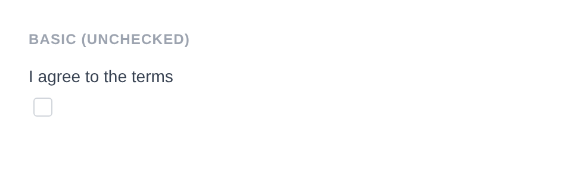
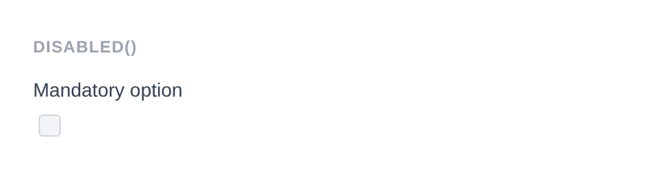

# Checkbox Input

Renders `<input type="checkbox">`. A single toggle input that can be checked or unchecked. Default sanitizer: none.

**Class:** `PinkCrab\Form_Components\Element\Field\Input\Checkbox`  
**Make helper:** `Make::checkbox( 'name', fn(Checkbox $f) => $f->... )`

---

## Basic Usage

```php
$this->component( new Input_Component(
        Checkbox::make( 'agree' )
            ->label( 'I agree to the terms' )
    ) )
```



<details markdown="1">
<summary>Generated HTML</summary>

```html
<div id="form-field_agree" class="pc-form__element pc-form__element--checkbox_input">
    <label for="agree" class="pc-form__label">I agree to the terms</label>
        <input type="checkbox" name="agree" class="form-control checkbox-input pc-form__element__field pc-form__element__field--checkbox_input" />
    </div>
```
</details>

---

## Using Make Helper

```php
use PinkCrab\Form_Components\Util\Make;

$this->component( Make::checkbox( 'agree_terms', fn( $f ) => $f
    ->label( 'I agree to the terms' )
    ->value( 'yes' )
) );
```

---

## Methods

### label( string $label )

Sets the visible label text for the checkbox.

```php
Checkbox::make( 'subscribe' )->label( 'Subscribe to newsletter' )
```

<details markdown="1">
<summary>Generated HTML</summary>

```html
<div id="form-field_subscribe" class="pc-form__element pc-form__element--checkbox_input">
    <label for="subscribe" class="pc-form__label">Subscribe to newsletter</label>
    <input type="checkbox" name="subscribe"
        class="form-control checkbox-input pc-form__element__field pc-form__element__field--checkbox_input"
    />
</div>
```
</details>

### value( string|float|int $value )

Sets the value submitted when the checkbox is checked. Non-string values are cast to string.

```php
Checkbox::make( 'opt_in' )
            ->label( 'Opt in to marketing' )
            ->value( 'yes' )
            ->checked( true )
```


<details markdown="1">
<summary>Generated HTML</summary>

```html
<div id="form-field_opt_in" class="pc-form__element pc-form__element--checkbox_input">
    <label for="opt_in" class="pc-form__label">Opt in to marketing</label>
        <input type="checkbox" name="opt_in" class="form-control checkbox-input pc-form__element__field pc-form__element__field--checkbox_input" checked="" value="yes" />
    </div>
```
</details>

### set_existing( mixed $value )

Sets the current value. No sanitizer is applied by default for checkbox inputs.

```php
Checkbox::make( 'subscribe' )
    ->label( 'Subscribe' )
    ->value( 'yes' )
    ->set_existing( 'yes' )
```

<details markdown="1">
<summary>Generated HTML</summary>

```html
<div id="form-field_subscribe" class="pc-form__element pc-form__element--checkbox_input">
    <label for="subscribe" class="pc-form__label">Subscribe</label>
    <input type="checkbox" name="subscribe"
        class="form-control checkbox-input pc-form__element__field pc-form__element__field--checkbox_input"
        value="yes"
    />
</div>
```
</details>

### checked( bool $checked = true )

Sets whether the checkbox is in a checked state.

```php
Checkbox::make( 'newsletter' )
            ->label( 'Subscribe to newsletter' )
            ->checked( true )
```


<details markdown="1">
<summary>Generated HTML</summary>

```html
<div id="form-field_newsletter" class="pc-form__element pc-form__element--checkbox_input">
    <label for="newsletter" class="pc-form__label">Subscribe to newsletter</label>
        <input type="checkbox" name="newsletter" class="form-control checkbox-input pc-form__element__field pc-form__element__field--checkbox_input" checked="" />
    </div>
```
</details>

### is_checked()

Returns whether the checkbox is currently checked.

```php
$checkbox = Checkbox::make( 'opt_in' )
    ->checked( true );

$checkbox->is_checked(); // true
```

<details markdown="1">
<summary>Generated HTML</summary>

```html
<div id="form-field_opt_in" class="pc-form__element pc-form__element--checkbox_input">
    <input type="checkbox" name="opt_in"
        class="form-control checkbox-input pc-form__element__field pc-form__element__field--checkbox_input"
        checked=""
    />
</div>
```
</details>

### disabled( bool $disabled = true )

Disables the checkbox. It is visible but cannot be toggled or submitted.

```php
Checkbox::make( 'mandatory' )
            ->label( 'Mandatory option' )
            ->checked( true )
            ->disabled( true )
```



<details markdown="1">
<summary>Generated HTML</summary>

```html
<div id="form-field_mandatory" class="pc-form__element pc-form__element--checkbox_input">
    <label for="mandatory" class="pc-form__label">Mandatory option</label>
        <input type="checkbox" name="mandatory" class="form-control checkbox-input pc-form__element__field pc-form__element__field--checkbox_input" checked="" disabled="" />
    </div>
```
</details>

### error_notification( string $message )

Displays an error message below the field.

```php
Checkbox::make( 'confirm' )
            ->label( 'Confirm your choice' )
            ->warning_notification( 'Please confirm to continue.' )
```


<details markdown="1">
<summary>Generated HTML</summary>

```html
<div id="form-field_confirm" class="pc-form__element pc-form__element--checkbox_input pc-form__element pc-form__element--checkbox_input notification-warning">
    <label for="confirm" class="pc-form__label">Confirm your choice</label>
        <input type="checkbox" name="confirm" class="form-control checkbox-input pc-form__element__field pc-form__element__field--checkbox_input pc-form__element__field pc-form__element__field--checkbox_input notification-warning" />
        <div class="pc-form__notification pc-form__notification--warning">Please confirm to continue.</div>
        </div>
```
</details>

### warning_notification( string $message )

Displays a warning message below the field.

```php
Checkbox::make( 'data_sharing' )
    ->label( 'Share my data' )
    ->warning_notification( 'Your data will be shared with partners.' )
```

<details markdown="1">
<summary>Generated HTML</summary>

```html
<div id="form-field_data_sharing" class="pc-form__element pc-form__element--checkbox_input notification-warning">
    <label for="data_sharing" class="pc-form__label">Share my data</label>
    <input type="checkbox" name="data_sharing"
        class="form-control checkbox-input pc-form__element__field pc-form__element__field--checkbox_input notification-warning"
    />
    <div class="pc-form__notification pc-form__notification--warning">Your data will be shared with partners.</div>
</div>
```
</details>

### success_notification( string $message )

Displays a success message below the field.

```php
Checkbox::make( 'verified' )
    ->label( 'Email Verified' )
    ->checked( true )
    ->success_notification( 'Your email has been verified.' )
```

<details markdown="1">
<summary>Generated HTML</summary>

```html
<div id="form-field_verified" class="pc-form__element pc-form__element--checkbox_input notification-success">
    <label for="verified" class="pc-form__label">Email Verified</label>
    <input type="checkbox" name="verified"
        class="form-control checkbox-input pc-form__element__field pc-form__element__field--checkbox_input notification-success"
        checked=""
    />
    <div class="pc-form__notification pc-form__notification--success">Your email has been verified.</div>
</div>
```
</details>

### info_notification( string $message )

Displays an info message below the field.

```php
Checkbox::make( 'optional' )
    ->label( 'Enable notifications' )
    ->info_notification( 'You can change this later in settings.' )
```

<details markdown="1">
<summary>Generated HTML</summary>

```html
<div id="form-field_optional" class="pc-form__element pc-form__element--checkbox_input notification-info">
    <label for="optional" class="pc-form__label">Enable notifications</label>
    <input type="checkbox" name="optional"
        class="form-control checkbox-input pc-form__element__field pc-form__element__field--checkbox_input notification-info"
    />
    <div class="pc-form__notification pc-form__notification--info">You can change this later in settings.</div>
</div>
```
</details>

### pre_description( string $description )

Sets a description or hint displayed before the input.

```php
Checkbox::make( 'agree' )
    ->label( 'I agree to the terms' )
    ->pre_description( 'Please review the terms before agreeing.' )
```

### post_description( string $description )

Sets a description or help text displayed after the input, before any notification.

```php
Checkbox::make( 'agree' )
    ->label( 'I agree to the terms' )
    ->post_description( 'You can withdraw consent at any time.' )
```

### before( string $html ) / after( string $html )

HTML content before or after the input; renders whether or not the wrapper is shown.

```php
Checkbox::make( 'agree' )
    ->label( 'I agree' )
    ->before( '<span>Please review the terms</span>' )
    ->after( '<span>Required</span>' )
```

<details markdown="1">
<summary>Generated HTML</summary>

```html
<div id="form-field_agree" class="pc-form__element pc-form__element--checkbox_input">
    <span>Please review the terms</span>
    <label for="agree" class="pc-form__label">I agree</label>
    <input type="checkbox" name="agree"
        class="form-control checkbox-input pc-form__element__field pc-form__element__field--checkbox_input"
    />
    <span>Required</span>
</div>
```
</details>

### id( string $id )

Sets a custom HTML `id` on the input element.

```php
Checkbox::make( 'agree' )->id( 'terms-checkbox' )
```

<details markdown="1">
<summary>Generated HTML</summary>

```html
<div id="form-field_agree" class="pc-form__element pc-form__element--checkbox_input">
    <input type="checkbox" name="agree" id="terms-checkbox"
        class="form-control checkbox-input pc-form__element__field pc-form__element__field--checkbox_input"
    />
</div>
```
</details>

### wrapper_id( string $id )

Sets a custom HTML `id` on the wrapper div.

```php
Checkbox::make( 'agree' )->wrapper_id( 'terms-wrapper' )
```

<details markdown="1">
<summary>Generated HTML</summary>

```html
<div id="terms-wrapper" class="pc-form__element pc-form__element--checkbox_input">
    <input type="checkbox" name="agree"
        class="form-control checkbox-input pc-form__element__field pc-form__element__field--checkbox_input"
    />
</div>
```
</details>

### data( string $key, string $value )

Adds a `data-*` attribute to the input.

```php
Checkbox::make( 'feature' )->data( 'toggle', 'section-advanced' )
```

<details markdown="1">
<summary>Generated HTML</summary>

```html
<div id="form-field_feature" class="pc-form__element pc-form__element--checkbox_input">
    <input type="checkbox" name="feature"
        class="form-control checkbox-input pc-form__element__field pc-form__element__field--checkbox_input"
        data-toggle="section-advanced"
    />
</div>
```
</details>

### wrapper_data( string $key, string $value )

Adds a `data-*` attribute to the wrapper div.

```php
Checkbox::make( 'feature' )->wrapper_data( 'group', 'preferences' )
```

<details markdown="1">
<summary>Generated HTML</summary>

```html
<div id="form-field_feature" class="pc-form__element pc-form__element--checkbox_input" data-group="preferences">
    <input type="checkbox" name="feature"
        class="form-control checkbox-input pc-form__element__field pc-form__element__field--checkbox_input"
    />
</div>
```
</details>

### add_class( string $class )

Adds a CSS class to the input element.

```php
Checkbox::make( 'agree' )->add_class( 'terms-checkbox' )
```

<details markdown="1">
<summary>Generated HTML</summary>

```html
<div id="form-field_agree" class="pc-form__element pc-form__element--checkbox_input">
    <input type="checkbox" name="agree"
        class="form-control checkbox-input pc-form__element__field pc-form__element__field--checkbox_input terms-checkbox"
    />
</div>
```
</details>

### add_wrapper_class( string $class )

Adds a CSS class to the wrapper div.

```php
Checkbox::make( 'agree' )->add_wrapper_class( 'checkbox-field' )
```

<details markdown="1">
<summary>Generated HTML</summary>

```html
<div id="form-field_agree" class="pc-form__element pc-form__element--checkbox_input checkbox-field">
    <input type="checkbox" name="agree"
        class="form-control checkbox-input pc-form__element__field pc-form__element__field--checkbox_input"
    />
</div>
```
</details>

### show_wrapper( bool $show = true )

Controls whether the wrapping `<div>` is rendered.

```php
Checkbox::make( 'inline' )->show_wrapper( false )
```

<details markdown="1">
<summary>Generated HTML</summary>

```html
<input type="checkbox" name="inline"
    class="form-control checkbox-input pc-form__element__field pc-form__element__field--checkbox_input"
/>
```
</details>

### tabindex( int $index )

Sets the tab order of the input.

```php
Checkbox::make( 'agree' )->tabindex( 2 )
```

<details markdown="1">
<summary>Generated HTML</summary>

```html
<div id="form-field_agree" class="pc-form__element pc-form__element--checkbox_input">
    <input type="checkbox" name="agree"
        class="form-control checkbox-input pc-form__element__field pc-form__element__field--checkbox_input"
        tabindex="2"
    />
</div>
```
</details>

### attribute( string $key, mixed $value )

Sets an arbitrary HTML attribute on the input.

```php
Checkbox::make( 'agree' )->attribute( 'aria-describedby', 'terms-description' )
```

<details markdown="1">
<summary>Generated HTML</summary>

```html
<div id="form-field_agree" class="pc-form__element pc-form__element--checkbox_input">
    <input type="checkbox" name="agree"
        class="form-control checkbox-input pc-form__element__field pc-form__element__field--checkbox_input"
        aria-describedby="terms-description"
    />
</div>
```
</details>

### attributes( array $attrs )

Sets multiple arbitrary HTML attributes at once.

```php
Checkbox::make( 'agree' )->attributes( array(
    'title'    => 'Accept terms and conditions',
    'tabindex' => '1',
) )
```

<details markdown="1">
<summary>Generated HTML</summary>

```html
<div id="form-field_agree" class="pc-form__element pc-form__element--checkbox_input">
    <input type="checkbox" name="agree"
        class="form-control checkbox-input pc-form__element__field pc-form__element__field--checkbox_input"
        title="Accept terms and conditions" tabindex="1"
    />
</div>
```
</details>

### sanitizer( callable $fn )

Sets a sanitization callback applied when `set_existing()` is called. Default: none.

**Using a built-in helper:**

```php
use PinkCrab\Form_Components\Util\Sanitize;

Checkbox::make( 'agree' )
    ->sanitizer( Sanitize::TEXT )
    ->set_existing( 'yes' )
```

**Using a custom callable:**

```php
Checkbox::make( 'agree' )
    ->sanitizer( function( $value ) {
        return $value === 'yes' ? 'yes' : 'no';
    } )
    ->set_existing( 'yes' )
```

**Built-in sanitizer helpers:**

| Constant | Function | Description |
|----------|----------|-------------|
| `Sanitize::TEXT` | `sanitize_text_field()` | Strips tags, removes extra whitespace |
| `Sanitize::TEXTAREA` | `sanitize_textarea_field()` | Like TEXT but preserves line breaks |
| `Sanitize::URL` | `esc_url_raw()` | Sanitises a URL for database storage |
| `Sanitize::EMAIL` | `sanitize_email()` | Strips invalid email characters |
| `Sanitize::HEX_COLOR` | `sanitize_hex_color()` | Validates hex colour (#fff or #ffffff) |
| `Sanitize::NUMBER` | Custom numeric parser | Parses to int or float |
| `Sanitize::NOOP` | Pass-through | No sanitization applied |

### validator( Validator $validator )

Sets a Respect\Validation validator for server-side validation.

```php
use Respect\Validation\Validator as v;

Checkbox::make( 'agree' )->validator( v::in( array( 'yes', 'no' ) ) )
```

### style( Style $style )

Sets a custom style for the field, overriding the default.

```php
use PinkCrab\Form_Components\Style\Default_Style;

Checkbox::make( 'agree' )->style( new Default_Style() )
```

---

## Traits

| Trait | Methods |
|-------|---------|
| Label | `label()`, `get_label()`, `has_label()` |
| Single_Value | `value()`, `get_value()`, `has_value()` |
| Checked | `checked()`, `is_checked()` |
| Disabled | `disabled()`, `is_disabled()` |
| Description | `pre_description()`, `post_description()`, `get_pre_description()`, `get_post_description()`, `has_pre_description()`, `has_post_description()` |
| Notification | `error_notification()`, `warning_notification()`, `success_notification()`, `info_notification()` |
| Form_Style | `style()`, `get_style()`, `has_explicit_style()` |
