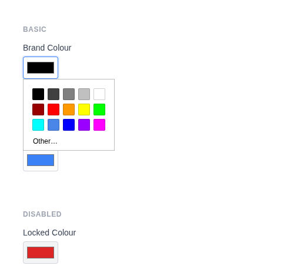
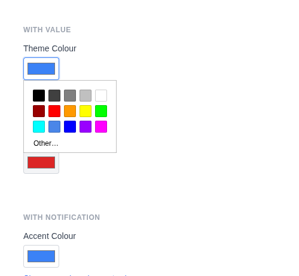

# Color Input

Renders `<input type="color">` as a colour picker swatch. Default sanitizer: `Sanitize::HEX_COLOR`.

**Class:** `PinkCrab\Form_Components\Element\Field\Input\Color`  
**Make helper:** `Make::color( 'name', fn(Color $f) => $f->... )`

---

## Basic Usage

```php
$this->component( new Input_Component(
        Color::make( 'brand_color' )
            ->label( 'Brand Colour' )
    ) )
```



<details markdown="1">
<summary>Generated HTML</summary>

```html
<div id="form-field_brand_color" class="pc-form__element pc-form__element--color_input">
    <label for="brand_color" class="pc-form__label">Brand Colour</label>
        <input type="color" name="brand_color" class="form-control color-input pc-form__element__field pc-form__element__field--color_input" list="_brand_color__list" />
    </div>
```
</details>

---

## Using Make Helper

```php
use PinkCrab\Form_Components\Util\Make;

$this->component( Make::color( 'brand_color', fn( $f ) => $f
    ->label( 'Brand Colour' )
    ->set_existing( '#3b82f6' )
) );
```

---

## Methods

### label( string $label )

Sets the visible label text above the input.

```php
Color::make( 'brand_color' )->label( 'Brand Colour' )
```

<details markdown="1">
<summary>Generated HTML</summary>

```html
<div id="form-field_brand_color" class="pc-form__element pc-form__element--color_input">
    <label for="brand_color" class="pc-form__label">Brand Colour</label>
    <input type="color" name="brand_color"
        class="form-control color-input pc-form__element__field pc-form__element__field--color_input"
    />
</div>
```
</details>

### set_existing( mixed $value )

Sets the current colour value. Runs through `sanitize_hex_color()` by default.

```php
Color::make( 'theme_color' )
            ->label( 'Theme Colour' )
            ->set_existing( '#3b82f6' )
```



<details markdown="1">
<summary>Generated HTML</summary>

```html
<div id="form-field_theme_color" class="pc-form__element pc-form__element--color_input">
    <label for="theme_color" class="pc-form__label">Theme Colour</label>
        <input type="color" name="theme_color" class="form-control color-input pc-form__element__field pc-form__element__field--color_input" list="_theme_color__list" value="#3b82f6" />
    </div>
```
</details>

### required( bool $required = true )

Marks the field as required.

```php
Color::make( 'accent' )
    ->label( 'Accent Colour' )
    ->required( true )
```

<details markdown="1">
<summary>Generated HTML</summary>

```html
<div id="form-field_accent" class="pc-form__element pc-form__element--color_input">
    <label for="accent" class="pc-form__label">Accent Colour</label>
    <input type="color" name="accent"
        class="form-control color-input pc-form__element__field pc-form__element__field--color_input"
        required=""
    />
</div>
```
</details>

### disabled( bool $disabled = true )

Disables the input. The colour swatch is visible but cannot be changed.

```php
Color::make( 'locked_color' )
            ->label( 'Locked Colour' )
            ->set_existing( '#dc2626' )
            ->disabled( true )
```


<details markdown="1">
<summary>Generated HTML</summary>

```html
<div id="form-field_locked_color" class="pc-form__element pc-form__element--color_input">
    <label for="locked_color" class="pc-form__label">Locked Colour</label>
        <input type="color" name="locked_color" class="form-control color-input pc-form__element__field pc-form__element__field--color_input" list="_locked_color__list" disabled="" value="#dc2626" />
    </div>
```
</details>

### autocomplete( string $value )

HTML `autocomplete` attribute.

```php
Color::make( 'bg_color' )
    ->label( 'Background' )
    ->autocomplete( 'off' )
```

<details markdown="1">
<summary>Generated HTML</summary>

```html
<div id="form-field_bg_color" class="pc-form__element pc-form__element--color_input">
    <label for="bg_color" class="pc-form__label">Background</label>
    <input type="color" name="bg_color"
        class="form-control color-input pc-form__element__field pc-form__element__field--color_input"
        autocomplete="off"
    />
</div>
```
</details>

Common values:

| Value | Description |
|-------|-------------|
| `off` | Disable autocomplete |
| `on` | Enable autocomplete (browser decides) |
| `name` | Full name |
| `given-name` | First name |
| `family-name` | Last name |
| `email` | Email address |
| `username` | Username |
| `new-password` | New password (password managers) |
| `current-password` | Current password |
| `organization` | Company/organisation name |
| `street-address` | Street address |
| `address-line1` | Address line 1 |
| `address-line2` | Address line 2 |
| `address-level2` | City |
| `address-level1` | State/province/region |
| `country` | Country code |
| `country-name` | Country name |
| `postal-code` | Postcode / ZIP |
| `tel` | Full phone number |
| `tel-national` | Phone without country code |
| `url` | URL |
| `bday` | Full date of birth |
| `bday-day` | Day of birth |
| `bday-month` | Month of birth |
| `bday-year` | Year of birth |
| `sex` | Gender |
| `cc-name` | Cardholder name |
| `cc-number` | Card number |
| `cc-exp` | Card expiry |
| `cc-csc` | Card security code |


### datalist_items( array $items )

Suggested colour values via an HTML `<datalist>` element.

```php
Color::make( 'preset_color' )
    ->label( 'Pick a Colour' )
    ->datalist_items( array( '#ff0000', '#00ff00', '#0000ff', '#ff9900', '#9900ff' ) )
```

<details markdown="1">
<summary>Generated HTML</summary>

```html
<div id="form-field_preset_color" class="pc-form__element pc-form__element--color_input">
    <label for="preset_color" class="pc-form__label">Pick a Colour</label>
    <input type="color" name="preset_color"
        class="form-control color-input pc-form__element__field pc-form__element__field--color_input"
        list="_preset_color__list"
    />
    <datalist id="_preset_color__list">
        <option value="#ff0000"></option>
        <option value="#00ff00"></option>
        <option value="#0000ff"></option>
        <option value="#ff9900"></option>
        <option value="#9900ff"></option>
    </datalist>
</div>
```
</details>

### error_notification( string $message )

Displays an error message below the field.

```php
Color::make( 'invalid_color' )
    ->label( 'Colour' )
    ->error_notification( 'Please select a valid colour.' )
```

<details markdown="1">
<summary>Generated HTML</summary>

```html
<div id="form-field_invalid_color" class="pc-form__element pc-form__element--color_input notification-error">
    <label for="invalid_color" class="pc-form__label">Colour</label>
    <input type="color" name="invalid_color"
        class="form-control color-input pc-form__element__field pc-form__element__field--color_input notification-error"
    />
    <div class="pc-form__notification pc-form__notification--error">Please select a valid colour.</div>
</div>
```
</details>

### warning_notification( string $message )

Displays a warning message below the field.

```php
Color::make( 'warn_color' )
    ->label( 'Colour' )
    ->warning_notification( 'This colour may have accessibility issues.' )
```

<details markdown="1">
<summary>Generated HTML</summary>

```html
<div id="form-field_warn_color" class="pc-form__element pc-form__element--color_input notification-warning">
    <label for="warn_color" class="pc-form__label">Colour</label>
    <input type="color" name="warn_color"
        class="form-control color-input pc-form__element__field pc-form__element__field--color_input notification-warning"
    />
    <div class="pc-form__notification pc-form__notification--warning">This colour may have accessibility issues.</div>
</div>
```
</details>

### success_notification( string $message )

Displays a success message below the field.

```php
Color::make( 'ok_color' )
    ->label( 'Colour' )
    ->success_notification( 'Colour meets contrast requirements.' )
```

<details markdown="1">
<summary>Generated HTML</summary>

```html
<div id="form-field_ok_color" class="pc-form__element pc-form__element--color_input notification-success">
    <label for="ok_color" class="pc-form__label">Colour</label>
    <input type="color" name="ok_color"
        class="form-control color-input pc-form__element__field pc-form__element__field--color_input notification-success"
    />
    <div class="pc-form__notification pc-form__notification--success">Colour meets contrast requirements.</div>
</div>
```
</details>

### info_notification( string $message )

Displays an info message below the field.

```php
Color::make( 'info_color' )
            ->label( 'Accent Colour' )
            ->set_existing( '#3b82f6' )
            ->info_notification( 'Choose your brand accent colour.' )
```


<details markdown="1">
<summary>Generated HTML</summary>

```html
<div id="form-field_info_color" class="pc-form__element pc-form__element--color_input pc-form__element pc-form__element--color_input notification-info">
    <label for="info_color" class="pc-form__label">Accent Colour</label>
        <input type="color" name="info_color" class="form-control color-input pc-form__element__field pc-form__element__field--color_input pc-form__element__field pc-form__element__field--color_input notification-info" list="_info_color__list" value="#3b82f6" />
        <div class="pc-form__notification pc-form__notification--info">Choose your brand accent colour.</div>
        </div>
```
</details>

### pre_description( string $description )

Sets a description or hint displayed before the input.

```php
Color::make( 'brand_color' )
    ->label( 'Brand Colour' )
    ->pre_description( 'Pick your brand colour.' )
```

### post_description( string $description )

Sets a description or help text displayed after the input, before any notification.

```php
Color::make( 'brand_color' )
    ->label( 'Brand Colour' )
    ->post_description( 'Used across all pages.' )
```

### before( string $html ) / after( string $html )

HTML content before or after the input; renders whether or not the wrapper is shown.

```php
Color::make( 'wrapped_color' )
            ->label( 'Background' )
            ->set_existing( '#f3f4f6' )
            ->before( '<span style="color:#6b7280;font-size:13px;">Pick a background colour</span>' )
            ->after( '<span style="color:#6b7280;font-size:13px;">Used across all pages</span>' )
```


<details markdown="1">
<summary>Generated HTML</summary>

```html
<div id="form-field_wrapped_color" class="pc-form__element pc-form__element--color_input">
    <span style="color:#6b7280;font-size:13px">Pick a background colour</span>
        <label for="wrapped_color" class="pc-form__label">Background</label>
            <input type="color" name="wrapped_color" class="form-control color-input pc-form__element__field pc-form__element__field--color_input" list="_wrapped_color__list" value="#f3f4f6" />
            <span style="color:#6b7280;font-size:13px">Used across all pages</span>
            </div>
```
</details>

### id( string $id )

Sets a custom HTML `id` on the input element.

```php
Color::make( 'color' )->id( 'my-color-picker' )
```

<details markdown="1">
<summary>Generated HTML</summary>

```html
<div id="form-field_color" class="pc-form__element pc-form__element--color_input">
    <input type="color" name="color" id="my-color-picker"
        class="form-control color-input pc-form__element__field pc-form__element__field--color_input"
    />
</div>
```
</details>

### wrapper_id( string $id )

Sets a custom HTML `id` on the wrapper div.

```php
Color::make( 'color' )->wrapper_id( 'color-wrapper' )
```

<details markdown="1">
<summary>Generated HTML</summary>

```html
<div id="color-wrapper" class="pc-form__element pc-form__element--color_input">
    <input type="color" name="color"
        class="form-control color-input pc-form__element__field pc-form__element__field--color_input"
    />
</div>
```
</details>

### data( string $key, string $value )

Adds a `data-*` attribute to the input.

```php
Color::make( 'color' )->data( 'target', 'preview-box' )
```

<details markdown="1">
<summary>Generated HTML</summary>

```html
<div id="form-field_color" class="pc-form__element pc-form__element--color_input">
    <input type="color" name="color"
        class="form-control color-input pc-form__element__field pc-form__element__field--color_input"
        data-target="preview-box"
    />
</div>
```
</details>

### wrapper_data( string $key, string $value )

Adds a `data-*` attribute to the wrapper div.

```php
Color::make( 'color' )->wrapper_data( 'section', 'branding' )
```

<details markdown="1">
<summary>Generated HTML</summary>

```html
<div id="form-field_color" class="pc-form__element pc-form__element--color_input" data-section="branding">
    <input type="color" name="color"
        class="form-control color-input pc-form__element__field pc-form__element__field--color_input"
    />
</div>
```
</details>

### add_class( string $class )

Adds a CSS class to the input element.

```php
Color::make( 'color' )->add_class( 'large-swatch' )
```

<details markdown="1">
<summary>Generated HTML</summary>

```html
<div id="form-field_color" class="pc-form__element pc-form__element--color_input">
    <input type="color" name="color"
        class="form-control color-input pc-form__element__field pc-form__element__field--color_input large-swatch"
    />
</div>
```
</details>

### add_wrapper_class( string $class )

Adds a CSS class to the wrapper div.

```php
Color::make( 'color' )->add_wrapper_class( 'color-field' )
```

<details markdown="1">
<summary>Generated HTML</summary>

```html
<div id="form-field_color" class="pc-form__element pc-form__element--color_input color-field">
    <input type="color" name="color"
        class="form-control color-input pc-form__element__field pc-form__element__field--color_input"
    />
</div>
```
</details>

### show_wrapper( bool $show = true )

Controls whether the wrapping `<div>` is rendered.

```php
Color::make( 'color' )->show_wrapper( false )
```

<details markdown="1">
<summary>Generated HTML</summary>

```html
<input type="color" name="color"
    class="form-control color-input pc-form__element__field pc-form__element__field--color_input"
/>
```
</details>

### tabindex( int $index )

Sets the tab order of the input.

```php
Color::make( 'color' )->tabindex( 3 )
```

<details markdown="1">
<summary>Generated HTML</summary>

```html
<div id="form-field_color" class="pc-form__element pc-form__element--color_input">
    <input type="color" name="color"
        class="form-control color-input pc-form__element__field pc-form__element__field--color_input"
        tabindex="3"
    />
</div>
```
</details>

### attribute( string $key, mixed $value )

Sets an arbitrary HTML attribute on the input.

```php
Color::make( 'color' )->attribute( 'aria-label', 'Pick a colour' )
```

<details markdown="1">
<summary>Generated HTML</summary>

```html
<div id="form-field_color" class="pc-form__element pc-form__element--color_input">
    <input type="color" name="color"
        class="form-control color-input pc-form__element__field pc-form__element__field--color_input"
        aria-label="Pick a colour"
    />
</div>
```
</details>

### attributes( array $attrs )

Sets multiple arbitrary HTML attributes at once.

```php
Color::make( 'color' )->attributes( array(
    'title' => 'Brand colour',
    'tabindex' => '3',
) )
```

<details markdown="1">
<summary>Generated HTML</summary>

```html
<div id="form-field_color" class="pc-form__element pc-form__element--color_input">
    <input type="color" name="color"
        class="form-control color-input pc-form__element__field pc-form__element__field--color_input"
        title="Brand colour" tabindex="3"
    />
</div>
```
</details>

### sanitizer( callable $fn )

Sets a sanitization callback applied when `set_existing()` is called. Default: `Sanitize::HEX_COLOR`.

**Using a built-in helper:**

```php
use PinkCrab\Form_Components\Util\Sanitize;

Color::make( 'color' )
    ->sanitizer( Sanitize::HEX_COLOR )
    ->set_existing( '#3b82f6' )
```

**Using a custom callable:**

```php
Color::make( 'color' )
    ->sanitizer( function( $value ) {
        // Force lowercase hex
        return strtolower( sanitize_hex_color( $value ) );
    } )
    ->set_existing( '#3B82F6' ) // Stores: "#3b82f6"
```

**Built-in sanitizer helpers:**

| Constant | Function | Description |
|----------|----------|-------------|
| `Sanitize::TEXT` | `sanitize_text_field()` | Strips tags, removes extra whitespace |
| `Sanitize::TEXTAREA` | `sanitize_textarea_field()` | Like TEXT but preserves line breaks |
| `Sanitize::URL` | `esc_url_raw()` | Sanitises a URL for database storage |
| `Sanitize::EMAIL` | `sanitize_email()` | Strips invalid email characters |
| `Sanitize::HEX_COLOR` | `sanitize_hex_color()` | Validates hex colour (#fff or #ffffff) |
| `Sanitize::NUMBER` | Custom numeric parser | Parses to int or float |
| `Sanitize::NOOP` | Pass-through | No sanitization applied |

### validator( Validator $validator )

Sets a Respect\Validation validator for server-side validation.

```php
use Respect\Validation\Validator as v;

Color::make( 'color' )->validator( v::hexRgbColor() )
```

### style( Style $style )

Sets a custom style for the field, overriding the default.

```php
use PinkCrab\Form_Components\Style\Default_Style;

Color::make( 'color' )->style( new Default_Style() )
```

---

## Traits

| Trait | Methods |
|-------|---------|
| Label | `label()`, `get_label()`, `has_label()` |
| Single_Value | `value()`, `get_value()`, `has_value()` |
| Required | `required()`, `is_required()` |
| Disabled | `disabled()`, `is_disabled()` |
| Autocomplete | `autocomplete()`, `get_autocomplete()`, `has_autocomplete()` |
| Datalist | `datalist_items()`, `get_datalist_key()`, `get_datalist_items()` |
| Description | `pre_description()`, `post_description()`, `get_pre_description()`, `get_post_description()`, `has_pre_description()`, `has_post_description()` |
| Notification | `error_notification()`, `warning_notification()`, `success_notification()`, `info_notification()` |
