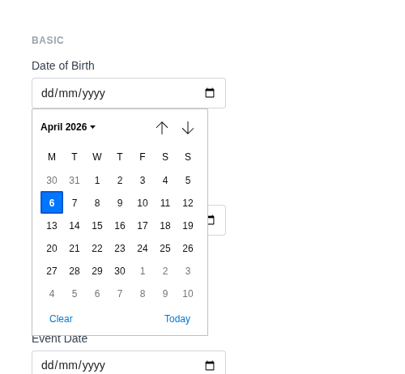
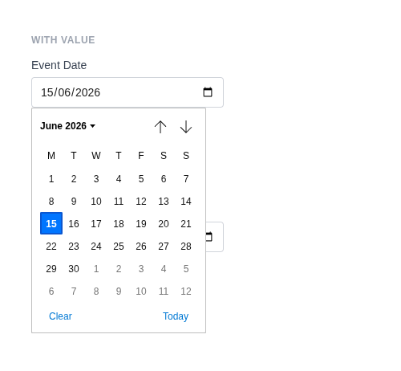

# Date Input

Renders `<input type="date">` with a browser-native date picker. Values are formatted as `YYYY-MM-DD`. Uses a custom date sanitizer by default.

**Class:** `PinkCrab\Form_Components\Element\Field\Input\Date`  
**Make helper:** `Make::date( 'name', fn(Date $f) => $f->... )`

---

## Basic Usage

```php
$this->component( new Input_Component(
        Date::make( 'birthday' )
            ->label( 'Date of Birth' )
    ) )
```



<details markdown="1">
<summary>Generated HTML</summary>

```html
<div id="form-field_birthday" class="pc-form__element pc-form__element--date_input">
    <label for="birthday" class="pc-form__label">Date of Birth</label>
        <input type="date" name="birthday" class="form-control date-input pc-form__element__field pc-form__element__field--date_input" list="_birthday__list" />
    </div>
```
</details>

---

## Using Make Helper

```php
use PinkCrab\Form_Components\Util\Make;

$this->component( Make::date( 'birthday', fn( $f ) => $f
    ->label( 'Date of Birth' )
    ->required( true )
    ->min( '1900-01-01' )
    ->max( '2026-12-31' )
) );
```

---

## Methods

### label( string $label )

Sets the visible label text above the input.

```php
Date::make( 'birthday' )->label( 'Date of Birth' )
```

<details markdown="1">
<summary>Generated HTML</summary>

```html
<div id="form-field_birthday" class="pc-form__element pc-form__element--date_input">
    <label for="birthday" class="pc-form__label">Date of Birth</label>
    <input type="date" name="birthday"
        class="form-control date-input pc-form__element__field pc-form__element__field--date_input"
    />
</div>
```
</details>

### set_existing( mixed $value )

Sets the current value. Runs through a date format sanitizer (`Y-m-d`) by default.

```php
Date::make( 'event_date' )
            ->label( 'Event Date' )
            ->set_existing( '2026-06-15' )
```



<details markdown="1">
<summary>Generated HTML</summary>

```html
<div id="form-field_event_date" class="pc-form__element pc-form__element--date_input">
    <label for="event_date" class="pc-form__label">Event Date</label>
        <input type="date" name="event_date" class="form-control date-input pc-form__element__field pc-form__element__field--date_input" list="_event_date__list" value="2026-06-15" />
    </div>
```
</details>

### min( int|float|string|null $min )

Sets the earliest allowed date.

```php
Date::make( 'booking' )
    ->label( 'Booking Date' )
    ->min( '2026-01-01' )
```

<details markdown="1">
<summary>Generated HTML</summary>

```html
<div id="form-field_booking" class="pc-form__element pc-form__element--date_input">
    <label for="booking" class="pc-form__label">Booking Date</label>
    <input type="date" name="booking"
        class="form-control date-input pc-form__element__field pc-form__element__field--date_input"
        min="2026-01-01"
    />
</div>
```
</details>

### max( int|float|string|null $max )

Sets the latest allowed date.

```php
Date::make( 'booking' )
    ->label( 'Booking Date' )
    ->max( '2026-12-31' )
```

<details markdown="1">
<summary>Generated HTML</summary>

```html
<div id="form-field_booking" class="pc-form__element pc-form__element--date_input">
    <label for="booking" class="pc-form__label">Booking Date</label>
    <input type="date" name="booking"
        class="form-control date-input pc-form__element__field pc-form__element__field--date_input"
        max="2026-12-31"
    />
</div>
```
</details>

### step_by_days( int $days )

Sets the step increment in days. Wrapper around `step()`.

```php
Date::make( 'weekly' )
    ->label( 'Select Date' )
    ->step_by_days( 1 )
```

<details markdown="1">
<summary>Generated HTML</summary>

```html
<div id="form-field_weekly" class="pc-form__element pc-form__element--date_input">
    <label for="weekly" class="pc-form__label">Select Date</label>
    <input type="date" name="weekly"
        class="form-control date-input pc-form__element__field pc-form__element__field--date_input"
        step="1"
    />
</div>
```
</details>

### step_by_weeks( int $weeks )

Sets the step increment in weeks (multiplied by 7).

```php
Date::make( 'biweekly' )
    ->label( 'Select Fortnight' )
    ->step_by_weeks( 2 )
```

<details markdown="1">
<summary>Generated HTML</summary>

```html
<div id="form-field_biweekly" class="pc-form__element pc-form__element--date_input">
    <label for="biweekly" class="pc-form__label">Select Fortnight</label>
    <input type="date" name="biweekly"
        class="form-control date-input pc-form__element__field pc-form__element__field--date_input"
        step="14"
    />
</div>
```
</details>

### required( bool $required = true )

Marks the field as required. The label displays a `*` indicator via CSS.

```php
Date::make( 'start_date' )
    ->label( 'Start Date' )
    ->required( true )
```

<details markdown="1">
<summary>Generated HTML</summary>

```html
<div id="form-field_start_date" class="pc-form__element pc-form__element--date_input">
    <label for="start_date" class="pc-form__label">Start Date</label>
    <input type="date" name="start_date"
        class="form-control date-input pc-form__element__field pc-form__element__field--date_input"
        required=""
    />
</div>
```
</details>

### disabled( bool $disabled = true )

Disables the input. Value is visible but cannot be changed or submitted.

```php
Date::make( 'locked_date' )
    ->label( 'Locked' )
    ->set_existing( '2026-01-01' )
    ->disabled( true )
```

<details markdown="1">
<summary>Generated HTML</summary>

```html
<div id="form-field_locked_date" class="pc-form__element pc-form__element--date_input">
    <label for="locked_date" class="pc-form__label">Locked</label>
    <input type="date" name="locked_date"
        class="form-control date-input pc-form__element__field pc-form__element__field--date_input"
        disabled="" value="2026-01-01"
    />
</div>
```
</details>

### readonly( bool $readonly = true )

Makes the field read-only.

```php
Date::make( 'confirmed' )
    ->label( 'Confirmed Date' )
    ->set_existing( '2026-06-15' )
    ->readonly( true )
```

<details markdown="1">
<summary>Generated HTML</summary>

```html
<div id="form-field_confirmed" class="pc-form__element pc-form__element--date_input">
    <label for="confirmed" class="pc-form__label">Confirmed Date</label>
    <input type="date" name="confirmed"
        class="form-control date-input pc-form__element__field pc-form__element__field--date_input"
        readonly="" value="2026-06-15"
    />
</div>
```
</details>

### autocomplete( string $value )

HTML `autocomplete` attribute to help browsers autofill.

```php
Date::make( 'bday' )
    ->label( 'Birthday' )
    ->autocomplete( 'bday' )
```

<details markdown="1">
<summary>Generated HTML</summary>

```html
<div id="form-field_bday" class="pc-form__element pc-form__element--date_input">
    <label for="bday" class="pc-form__label">Birthday</label>
    <input type="date" name="bday"
        class="form-control date-input pc-form__element__field pc-form__element__field--date_input"
        autocomplete="bday"
    />
</div>
```
</details>

Common values:

| Value | Description |
|-------|-------------|
| `off` | Disable autocomplete |
| `on` | Enable autocomplete (browser decides) |
| `name` | Full name |
| `given-name` | First name |
| `family-name` | Last name |
| `email` | Email address |
| `username` | Username |
| `new-password` | New password (password managers) |
| `current-password` | Current password |
| `organization` | Company/organisation name |
| `street-address` | Street address |
| `address-line1` | Address line 1 |
| `address-line2` | Address line 2 |
| `address-level2` | City |
| `address-level1` | State/province/region |
| `country` | Country code |
| `country-name` | Country name |
| `postal-code` | Postcode / ZIP |
| `tel` | Full phone number |
| `tel-national` | Phone without country code |
| `url` | URL |
| `bday` | Full date of birth |
| `bday-day` | Day of birth |
| `bday-month` | Month of birth |
| `bday-year` | Year of birth |
| `sex` | Gender |
| `cc-name` | Cardholder name |
| `cc-number` | Card number |
| `cc-exp` | Card expiry |
| `cc-csc` | Card security code |


### datalist_items( array $items )

Suggested date values via an HTML `<datalist>` element.

```php
Date::make( 'holiday' )
    ->label( 'Holiday' )
    ->datalist_items( array( '2026-01-01', '2026-12-25', '2026-12-26' ) )
```

<details markdown="1">
<summary>Generated HTML</summary>

```html
<div id="form-field_holiday" class="pc-form__element pc-form__element--date_input">
    <label for="holiday" class="pc-form__label">Holiday</label>
    <input type="date" name="holiday"
        class="form-control date-input pc-form__element__field pc-form__element__field--date_input"
        list="_holiday__list"
    />
    <datalist id="_holiday__list">
        <option value="2026-01-01"></option>
        <option value="2026-12-25"></option>
        <option value="2026-12-26"></option>
    </datalist>
</div>
```
</details>

### error_notification( string $message )

Displays an error message below the field.

```php
Date::make( 'invalid_date' )
    ->label( 'Date' )
    ->error_notification( 'Please select a valid date.' )
```

<details markdown="1">
<summary>Generated HTML</summary>

```html
<div id="form-field_invalid_date" class="pc-form__element pc-form__element--date_input notification-error">
    <label for="invalid_date" class="pc-form__label">Date</label>
    <input type="date" name="invalid_date"
        class="form-control date-input pc-form__element__field pc-form__element__field--date_input notification-error"
    />
    <div class="pc-form__notification pc-form__notification--error">Please select a valid date.</div>
</div>
```
</details>

### warning_notification( string $message )

Displays a warning message below the field.

```php
Date::make( 'past_date' )
    ->label( 'Date' )
    ->set_existing( '2020-01-01' )
    ->warning_notification( 'This date is in the past.' )
```

<details markdown="1">
<summary>Generated HTML</summary>

```html
<div id="form-field_past_date" class="pc-form__element pc-form__element--date_input notification-warning">
    <label for="past_date" class="pc-form__label">Date</label>
    <input type="date" name="past_date"
        class="form-control date-input pc-form__element__field pc-form__element__field--date_input notification-warning"
        value="2020-01-01"
    />
    <div class="pc-form__notification pc-form__notification--warning">This date is in the past.</div>
</div>
```
</details>

### success_notification( string $message )

Displays a success message below the field.

```php
Date::make( 'ok_date' )
    ->label( 'Date' )
    ->set_existing( '2026-06-15' )
    ->success_notification( 'Date is available.' )
```

<details markdown="1">
<summary>Generated HTML</summary>

```html
<div id="form-field_ok_date" class="pc-form__element pc-form__element--date_input notification-success">
    <label for="ok_date" class="pc-form__label">Date</label>
    <input type="date" name="ok_date"
        class="form-control date-input pc-form__element__field pc-form__element__field--date_input notification-success"
        value="2026-06-15"
    />
    <div class="pc-form__notification pc-form__notification--success">Date is available.</div>
</div>
```
</details>

### info_notification( string $message )

Displays an info message below the field.

```php
Date::make( 'info_date' )
    ->label( 'Date' )
    ->info_notification( 'Select a date within the next 30 days.' )
```

<details markdown="1">
<summary>Generated HTML</summary>

```html
<div id="form-field_info_date" class="pc-form__element pc-form__element--date_input notification-info">
    <label for="info_date" class="pc-form__label">Date</label>
    <input type="date" name="info_date"
        class="form-control date-input pc-form__element__field pc-form__element__field--date_input notification-info"
    />
    <div class="pc-form__notification pc-form__notification--info">Select a date within the next 30 days.</div>
</div>
```
</details>

### pre_description( string $description )

Sets a description or hint displayed before the input.

```php
Date::make( 'birthday' )
    ->label( 'Date of Birth' )
    ->pre_description( 'Select your date of birth.' )
```

### post_description( string $description )

Sets a description or help text displayed after the input, before any notification.

```php
Date::make( 'birthday' )
    ->label( 'Date of Birth' )
    ->post_description( 'Format: YYYY-MM-DD' )
```

### before( string $html ) / after( string $html )

HTML content before or after the input; renders whether or not the wrapper is shown.

```php
Date::make( 'wrapped_date' )
            ->label( 'Event Date' )
            ->before( '<span style="color:#6b7280;font-size:13px;">Select your preferred date</span>' )
            ->after( '<span style="color:#6b7280;font-size:13px;">Format: YYYY-MM-DD</span>' )
```


<details markdown="1">
<summary>Generated HTML</summary>

```html
<div id="form-field_wrapped_date" class="pc-form__element pc-form__element--date_input">
    <span style="color:#6b7280;font-size:13px">Select your preferred date</span>
        <label for="wrapped_date" class="pc-form__label">Event Date</label>
            <input type="date" name="wrapped_date" class="form-control date-input pc-form__element__field pc-form__element__field--date_input" list="_wrapped_date__list" />
            <span style="color:#6b7280;font-size:13px">Format: YYYY-MM-DD</span>
            </div>
```
</details>

### id( string $id )

Sets a custom HTML `id` on the input element.

```php
Date::make( 'date' )->id( 'my-date-picker' )
```

<details markdown="1">
<summary>Generated HTML</summary>

```html
<div id="form-field_date" class="pc-form__element pc-form__element--date_input">
    <input type="date" name="date" id="my-date-picker"
        class="form-control date-input pc-form__element__field pc-form__element__field--date_input"
    />
</div>
```
</details>

### wrapper_id( string $id )

Sets a custom HTML `id` on the wrapper div.

```php
Date::make( 'date' )->wrapper_id( 'date-wrapper' )
```

<details markdown="1">
<summary>Generated HTML</summary>

```html
<div id="date-wrapper" class="pc-form__element pc-form__element--date_input">
    <input type="date" name="date"
        class="form-control date-input pc-form__element__field pc-form__element__field--date_input"
    />
</div>
```
</details>

### data( string $key, string $value )

Adds a `data-*` attribute to the input.

```php
Date::make( 'date' )->data( 'format', 'iso' )
```

<details markdown="1">
<summary>Generated HTML</summary>

```html
<div id="form-field_date" class="pc-form__element pc-form__element--date_input">
    <input type="date" name="date"
        class="form-control date-input pc-form__element__field pc-form__element__field--date_input"
        data-format="iso"
    />
</div>
```
</details>

### wrapper_data( string $key, string $value )

Adds a `data-*` attribute to the wrapper div.

```php
Date::make( 'date' )->wrapper_data( 'section', 'booking' )
```

<details markdown="1">
<summary>Generated HTML</summary>

```html
<div id="form-field_date" class="pc-form__element pc-form__element--date_input" data-section="booking">
    <input type="date" name="date"
        class="form-control date-input pc-form__element__field pc-form__element__field--date_input"
    />
</div>
```
</details>

### add_class( string $class )

Adds a CSS class to the input element.

```php
Date::make( 'date' )->add_class( 'wide-picker' )
```

<details markdown="1">
<summary>Generated HTML</summary>

```html
<div id="form-field_date" class="pc-form__element pc-form__element--date_input">
    <input type="date" name="date"
        class="form-control date-input pc-form__element__field pc-form__element__field--date_input wide-picker"
    />
</div>
```
</details>

### add_wrapper_class( string $class )

Adds a CSS class to the wrapper div.

```php
Date::make( 'date' )->add_wrapper_class( 'date-field' )
```

<details markdown="1">
<summary>Generated HTML</summary>

```html
<div id="form-field_date" class="pc-form__element pc-form__element--date_input date-field">
    <input type="date" name="date"
        class="form-control date-input pc-form__element__field pc-form__element__field--date_input"
    />
</div>
```
</details>

### show_wrapper( bool $show = true )

Controls whether the wrapping `<div>` is rendered.

```php
Date::make( 'date' )->show_wrapper( false )
```

<details markdown="1">
<summary>Generated HTML</summary>

```html
<input type="date" name="date"
    class="form-control date-input pc-form__element__field pc-form__element__field--date_input"
/>
```
</details>

### tabindex( int $index )

Sets the tab order of the input.

```php
Date::make( 'date' )->tabindex( 4 )
```

<details markdown="1">
<summary>Generated HTML</summary>

```html
<div id="form-field_date" class="pc-form__element pc-form__element--date_input">
    <input type="date" name="date"
        class="form-control date-input pc-form__element__field pc-form__element__field--date_input"
        tabindex="4"
    />
</div>
```
</details>

### attribute( string $key, mixed $value )

Sets an arbitrary HTML attribute on the input.

```php
Date::make( 'date' )->attribute( 'aria-label', 'Select a date' )
```

<details markdown="1">
<summary>Generated HTML</summary>

```html
<div id="form-field_date" class="pc-form__element pc-form__element--date_input">
    <input type="date" name="date"
        class="form-control date-input pc-form__element__field pc-form__element__field--date_input"
        aria-label="Select a date"
    />
</div>
```
</details>

### attributes( array $attrs )

Sets multiple arbitrary HTML attributes at once.

```php
Date::make( 'date' )->attributes( array(
    'title' => 'Pick a date',
    'tabindex' => '4',
) )
```

<details markdown="1">
<summary>Generated HTML</summary>

```html
<div id="form-field_date" class="pc-form__element pc-form__element--date_input">
    <input type="date" name="date"
        class="form-control date-input pc-form__element__field pc-form__element__field--date_input"
        title="Pick a date" tabindex="4"
    />
</div>
```
</details>

### sanitizer( callable $fn )

Sets a sanitization callback applied when `set_existing()` is called. Default: custom date sanitizer that validates `Y-m-d` format using `DateTimeImmutable`.

**Using the default (automatic):**

```php
Date::make( 'date' )
    ->set_existing( '2026-06-15' ) // Validates and stores as Y-m-d
```

**Using a custom callable:**

```php
Date::make( 'date' )
    ->sanitizer( function( $value ) {
        $date = DateTimeImmutable::createFromFormat( 'Y-m-d', $value );
        return $date ? $date->format( 'Y-m-d' ) : '';
    } )
    ->set_existing( '2026-06-15' )
```

**Built-in sanitizer helpers:**

| Constant | Function | Description |
|----------|----------|-------------|
| `Sanitize::TEXT` | `sanitize_text_field()` | Strips tags, removes extra whitespace |
| `Sanitize::TEXTAREA` | `sanitize_textarea_field()` | Like TEXT but preserves line breaks |
| `Sanitize::URL` | `esc_url_raw()` | Sanitises a URL for database storage |
| `Sanitize::EMAIL` | `sanitize_email()` | Strips invalid email characters |
| `Sanitize::HEX_COLOR` | `sanitize_hex_color()` | Validates hex colour (#fff or #ffffff) |
| `Sanitize::NUMBER` | Custom numeric parser | Parses to int or float |
| `Sanitize::NOOP` | Pass-through | No sanitization applied |

### validator( Validator $validator )

Sets a Respect\Validation validator for server-side validation.

```php
use Respect\Validation\Validator as v;

Date::make( 'date' )->validator( v::date( 'Y-m-d' ) )
```

### style( Style $style )

Sets a custom style for the field, overriding the default.

```php
use PinkCrab\Form_Components\Style\Default_Style;

Date::make( 'date' )->style( new Default_Style() )
```

---

## Traits

| Trait | Methods |
|-------|---------|
| Label | `label()`, `get_label()`, `has_label()` |
| Single_Value | `value()`, `get_value()`, `has_value()` |
| Range | `min()`, `max()`, `get_min()`, `get_max()` |
| Required | `required()`, `is_required()` |
| Disabled | `disabled()`, `is_disabled()` |
| Read_Only | `readonly()`, `is_read_only()` |
| Autocomplete | `autocomplete()`, `get_autocomplete()`, `has_autocomplete()` |
| Datalist | `datalist_items()`, `get_datalist_key()`, `get_datalist_items()` |
| Description | `pre_description()`, `post_description()`, `get_pre_description()`, `get_post_description()`, `has_pre_description()`, `has_post_description()` |
| Notification | `error_notification()`, `warning_notification()`, `success_notification()`, `info_notification()` |
