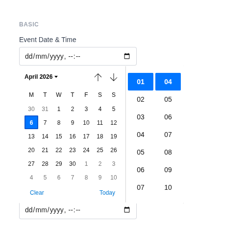
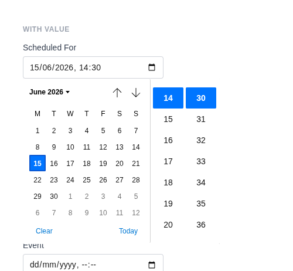
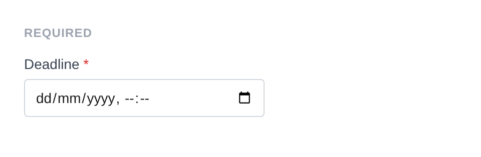

# Datetime Input

Renders `<input type="datetime-local">` with a browser-native date and time picker. Values are formatted as `YYYY-MM-DDTHH:MM:SS`. Uses a custom datetime sanitizer by default.

**Class:** `PinkCrab\Form_Components\Element\Field\Input\Datetime`  
**Make helper:** `Make::datetime( 'name', fn(Datetime $f) => $f->... )`

---

## Basic Usage

```php
$this->component( new Input_Component(
        Datetime::make( 'event' )
            ->label( 'Event Date & Time' )
    ) )
```



<details markdown="1">
<summary>Generated HTML</summary>

```html
<div id="form-field_event" class="pc-form__element pc-form__element--datetime-local_input">
    <label for="event" class="pc-form__label">Event Date &amp; Time</label>
        <input type="datetime-local" name="event" class="form-control datetime-local-input pc-form__element__field pc-form__element__field--datetime-local_input" list="_event__list" />
    </div>
```
</details>

---

## Using Make Helper

```php
use PinkCrab\Form_Components\Util\Make;

$this->component( Make::datetime( 'event_start', fn( $f ) => $f
    ->label( 'Event Start' )
    ->required( true )
    ->min( '2026-01-01T00:00' )
    ->max( '2026-12-31T23:59' )
) );
```

---

## Methods

### label( string $label )

Sets the visible label text above the input.

```php
Datetime::make( 'event_start' )->label( 'Event Start' )
```

<details markdown="1">
<summary>Generated HTML</summary>

```html
<div id="form-field_event_start" class="pc-form__element pc-form__element--datetime-local_input">
    <label for="event_start" class="pc-form__label">Event Start</label>
    <input type="datetime-local" name="event_start"
        class="form-control datetime-local-input pc-form__element__field pc-form__element__field--datetime-local_input"
    />
</div>
```
</details>

### set_existing( mixed $value )

Sets the current value. Runs through a datetime format sanitizer (`Y-m-d\TH:i:s`) by default, accepting both `Y-m-d\TH:i` and `Y-m-d\TH:i:s` formats.

```php
Datetime::make( 'scheduled' )
    ->label( 'Scheduled For' )
    ->set_existing( '2026-06-15T14:30' )
```



<details markdown="1">
<summary>Generated HTML</summary>

```html
<div id="form-field_scheduled" class="pc-form__element pc-form__element--datetime-local_input">
    <label for="scheduled" class="pc-form__label">Scheduled For</label>
        <input type="datetime-local" name="scheduled" class="form-control datetime-local-input pc-form__element__field pc-form__element__field--datetime-local_input" list="_scheduled__list" value="2026-06-15T14:30:00" />
    </div>
```
</details>

### min( int|float|string|null $min )

Sets the earliest allowed datetime.

```php
Datetime::make( 'event_start' )
    ->label( 'Event Start' )
    ->min( '2026-01-01T00:00' )
```

<details markdown="1">
<summary>Generated HTML</summary>

```html
<div id="form-field_event_start" class="pc-form__element pc-form__element--datetime-local_input">
    <label for="event_start" class="pc-form__label">Event Start</label>
    <input type="datetime-local" name="event_start"
        class="form-control datetime-local-input pc-form__element__field pc-form__element__field--datetime-local_input"
        min="2026-01-01T00:00"
    />
</div>
```
</details>

### max( int|float|string|null $max )

Sets the latest allowed datetime.

```php
Datetime::make( 'event_start' )
    ->label( 'Event Start' )
    ->max( '2026-12-31T23:59' )
```

<details markdown="1">
<summary>Generated HTML</summary>

```html
<div id="form-field_event_start" class="pc-form__element pc-form__element--datetime-local_input">
    <label for="event_start" class="pc-form__label">Event Start</label>
    <input type="datetime-local" name="event_start"
        class="form-control datetime-local-input pc-form__element__field pc-form__element__field--datetime-local_input"
        max="2026-12-31T23:59"
    />
</div>
```
</details>

### range( int|float|string $min, int|float|string $max )

Sets both min and max datetimes in a single call.

```php
Datetime::make( 'event_start' )
    ->label( 'Event Start' )
    ->range( '2026-01-01T00:00', '2026-12-31T23:59' )
```

<details markdown="1">
<summary>Generated HTML</summary>

```html
<div id="form-field_event_start" class="pc-form__element pc-form__element--datetime-local_input">
    <label for="event_start" class="pc-form__label">Event Start</label>
    <input type="datetime-local" name="event_start"
        class="form-control datetime-local-input pc-form__element__field pc-form__element__field--datetime-local_input"
        min="2026-01-01T00:00" max="2026-12-31T23:59"
    />
</div>
```
</details>

### step( int|float|string|null $step )

Sets the step increment in seconds.

```php
Datetime::make( 'event_start' )
    ->label( 'Event Start' )
    ->step( 900 )
```

<details markdown="1">
<summary>Generated HTML</summary>

```html
<div id="form-field_event_start" class="pc-form__element pc-form__element--datetime-local_input">
    <label for="event_start" class="pc-form__label">Event Start</label>
    <input type="datetime-local" name="event_start"
        class="form-control datetime-local-input pc-form__element__field pc-form__element__field--datetime-local_input"
        step="900"
    />
</div>
```
</details>

### step_by_seconds( int $seconds )

Convenience method to step by a number of seconds.

```php
Datetime::make( 'precise_event' )
    ->label( 'Precise Event' )
    ->step_by_seconds( 30 )
```

<details markdown="1">
<summary>Generated HTML</summary>

```html
<div id="form-field_precise_event" class="pc-form__element pc-form__element--datetime-local_input">
    <label for="precise_event" class="pc-form__label">Precise Event</label>
    <input type="datetime-local" name="precise_event"
        class="form-control datetime-local-input pc-form__element__field pc-form__element__field--datetime-local_input"
        step="30"
    />
</div>
```
</details>

### step_by_minutes( int $minutes )

Convenience method to step by a number of minutes (multiplied by 60 internally).

```php
Datetime::make( 'appointment' )
    ->label( 'Appointment' )
    ->step_by_minutes( 15 )
```

<details markdown="1">
<summary>Generated HTML</summary>

```html
<div id="form-field_appointment" class="pc-form__element pc-form__element--datetime-local_input">
    <label for="appointment" class="pc-form__label">Appointment</label>
    <input type="datetime-local" name="appointment"
        class="form-control datetime-local-input pc-form__element__field pc-form__element__field--datetime-local_input"
        step="900"
    />
</div>
```
</details>

### step_by_hours( int $hours )

Convenience method to step by a number of hours (multiplied by 3600 internally).

```php
Datetime::make( 'shift_start' )
    ->label( 'Shift Start' )
    ->step_by_hours( 1 )
```

<details markdown="1">
<summary>Generated HTML</summary>

```html
<div id="form-field_shift_start" class="pc-form__element pc-form__element--datetime-local_input">
    <label for="shift_start" class="pc-form__label">Shift Start</label>
    <input type="datetime-local" name="shift_start"
        class="form-control datetime-local-input pc-form__element__field pc-form__element__field--datetime-local_input"
        step="3600"
    />
</div>
```
</details>

### step_by_days( int $days )

Convenience method to step by a number of days (multiplied by 86400 internally).

```php
Datetime::make( 'daily_event' )
    ->label( 'Daily Event' )
    ->step_by_days( 1 )
```

<details markdown="1">
<summary>Generated HTML</summary>

```html
<div id="form-field_daily_event" class="pc-form__element pc-form__element--datetime-local_input">
    <label for="daily_event" class="pc-form__label">Daily Event</label>
    <input type="datetime-local" name="daily_event"
        class="form-control datetime-local-input pc-form__element__field pc-form__element__field--datetime-local_input"
        step="86400"
    />
</div>
```
</details>

### step_by_weeks( int $weeks )

Convenience method to step by a number of weeks (multiplied by 604800 internally).

```php
Datetime::make( 'weekly_meeting' )
    ->label( 'Weekly Meeting' )
    ->step_by_weeks( 1 )
```

<details markdown="1">
<summary>Generated HTML</summary>

```html
<div id="form-field_weekly_meeting" class="pc-form__element pc-form__element--datetime-local_input">
    <label for="weekly_meeting" class="pc-form__label">Weekly Meeting</label>
    <input type="datetime-local" name="weekly_meeting"
        class="form-control datetime-local-input pc-form__element__field pc-form__element__field--datetime-local_input"
        step="604800"
    />
</div>
```
</details>

### required( bool $required = true )

Marks the field as required. The label displays a `*` indicator via CSS.

```php
Datetime::make( 'required_dt' )
    ->label( 'Deadline' )
    ->required( true )
```



<details markdown="1">
<summary>Generated HTML</summary>

```html
<div id="form-field_required_dt" class="pc-form__element pc-form__element--datetime-local_input">
    <label for="required_dt" class="pc-form__label">Deadline</label>
        <input type="datetime-local" name="required_dt" class="form-control datetime-local-input pc-form__element__field pc-form__element__field--datetime-local_input" list="_required_dt__list" required="" />
    </div>
```
</details>

### readonly( bool $readonly = true )

Makes the field read-only. Value can be selected and copied but not changed.

```php
Datetime::make( 'created_at' )
    ->label( 'Created At' )
    ->set_existing( '2026-01-01T10:00' )
    ->readonly( true )
```

<details markdown="1">
<summary>Generated HTML</summary>

```html
<div id="form-field_created_at" class="pc-form__element pc-form__element--datetime-local_input">
    <label for="created_at" class="pc-form__label">Created At</label>
    <input type="datetime-local" name="created_at"
        class="form-control datetime-local-input pc-form__element__field pc-form__element__field--datetime-local_input"
        readonly="" value="2026-01-01T10:00:00"
    />
</div>
```
</details>

### autocomplete( string $value )

HTML `autocomplete` attribute to help browsers autofill.

```php
Datetime::make( 'event_start' )
    ->label( 'Event Start' )
    ->autocomplete( 'off' )
```

<details markdown="1">
<summary>Generated HTML</summary>

```html
<div id="form-field_event_start" class="pc-form__element pc-form__element--datetime-local_input">
    <label for="event_start" class="pc-form__label">Event Start</label>
    <input type="datetime-local" name="event_start"
        class="form-control datetime-local-input pc-form__element__field pc-form__element__field--datetime-local_input"
        autocomplete="off"
    />
</div>
```
</details>

Common values:

| Value | Description |
|-------|-------------|
| `off` | Disable autocomplete |
| `on` | Enable autocomplete (browser decides) |
| `name` | Full name |
| `given-name` | First name |
| `family-name` | Last name |
| `email` | Email address |
| `username` | Username |
| `new-password` | New password (password managers) |
| `current-password` | Current password |
| `organization` | Company/organisation name |
| `street-address` | Street address |
| `address-line1` | Address line 1 |
| `address-line2` | Address line 2 |
| `address-level2` | City |
| `address-level1` | State/province/region |
| `country` | Country code |
| `country-name` | Country name |
| `postal-code` | Postcode / ZIP |
| `tel` | Full phone number |
| `tel-national` | Phone without country code |
| `url` | URL |
| `bday` | Full date of birth |
| `bday-day` | Day of birth |
| `bday-month` | Month of birth |
| `bday-year` | Year of birth |
| `sex` | Gender |
| `cc-name` | Cardholder name |
| `cc-number` | Card number |
| `cc-exp` | Card expiry |
| `cc-csc` | Card security code |


### datalist_items( array $items )

Autocomplete suggestions via an HTML `<datalist>` element.

```php
Datetime::make( 'meeting' )
    ->label( 'Meeting' )
    ->datalist_items( array(
        '2026-07-01T09:00',
        '2026-07-01T14:00',
        '2026-07-02T09:00',
    ) )
```

<details markdown="1">
<summary>Generated HTML</summary>

```html
<div id="form-field_meeting" class="pc-form__element pc-form__element--datetime-local_input">
    <label for="meeting" class="pc-form__label">Meeting</label>
    <input type="datetime-local" name="meeting"
        class="form-control datetime-local-input pc-form__element__field pc-form__element__field--datetime-local_input"
        list="_meeting__list"
    />
    <datalist id="_meeting__list">
        <option value="2026-07-01T09:00"></option>
        <option value="2026-07-01T14:00"></option>
        <option value="2026-07-02T09:00"></option>
    </datalist>
</div>
```
</details>

### error_notification( string $message )

Displays an error message below the field.

```php
Datetime::make( 'invalid_event' )
    ->label( 'Event Start' )
    ->error_notification( 'Please enter a valid date and time.' )
```

<details markdown="1">
<summary>Generated HTML</summary>

```html
<div id="form-field_invalid_event" class="pc-form__element pc-form__element--datetime-local_input notification-error">
    <label for="invalid_event" class="pc-form__label">Event Start</label>
    <input type="datetime-local" name="invalid_event"
        class="form-control datetime-local-input pc-form__element__field pc-form__element__field--datetime-local_input notification-error"
    />
    <div class="pc-form__notification pc-form__notification--error">Please enter a valid date and time.</div>
</div>
```
</details>

### warning_notification( string $message )

Displays a warning message below the field.

```php
Datetime::make( 'past_event' )
    ->label( 'Event Start' )
    ->set_existing( '2024-01-01T00:00' )
    ->warning_notification( 'This date is in the past.' )
```

<details markdown="1">
<summary>Generated HTML</summary>

```html
<div id="form-field_past_event" class="pc-form__element pc-form__element--datetime-local_input notification-warning">
    <label for="past_event" class="pc-form__label">Event Start</label>
    <input type="datetime-local" name="past_event"
        class="form-control datetime-local-input pc-form__element__field pc-form__element__field--datetime-local_input notification-warning"
        value="2024-01-01T00:00:00"
    />
    <div class="pc-form__notification pc-form__notification--warning">This date is in the past.</div>
</div>
```
</details>

### success_notification( string $message )

Displays a success message below the field.

```php
Datetime::make( 'ok_event' )
    ->label( 'Event Start' )
    ->set_existing( '2026-07-01T09:00' )
    ->success_notification( 'Slot confirmed.' )
```

<details markdown="1">
<summary>Generated HTML</summary>

```html
<div id="form-field_ok_event" class="pc-form__element pc-form__element--datetime-local_input notification-success">
    <label for="ok_event" class="pc-form__label">Event Start</label>
    <input type="datetime-local" name="ok_event"
        class="form-control datetime-local-input pc-form__element__field pc-form__element__field--datetime-local_input notification-success"
        value="2026-07-01T09:00:00"
    />
    <div class="pc-form__notification pc-form__notification--success">Slot confirmed.</div>
</div>
```
</details>

### info_notification( string $message )

Displays an info message below the field.

```php
Datetime::make( 'info_event' )
    ->label( 'Event Start' )
    ->info_notification( 'All times are in your local timezone.' )
```

<details markdown="1">
<summary>Generated HTML</summary>

```html
<div id="form-field_info_event" class="pc-form__element pc-form__element--datetime-local_input notification-info">
    <label for="info_event" class="pc-form__label">Event Start</label>
    <input type="datetime-local" name="info_event"
        class="form-control datetime-local-input pc-form__element__field pc-form__element__field--datetime-local_input notification-info"
    />
    <div class="pc-form__notification pc-form__notification--info">All times are in your local timezone.</div>
</div>
```
</details>

### pre_description( string $description )

Sets a description or hint displayed before the input.

```php
Datetime::make( 'event_start' )
    ->label( 'Event Start' )
    ->pre_description( 'Select the event date and time.' )
```

### post_description( string $description )

Sets a description or help text displayed after the input, before any notification.

```php
Datetime::make( 'event_start' )
    ->label( 'Event Start' )
    ->post_description( 'All times are in your local timezone.' )
```

### before( string $html ) / after( string $html )

HTML content before or after the input; renders whether or not the wrapper is shown.

```php
Datetime::make( 'wrapped_dt' )
    ->label( 'Event' )
    ->before( '<span style="color:#6b7280;font-size:13px;">Select date and time</span>' )
    ->after( '<span style="color:#6b7280;font-size:13px;">All times in UTC</span>' )
```


<details markdown="1">
<summary>Generated HTML</summary>

```html
<div id="form-field_wrapped_dt" class="pc-form__element pc-form__element--datetime-local_input">
    <span style="color:#6b7280;font-size:13px">Select date and time</span>
        <label for="wrapped_dt" class="pc-form__label">Event</label>
            <input type="datetime-local" name="wrapped_dt" class="form-control datetime-local-input pc-form__element__field pc-form__element__field--datetime-local_input" list="_wrapped_dt__list" />
            <span style="color:#6b7280;font-size:13px">All times in UTC</span>
            </div>
```
</details>

### id( string $id )

Sets a custom HTML `id` on the input element.

```php
Datetime::make( 'event_start' )->id( 'my-datetime-picker' )
```

<details markdown="1">
<summary>Generated HTML</summary>

```html
<div id="form-field_event_start" class="pc-form__element pc-form__element--datetime-local_input">
    <input type="datetime-local" name="event_start" id="my-datetime-picker"
        class="form-control datetime-local-input pc-form__element__field pc-form__element__field--datetime-local_input"
    />
</div>
```
</details>

### wrapper_id( string $id )

Sets a custom HTML `id` on the wrapper div.

```php
Datetime::make( 'event_start' )->wrapper_id( 'event-start-wrapper' )
```

<details markdown="1">
<summary>Generated HTML</summary>

```html
<div id="event-start-wrapper" class="pc-form__element pc-form__element--datetime-local_input">
    <input type="datetime-local" name="event_start"
        class="form-control datetime-local-input pc-form__element__field pc-form__element__field--datetime-local_input"
    />
</div>
```
</details>

### data( string $key, string $value )

Adds a `data-*` attribute to the input.

```php
Datetime::make( 'event_start' )->data( 'timezone', 'Europe/London' )
```

<details markdown="1">
<summary>Generated HTML</summary>

```html
<div id="form-field_event_start" class="pc-form__element pc-form__element--datetime-local_input">
    <input type="datetime-local" name="event_start"
        class="form-control datetime-local-input pc-form__element__field pc-form__element__field--datetime-local_input"
        data-timezone="Europe/London"
    />
</div>
```
</details>

### wrapper_data( string $key, string $value )

Adds a `data-*` attribute to the wrapper div.

```php
Datetime::make( 'event_start' )->wrapper_data( 'section', 'scheduling' )
```

<details markdown="1">
<summary>Generated HTML</summary>

```html
<div id="form-field_event_start" class="pc-form__element pc-form__element--datetime-local_input" data-section="scheduling">
    <input type="datetime-local" name="event_start"
        class="form-control datetime-local-input pc-form__element__field pc-form__element__field--datetime-local_input"
    />
</div>
```
</details>

### add_class( string $class )

Adds a CSS class to the input element.

```php
Datetime::make( 'event_start' )->add_class( 'datetime-picker' )
```

<details markdown="1">
<summary>Generated HTML</summary>

```html
<div id="form-field_event_start" class="pc-form__element pc-form__element--datetime-local_input">
    <input type="datetime-local" name="event_start"
        class="form-control datetime-local-input pc-form__element__field pc-form__element__field--datetime-local_input datetime-picker"
    />
</div>
```
</details>

### add_wrapper_class( string $class )

Adds a CSS class to the wrapper div.

```php
Datetime::make( 'event_start' )->add_wrapper_class( 'datetime-field' )
```

<details markdown="1">
<summary>Generated HTML</summary>

```html
<div id="form-field_event_start" class="pc-form__element pc-form__element--datetime-local_input datetime-field">
    <input type="datetime-local" name="event_start"
        class="form-control datetime-local-input pc-form__element__field pc-form__element__field--datetime-local_input"
    />
</div>
```
</details>

### show_wrapper( bool $show = true )

Controls whether the wrapping `<div>` is rendered.

```php
Datetime::make( 'event_start' )->show_wrapper( false )
```

<details markdown="1">
<summary>Generated HTML</summary>

```html
<input type="datetime-local" name="event_start"
    class="form-control datetime-local-input pc-form__element__field pc-form__element__field--datetime-local_input"
/>
```
</details>

### tabindex( int $index )

Sets the tab order of the input.

```php
Datetime::make( 'event_start' )->tabindex( 3 )
```

<details markdown="1">
<summary>Generated HTML</summary>

```html
<div id="form-field_event_start" class="pc-form__element pc-form__element--datetime-local_input">
    <input type="datetime-local" name="event_start"
        class="form-control datetime-local-input pc-form__element__field pc-form__element__field--datetime-local_input"
        tabindex="3"
    />
</div>
```
</details>

### attribute( string $key, mixed $value )

Sets an arbitrary HTML attribute on the input.

```php
Datetime::make( 'event_start' )->attribute( 'aria-label', 'Select event start date and time' )
```

<details markdown="1">
<summary>Generated HTML</summary>

```html
<div id="form-field_event_start" class="pc-form__element pc-form__element--datetime-local_input">
    <input type="datetime-local" name="event_start"
        class="form-control datetime-local-input pc-form__element__field pc-form__element__field--datetime-local_input"
        aria-label="Select event start date and time"
    />
</div>
```
</details>

### attributes( array $attrs )

Sets multiple arbitrary HTML attributes at once.

```php
Datetime::make( 'event_start' )->attributes( array(
    'title' => 'Pick a date and time',
    'tabindex' => '3',
) )
```

<details markdown="1">
<summary>Generated HTML</summary>

```html
<div id="form-field_event_start" class="pc-form__element pc-form__element--datetime-local_input">
    <input type="datetime-local" name="event_start"
        class="form-control datetime-local-input pc-form__element__field pc-form__element__field--datetime-local_input"
        title="Pick a date and time" tabindex="3"
    />
</div>
```
</details>

### sanitizer( callable $fn )

Sets a sanitization callback applied when `set_existing()` is called. Default: custom datetime sanitizer that validates `Y-m-d\TH:i` or `Y-m-d\TH:i:s` format and outputs as `Y-m-d\TH:i:s`.

**Using the default (automatic):**

```php
Datetime::make( 'event_start' )
    ->set_existing( '2026-06-15T09:30' ) // Validates and stores as Y-m-d\TH:i:s
```

**Using a custom callable:**

```php
Datetime::make( 'event_start' )
    ->sanitizer( function( $value ) {
        $date = DateTimeImmutable::createFromFormat( 'Y-m-d\TH:i', $value );
        return $date ? $date->format( 'Y-m-d\TH:i:s' ) : '';
    } )
    ->set_existing( '2026-06-15T09:30' )
```

**Built-in sanitizer helpers:**

| Constant | Function | Description |
|----------|----------|-------------|
| `Sanitize::TEXT` | `sanitize_text_field()` | Strips tags, removes extra whitespace |
| `Sanitize::TEXTAREA` | `sanitize_textarea_field()` | Like TEXT but preserves line breaks |
| `Sanitize::URL` | `esc_url_raw()` | Sanitises a URL for database storage |
| `Sanitize::EMAIL` | `sanitize_email()` | Strips invalid email characters |
| `Sanitize::HEX_COLOR` | `sanitize_hex_color()` | Validates hex colour (#fff or #ffffff) |
| `Sanitize::NUMBER` | Custom numeric parser | Parses to int or float |
| `Sanitize::NOOP` | Pass-through | No sanitization applied |

### validator( Validator $validator )

Sets a Respect\Validation validator for server-side validation.

```php
use Respect\Validation\Validator as v;

Datetime::make( 'event_start' )->validator( v::date( 'Y-m-d\TH:i:s' ) )
```

### style( Style $style )

Sets a custom style for the field, overriding the default.

```php
use PinkCrab\Form_Components\Style\Default_Style;

Datetime::make( 'event_start' )->style( new Default_Style() )
```

---

## Traits

| Trait | Methods |
|-------|---------|
| Label | `label()`, `get_label()`, `has_label()` |
| Single_Value | `value()`, `get_value()`, `has_value()` |
| Range | `min()`, `max()`, `range()`, `get_min()`, `get_max()` |
| Step | `step()`, `get_step()`, `has_step()`, `clear_step()` |
| Required | `required()`, `is_required()` |
| Read_Only | `readonly()`, `is_read_only()` |
| Autocomplete | `autocomplete()`, `get_autocomplete()`, `has_autocomplete()` |
| Datalist | `datalist_items()`, `get_datalist_key()`, `get_datalist_items()` |
| Description | `pre_description()`, `post_description()`, `get_pre_description()`, `get_post_description()`, `has_pre_description()`, `has_post_description()` |
| Notification | `error_notification()`, `warning_notification()`, `success_notification()`, `info_notification()` |
