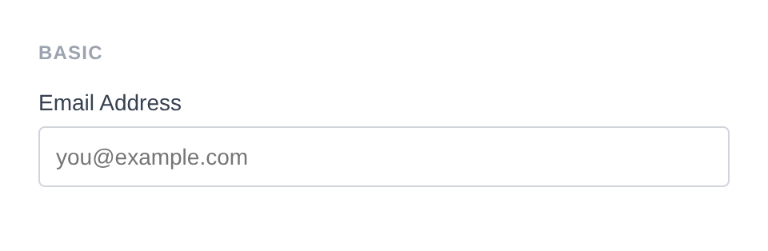
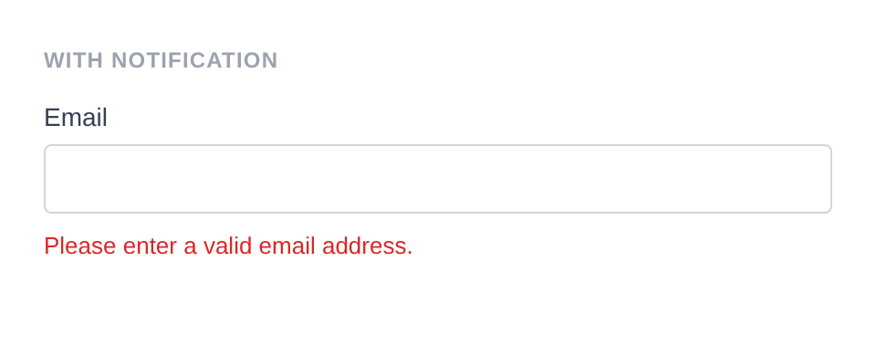
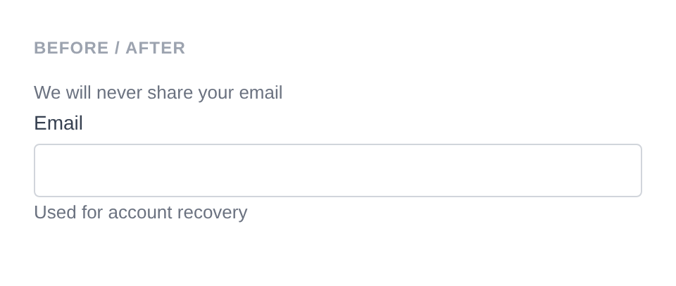

# Email Input

Renders `<input type="email">`. The browser provides built-in email format validation. Default sanitizer: custom pipe that splits on commas, trims, and applies `sanitize_email()` to each.

**Class:** `PinkCrab\Form_Components\Element\Field\Input\Email`  
**Make helper:** `Make::email( 'name', fn(Email $f) => $f->... )`

---

## Basic Usage

```php
$this->component( new Input_Component(
		Email::make( 'email' )
			->label( 'Email Address' )
			->placeholder( 'you@example.com' )
	) )
```



<details>
<summary>Generated HTML</summary>

```html
<div id="form-field_email" class="pc-form__element pc-form__element--email_input">
    <label for="email" class="pc-form__label">Email Address</label>
        <input type="email" name="email" class="form-control email-input pc-form__element__field pc-form__element__field--email_input" list="_email__list" placeholder="you@example.com" />
    </div>
```
</details>

---

## Using Make Helper

```php
use PinkCrab\Form_Components\Util\Make;

$this->component( Make::email( 'email', fn( $f ) => $f
    ->label( 'Email Address' )
    ->required( true )
) );
```

---

## Methods

### label( string $label )

Sets the visible label text above the input.

```php
Email::make( 'email' )->label( 'Email Address' )
```

<details>
<summary>Generated HTML</summary>

```html
<div id="form-field_email" class="pc-form__element pc-form__element--email_input">
    <label for="email" class="pc-form__label">Email Address</label>
    <input type="email" name="email"
        class="form-control email-input pc-form__element__field pc-form__element__field--email_input"
    />
</div>
```
</details>

### set_existing( mixed $value )

Sets the current email value. Runs through the built-in email sanitizer by default (splits on commas, trims, applies `sanitize_email()`).

```php
Email::make( 'contact_email' )
    ->label( 'Contact Email' )
    ->set_existing( 'john@example.com' )
```

<details>
<summary>Generated HTML</summary>

```html
<div id="form-field_contact_email" class="pc-form__element pc-form__element--email_input">
    <label for="contact_email" class="pc-form__label">Contact Email</label>
    <input type="email" name="contact_email"
        class="form-control email-input pc-form__element__field pc-form__element__field--email_input"
        value="john@example.com"
    />
</div>
```
</details>

### placeholder( string $text )

Sets placeholder text shown when the input is empty.

```php
Email::make( 'email' )
    ->label( 'Email' )
    ->placeholder( 'you@example.com' )
```

<details>
<summary>Generated HTML</summary>

```html
<div id="form-field_email" class="pc-form__element pc-form__element--email_input">
    <label for="email" class="pc-form__label">Email</label>
    <input type="email" name="email"
        class="form-control email-input pc-form__element__field pc-form__element__field--email_input"
        placeholder="you@example.com"
    />
</div>
```
</details>

### required( bool $required = true )

Marks the field as required.

```php
Email::make( 'email' )
    ->label( 'Email' )
    ->required( true )
```

<details>
<summary>Generated HTML</summary>

```html
<div id="form-field_email" class="pc-form__element pc-form__element--email_input">
    <label for="email" class="pc-form__label">Email</label>
    <input type="email" name="email"
        class="form-control email-input pc-form__element__field pc-form__element__field--email_input"
        required=""
    />
</div>
```
</details>

### disabled( bool $disabled = true )

Disables the input. The email is visible but cannot be changed.

```php
Email::make( 'verified_email' )
    ->label( 'Verified Email' )
    ->set_existing( 'verified@example.com' )
    ->disabled( true )
```

<details>
<summary>Generated HTML</summary>

```html
<div id="form-field_verified_email" class="pc-form__element pc-form__element--email_input">
    <label for="verified_email" class="pc-form__label">Verified Email</label>
    <input type="email" name="verified_email"
        class="form-control email-input pc-form__element__field pc-form__element__field--email_input"
        disabled="" value="verified@example.com"
    />
</div>
```
</details>

### readonly( bool $readonly = true )

Makes the input read-only. The value is visible and submitted but cannot be edited.

```php
Email::make( 'registered_email' )
    ->label( 'Registered Email' )
    ->set_existing( 'registered@example.com' )
    ->readonly( true )
```

<details>
<summary>Generated HTML</summary>

```html
<div id="form-field_registered_email" class="pc-form__element pc-form__element--email_input">
    <label for="registered_email" class="pc-form__label">Registered Email</label>
    <input type="email" name="registered_email"
        class="form-control email-input pc-form__element__field pc-form__element__field--email_input"
        readonly="" value="registered@example.com"
    />
</div>
```
</details>

### pattern( string $regex )

Sets a regex pattern for client-side validation.

```php
Email::make( 'corp_email' )
    ->label( 'Corporate Email' )
    ->pattern( '[a-z]+@company\\.com' )
    ->placeholder( 'name@company.com' )
```

<details>
<summary>Generated HTML</summary>

```html
<div id="form-field_corp_email" class="pc-form__element pc-form__element--email_input">
    <label for="corp_email" class="pc-form__label">Corporate Email</label>
    <input type="email" name="corp_email"
        class="form-control email-input pc-form__element__field pc-form__element__field--email_input"
        pattern="[a-z]+@company\.com" placeholder="name@company.com"
    />
</div>
```
</details>

### minlength( int $min ) / maxlength( int $max )

Sets the minimum and maximum character length for the input.

```php
Email::make( 'email' )
    ->label( 'Email' )
    ->minlength( 5 )
    ->maxlength( 100 )
```

<details>
<summary>Generated HTML</summary>

```html
<div id="form-field_email" class="pc-form__element pc-form__element--email_input">
    <label for="email" class="pc-form__label">Email</label>
    <input type="email" name="email"
        class="form-control email-input pc-form__element__field pc-form__element__field--email_input"
        minlength="5" maxlength="100"
    />
</div>
```
</details>

### size( int $size )

Sets the visible width of the input in characters.

```php
Email::make( 'email' )
    ->label( 'Email' )
    ->size( 40 )
```

<details>
<summary>Generated HTML</summary>

```html
<div id="form-field_email" class="pc-form__element pc-form__element--email_input">
    <label for="email" class="pc-form__label">Email</label>
    <input type="email" name="email"
        class="form-control email-input pc-form__element__field pc-form__element__field--email_input"
        size="40"
    />
</div>
```
</details>

### multiple( bool $multiple = true )

Allows multiple comma-separated email addresses.

```php
Email::make( 'recipients' )
    ->label( 'Recipients' )
    ->multiple( true )
```

<details>
<summary>Generated HTML</summary>

```html
<div id="form-field_recipients" class="pc-form__element pc-form__element--email_input">
    <label for="recipients" class="pc-form__label">Recipients</label>
    <input type="email" name="recipients"
        class="form-control email-input pc-form__element__field pc-form__element__field--email_input"
        multiple=""
    />
</div>
```
</details>

### autocomplete( string $value )

HTML `autocomplete` attribute.

```php
Email::make( 'email' )
    ->label( 'Email' )
    ->autocomplete( 'email' )
```

<details>
<summary>Generated HTML</summary>

```html
<div id="form-field_email" class="pc-form__element pc-form__element--email_input">
    <label for="email" class="pc-form__label">Email</label>
    <input type="email" name="email"
        class="form-control email-input pc-form__element__field pc-form__element__field--email_input"
        autocomplete="email"
    />
</div>
```
</details>

Common values:

| Value | Description |
|-------|-------------|
| `off` | Disable autocomplete |
| `on` | Enable autocomplete (browser decides) |
| `name` | Full name |
| `given-name` | First name |
| `family-name` | Last name |
| `email` | Email address |
| `username` | Username |
| `new-password` | New password (password managers) |
| `current-password` | Current password |
| `organization` | Company/organisation name |
| `street-address` | Street address |
| `address-line1` | Address line 1 |
| `address-line2` | Address line 2 |
| `address-level2` | City |
| `address-level1` | State/province/region |
| `country` | Country code |
| `country-name` | Country name |
| `postal-code` | Postcode / ZIP |
| `tel` | Full phone number |
| `tel-national` | Phone without country code |
| `url` | URL |
| `bday` | Full date of birth |
| `bday-day` | Day of birth |
| `bday-month` | Month of birth |
| `bday-year` | Year of birth |
| `sex` | Gender |
| `cc-name` | Cardholder name |
| `cc-number` | Card number |
| `cc-exp` | Card expiry |
| `cc-csc` | Card security code |


### datalist_items( array $items )

Suggested email values via an HTML `<datalist>` element.

```php
Email::make( 'email' )
    ->label( 'Email' )
    ->datalist_items( array( 'admin@example.com', 'info@example.com', 'support@example.com' ) )
```

<details>
<summary>Generated HTML</summary>

```html
<div id="form-field_email" class="pc-form__element pc-form__element--email_input">
    <label for="email" class="pc-form__label">Email</label>
    <input type="email" name="email"
        class="form-control email-input pc-form__element__field pc-form__element__field--email_input"
        list="_email__list"
    />
    <datalist id="_email__list">
        <option value="admin@example.com"></option>
        <option value="info@example.com"></option>
        <option value="support@example.com"></option>
    </datalist>
</div>
```
</details>

### error_notification( string $message )

Displays an error message below the field.

```php
Email::make( 'invalid_email' )
			->label( 'Email' )
			->set_existing( 'not-an-email' )
			->error_notification( 'Please enter a valid email address.' )
```



<details>
<summary>Generated HTML</summary>

```html
<div id="form-field_invalid_email" class="pc-form__element pc-form__element--email_input pc-form__element pc-form__element--email_input notification-error">
    <label for="invalid_email" class="pc-form__label">Email</label>
        <input type="email" name="invalid_email" class="form-control email-input pc-form__element__field pc-form__element__field--email_input pc-form__element__field pc-form__element__field--email_input notification-error" list="_invalid_email__list" value="" />
        <div class="pc-form__notification pc-form__notification--error">Please enter a valid email address.</div>
        </div>
```
</details>

### warning_notification( string $message )

Displays a warning message below the field.

```php
Email::make( 'warn_email' )
    ->label( 'Email' )
    ->warning_notification( 'This email domain looks suspicious.' )
```

<details>
<summary>Generated HTML</summary>

```html
<div id="form-field_warn_email" class="pc-form__element pc-form__element--email_input notification-warning">
    <label for="warn_email" class="pc-form__label">Email</label>
    <input type="email" name="warn_email"
        class="form-control email-input pc-form__element__field pc-form__element__field--email_input notification-warning"
    />
    <div class="pc-form__notification pc-form__notification--warning">This email domain looks suspicious.</div>
</div>
```
</details>

### success_notification( string $message )

Displays a success message below the field.

```php
Email::make( 'ok_email' )
    ->label( 'Email' )
    ->set_existing( 'valid@example.com' )
    ->success_notification( 'Email verified!' )
```

<details>
<summary>Generated HTML</summary>

```html
<div id="form-field_ok_email" class="pc-form__element pc-form__element--email_input notification-success">
    <label for="ok_email" class="pc-form__label">Email</label>
    <input type="email" name="ok_email"
        class="form-control email-input pc-form__element__field pc-form__element__field--email_input notification-success"
        value="valid@example.com"
    />
    <div class="pc-form__notification pc-form__notification--success">Email verified!</div>
</div>
```
</details>

### info_notification( string $message )

Displays an info message below the field.

```php
Email::make( 'info_email' )
    ->label( 'Email' )
    ->info_notification( 'We will send a verification link.' )
```

<details>
<summary>Generated HTML</summary>

```html
<div id="form-field_info_email" class="pc-form__element pc-form__element--email_input notification-info">
    <label for="info_email" class="pc-form__label">Email</label>
    <input type="email" name="info_email"
        class="form-control email-input pc-form__element__field pc-form__element__field--email_input notification-info"
    />
    <div class="pc-form__notification pc-form__notification--info">We will send a verification link.</div>
</div>
```
</details>

### pre_description( string $description )

Sets a description or hint displayed before the input.

```php
Email::make( 'email' )
    ->label( 'Email Address' )
    ->pre_description( 'We will never share your email.' )
```

### post_description( string $description )

Sets a description or help text displayed after the input, before any notification.

```php
Email::make( 'email' )
    ->label( 'Email Address' )
    ->post_description( 'Used for account recovery only.' )
```

### before( string $html ) / after( string $html )

HTML content before or after the input within the wrapper.

```php
Email::make( 'wrapped_email' )
			->label( 'Email' )
			->before( '<span style="color:#6b7280;font-size:13px;">We will never share your email</span>' )
			->after( '<span style="color:#6b7280;font-size:13px;">Used for account recovery</span>' )
```



<details>
<summary>Generated HTML</summary>

```html
<div id="form-field_wrapped_email" class="pc-form__element pc-form__element--email_input">
    <span style="color:#6b7280;font-size:13px">We will never share your email</span>
        <label for="wrapped_email" class="pc-form__label">Email</label>
            <input type="email" name="wrapped_email" class="form-control email-input pc-form__element__field pc-form__element__field--email_input" list="_wrapped_email__list" />
            <span style="color:#6b7280;font-size:13px">Used for account recovery</span>
            </div>
```
</details>

### id( string $id )

Sets a custom HTML `id` on the input element.

```php
Email::make( 'email' )->id( 'signup-email' )
```

<details>
<summary>Generated HTML</summary>

```html
<div id="form-field_email" class="pc-form__element pc-form__element--email_input">
    <input type="email" name="email" id="signup-email"
        class="form-control email-input pc-form__element__field pc-form__element__field--email_input"
    />
</div>
```
</details>

### wrapper_id( string $id )

Sets a custom HTML `id` on the wrapper div.

```php
Email::make( 'email' )->wrapper_id( 'email-wrapper' )
```

<details>
<summary>Generated HTML</summary>

```html
<div id="email-wrapper" class="pc-form__element pc-form__element--email_input">
    <input type="email" name="email"
        class="form-control email-input pc-form__element__field pc-form__element__field--email_input"
    />
</div>
```
</details>

### data( string $key, string $value )

Adds a `data-*` attribute to the input.

```php
Email::make( 'email' )->data( 'validate', 'email' )
```

<details>
<summary>Generated HTML</summary>

```html
<div id="form-field_email" class="pc-form__element pc-form__element--email_input">
    <input type="email" name="email"
        class="form-control email-input pc-form__element__field pc-form__element__field--email_input"
        data-validate="email"
    />
</div>
```
</details>

### wrapper_data( string $key, string $value )

Adds a `data-*` attribute to the wrapper div.

```php
Email::make( 'email' )->wrapper_data( 'section', 'contact' )
```

<details>
<summary>Generated HTML</summary>

```html
<div id="form-field_email" class="pc-form__element pc-form__element--email_input" data-section="contact">
    <input type="email" name="email"
        class="form-control email-input pc-form__element__field pc-form__element__field--email_input"
    />
</div>
```
</details>

### add_class( string $class )

Adds a CSS class to the input element.

```php
Email::make( 'email' )->add_class( 'email-field' )
```

<details>
<summary>Generated HTML</summary>

```html
<div id="form-field_email" class="pc-form__element pc-form__element--email_input">
    <input type="email" name="email"
        class="form-control email-input pc-form__element__field pc-form__element__field--email_input email-field"
    />
</div>
```
</details>

### add_wrapper_class( string $class )

Adds a CSS class to the wrapper div.

```php
Email::make( 'email' )->add_wrapper_class( 'email-wrapper' )
```

<details>
<summary>Generated HTML</summary>

```html
<div id="form-field_email" class="pc-form__element pc-form__element--email_input email-wrapper">
    <input type="email" name="email"
        class="form-control email-input pc-form__element__field pc-form__element__field--email_input"
    />
</div>
```
</details>

### show_wrapper( bool $show = true )

Controls whether the wrapping `<div>` is rendered.

```php
Email::make( 'email' )->show_wrapper( false )
```

<details>
<summary>Generated HTML</summary>

```html
<input type="email" name="email"
    class="form-control email-input pc-form__element__field pc-form__element__field--email_input"
/>
```
</details>

### tabindex( int $index )

Sets the tab order of the input.

```php
Email::make( 'email' )->tabindex( 2 )
```

<details>
<summary>Generated HTML</summary>

```html
<div id="form-field_email" class="pc-form__element pc-form__element--email_input">
    <input type="email" name="email"
        class="form-control email-input pc-form__element__field pc-form__element__field--email_input"
        tabindex="2"
    />
</div>
```
</details>

### attribute( string $key, mixed $value )

Sets an arbitrary HTML attribute on the input.

```php
Email::make( 'email' )->attribute( 'aria-describedby', 'email-help' )
```

<details>
<summary>Generated HTML</summary>

```html
<div id="form-field_email" class="pc-form__element pc-form__element--email_input">
    <input type="email" name="email"
        class="form-control email-input pc-form__element__field pc-form__element__field--email_input"
        aria-describedby="email-help"
    />
</div>
```
</details>

### attributes( array $attrs )

Sets multiple arbitrary HTML attributes at once.

```php
Email::make( 'email' )->attributes( array(
    'title'    => 'Enter your email',
    'tabindex' => '3',
) )
```

<details>
<summary>Generated HTML</summary>

```html
<div id="form-field_email" class="pc-form__element pc-form__element--email_input">
    <input type="email" name="email"
        class="form-control email-input pc-form__element__field pc-form__element__field--email_input"
        title="Enter your email" tabindex="3"
    />
</div>
```
</details>

### sanitizer( callable $fn )

Sets a sanitization callback applied when `set_existing()` is called. Default: custom pipe that splits on commas, trims, and applies `sanitize_email()`.

**Using a built-in helper:**

```php
use PinkCrab\Form_Components\Util\Sanitize;

Email::make( 'email' )
    ->sanitizer( Sanitize::EMAIL )
    ->set_existing( $user_input )
```

**Using a custom callable:**

```php
Email::make( 'email' )
    ->sanitizer( function( $value ) {
        return strtolower( sanitize_email( $value ) );
    } )
    ->set_existing( 'John@Example.COM' ) // Stores: "john@example.com"
```

**Built-in sanitizer helpers:**

| Constant | Function | Description |
|----------|----------|-------------|
| `Sanitize::TEXT` | `sanitize_text_field()` | Strips tags, removes extra whitespace |
| `Sanitize::TEXTAREA` | `sanitize_textarea_field()` | Like TEXT but preserves line breaks |
| `Sanitize::URL` | `esc_url_raw()` | Sanitises a URL for database storage |
| `Sanitize::EMAIL` | `sanitize_email()` | Strips invalid email characters |
| `Sanitize::HEX_COLOR` | `sanitize_hex_color()` | Validates hex colour (#fff or #ffffff) |
| `Sanitize::NUMBER` | Custom numeric parser | Parses to int or float |
| `Sanitize::NOOP` | Pass-through | No sanitization applied |

### validator( Validator $validator )

Sets a Respect\Validation validator for server-side validation.

```php
use Respect\Validation\Validator as v;

Email::make( 'email' )->validator( v::email() )
```

### style( Style $style )

Sets a custom style for the field, overriding the default.

```php
use PinkCrab\Form_Components\Style\Default_Style;

Email::make( 'email' )->style( new Default_Style() )
```

---

## Traits

| Trait | Methods |
|-------|---------|
| Label | `label()`, `get_label()`, `has_label()` |
| Single_Value | `value()`, `get_value()`, `has_value()` |
| Placeholder | `placeholder()`, `get_placeholder()`, `has_placeholder()` |
| Required | `required()`, `is_required()` |
| Disabled | `disabled()`, `is_disabled()` |
| Read_Only | `readonly()`, `is_readonly()` |
| Pattern | `pattern()`, `get_pattern()`, `has_pattern()` |
| Datalist | `datalist_items()`, `get_datalist_key()`, `get_datalist_items()` |
| Length | `minlength()`, `maxlength()`, `get_minlength()`, `get_maxlength()` |
| Size | `size()`, `get_size()`, `has_size()` |
| Autocomplete | `autocomplete()`, `get_autocomplete()`, `has_autocomplete()` |
| Multiple | `multiple()`, `is_multiple()` |
| Description | `pre_description()`, `post_description()`, `get_pre_description()`, `get_post_description()`, `has_pre_description()`, `has_post_description()` |
| Notification | `error_notification()`, `warning_notification()`, `success_notification()`, `info_notification()` |
| Form_Style | `style()`, `get_style()`, `has_explicit_style()` |
