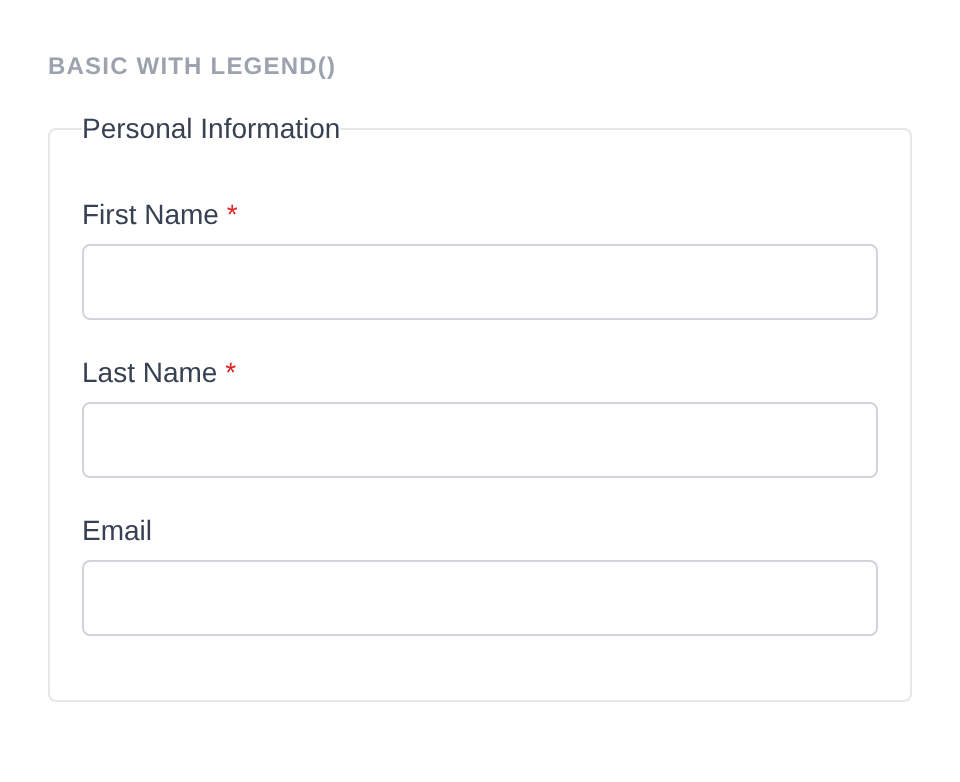
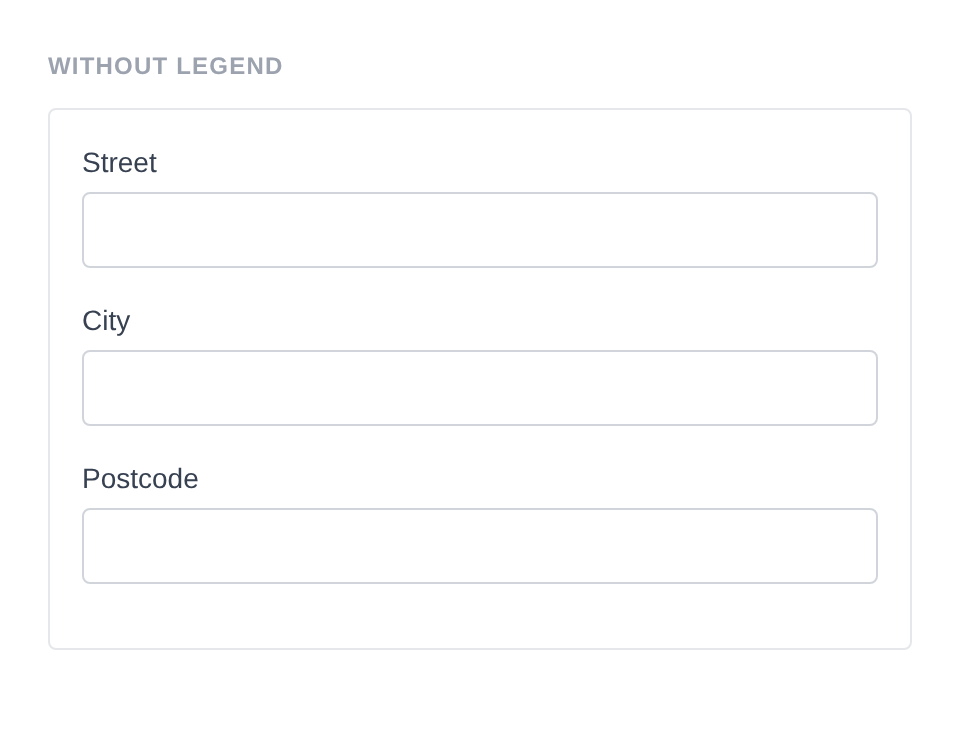
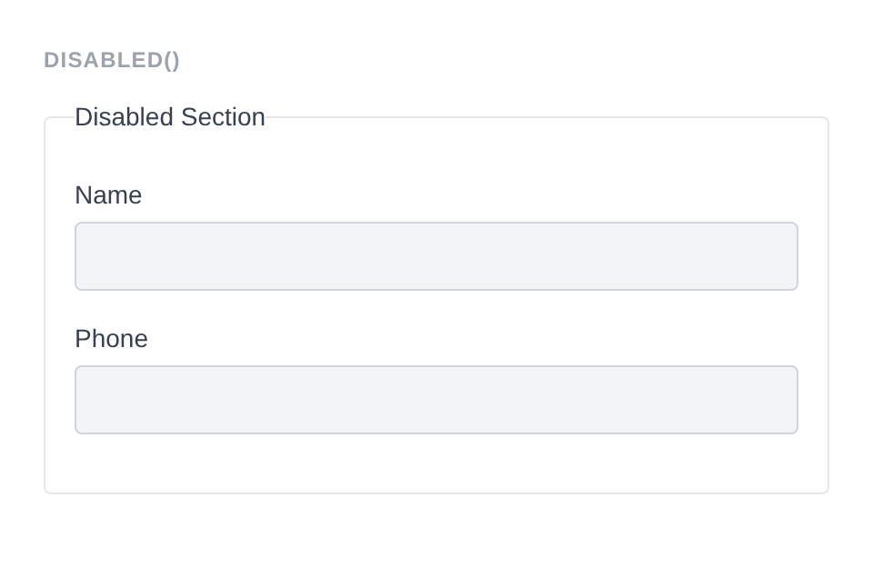
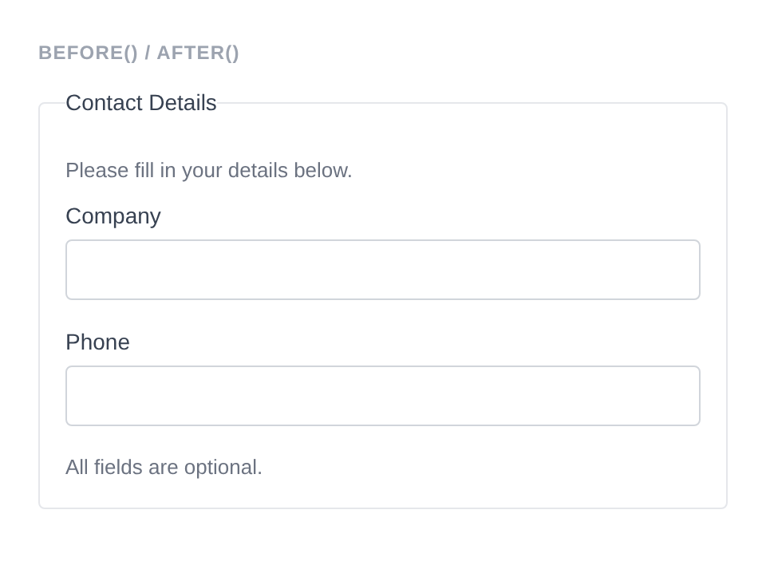
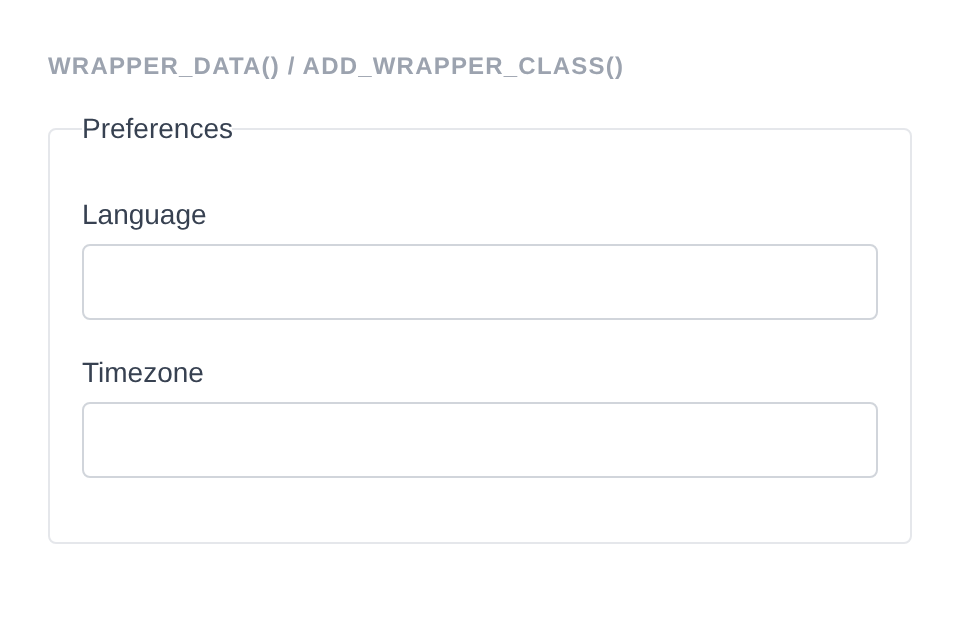

# Fieldset

Renders a `<fieldset>` element with an optional `<legend>`, wrapping child field components. Used to group related form fields together.

**Class:** `PinkCrab\Form_Components\Element\Fieldset`  
**Component:** `PinkCrab\Form_Components\Component\Form\Fieldset_Component`  
**Make helper:** `Make::fieldset( 'name', fn(Fieldset $f) => $f->... )`

---

## Basic Usage

```php
$this->component( new Fieldset_Component(
        Fieldset::make( 'personal' )
            ->legend( 'Personal Information' )
            ->fields(
                Text::make( 'first_name' )->label( 'First Name' )->required( true ),
                Text::make( 'last_name' )->label( 'Last Name' )->required( true ),
                Email::make( 'contact_email' )->label( 'Email' )
            )
    ) )
```



<details markdown="1">
<summary>Generated HTML</summary>

```html
<fieldset id="fieldset-personal" class="pc-form__element pc-form__element--fieldset">
    <legend class="pc-form__legend">Personal Information</legend>
        <div id="form-field_first_name" class="pc-form__element pc-form__element--text_input">
            <label for="first_name" class="pc-form__label">First Name</label>
                <input type="text" name="first_name" class="form-control text-input pc-form__element__field pc-form__element__field--text_input" list="_first_name__list" required="" />
            </div>
            <div id="form-field_last_name" class="pc-form__element pc-form__element--text_input">
                <label for="last_name" class="pc-form__label">Last Name</label>
                    <input type="text" name="last_name" class="form-control text-input pc-form__element__field pc-form__element__field--text_input" list="_last_name__list" required="" />
                </div>
                <div id="form-field_contact_email" class="pc-form__element pc-form__element--email_input">
                    <label for="contact_email" class="pc-form__label">Email</label>
                        <input type="email" name="contact_email" class="form-control email-input pc-form__element__field pc-form__element__field--email_input" list="_contact_email__list" />
                    </div>
                </fieldset>
```
</details>

---

## Using Make Helper

```php
use PinkCrab\Form_Components\Util\Make;
use PinkCrab\Form_Components\Element\Field\Input\Text;
use PinkCrab\Form_Components\Element\Field\Input\Email;

$this->component( Make::fieldset( 'personal', fn( $f ) => $f
    ->legend( 'Personal Details' )
    ->fields(
        Text::make( 'first_name' )->label( 'First Name' ),
        Text::make( 'last_name' )->label( 'Last Name' ),
        Email::make( 'email' )->label( 'Email' ),
    )
) );
```

---

## Methods

### legend( string $legend )

Sets the legend text displayed at the top of the fieldset.

```php
Fieldset::make( 'address' )
    ->legend( 'Shipping Address' )
    ->fields(
        Text::make( 'street' )->label( 'Street' ),
        Text::make( 'city' )->label( 'City' ),
    )
```

<details markdown="1">
<summary>Generated HTML</summary>

```html
<fieldset id="fieldset-address" class="pc-form__element pc-form__element--fieldset">
    <legend class="pc-form__legend">Shipping Address</legend>
    <div id="form-field_street" class="pc-form__element pc-form__element--text_input">
        <label for="street" class="pc-form__label">Street</label>
        <input type="text" name="street"
            class="form-control text-input pc-form__element__field pc-form__element__field--text_input"
        />
    </div>
    <div id="form-field_city" class="pc-form__element pc-form__element--text_input">
        <label for="city" class="pc-form__label">City</label>
        <input type="text" name="city"
            class="form-control text-input pc-form__element__field pc-form__element__field--text_input"
        />
    </div>
</fieldset>
```
</details>

When no legend is set, the fieldset renders without a `<legend>` tag.

```php
Fieldset::make( 'address' )
    ->fields(
        Text::make( 'street' )->label( 'Street' ),
        Text::make( 'city' )->label( 'City' ),
        Text::make( 'postcode' )->label( 'Postcode' )
    )
```



<details markdown="1">
<summary>Generated HTML</summary>

```html
<fieldset id="fieldset-address" class="pc-form__element pc-form__element--fieldset">
    <div id="form-field_street" class="pc-form__element pc-form__element--text_input">
        <label for="street" class="pc-form__label">Street</label>
            <input type="text" name="street" class="form-control text-input pc-form__element__field pc-form__element__field--text_input" list="_street__list" />
        </div>
        <div id="form-field_city" class="pc-form__element pc-form__element--text_input">
            <label for="city" class="pc-form__label">City</label>
                <input type="text" name="city" class="form-control text-input pc-form__element__field pc-form__element__field--text_input" list="_city__list" />
            </div>
            <div id="form-field_postcode" class="pc-form__element pc-form__element--text_input">
                <label for="postcode" class="pc-form__label">Postcode</label>
                    <input type="text" name="postcode" class="form-control text-input pc-form__element__field pc-form__element__field--text_input" list="_postcode__list" />
                </div>
            </fieldset>
```
</details>

### fields( Element ...$elements )

Adds child elements (fields, buttons, nonces, raw HTML) to the fieldset. Accepts any number of `Element` instances. Child elements inherit the fieldset's style unless they have an explicit style set.

```php
use PinkCrab\Form_Components\Element\Field\Input\Text;
use PinkCrab\Form_Components\Element\Field\Input\Tel;
use PinkCrab\Form_Components\Element\Field\Select;

Fieldset::make( 'contact' )
    ->legend( 'Contact Information' )
    ->fields(
        Text::make( 'name' )->label( 'Full Name' )->required(),
        Tel::make( 'phone' )->label( 'Phone' ),
        Select::make( 'preferred' )
            ->label( 'Preferred Contact' )
            ->options( array( 'email' => 'Email', 'phone' => 'Phone' ) ),
    )
```

<details markdown="1">
<summary>Generated HTML</summary>

```html
<fieldset id="fieldset-contact" class="pc-form__element pc-form__element--fieldset">
    <legend class="pc-form__legend">Contact Information</legend>
    <div id="form-field_name" class="pc-form__element pc-form__element--text_input">
        <label for="name" class="pc-form__label">Full Name</label>
        <input type="text" name="name"
            class="form-control text-input pc-form__element__field pc-form__element__field--text_input"
            required=""
        />
    </div>
    <div id="form-field_phone" class="pc-form__element pc-form__element--tel_input">
        <label for="phone" class="pc-form__label">Phone</label>
        <input type="tel" name="phone"
            class="form-control tel-input pc-form__element__field pc-form__element__field--tel_input"
        />
    </div>
    <div id="form-field_preferred" class="pc-form__element pc-form__element--select">
        <label for="preferred" class="pc-form__label">Preferred Contact</label>
        <select name="preferred"
            class="form-control select pc-form__element__field pc-form__element__field--select">
            <option value="email">Email</option>
            <option value="phone">Phone</option>
        </select>
    </div>
</fieldset>
```
</details>

### add_field( string $key, string $field_class, ?callable $config = null )

Adds a field by class name with an optional configuration callback.

```php
use PinkCrab\Form_Components\Element\Field\Input\Text;

Fieldset::make( 'address' )
    ->legend( 'Address' )
    ->add_field( 'street', Text::class, fn( $f ) => $f
        ->label( 'Street' )
        ->required()
    )
```

<details markdown="1">
<summary>Generated HTML</summary>

```html
<fieldset id="fieldset-address" class="pc-form__element pc-form__element--fieldset">
    <legend class="pc-form__legend">Address</legend>
    <div id="form-field_street" class="pc-form__element pc-form__element--text_input">
        <label for="street" class="pc-form__label">Street</label>
        <input type="text" name="street"
            class="form-control text-input pc-form__element__field pc-form__element__field--text_input"
            required=""
        />
    </div>
</fieldset>
```
</details>

### disabled( bool $disabled = true )

Disables the entire fieldset, which disables all child form elements.

```php
Fieldset::make( 'disabled_section' )
    ->legend( 'Disabled Section' )
    ->disabled( true )
    ->fields(
        Text::make( 'disabled_name' )->label( 'Name' ),
        Tel::make( 'disabled_phone' )->label( 'Phone' )
    )
```



<details markdown="1">
<summary>Generated HTML</summary>

```html
<fieldset id="fieldset-disabled_section" class="pc-form__element pc-form__element--fieldset" disabled>
    <legend class="pc-form__legend">Disabled Section</legend>
        <div id="form-field_disabled_name" class="pc-form__element pc-form__element--text_input">
            <label for="disabled_name" class="pc-form__label">Name</label>
                <input type="text" name="disabled_name" class="form-control text-input pc-form__element__field pc-form__element__field--text_input" list="_disabled_name__list" />
            </div>
            <div id="form-field_disabled_phone" class="pc-form__element pc-form__element--tel_input">
                <label for="disabled_phone" class="pc-form__label">Phone</label>
                    <input type="tel" name="disabled_phone" class="form-control tel-input pc-form__element__field pc-form__element__field--tel_input" list="_disabled_phone__list" />
                </div>
            </fieldset>
```
</details>

### pre_description( string $description )

Sets a description displayed after the legend but before the child fields.

```php
Fieldset::make( 'personal' )
    ->legend( 'Personal Details' )
    ->pre_description( 'Please fill in your personal information.' )
    ->fields(
        Text::make( 'name' )->label( 'Name' ),
    )
```

### post_description( string $description )

Sets a description displayed after the child fields.

```php
Fieldset::make( 'personal' )
    ->legend( 'Personal Details' )
    ->post_description( 'All fields are required.' )
    ->fields(
        Text::make( 'name' )->label( 'Name' ),
    )
```

### before( string $html ) / after( string $html )

HTML content before or after the fieldset's child elements, rendered inside the `<fieldset>` tag (after the legend).

```php
Fieldset::make( 'wrapped_fs' )
    ->legend( 'Contact Details' )
    ->before( '<p style="color:#6b7280;font-size:13px;margin:0 0 8px;">Please fill in your details below.</p>' )
    ->after( '<p style="color:#6b7280;font-size:13px;margin:8px 0 0;">All fields are optional.</p>' )
    ->fields(
        Text::make( 'company' )->label( 'Company' ),
        Tel::make( 'phone' )->label( 'Phone' )
    )
```



<details markdown="1">
<summary>Generated HTML</summary>

```html
<fieldset id="fieldset-wrapped_fs" class="pc-form__element pc-form__element--fieldset">
    <legend class="pc-form__legend">Contact Details</legend>
        <p style="color:#6b7280;font-size:13px;margin:0 0 8px">Please fill in your details below.</p>
            <div id="form-field_company" class="pc-form__element pc-form__element--text_input">
                <label for="company" class="pc-form__label">Company</label>
                    <input type="text" name="company" class="form-control text-input pc-form__element__field pc-form__element__field--text_input" list="_company__list" />
                </div>
                <div id="form-field_phone" class="pc-form__element pc-form__element--tel_input">
                    <label for="phone" class="pc-form__label">Phone</label>
                        <input type="tel" name="phone" class="form-control tel-input pc-form__element__field pc-form__element__field--tel_input" list="_phone__list" />
                    </div>
                    <p style="color:#6b7280;font-size:13px;margin:8px 0 0">All fields are optional.</p>
                    </fieldset>
```
</details>

### wrapper_id( string $id )

Sets a custom HTML `id` on the fieldset element. Defaults to `fieldset-{name}`.

```php
Fieldset::make( 'address' )
    ->wrapper_id( 'my-custom-fieldset-id' )
    ->fields(
        Text::make( 'street' )->label( 'Street' ),
    )
```

<details markdown="1">
<summary>Generated HTML</summary>

```html
<fieldset id="my-custom-fieldset-id" class="pc-form__element pc-form__element--fieldset">
    <div id="form-field_street" class="pc-form__element pc-form__element--text_input">
        <label for="street" class="pc-form__label">Street</label>
        <input type="text" name="street"
            class="form-control text-input pc-form__element__field pc-form__element__field--text_input"
        />
    </div>
</fieldset>
```
</details>

### wrapper_attribute( string $key, mixed $value )

Sets an arbitrary HTML attribute on the fieldset element.

```php
Fieldset::make( 'data_fs' )
    ->legend( 'Preferences' )
    ->wrapper_data( 'section', 'preferences' )
    ->add_wrapper_class( 'highlighted-fieldset' )
    ->fields(
        Text::make( 'language' )->label( 'Language' ),
        Text::make( 'timezone' )->label( 'Timezone' )
    )
```



<details markdown="1">
<summary>Generated HTML</summary>

```html
<fieldset id="fieldset-data_fs" data-section="preferences" class="pc-form__element pc-form__element--fieldset pc-form__element pc-form__element--fieldset highlighted-fieldset">
    <legend class="pc-form__legend">Preferences</legend>
        <div id="form-field_language" class="pc-form__element pc-form__element--text_input">
            <label for="language" class="pc-form__label">Language</label>
                <input type="text" name="language" class="form-control text-input pc-form__element__field pc-form__element__field--text_input" list="_language__list" />
            </div>
            <div id="form-field_timezone" class="pc-form__element pc-form__element--text_input">
                <label for="timezone" class="pc-form__label">Timezone</label>
                    <input type="text" name="timezone" class="form-control text-input pc-form__element__field pc-form__element__field--text_input" list="_timezone__list" />
                </div>
            </fieldset>
```
</details>

### wrapper_attributes( array $attrs )

Sets multiple arbitrary HTML attributes on the fieldset element at once.

```php
Fieldset::make( 'address' )
    ->wrapper_attributes( array(
        'data-section' => 'address',
        'role'         => 'group',
    ) )
    ->fields(
        Text::make( 'street' )->label( 'Street' ),
    )
```

<details markdown="1">
<summary>Generated HTML</summary>

```html
<fieldset id="fieldset-address" class="pc-form__element pc-form__element--fieldset" data-section="address" role="group">
    <div id="form-field_street" class="pc-form__element pc-form__element--text_input">
        <label for="street" class="pc-form__label">Street</label>
        <input type="text" name="street"
            class="form-control text-input pc-form__element__field pc-form__element__field--text_input"
        />
    </div>
</fieldset>
```
</details>

### wrapper_data( string $key, string $value )

Adds a `data-*` attribute to the fieldset element.

```php
Fieldset::make( 'address' )
    ->legend( 'Address' )
    ->wrapper_data( 'section', 'shipping' )
    ->fields(
        Text::make( 'street' )->label( 'Street' ),
    )
```

<details markdown="1">
<summary>Generated HTML</summary>

```html
<fieldset id="fieldset-address" class="pc-form__element pc-form__element--fieldset" data-section="shipping">
    <legend class="pc-form__legend">Address</legend>
    <div id="form-field_street" class="pc-form__element pc-form__element--text_input">
        <label for="street" class="pc-form__label">Street</label>
        <input type="text" name="street"
            class="form-control text-input pc-form__element__field pc-form__element__field--text_input"
        />
    </div>
</fieldset>
```
</details>

### add_wrapper_class( string $class )

Adds a CSS class to the fieldset element.

```php
Fieldset::make( 'address' )
    ->legend( 'Address' )
    ->add_wrapper_class( 'my-fieldset-class' )
    ->fields(
        Text::make( 'street' )->label( 'Street' ),
    )
```

<details markdown="1">
<summary>Generated HTML</summary>

```html
<fieldset id="fieldset-address" class="pc-form__element pc-form__element--fieldset my-fieldset-class">
    <legend class="pc-form__legend">Address</legend>
    <div id="form-field_street" class="pc-form__element pc-form__element--text_input">
        <label for="street" class="pc-form__label">Street</label>
        <input type="text" name="street"
            class="form-control text-input pc-form__element__field pc-form__element__field--text_input"
        />
    </div>
</fieldset>
```
</details>

### id( string $id )

Sets a custom HTML `id` attribute (on the inner element, separate from wrapper).

```php
Fieldset::make( 'address' )
    ->id( 'address-inner' )
    ->fields(
        Text::make( 'street' )->label( 'Street' ),
    )
```

<details markdown="1">
<summary>Generated HTML</summary>

```html
<fieldset id="fieldset-address" class="pc-form__element pc-form__element--fieldset">
    <div id="form-field_street" class="pc-form__element pc-form__element--text_input">
        <label for="street" class="pc-form__label">Street</label>
        <input type="text" name="street"
            class="form-control text-input pc-form__element__field pc-form__element__field--text_input"
        />
    </div>
</fieldset>
```
</details>

### data( string $key, string $value )

Adds a `data-*` attribute to the inner element.

```php
Fieldset::make( 'address' )
    ->data( 'group', 'shipping' )
    ->fields(
        Text::make( 'street' )->label( 'Street' ),
    )
```

<details markdown="1">
<summary>Generated HTML</summary>

```html
<fieldset id="fieldset-address" class="pc-form__element pc-form__element--fieldset">
    <div id="form-field_street" class="pc-form__element pc-form__element--text_input">
        <label for="street" class="pc-form__label">Street</label>
        <input type="text" name="street"
            class="form-control text-input pc-form__element__field pc-form__element__field--text_input"
        />
    </div>
</fieldset>
```
</details>

### add_class( string $class )

Adds a CSS class to the inner element.

```php
Fieldset::make( 'address' )
    ->add_class( 'my-inner-class' )
    ->fields(
        Text::make( 'street' )->label( 'Street' ),
    )
```

<details markdown="1">
<summary>Generated HTML</summary>

```html
<fieldset id="fieldset-address" class="pc-form__element pc-form__element--fieldset">
    <div id="form-field_street" class="pc-form__element pc-form__element--text_input">
        <label for="street" class="pc-form__label">Street</label>
        <input type="text" name="street"
            class="form-control text-input pc-form__element__field pc-form__element__field--text_input"
        />
    </div>
</fieldset>
```
</details>

### attribute( string $key, mixed $value )

Sets an arbitrary HTML attribute on the inner element.

```php
Fieldset::make( 'address' )
    ->attribute( 'role', 'group' )
    ->fields(
        Text::make( 'street' )->label( 'Street' ),
    )
```

<details markdown="1">
<summary>Generated HTML</summary>

```html
<fieldset id="fieldset-address" class="pc-form__element pc-form__element--fieldset">
    <div id="form-field_street" class="pc-form__element pc-form__element--text_input">
        <label for="street" class="pc-form__label">Street</label>
        <input type="text" name="street"
            class="form-control text-input pc-form__element__field pc-form__element__field--text_input"
        />
    </div>
</fieldset>
```
</details>

### attributes( array $attrs )

Sets multiple arbitrary HTML attributes on the inner element at once.

```php
Fieldset::make( 'address' )
    ->attributes( array(
        'title'    => 'Address group',
        'tabindex' => '0',
    ) )
    ->fields(
        Text::make( 'street' )->label( 'Street' ),
    )
```

<details markdown="1">
<summary>Generated HTML</summary>

```html
<fieldset id="fieldset-address" class="pc-form__element pc-form__element--fieldset">
    <div id="form-field_street" class="pc-form__element pc-form__element--text_input">
        <label for="street" class="pc-form__label">Street</label>
        <input type="text" name="street"
            class="form-control text-input pc-form__element__field pc-form__element__field--text_input"
        />
    </div>
</fieldset>
```
</details>

### style( Style $style )

Sets a custom style on the fieldset. Child elements without an explicit style will inherit this.

```php
use PinkCrab\Form_Components\Style\Default_Style;

Fieldset::make( 'address' )
    ->style( new Default_Style() )
    ->fields(
        Text::make( 'street' )->label( 'Street' ),
    )
```

<details markdown="1">
<summary>Generated HTML</summary>

```html
<fieldset id="fieldset-address" class="pc-form__element pc-form__element--fieldset">
    <div id="form-field_street" class="pc-form__element pc-form__element--text_input">
        <label for="street" class="pc-form__label">Street</label>
        <input type="text" name="street"
            class="form-control text-input pc-form__element__field pc-form__element__field--text_input"
        />
    </div>
</fieldset>
```
</details>

### add_validation_rule( string $key, Validatable $validator )

Adds a server-side validation rule for a specific field key within the fieldset.

```php
use Respect\Validation\Validator as v;

Fieldset::make( 'address' )
    ->add_validation_rule( 'postcode', v::postalCode( 'GB' ) )
    ->fields(
        Text::make( 'postcode' )->label( 'Postcode' ),
    )
```

<details markdown="1">
<summary>Generated HTML</summary>

```html
<fieldset id="fieldset-address" class="pc-form__element pc-form__element--fieldset">
    <div id="form-field_postcode" class="pc-form__element pc-form__element--text_input">
        <label for="postcode" class="pc-form__label">Postcode</label>
        <input type="text" name="postcode"
            class="form-control text-input pc-form__element__field pc-form__element__field--text_input"
        />
    </div>
</fieldset>
```
</details>

---

## Traits

| Trait | Methods |
|-------|---------|
| Wrapper_Attributes | `wrapper_attribute()`, `wrapper_attributes()`, `get_wrapper_attribute()`, `get_wrapper_attributes()`, `wrapper_id()`, `wrapper_data()`, `add_wrapper_class()` |
| Attributes | `attribute()`, `attributes()`, `get_attribute()`, `get_attributes()`, `has_attribute()`, `add_class()`, `remove_class()`, `id()`, `data()` |
| Element_Wrap | `before()`, `after()`, `get_before()`, `get_after()`, `has_before()`, `has_after()` |
| Fields | `fields()`, `add_field()`, `get_fields()`, `get_field()`, `has_field()`, `get_field_names()`, `get_nested_fields()`, `add_validation_rule()`, `get_validation_rules()` |
| Form_Style | `style()`, `get_style()`, `has_explicit_style()` |
| Disabled | `disabled()`, `is_disabled()` |
| Description | `pre_description()`, `post_description()`, `get_pre_description()`, `get_post_description()`, `has_pre_description()`, `has_post_description()` |
