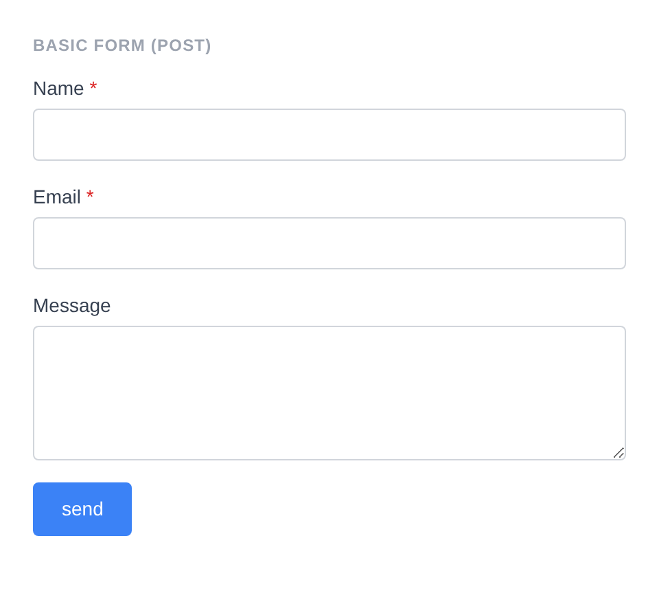
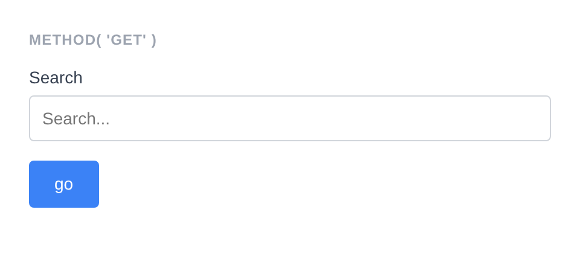
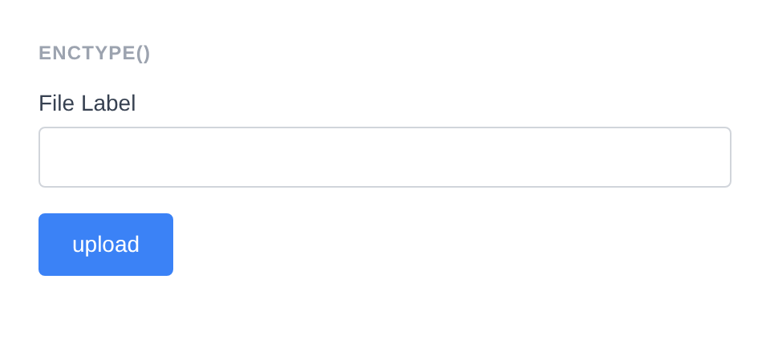
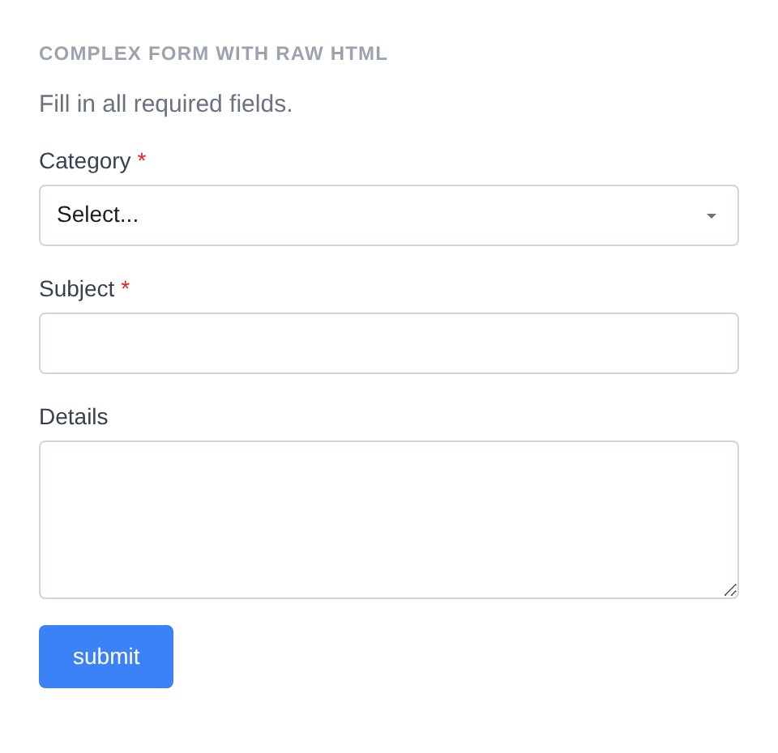

# Form

Renders a `<form>` element that wraps child field components. Acts as a container for fields, fieldsets, buttons, and nonces.

**Class:** `PinkCrab\Form_Components\Element\Form`  
**Component:** `PinkCrab\Form_Components\Component\Form\Form_Component`  
**Make helper:** `Make::form( 'name', fn(Form $f) => $f->... )`

---

## Basic Usage

```php
$this->component( new Form_Component(
		Form::make( 'contact' )
			->method( 'POST' )
			->action( '/submit' )
			->fields(
				Text::make( 'name' )
					->label( 'Name' )
					->required( true ),
				Email::make( 'email' )
					->label( 'Email' )
					->required( true ),
				Textarea::make( 'message' )
					->label( 'Message' )
					->rows( 4 ),
				Button::make( 'submit' )
					->type( 'submit' )
					->text( 'Send' )
			)
	) )
```



<details markdown="1">
<summary>Generated HTML</summary>

```html
<form id="form-contact" class="pc-form" method="POST" action="/submit">
    <div id="form-field_name" class="pc-form__element pc-form__element--text_input">
        <label for="name" class="pc-form__label">Name</label>
            <input type="text" name="name" class="form-control text-input pc-form__element__field pc-form__element__field--text_input" list="_name__list" required="" />
        </div>
        <div id="form-field_email" class="pc-form__element pc-form__element--email_input">
            <label for="email" class="pc-form__label">Email</label>
                <input type="email" name="email" class="form-control email-input pc-form__element__field pc-form__element__field--email_input" list="_email__list" required="" />
            </div>
            <div id="form-field_message" class="pc-form__element pc-form__element--textarea">
                <label for="message" class="pc-form__label">Message</label>
                    <textarea name="message" class="form-control textarea pc-form__element__field pc-form__element__field--textarea" rows="4" >
                    </textarea>
                </div>
                <div id="form-buttonsubmit" class="pc-form__element pc-form__element--button">
                    <button type="submit" name="submit" class="pc-form__button" >send</button>
                    </div>
                </form>
```
</details>

---

## Using Make Helper

```php
use PinkCrab\Form_Components\Util\Make;
use PinkCrab\Form_Components\Element\Field\Input\Text;
use PinkCrab\Form_Components\Element\Button;

$this->component( Make::form( 'contact', fn( $f ) => $f
    ->action( admin_url( 'admin-post.php' ) )
    ->fields(
        Text::make( 'name' )->label( 'Name' ),
        Text::make( 'email' )->label( 'Email' ),
        Button::make( 'submit' )->type( 'submit' )->text( 'Send' ),
    )
) );
```

---

## Methods

### method( string $method )

Sets the HTTP method for the form. Defaults to `POST`. Automatically uppercased.

```php
Form::make( 'search_form' )
			->method( 'GET' )
			->action( '/search' )
			->fields(
				Text::make( 'query' )
					->label( 'Search' )
					->placeholder( 'Search...' ),
				Button::make( 'go' )
					->type( 'submit' )
					->text( 'Go' )
			)
```



<details markdown="1">
<summary>Generated HTML</summary>

```html
<form id="form-search_form" class="pc-form" method="GET" action="/search">
    <div id="form-field_query" class="pc-form__element pc-form__element--text_input">
        <label for="query" class="pc-form__label">Search</label>
            <input type="text" name="query" class="form-control text-input pc-form__element__field pc-form__element__field--text_input" list="_query__list" placeholder="Search..." />
        </div>
        <div id="form-buttongo" class="pc-form__element pc-form__element--button">
            <button type="submit" name="go" class="pc-form__button" >go</button>
            </div>
        </form>
```
</details>

### action( string $action )

Sets the form action URL where the form data is submitted.

```php
Form::make( 'contact' )
    ->action( admin_url( 'admin-post.php' ) )
    ->fields(
        Text::make( 'name' )->label( 'Name' ),
    )
```

<details markdown="1">
<summary>Generated HTML</summary>

```html
<form id="form-contact" class="pc-form" method="POST" action="https://example.com/wp-admin/admin-post.php">
    <div id="form-field_name" class="pc-form__element pc-form__element--text_input">
        <label for="name" class="pc-form__label">Name</label>
        <input type="text" name="name"
            class="form-control text-input pc-form__element__field pc-form__element__field--text_input"
        />
    </div>
</form>
```
</details>

### enctype( string $enctype )

Sets the form encoding type. Required for file uploads.

```php
Form::make( 'upload_form' )
			->method( 'POST' )
			->action( '/upload' )
			->enctype( 'multipart/form-data' )
			->fields(
				Text::make( 'file_label' )
					->label( 'File Label' ),
				Button::make( 'upload' )
					->type( 'submit' )
					->text( 'Upload' )
			)
```



<details markdown="1">
<summary>Generated HTML</summary>

```html
<form id="form-upload_form" class="pc-form" method="POST" action="/upload" enctype="multipart/form-data">
    <div id="form-field_file_label" class="pc-form__element pc-form__element--text_input">
        <label for="file_label" class="pc-form__label">File Label</label>
            <input type="text" name="file_label" class="form-control text-input pc-form__element__field pc-form__element__field--text_input" list="_file_label__list" />
        </div>
        <div id="form-buttonupload" class="pc-form__element pc-form__element--button">
            <button type="submit" name="upload" class="pc-form__button" >upload</button>
            </div>
        </form>
```
</details>

### fields( Element ...$elements )

Adds child elements (fields, buttons, nonces, fieldsets, raw HTML) to the form. Accepts any number of `Element` instances. Child elements inherit the form's style unless they have an explicit style set.

```php
Form::make( 'secure_form' )
			->method( 'POST' )
			->fields(
				Hidden::make( 'form_id' )
					->set_existing( '42' )
					->show_wrapper( false ),
				Nonce::make( 'save_action', 'form_nonce' ),
				Text::make( 'title' )
					->label( 'Title' ),
				Button::make( 'save' )
					->type( 'submit' )
					->text( 'Save' )
			)
```


<details markdown="1">
<summary>Generated HTML</summary>

```html
<form id="form-secure_form" class="pc-form" method="POST">
    <input type="hidden" name="form_id" class="form-control hidden-input pc-form__element__field pc-form__element__field--hidden_input" value="42" />
    <input type="hidden" id="form_nonce" name="form_nonce" value="12e9c3e24f" />
    <input type="hidden" name="_wp_http_referer" value="/?docs-screenshot=form" />
    <div id="form-field_title" class="pc-form__element pc-form__element--text_input">
        <label for="title" class="pc-form__label">Title</label>
            <input type="text" name="title" class="form-control text-input pc-form__element__field pc-form__element__field--text_input" list="_title__list" />
        </div>
        <div id="form-buttonsave" class="pc-form__element pc-form__element--button">
            <button type="submit" name="save" class="pc-form__button" >save</button>
            </div>
        </form>
```
</details>

### add_field( string $key, string $field_class, ?callable $config = null )

Adds a field by class name with an optional configuration callback.

```php
use PinkCrab\Form_Components\Element\Field\Input\Text;

Form::make( 'contact' )
    ->add_field( 'name', Text::class, fn( $f ) => $f
        ->label( 'Name' )
        ->required()
    )
```

<details markdown="1">
<summary>Generated HTML</summary>

```html
<form id="form-contact" class="pc-form" method="POST">
    <div id="form-field_name" class="pc-form__element pc-form__element--text_input">
        <label for="name" class="pc-form__label">Name</label>
        <input type="text" name="name"
            class="form-control text-input pc-form__element__field pc-form__element__field--text_input"
            required=""
        />
    </div>
</form>
```
</details>

### before( string $html ) / after( string $html )

HTML content before or after the form's child elements, rendered inside the `<form>` tag.

```php
Form::make( 'wrapped_form' )
			->method( 'POST' )
			->before( '<div style="padding:8px 0;color:#374151;font-weight:500;">Contact Us
```


<details markdown="1">
<summary>Generated HTML</summary>

```html
<form id="form-wrapped_form" class="pc-form" method="POST">
    <div style="padding:8px 0;color:#374151;font-weight:500">Contact Us</div>
        <div id="form-field_subject" class="pc-form__element pc-form__element--text_input">
            <label for="subject" class="pc-form__label">Subject</label>
                <input type="text" name="subject" class="form-control text-input pc-form__element__field pc-form__element__field--text_input" list="_subject__list" />
            </div>
            <div id="form-buttonsend" class="pc-form__element pc-form__element--button">
                <button type="submit" name="send" class="pc-form__button" >send</button>
                </div>
                <div style="padding:8px 0;color:#6b7280;font-size:13px">We will respond within 24 hours.</div>
                </form>
```
</details>

### wrapper_id( string $id )

Sets a custom HTML `id` on the form element. Defaults to `form-{name}`.

```php
Form::make( 'contact' )
    ->wrapper_id( 'my-custom-form-id' )
    ->fields(
        Text::make( 'name' )->label( 'Name' ),
    )
```

<details markdown="1">
<summary>Generated HTML</summary>

```html
<form id="my-custom-form-id" class="pc-form" method="POST">
    <div id="form-field_name" class="pc-form__element pc-form__element--text_input">
        <label for="name" class="pc-form__label">Name</label>
        <input type="text" name="name"
            class="form-control text-input pc-form__element__field pc-form__element__field--text_input"
        />
    </div>
</form>
```
</details>

### wrapper_attribute( string $key, mixed $value )

Sets an arbitrary HTML attribute on the form element.

```php
Form::make( 'contact' )
    ->wrapper_attribute( 'aria-label', 'Contact form' )
    ->fields(
        Text::make( 'name' )->label( 'Name' ),
    )
```

<details markdown="1">
<summary>Generated HTML</summary>

```html
<form id="form-contact" class="pc-form" method="POST" aria-label="Contact form">
    <div id="form-field_name" class="pc-form__element pc-form__element--text_input">
        <label for="name" class="pc-form__label">Name</label>
        <input type="text" name="name"
            class="form-control text-input pc-form__element__field pc-form__element__field--text_input"
        />
    </div>
</form>
```
</details>

### wrapper_attributes( array $attrs )

Sets multiple arbitrary HTML attributes on the form element at once.

```php
Form::make( 'contact' )
    ->wrapper_attributes( array(
        'novalidate' => null,
        'data-ajax'  => 'true',
    ) )
    ->fields(
        Text::make( 'name' )->label( 'Name' ),
    )
```

<details markdown="1">
<summary>Generated HTML</summary>

```html
<form id="form-contact" class="pc-form" method="POST" novalidate data-ajax="true">
    <div id="form-field_name" class="pc-form__element pc-form__element--text_input">
        <label for="name" class="pc-form__label">Name</label>
        <input type="text" name="name"
            class="form-control text-input pc-form__element__field pc-form__element__field--text_input"
        />
    </div>
</form>
```
</details>

### wrapper_data( string $key, string $value )

Adds a `data-*` attribute to the form element.

```php
Form::make( 'contact' )
    ->wrapper_data( 'handler', 'ajax-submit' )
    ->fields(
        Text::make( 'name' )->label( 'Name' ),
    )
```

<details markdown="1">
<summary>Generated HTML</summary>

```html
<form id="form-contact" class="pc-form" method="POST" data-handler="ajax-submit">
    <div id="form-field_name" class="pc-form__element pc-form__element--text_input">
        <label for="name" class="pc-form__label">Name</label>
        <input type="text" name="name"
            class="form-control text-input pc-form__element__field pc-form__element__field--text_input"
        />
    </div>
</form>
```
</details>

### add_wrapper_class( string $class )

Adds a CSS class to the form element.

```php
Form::make( 'contact' )
    ->add_wrapper_class( 'my-form-class' )
    ->fields(
        Text::make( 'name' )->label( 'Name' ),
    )
```

<details markdown="1">
<summary>Generated HTML</summary>

```html
<form id="form-contact" class="pc-form my-form-class" method="POST">
    <div id="form-field_name" class="pc-form__element pc-form__element--text_input">
        <label for="name" class="pc-form__label">Name</label>
        <input type="text" name="name"
            class="form-control text-input pc-form__element__field pc-form__element__field--text_input"
        />
    </div>
</form>
```
</details>

### style( Style $style )

Sets a custom style on the form. Child elements without an explicit style will inherit this.

```php
use PinkCrab\Form_Components\Style\Default_Style;

Form::make( 'contact' )
    ->style( new Default_Style() )
    ->fields(
        Text::make( 'name' )->label( 'Name' ),
    )
```

<details markdown="1">
<summary>Generated HTML</summary>

```html
<form id="form-contact" class="pc-form" method="POST">
    <div id="form-field_name" class="pc-form__element pc-form__element--text_input">
        <label for="name" class="pc-form__label">Name</label>
        <input type="text" name="name"
            class="form-control text-input pc-form__element__field pc-form__element__field--text_input"
        />
    </div>
</form>
```
</details>

### add_validation_rule( string $key, Validatable $validator )

Adds a server-side validation rule for a specific field key.

```php
use Respect\Validation\Validator as v;

Form::make( 'contact' )
    ->add_validation_rule( 'email', v::email() )
    ->fields(
        Text::make( 'email' )->label( 'Email' ),
    )
```

<details markdown="1">
<summary>Generated HTML</summary>

```html
<form id="form-contact" class="pc-form" method="POST">
    <div id="form-field_email" class="pc-form__element pc-form__element--text_input">
        <label for="email" class="pc-form__label">Email</label>
        <input type="text" name="email"
            class="form-control text-input pc-form__element__field pc-form__element__field--text_input"
        />
    </div>
</form>
```
</details>

### Complex Form Example

```php
Form::make( 'complex_form' )
			->method( 'POST' )
			->fields(
				Raw_HTML::make( 'intro' )
					->html( '<p style="color:#6b7280;margin:0 0 12px;">Fill in all required fields.</p>' ),
				Select::make( 'category' )
					->label( 'Category' )
					->options( array(
						''        => 'Select...',
						'bug'     => 'Bug Report',
						'feature' => 'Feature Request',
					) )
					->required( true ),
				Text::make( 'subject' )
					->label( 'Subject' )
					->required( true ),
				Textarea::make( 'details' )
					->label( 'Details' )
					->rows( 4 ),
				Button::make( 'submit' )
					->type( 'submit' )
					->text( 'Submit' )
			)
```



<details markdown="1">
<summary>Generated HTML</summary>

```html
<form id="form-complex_form" class="pc-form" method="POST">
    <p style="color:#6b7280;margin:0 0 12px">Fill in all required fields.</p>
        <div id="form-field_category" class="pc-form__element pc-form__element--select">
            <label for="category" class="pc-form__label">Category</label>
                <select name="category" class="form-control select pc-form__element__field pc-form__element__field--select" required="" >
                    <option value="" >Select...</option>
                    <option value="bug" >Bug Report</option>
                    <option value="feature" >Feature Request</option>
                </select>
            </div>
            <div id="form-field_subject" class="pc-form__element pc-form__element--text_input">
                <label for="subject" class="pc-form__label">Subject</label>
                    <input type="text" name="subject" class="form-control text-input pc-form__element__field pc-form__element__field--text_input" list="_subject__list" required="" />
                </div>
                <div id="form-field_details" class="pc-form__element pc-form__element--textarea">
                    <label for="details" class="pc-form__label">Details</label>
                        <textarea name="details" class="form-control textarea pc-form__element__field pc-form__element__field--textarea" rows="4" >
                        </textarea>
                    </div>
                    <div id="form-buttonsubmit" class="pc-form__element pc-form__element--button">
                        <button type="submit" name="submit" class="pc-form__button" >submit</button>
                        </div>
                    </form>
```
</details>

---

## Traits

| Trait | Methods |
|-------|---------|
| Wrapper_Attributes | `wrapper_attribute()`, `wrapper_attributes()`, `get_wrapper_attribute()`, `get_wrapper_attributes()`, `wrapper_id()`, `wrapper_data()`, `add_wrapper_class()` |
| Element_Wrap | `before()`, `after()`, `get_before()`, `get_after()`, `has_before()`, `has_after()` |
| Fields | `fields()`, `add_field()`, `get_fields()`, `get_field()`, `has_field()`, `get_field_names()`, `get_nested_fields()`, `add_validation_rule()`, `get_validation_rules()` |
| Form_Style | `style()`, `get_style()`, `has_explicit_style()` |
