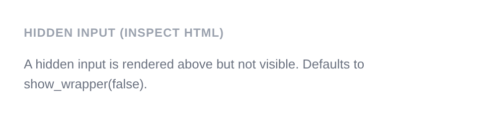

# Hidden Input

Renders `<input type="hidden">`. Submits a value without displaying any visible UI to the user. The wrapper is disabled by default (`show_wrapper` is `false`). No sanitizer is applied by default.

**Class:** `PinkCrab\Form_Components\Element\Field\Input\Hidden`  
**Make helper:** `Make::hidden( 'name', fn(Hidden $f) => $f->... )`

---

## Basic Usage

Hidden inputs have no visible UI. The wrapper is disabled by default (`show_wrapper` is `false`), so no wrapping `<div>` is rendered.

```php
$this->component( new Input_Component(
		Hidden::make( 'form_id' )
			->set_existing( '42' )
			->show_wrapper( false )
	) );
	<p style="color:#6b7280;font-size:13px;">A hidden input is rendered above but not visible. Defaults to show_wrapper(false).</p>
```



<details markdown="1">
<summary>Generated HTML</summary>

```html
<input type="hidden" name="form_id" class="form-control hidden-input pc-form__element__field pc-form__element__field--hidden_input" value="42" />
<p style="color:#6b7280;font-size:13px;">A hidden input is rendered above but not visible. Defaults to show_wrapper(false).</p>
```
</details>

---

## Using Make Helper

```php
use PinkCrab\Form_Components\Util\Make;

$this->component( Make::hidden( 'user_id', fn( $f ) => $f
    ->value( '42' )
) );
```

---

## Methods

### value( mixed $value )

Sets the value of the hidden field.

```php
Hidden::make( 'action' )
    ->value( 'update_profile' )
```

<details markdown="1">
<summary>Generated HTML</summary>

```html
<input type="hidden" name="action"
    class="form-control hidden-input pc-form__element__field pc-form__element__field--hidden_input"
    value="update_profile"
/>
```
</details>

### set_existing( mixed $value )

Sets the current value. No sanitizer is applied by default for hidden inputs.

```php
Hidden::make( 'record_id' )
    ->set_existing( '99' )
```

<details markdown="1">
<summary>Generated HTML</summary>

```html
<input type="hidden" name="record_id"
    class="form-control hidden-input pc-form__element__field pc-form__element__field--hidden_input"
    value="99"
/>
```
</details>

### label( string $label )

Sets a label. Although hidden fields are not visible, the label can be set for accessibility or internal reference purposes.

```php
Hidden::make( 'token' )
    ->label( 'Session Token' )
    ->value( 'abc123' )
```

<details markdown="1">
<summary>Generated HTML</summary>

```html
<input type="hidden" name="token"
    class="form-control hidden-input pc-form__element__field pc-form__element__field--hidden_input"
    value="abc123"
/>
```
</details>

### show_wrapper( bool $show = true )

Controls whether the wrapping `<div>` is rendered. Defaults to `false` for hidden inputs since there is no visible UI. You can re-enable it if needed.

```php
// Wrapper is off by default for hidden inputs
Hidden::make( 'user_id' )->value( '42' )
```

<details markdown="1">
<summary>Generated HTML</summary>

```html
<input type="hidden" name="user_id"
    class="form-control hidden-input pc-form__element__field pc-form__element__field--hidden_input"
    value="42"
/>
```
</details>

```php
// Explicitly enable wrapper if needed
Hidden::make( 'user_id' )
    ->show_wrapper( true )
    ->value( '42' )
```

<details markdown="1">
<summary>Generated HTML</summary>

```html
<div id="form-field_user_id" class="pc-form__element pc-form__element--hidden_input">
    <input type="hidden" name="user_id"
        class="form-control hidden-input pc-form__element__field pc-form__element__field--hidden_input"
        value="42"
    />
</div>
```
</details>

### id( string $id )

Sets a custom HTML `id` on the input element.

```php
Hidden::make( 'token' )
    ->id( 'csrf-token' )
    ->value( 'abc123' )
```

<details markdown="1">
<summary>Generated HTML</summary>

```html
<input type="hidden" name="token" id="csrf-token"
    class="form-control hidden-input pc-form__element__field pc-form__element__field--hidden_input"
    value="abc123"
/>
```
</details>

### wrapper_id( string $id )

Sets a custom HTML `id` on the wrapper div.

```php
Hidden::make( 'token' )
    ->show_wrapper( true )
    ->wrapper_id( 'token-wrapper' )
    ->value( 'abc123' )
```

<details markdown="1">
<summary>Generated HTML</summary>

```html
<div id="token-wrapper" class="pc-form__element pc-form__element--hidden_input">
    <input type="hidden" name="token"
        class="form-control hidden-input pc-form__element__field pc-form__element__field--hidden_input"
        value="abc123"
    />
</div>
```
</details>

### data( string $key, string $value )

Adds a `data-*` attribute to the input.

```php
Hidden::make( 'action' )
    ->data( 'source', 'form' )
    ->value( 'submit' )
```

<details markdown="1">
<summary>Generated HTML</summary>

```html
<input type="hidden" name="action"
    class="form-control hidden-input pc-form__element__field pc-form__element__field--hidden_input"
    value="submit" data-source="form"
/>
```
</details>

### wrapper_data( string $key, string $value )

Adds a `data-*` attribute to the wrapper div.

```php
Hidden::make( 'action' )
    ->show_wrapper( true )
    ->wrapper_data( 'type', 'hidden' )
    ->value( 'submit' )
```

<details markdown="1">
<summary>Generated HTML</summary>

```html
<div id="form-field_action" class="pc-form__element pc-form__element--hidden_input" data-type="hidden">
    <input type="hidden" name="action"
        class="form-control hidden-input pc-form__element__field pc-form__element__field--hidden_input"
        value="submit"
    />
</div>
```
</details>

### add_class( string $class )

Adds a CSS class to the input element.

```php
Hidden::make( 'action' )
    ->add_class( 'hidden-field' )
    ->value( 'submit' )
```

<details markdown="1">
<summary>Generated HTML</summary>

```html
<input type="hidden" name="action"
    class="form-control hidden-input pc-form__element__field pc-form__element__field--hidden_input hidden-field"
    value="submit"
/>
```
</details>

### add_wrapper_class( string $class )

Adds a CSS class to the wrapper div.

```php
Hidden::make( 'action' )
    ->show_wrapper( true )
    ->add_wrapper_class( 'hidden-wrapper' )
    ->value( 'submit' )
```

<details markdown="1">
<summary>Generated HTML</summary>

```html
<div id="form-field_action" class="pc-form__element pc-form__element--hidden_input hidden-wrapper">
    <input type="hidden" name="action"
        class="form-control hidden-input pc-form__element__field pc-form__element__field--hidden_input"
        value="submit"
    />
</div>
```
</details>

### pre_description( string $description )

Sets a description or hint displayed before the input.

```php
Hidden::make( 'form_id' )
    ->pre_description( 'Internal form identifier.' )
```

### post_description( string $description )

Sets a description or help text displayed after the input, before any notification.

```php
Hidden::make( 'form_id' )
    ->post_description( 'Auto-generated value.' )
```

### before( string $html ) / after( string $html )

HTML content before or after the input; renders whether or not the wrapper is shown.

```php
Hidden::make( 'action' )
    ->show_wrapper( true )
    ->before( '<!-- hidden field start -->' )
    ->after( '<!-- hidden field end -->' )
    ->value( 'submit' )
```

<details markdown="1">
<summary>Generated HTML</summary>

```html
<div id="form-field_action" class="pc-form__element pc-form__element--hidden_input">
    <!-- hidden field start -->
    <input type="hidden" name="action"
        class="form-control hidden-input pc-form__element__field pc-form__element__field--hidden_input"
        value="submit"
    />
    <!-- hidden field end -->
</div>
```
</details>

### tabindex( int $index )

Sets the tab order of the input. Generally not needed for hidden fields.

```php
Hidden::make( 'field' )
    ->tabindex( -1 )
    ->value( 'skip' )
```

<details markdown="1">
<summary>Generated HTML</summary>

```html
<input type="hidden" name="field"
    class="form-control hidden-input pc-form__element__field pc-form__element__field--hidden_input"
    value="skip" tabindex="-1"
/>
```
</details>

### attribute( string $key, mixed $value )

Sets an arbitrary HTML attribute on the input.

```php
Hidden::make( 'token' )
    ->attribute( 'autocomplete', 'off' )
    ->value( 'abc123' )
```

<details markdown="1">
<summary>Generated HTML</summary>

```html
<input type="hidden" name="token"
    class="form-control hidden-input pc-form__element__field pc-form__element__field--hidden_input"
    value="abc123" autocomplete="off"
/>
```
</details>

### attributes( array $attrs )

Sets multiple arbitrary HTML attributes at once.

```php
Hidden::make( 'meta' )
    ->attributes( array(
        'data-context' => 'settings',
        'data-version' => '2',
    ) )
    ->value( 'config' )
```

<details markdown="1">
<summary>Generated HTML</summary>

```html
<input type="hidden" name="meta"
    class="form-control hidden-input pc-form__element__field pc-form__element__field--hidden_input"
    value="config" data-context="settings" data-version="2"
/>
```
</details>

### error_notification( string $message )

Displays an error notification. Only visible if `show_wrapper(true)` has been called.

```php
Hidden::make( 'token' )
    ->show_wrapper( true )
    ->error_notification( 'Invalid token.' )
    ->value( 'abc123' )
```

<details markdown="1">
<summary>Generated HTML</summary>

```html
<div id="form-field_token" class="pc-form__element pc-form__element--hidden_input notification-error">
    <input type="hidden" name="token"
        class="form-control hidden-input pc-form__element__field pc-form__element__field--hidden_input notification-error"
        value="abc123"
    />
    <div class="pc-form__notification pc-form__notification--error">Invalid token.</div>
</div>
```
</details>

### warning_notification( string $message )

Displays a warning notification. Only visible if `show_wrapper(true)` has been called.

```php
Hidden::make( 'token' )
    ->show_wrapper( true )
    ->warning_notification( 'Token will expire soon.' )
    ->value( 'abc123' )
```

<details markdown="1">
<summary>Generated HTML</summary>

```html
<div id="form-field_token" class="pc-form__element pc-form__element--hidden_input notification-warning">
    <input type="hidden" name="token"
        class="form-control hidden-input pc-form__element__field pc-form__element__field--hidden_input notification-warning"
        value="abc123"
    />
    <div class="pc-form__notification pc-form__notification--warning">Token will expire soon.</div>
</div>
```
</details>

### success_notification( string $message )

Displays a success notification. Only visible if `show_wrapper(true)` has been called.

```php
Hidden::make( 'token' )
    ->show_wrapper( true )
    ->success_notification( 'Token verified.' )
    ->value( 'abc123' )
```

<details markdown="1">
<summary>Generated HTML</summary>

```html
<div id="form-field_token" class="pc-form__element pc-form__element--hidden_input notification-success">
    <input type="hidden" name="token"
        class="form-control hidden-input pc-form__element__field pc-form__element__field--hidden_input notification-success"
        value="abc123"
    />
    <div class="pc-form__notification pc-form__notification--success">Token verified.</div>
</div>
```
</details>

### info_notification( string $message )

Displays an info notification. Only visible if `show_wrapper(true)` has been called.

```php
Hidden::make( 'token' )
    ->show_wrapper( true )
    ->info_notification( 'Auto-generated token.' )
    ->value( 'abc123' )
```

<details markdown="1">
<summary>Generated HTML</summary>

```html
<div id="form-field_token" class="pc-form__element pc-form__element--hidden_input notification-info">
    <input type="hidden" name="token"
        class="form-control hidden-input pc-form__element__field pc-form__element__field--hidden_input notification-info"
        value="abc123"
    />
    <div class="pc-form__notification pc-form__notification--info">Auto-generated token.</div>
</div>
```
</details>

### sanitizer( callable $fn )

Sets a sanitization callback applied when `set_existing()` is called. Default: no sanitizer (`null`).

**Using a custom callable:**

```php
Hidden::make( 'user_id' )
    ->sanitizer( function( $value ) {
        return absint( $value );
    } )
    ->set_existing( '42' )
```

**Built-in sanitizer helpers:**

| Constant | Function | Description |
|----------|----------|-------------|
| `Sanitize::TEXT` | `sanitize_text_field()` | Strips tags, removes extra whitespace |
| `Sanitize::TEXTAREA` | `sanitize_textarea_field()` | Like TEXT but preserves line breaks |
| `Sanitize::URL` | `esc_url_raw()` | Sanitises a URL for database storage |
| `Sanitize::EMAIL` | `sanitize_email()` | Strips invalid email characters |
| `Sanitize::HEX_COLOR` | `sanitize_hex_color()` | Validates hex colour (#fff or #ffffff) |
| `Sanitize::NUMBER` | Custom numeric parser | Parses to int or float |
| `Sanitize::NOOP` | Pass-through | No sanitization applied |

### validator( Validator $validator )

Sets a Respect\Validation validator for server-side validation.

```php
use Respect\Validation\Validator as v;

Hidden::make( 'user_id' )->validator( v::intVal()->positive() )
```

### style( Style $style )

Sets a custom style for the field, overriding the default.

```php
use PinkCrab\Form_Components\Style\Default_Style;

Hidden::make( 'user_id' )->style( new Default_Style() )
```

---

## Traits

| Trait | Methods |
|-------|---------|
| Label | `label()`, `get_label()`, `has_label()` |
| Single_Value | `value()`, `get_value()`, `has_value()` |
| Description | `pre_description()`, `post_description()`, `get_pre_description()`, `get_post_description()`, `has_pre_description()`, `has_post_description()` |
| Notification | `error_notification()`, `warning_notification()`, `success_notification()`, `info_notification()` |
