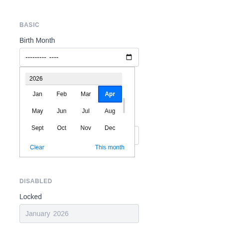
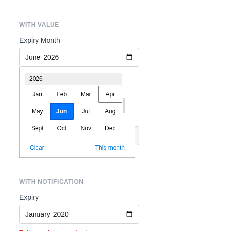

# Month Input

Renders `<input type="month">` with a browser-native month/year picker. Values are formatted as `YYYY-MM`. Uses a custom month sanitizer by default.

**Class:** `PinkCrab\Form_Components\Element\Field\Input\Month`  
**Make helper:** `Make::month( 'name', fn(Month $f) => $f->... )`

---

## Basic Usage

```php
$this->component( new Input_Component(
        Month::make( 'birth_month' )
            ->label( 'Birth Month' )
    ) )
```



<details markdown="1">
<summary>Generated HTML</summary>

```html
<div id="form-field_birth_month" class="pc-form__element pc-form__element--month_input">
    <label for="birth_month" class="pc-form__label">Birth Month</label>
        <input type="month" name="birth_month" class="form-control month-input pc-form__element__field pc-form__element__field--month_input" list="_birth_month__list" />
    </div>
```
</details>

---

## Using Make Helper

```php
use PinkCrab\Form_Components\Util\Make;

$this->component( Make::month( 'birth_month', fn( $f ) => $f
    ->label( 'Birth Month' )
    ->required( true )
    ->min( '2026-01' )
    ->max( '2026-12' )
) );
```

---

## Methods

### label( string $label )

Sets the visible label text above the input.

```php
Month::make( 'birth_month' )->label( 'Birth Month' )
```

<details markdown="1">
<summary>Generated HTML</summary>

```html
<div id="form-field_birth_month" class="pc-form__element pc-form__element--month_input">
    <label for="birth_month" class="pc-form__label">Birth Month</label>
    <input type="month" name="birth_month"
        class="form-control month-input pc-form__element__field pc-form__element__field--month_input"
    />
</div>
```
</details>

### set_existing( mixed $value )

Sets the current value. Runs through a month format sanitizer (`Y-m`) by default.

```php
Month::make( 'expiry' )
    ->label( 'Expiry Month' )
    ->set_existing( '2026-06' )
```



<details markdown="1">
<summary>Generated HTML</summary>

```html
<div id="form-field_expiry" class="pc-form__element pc-form__element--month_input">
    <label for="expiry" class="pc-form__label">Expiry Month</label>
        <input type="month" name="expiry" class="form-control month-input pc-form__element__field pc-form__element__field--month_input" list="_expiry__list" value="2026-06" />
    </div>
```
</details>

### min( int|float|string|null $min )

Sets the earliest allowed month.

```php
Month::make( 'billing_month' )
    ->label( 'Billing Month' )
    ->min( '2026-01' )
```

<details markdown="1">
<summary>Generated HTML</summary>

```html
<div id="form-field_billing_month" class="pc-form__element pc-form__element--month_input">
    <label for="billing_month" class="pc-form__label">Billing Month</label>
    <input type="month" name="billing_month"
        class="form-control month-input pc-form__element__field pc-form__element__field--month_input"
        min="2026-01"
    />
</div>
```
</details>

### max( int|float|string|null $max )

Sets the latest allowed month.

```php
Month::make( 'billing_month' )
    ->label( 'Billing Month' )
    ->max( '2026-12' )
```

<details markdown="1">
<summary>Generated HTML</summary>

```html
<div id="form-field_billing_month" class="pc-form__element pc-form__element--month_input">
    <label for="billing_month" class="pc-form__label">Billing Month</label>
    <input type="month" name="billing_month"
        class="form-control month-input pc-form__element__field pc-form__element__field--month_input"
        max="2026-12"
    />
</div>
```
</details>

### step_by_months( int $step = 1 )

Sets the step increment in months. Wrapper around `step()`.

```php
Month::make( 'quarter' )
    ->label( 'Quarter Start' )
    ->step_by_months( 3 )
```

<details markdown="1">
<summary>Generated HTML</summary>

```html
<div id="form-field_quarter" class="pc-form__element pc-form__element--month_input">
    <label for="quarter" class="pc-form__label">Quarter Start</label>
    <input type="month" name="quarter"
        class="form-control month-input pc-form__element__field pc-form__element__field--month_input"
        step="3"
    />
</div>
```
</details>

### required( bool $required = true )

Marks the field as required. The label displays a `*` indicator via CSS.

```php
Month::make( 'birth_month' )
    ->label( 'Birth Month' )
    ->required( true )
```

<details markdown="1">
<summary>Generated HTML</summary>

```html
<div id="form-field_birth_month" class="pc-form__element pc-form__element--month_input">
    <label for="birth_month" class="pc-form__label">Birth Month</label>
    <input type="month" name="birth_month"
        class="form-control month-input pc-form__element__field pc-form__element__field--month_input"
        required=""
    />
</div>
```
</details>

### disabled( bool $disabled = true )

Disables the input. Value is visible but cannot be changed or submitted.

```php
Month::make( 'locked_month' )
    ->label( 'Locked' )
    ->set_existing( '2026-01' )
    ->disabled( true )
```


<details markdown="1">
<summary>Generated HTML</summary>

```html
<div id="form-field_locked_month" class="pc-form__element pc-form__element--month_input">
    <label for="locked_month" class="pc-form__label">Locked</label>
        <input type="month" name="locked_month" class="form-control month-input pc-form__element__field pc-form__element__field--month_input" list="_locked_month__list" disabled="" value="2026-01" />
    </div>
```
</details>

### readonly( bool $readonly = true )

Makes the field read-only.

```php
Month::make( 'confirmed' )
    ->label( 'Confirmed Month' )
    ->set_existing( '2026-06' )
    ->readonly( true )
```

<details markdown="1">
<summary>Generated HTML</summary>

```html
<div id="form-field_confirmed" class="pc-form__element pc-form__element--month_input">
    <label for="confirmed" class="pc-form__label">Confirmed Month</label>
    <input type="month" name="confirmed"
        class="form-control month-input pc-form__element__field pc-form__element__field--month_input"
        readonly="" value="2026-06"
    />
</div>
```
</details>

### autocomplete( string $value )

HTML `autocomplete` attribute to help browsers autofill.

```php
Month::make( 'birth_month' )
    ->label( 'Birth Month' )
    ->autocomplete( 'off' )
```

<details markdown="1">
<summary>Generated HTML</summary>

```html
<div id="form-field_birth_month" class="pc-form__element pc-form__element--month_input">
    <label for="birth_month" class="pc-form__label">Birth Month</label>
    <input type="month" name="birth_month"
        class="form-control month-input pc-form__element__field pc-form__element__field--month_input"
        autocomplete="off"
    />
</div>
```
</details>

Common values:

| Value | Description |
|-------|-------------|
| `off` | Disable autocomplete |
| `on` | Enable autocomplete (browser decides) |
| `name` | Full name |
| `given-name` | First name |
| `family-name` | Last name |
| `email` | Email address |
| `username` | Username |
| `new-password` | New password (password managers) |
| `current-password` | Current password |
| `organization` | Company/organisation name |
| `street-address` | Street address |
| `address-line1` | Address line 1 |
| `address-line2` | Address line 2 |
| `address-level2` | City |
| `address-level1` | State/province/region |
| `country` | Country code |
| `country-name` | Country name |
| `postal-code` | Postcode / ZIP |
| `tel` | Full phone number |
| `tel-national` | Phone without country code |
| `url` | URL |
| `bday` | Full date of birth |
| `bday-day` | Day of birth |
| `bday-month` | Month of birth |
| `bday-year` | Year of birth |
| `sex` | Gender |
| `cc-name` | Cardholder name |
| `cc-number` | Card number |
| `cc-exp` | Card expiry |
| `cc-csc` | Card security code |


### inputmode( string $mode )

Hints to mobile browsers which keyboard to display.

```php
Month::make( 'birth_month' )
    ->label( 'Birth Month' )
    ->inputmode( 'numeric' )
```

<details markdown="1">
<summary>Generated HTML</summary>

```html
<div id="form-field_birth_month" class="pc-form__element pc-form__element--month_input">
    <label for="birth_month" class="pc-form__label">Birth Month</label>
    <input type="month" name="birth_month"
        class="form-control month-input pc-form__element__field pc-form__element__field--month_input"
        inputmode="numeric"
    />
</div>
```
</details>

Valid values:

| Value | Keyboard |
|-------|----------|
| `none` | No virtual keyboard |
| `text` | Standard text keyboard (default) |
| `decimal` | Numbers with decimal point |
| `numeric` | Numbers only |
| `tel` | Telephone keypad |
| `search` | Search-optimised keyboard |
| `email` | Email-optimised keyboard |
| `url` | URL-optimised keyboard |


### datalist_items( array $items )

Suggested month values via an HTML `<datalist>` element.

```php
Month::make( 'quarter_start' )
    ->label( 'Quarter Start' )
    ->datalist_items( array( '2026-01', '2026-04', '2026-07', '2026-10' ) )
```

<details markdown="1">
<summary>Generated HTML</summary>

```html
<div id="form-field_quarter_start" class="pc-form__element pc-form__element--month_input">
    <label for="quarter_start" class="pc-form__label">Quarter Start</label>
    <input type="month" name="quarter_start"
        class="form-control month-input pc-form__element__field pc-form__element__field--month_input"
        list="_quarter_start__list"
    />
    <datalist id="_quarter_start__list">
        <option value="2026-01"></option>
        <option value="2026-04"></option>
        <option value="2026-07"></option>
        <option value="2026-10"></option>
    </datalist>
</div>
```
</details>

### error_notification( string $message )

Displays an error message below the field.

```php
Month::make( 'expired_month' )
    ->label( 'Expiry' )
    ->set_existing( '2020-01' )
    ->error_notification( 'This month has expired.' )
```


<details markdown="1">
<summary>Generated HTML</summary>

```html
<div id="form-field_expired_month" class="pc-form__element pc-form__element--month_input pc-form__element pc-form__element--month_input notification-error">
    <label for="expired_month" class="pc-form__label">Expiry</label>
        <input type="month" name="expired_month" class="form-control month-input pc-form__element__field pc-form__element__field--month_input pc-form__element__field pc-form__element__field--month_input notification-error" list="_expired_month__list" value="2020-01" />
        <div class="pc-form__notification pc-form__notification--error">This month has expired.</div>
        </div>
```
</details>

### warning_notification( string $message )

Displays a warning message below the field.

```php
Month::make( 'expiry_month' )
    ->label( 'Month' )
    ->set_existing( '2024-01' )
    ->warning_notification( 'This month has passed.' )
```

<details markdown="1">
<summary>Generated HTML</summary>

```html
<div id="form-field_expiry_month" class="pc-form__element pc-form__element--month_input notification-warning">
    <label for="expiry_month" class="pc-form__label">Month</label>
    <input type="month" name="expiry_month"
        class="form-control month-input pc-form__element__field pc-form__element__field--month_input notification-warning"
        value="2024-01"
    />
    <div class="pc-form__notification pc-form__notification--warning">This month has passed.</div>
</div>
```
</details>

### success_notification( string $message )

Displays a success message below the field.

```php
Month::make( 'ok_month' )
    ->label( 'Month' )
    ->set_existing( '2026-06' )
    ->success_notification( 'Month confirmed.' )
```

<details markdown="1">
<summary>Generated HTML</summary>

```html
<div id="form-field_ok_month" class="pc-form__element pc-form__element--month_input notification-success">
    <label for="ok_month" class="pc-form__label">Month</label>
    <input type="month" name="ok_month"
        class="form-control month-input pc-form__element__field pc-form__element__field--month_input notification-success"
        value="2026-06"
    />
    <div class="pc-form__notification pc-form__notification--success">Month confirmed.</div>
</div>
```
</details>

### info_notification( string $message )

Displays an info message below the field.

```php
Month::make( 'info_month' )
    ->label( 'Month' )
    ->info_notification( 'Format: YYYY-MM' )
```

<details markdown="1">
<summary>Generated HTML</summary>

```html
<div id="form-field_info_month" class="pc-form__element pc-form__element--month_input notification-info">
    <label for="info_month" class="pc-form__label">Month</label>
    <input type="month" name="info_month"
        class="form-control month-input pc-form__element__field pc-form__element__field--month_input notification-info"
    />
    <div class="pc-form__notification pc-form__notification--info">Format: YYYY-MM</div>
</div>
```
</details>

### pre_description( string $description )

Sets a description or hint displayed before the input.

```php
Month::make( 'birth_month' )
    ->label( 'Birth Month' )
    ->pre_description( 'Select your birth month.' )
```

### post_description( string $description )

Sets a description or help text displayed after the input, before any notification.

```php
Month::make( 'birth_month' )
    ->label( 'Birth Month' )
    ->post_description( 'Format: YYYY-MM' )
```

### before( string $html ) / after( string $html )

HTML content before or after the input; renders whether or not the wrapper is shown.

```php
Month::make( 'wrapped_month' )
    ->label( 'Billing Month' )
    ->before( '<span style="color:#6b7280;font-size:13px;">Select billing period</span>' )
    ->after( '<span style="color:#6b7280;font-size:13px;">Charges applied at month end</span>' )
```


<details markdown="1">
<summary>Generated HTML</summary>

```html
<div id="form-field_wrapped_month" class="pc-form__element pc-form__element--month_input">
    <span style="color:#6b7280;font-size:13px">Select billing period</span>
        <label for="wrapped_month" class="pc-form__label">Billing Month</label>
            <input type="month" name="wrapped_month" class="form-control month-input pc-form__element__field pc-form__element__field--month_input" list="_wrapped_month__list" />
            <span style="color:#6b7280;font-size:13px">Charges applied at month end</span>
            </div>
```
</details>

### id( string $id )

Sets a custom HTML `id` on the input element.

```php
Month::make( 'birth_month' )->id( 'my-month-picker' )
```

<details markdown="1">
<summary>Generated HTML</summary>

```html
<div id="form-field_birth_month" class="pc-form__element pc-form__element--month_input">
    <input type="month" name="birth_month" id="my-month-picker"
        class="form-control month-input pc-form__element__field pc-form__element__field--month_input"
    />
</div>
```
</details>

### wrapper_id( string $id )

Sets a custom HTML `id` on the wrapper div.

```php
Month::make( 'birth_month' )->wrapper_id( 'month-wrapper' )
```

<details markdown="1">
<summary>Generated HTML</summary>

```html
<div id="month-wrapper" class="pc-form__element pc-form__element--month_input">
    <input type="month" name="birth_month"
        class="form-control month-input pc-form__element__field pc-form__element__field--month_input"
    />
</div>
```
</details>

### data( string $key, string $value )

Adds a `data-*` attribute to the input.

```php
Month::make( 'birth_month' )->data( 'format', 'month' )
```

<details markdown="1">
<summary>Generated HTML</summary>

```html
<div id="form-field_birth_month" class="pc-form__element pc-form__element--month_input">
    <input type="month" name="birth_month"
        class="form-control month-input pc-form__element__field pc-form__element__field--month_input"
        data-format="month"
    />
</div>
```
</details>

### wrapper_data( string $key, string $value )

Adds a `data-*` attribute to the wrapper div.

```php
Month::make( 'birth_month' )->wrapper_data( 'section', 'personal' )
```

<details markdown="1">
<summary>Generated HTML</summary>

```html
<div id="form-field_birth_month" class="pc-form__element pc-form__element--month_input" data-section="personal">
    <input type="month" name="birth_month"
        class="form-control month-input pc-form__element__field pc-form__element__field--month_input"
    />
</div>
```
</details>

### add_class( string $class )

Adds a CSS class to the input element.

```php
Month::make( 'birth_month' )->add_class( 'month-picker' )
```

<details markdown="1">
<summary>Generated HTML</summary>

```html
<div id="form-field_birth_month" class="pc-form__element pc-form__element--month_input">
    <input type="month" name="birth_month"
        class="form-control month-input pc-form__element__field pc-form__element__field--month_input month-picker"
    />
</div>
```
</details>

### add_wrapper_class( string $class )

Adds a CSS class to the wrapper div.

```php
Month::make( 'birth_month' )->add_wrapper_class( 'month-field' )
```

<details markdown="1">
<summary>Generated HTML</summary>

```html
<div id="form-field_birth_month" class="pc-form__element pc-form__element--month_input month-field">
    <input type="month" name="birth_month"
        class="form-control month-input pc-form__element__field pc-form__element__field--month_input"
    />
</div>
```
</details>

### show_wrapper( bool $show = true )

Controls whether the wrapping `<div>` is rendered.

```php
Month::make( 'birth_month' )->show_wrapper( false )
```

<details markdown="1">
<summary>Generated HTML</summary>

```html
<input type="month" name="birth_month"
    class="form-control month-input pc-form__element__field pc-form__element__field--month_input"
/>
```
</details>

### tabindex( int $index )

Sets the tab order of the input.

```php
Month::make( 'birth_month' )->tabindex( 4 )
```

<details markdown="1">
<summary>Generated HTML</summary>

```html
<div id="form-field_birth_month" class="pc-form__element pc-form__element--month_input">
    <input type="month" name="birth_month"
        class="form-control month-input pc-form__element__field pc-form__element__field--month_input"
        tabindex="4"
    />
</div>
```
</details>

### attribute( string $key, mixed $value )

Sets an arbitrary HTML attribute on the input.

```php
Month::make( 'birth_month' )->attribute( 'aria-label', 'Select your birth month' )
```

<details markdown="1">
<summary>Generated HTML</summary>

```html
<div id="form-field_birth_month" class="pc-form__element pc-form__element--month_input">
    <input type="month" name="birth_month"
        class="form-control month-input pc-form__element__field pc-form__element__field--month_input"
        aria-label="Select your birth month"
    />
</div>
```
</details>

### attributes( array $attrs )

Sets multiple arbitrary HTML attributes at once.

```php
Month::make( 'birth_month' )->attributes( array(
    'title' => 'Pick a month',
    'tabindex' => '4',
) )
```

<details markdown="1">
<summary>Generated HTML</summary>

```html
<div id="form-field_birth_month" class="pc-form__element pc-form__element--month_input">
    <input type="month" name="birth_month"
        class="form-control month-input pc-form__element__field pc-form__element__field--month_input"
        title="Pick a month" tabindex="4"
    />
</div>
```
</details>

### sanitizer( callable $fn )

Sets a sanitization callback applied when `set_existing()` is called. Default: custom month sanitizer that validates `Y-m` format using `DateTimeImmutable`.

**Using the default (automatic):**

```php
Month::make( 'birth_month' )
    ->set_existing( '2026-06' ) // Validates and stores as Y-m
```

**Using a custom callable:**

```php
Month::make( 'birth_month' )
    ->sanitizer( function( $value ) {
        $date = DateTimeImmutable::createFromFormat( 'Y-m', $value );
        return $date ? $date->format( 'Y-m' ) : '';
    } )
    ->set_existing( '2026-06' )
```

**Built-in sanitizer helpers:**

| Constant | Function | Description |
|----------|----------|-------------|
| `Sanitize::TEXT` | `sanitize_text_field()` | Strips tags, removes extra whitespace |
| `Sanitize::TEXTAREA` | `sanitize_textarea_field()` | Like TEXT but preserves line breaks |
| `Sanitize::URL` | `esc_url_raw()` | Sanitises a URL for database storage |
| `Sanitize::EMAIL` | `sanitize_email()` | Strips invalid email characters |
| `Sanitize::HEX_COLOR` | `sanitize_hex_color()` | Validates hex colour (#fff or #ffffff) |
| `Sanitize::NUMBER` | Custom numeric parser | Parses to int or float |
| `Sanitize::NOOP` | Pass-through | No sanitization applied |

### validator( Validator $validator )

Sets a Respect\Validation validator for server-side validation.

```php
use Respect\Validation\Validator as v;

Month::make( 'birth_month' )->validator( v::date( 'Y-m' ) )
```

### style( Style $style )

Sets a custom style for the field, overriding the default.

```php
use PinkCrab\Form_Components\Style\Default_Style;

Month::make( 'birth_month' )->style( new Default_Style() )
```

---

## Traits

| Trait | Methods |
|-------|---------|
| Label | `label()`, `get_label()`, `has_label()` |
| Single_Value | `value()`, `get_value()`, `has_value()` |
| Range | `min()`, `max()`, `get_min()`, `get_max()` |
| Required | `required()`, `is_required()` |
| Disabled | `disabled()`, `is_disabled()` |
| Read_Only | `readonly()`, `is_read_only()` |
| Autocomplete | `autocomplete()`, `get_autocomplete()`, `has_autocomplete()` |
| Input_Mode | `inputmode()`, `get_inputmode()`, `has_inputmode()`, `clear_inputmode()` |
| Datalist | `datalist_items()`, `get_datalist_key()`, `get_datalist_items()` |
| Description | `pre_description()`, `post_description()`, `get_pre_description()`, `get_post_description()`, `has_pre_description()`, `has_post_description()` |
| Notification | `error_notification()`, `warning_notification()`, `success_notification()`, `info_notification()` |
