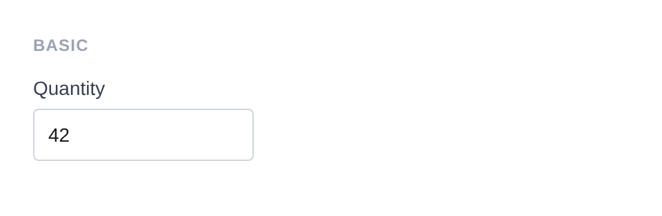
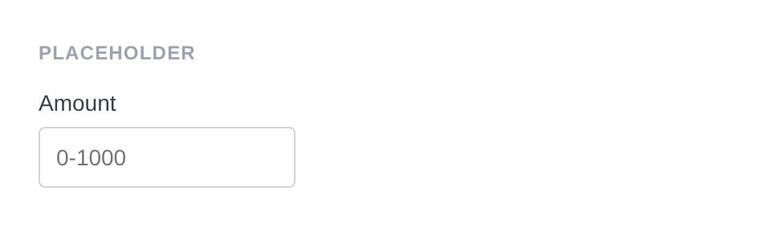

# Number Input

Renders `<input type="number">` with spinner controls for incrementing/decrementing. Uses a numeric sanitizer by default.

**Class:** `PinkCrab\Form_Components\Element\Field\Input\Number`  
**Make helper:** `Make::number( 'name', fn(Number $f) => $f->... )`

---

## Basic Usage

```php
$this->component( new Input_Component(
		Number::make( 'quantity' )
			->label( 'Quantity' )
			->set_existing( '42' )
	) )
```



<details>
<summary>Generated HTML</summary>

```html
<div id="form-field_quantity" class="pc-form__element pc-form__element--number_input">
    <label for="quantity" class="pc-form__label">Quantity</label>
        <input type="number" name="quantity" class="form-control number-input pc-form__element__field pc-form__element__field--number_input" list="_quantity__list" value="42" />
    </div>
```
</details>

---

## Using Make Helper

```php
use PinkCrab\Form_Components\Util\Make;

$this->component( Make::number( 'quantity', fn( $f ) => $f
    ->label( 'Quantity' )
    ->min( 1 )
    ->max( 100 )
    ->step( 1 )
) );
```

---

## Methods

### label( string $label )

Sets the visible label text above the input.

```php
Number::make( 'quantity' )->label( 'Quantity' )
```

<details>
<summary>Generated HTML</summary>

```html
<div id="form-field_quantity" class="pc-form__element pc-form__element--number_input">
    <label for="quantity" class="pc-form__label">Quantity</label>
    <input type="number" name="quantity"
        class="form-control number-input pc-form__element__field pc-form__element__field--number_input"
    />
</div>
```
</details>

### set_existing( mixed $value )

Sets the current value. Runs through the numeric sanitizer (`Sanitize::NUMBER`) by default.

```php
Number::make( 'quantity' )
    ->label( 'Quantity' )
    ->set_existing( 42 )
```

<details>
<summary>Generated HTML</summary>

```html
<div id="form-field_quantity" class="pc-form__element pc-form__element--number_input">
    <label for="quantity" class="pc-form__label">Quantity</label>
    <input type="number" name="quantity"
        class="form-control number-input pc-form__element__field pc-form__element__field--number_input"
        value="42"
    />
</div>
```
</details>

### placeholder( string $text )

Placeholder text shown when the field is empty.

```php
Number::make( 'amount' )
			->label( 'Amount' )
			->placeholder( '0-1000' )
			->min( 0 )
			->max( 1000 )
```



<details>
<summary>Generated HTML</summary>

```html
<div id="form-field_amount" class="pc-form__element pc-form__element--number_input">
    <label for="amount" class="pc-form__label">Amount</label>
        <input type="number" name="amount" class="form-control number-input pc-form__element__field pc-form__element__field--number_input" list="_amount__list" placeholder="0-1000" min="0" max="1000" />
    </div>
```
</details>

### min( int|float|string|null $min )

Sets the minimum allowed value.

```php
Number::make( 'age' )
    ->label( 'Age' )
    ->min( 0 )
```

<details>
<summary>Generated HTML</summary>

```html
<div id="form-field_age" class="pc-form__element pc-form__element--number_input">
    <label for="age" class="pc-form__label">Age</label>
    <input type="number" name="age"
        class="form-control number-input pc-form__element__field pc-form__element__field--number_input"
        min="0"
    />
</div>
```
</details>

### max( int|float|string|null $max )

Sets the maximum allowed value.

```php
Number::make( 'age' )
    ->label( 'Age' )
    ->max( 120 )
```

<details>
<summary>Generated HTML</summary>

```html
<div id="form-field_age" class="pc-form__element pc-form__element--number_input">
    <label for="age" class="pc-form__label">Age</label>
    <input type="number" name="age"
        class="form-control number-input pc-form__element__field pc-form__element__field--number_input"
        max="120"
    />
</div>
```
</details>

### range( int|float|string $min, int|float|string $max )

Sets both min and max in a single call.

```php
Number::make( 'age' )
			->label( 'Age' )
			->min( 1 )
			->max( 120 )
			->step( 1 )
			->set_existing( '25' )
```


<details>
<summary>Generated HTML</summary>

```html
<div id="form-field_age" class="pc-form__element pc-form__element--number_input">
    <label for="age" class="pc-form__label">Age</label>
        <input type="number" name="age" class="form-control number-input pc-form__element__field pc-form__element__field--number_input" list="_age__list" min="1" max="120" step="1" value="25" />
    </div>
```
</details>

### step( int|float|string|null $step )

Sets the step increment for the field.

```php
Number::make( 'price' )
    ->label( 'Price' )
    ->step( 0.01 )
```

<details>
<summary>Generated HTML</summary>

```html
<div id="form-field_price" class="pc-form__element pc-form__element--number_input">
    <label for="price" class="pc-form__label">Price</label>
    <input type="number" name="price"
        class="form-control number-input pc-form__element__field pc-form__element__field--number_input"
        step="0.01"
    />
</div>
```
</details>

### required( bool $required = true )

Marks the field as required. The label displays a `*` indicator via CSS.

```php
Number::make( 'quantity' )
    ->label( 'Quantity' )
    ->required( true )
```

<details>
<summary>Generated HTML</summary>

```html
<div id="form-field_quantity" class="pc-form__element pc-form__element--number_input">
    <label for="quantity" class="pc-form__label">Quantity</label>
    <input type="number" name="quantity"
        class="form-control number-input pc-form__element__field pc-form__element__field--number_input"
        required=""
    />
</div>
```
</details>

### readonly( bool $readonly = true )

Makes the field read-only. Value can be selected and copied but not changed.

```php
Number::make( 'total' )
    ->label( 'Total' )
    ->set_existing( 42 )
    ->readonly( true )
```

<details>
<summary>Generated HTML</summary>

```html
<div id="form-field_total" class="pc-form__element pc-form__element--number_input">
    <label for="total" class="pc-form__label">Total</label>
    <input type="number" name="total"
        class="form-control number-input pc-form__element__field pc-form__element__field--number_input"
        readonly="" value="42"
    />
</div>
```
</details>

### autocomplete( string $value )

HTML `autocomplete` attribute to help browsers autofill.

```php
Number::make( 'age' )
    ->label( 'Age' )
    ->autocomplete( 'off' )
```

<details>
<summary>Generated HTML</summary>

```html
<div id="form-field_age" class="pc-form__element pc-form__element--number_input">
    <label for="age" class="pc-form__label">Age</label>
    <input type="number" name="age"
        class="form-control number-input pc-form__element__field pc-form__element__field--number_input"
        autocomplete="off"
    />
</div>
```
</details>

Common values:

| Value | Description |
|-------|-------------|
| `off` | Disable autocomplete |
| `on` | Enable autocomplete (browser decides) |
| `name` | Full name |
| `given-name` | First name |
| `family-name` | Last name |
| `email` | Email address |
| `username` | Username |
| `new-password` | New password (password managers) |
| `current-password` | Current password |
| `organization` | Company/organisation name |
| `street-address` | Street address |
| `address-line1` | Address line 1 |
| `address-line2` | Address line 2 |
| `address-level2` | City |
| `address-level1` | State/province/region |
| `country` | Country code |
| `country-name` | Country name |
| `postal-code` | Postcode / ZIP |
| `tel` | Full phone number |
| `tel-national` | Phone without country code |
| `url` | URL |
| `bday` | Full date of birth |
| `bday-day` | Day of birth |
| `bday-month` | Month of birth |
| `bday-year` | Year of birth |
| `sex` | Gender |
| `cc-name` | Cardholder name |
| `cc-number` | Card number |
| `cc-exp` | Card expiry |
| `cc-csc` | Card security code |


### datalist_items( array $items )

Autocomplete suggestions via an HTML `<datalist>` element.

```php
Number::make( 'rating' )
    ->label( 'Rating' )
    ->datalist_items( array( '1', '2', '3', '4', '5' ) )
```

<details>
<summary>Generated HTML</summary>

```html
<div id="form-field_rating" class="pc-form__element pc-form__element--number_input">
    <label for="rating" class="pc-form__label">Rating</label>
    <input type="number" name="rating"
        class="form-control number-input pc-form__element__field pc-form__element__field--number_input"
        list="_rating__list"
    />
    <datalist id="_rating__list">
        <option value="1"></option>
        <option value="2"></option>
        <option value="3"></option>
        <option value="4"></option>
        <option value="5"></option>
    </datalist>
</div>
```
</details>

### error_notification( string $message )

Displays an error message below the field.

```php
Number::make( 'invalid_qty' )
    ->label( 'Quantity' )
    ->error_notification( 'Please enter a valid number.' )
```

<details>
<summary>Generated HTML</summary>

```html
<div id="form-field_invalid_qty" class="pc-form__element pc-form__element--number_input notification-error">
    <label for="invalid_qty" class="pc-form__label">Quantity</label>
    <input type="number" name="invalid_qty"
        class="form-control number-input pc-form__element__field pc-form__element__field--number_input notification-error"
    />
    <div class="pc-form__notification pc-form__notification--error">Please enter a valid number.</div>
</div>
```
</details>

### warning_notification( string $message )

Displays a warning message below the field.

```php
Number::make( 'low_qty' )
    ->label( 'Quantity' )
    ->set_existing( 0 )
    ->warning_notification( 'Quantity is zero.' )
```

<details>
<summary>Generated HTML</summary>

```html
<div id="form-field_low_qty" class="pc-form__element pc-form__element--number_input notification-warning">
    <label for="low_qty" class="pc-form__label">Quantity</label>
    <input type="number" name="low_qty"
        class="form-control number-input pc-form__element__field pc-form__element__field--number_input notification-warning"
        value="0"
    />
    <div class="pc-form__notification pc-form__notification--warning">Quantity is zero.</div>
</div>
```
</details>

### success_notification( string $message )

Displays a success message below the field.

```php
Number::make( 'ok_qty' )
    ->label( 'Quantity' )
    ->set_existing( 10 )
    ->success_notification( 'Stock available.' )
```

<details>
<summary>Generated HTML</summary>

```html
<div id="form-field_ok_qty" class="pc-form__element pc-form__element--number_input notification-success">
    <label for="ok_qty" class="pc-form__label">Quantity</label>
    <input type="number" name="ok_qty"
        class="form-control number-input pc-form__element__field pc-form__element__field--number_input notification-success"
        value="10"
    />
    <div class="pc-form__notification pc-form__notification--success">Stock available.</div>
</div>
```
</details>

### info_notification( string $message )

Displays an info message below the field.

```php
Number::make( 'info_qty' )
    ->label( 'Quantity' )
    ->info_notification( 'Enter quantity between 1 and 100.' )
```

<details>
<summary>Generated HTML</summary>

```html
<div id="form-field_info_qty" class="pc-form__element pc-form__element--number_input notification-info">
    <label for="info_qty" class="pc-form__label">Quantity</label>
    <input type="number" name="info_qty"
        class="form-control number-input pc-form__element__field pc-form__element__field--number_input notification-info"
    />
    <div class="pc-form__notification pc-form__notification--info">Enter quantity between 1 and 100.</div>
</div>
```
</details>

### pre_description( string $description )

Sets a description or hint displayed before the input.

```php
Number::make( 'quantity' )
    ->label( 'Quantity' )
    ->pre_description( 'Enter the number of items.' )
```

### post_description( string $description )

Sets a description or help text displayed after the input, before any notification.

```php
Number::make( 'quantity' )
    ->label( 'Quantity' )
    ->post_description( 'Must be between 1 and 100.' )
```

### before( string $html ) / after( string $html )

HTML content before or after the input within the wrapper.

```php
Number::make( 'wrapped_num' )
			->label( 'Price' )
			->before( '<span style="color:#6b7280;font-size:13px;">Enter amount in GBP</span>' )
			->after( '<span style="color:#6b7280;font-size:13px;">Excluding VAT</span>' )
```


<details>
<summary>Generated HTML</summary>

```html
<div id="form-field_wrapped_num" class="pc-form__element pc-form__element--number_input">
    <span style="color:#6b7280;font-size:13px">Enter amount in GBP</span>
        <label for="wrapped_num" class="pc-form__label">Price</label>
            <input type="number" name="wrapped_num" class="form-control number-input pc-form__element__field pc-form__element__field--number_input" list="_wrapped_num__list" />
            <span style="color:#6b7280;font-size:13px">Excluding VAT</span>
            </div>
```
</details>

### id( string $id )

Sets a custom HTML `id` on the input element.

```php
Number::make( 'quantity' )->id( 'my-quantity' )
```

<details>
<summary>Generated HTML</summary>

```html
<div id="form-field_quantity" class="pc-form__element pc-form__element--number_input">
    <input type="number" name="quantity" id="my-quantity"
        class="form-control number-input pc-form__element__field pc-form__element__field--number_input"
    />
</div>
```
</details>

### wrapper_id( string $id )

Sets a custom HTML `id` on the wrapper div.

```php
Number::make( 'quantity' )->wrapper_id( 'qty-wrapper' )
```

<details>
<summary>Generated HTML</summary>

```html
<div id="qty-wrapper" class="pc-form__element pc-form__element--number_input">
    <input type="number" name="quantity"
        class="form-control number-input pc-form__element__field pc-form__element__field--number_input"
    />
</div>
```
</details>

### data( string $key, string $value )

Adds a `data-*` attribute to the input.

```php
Number::make( 'quantity' )->data( 'min-stock', '5' )
```

<details>
<summary>Generated HTML</summary>

```html
<div id="form-field_quantity" class="pc-form__element pc-form__element--number_input">
    <input type="number" name="quantity"
        class="form-control number-input pc-form__element__field pc-form__element__field--number_input"
        data-min-stock="5"
    />
</div>
```
</details>

### wrapper_data( string $key, string $value )

Adds a `data-*` attribute to the wrapper div.

```php
Number::make( 'quantity' )->wrapper_data( 'section', 'cart' )
```

<details>
<summary>Generated HTML</summary>

```html
<div id="form-field_quantity" class="pc-form__element pc-form__element--number_input" data-section="cart">
    <input type="number" name="quantity"
        class="form-control number-input pc-form__element__field pc-form__element__field--number_input"
    />
</div>
```
</details>

### add_class( string $class )

Adds a CSS class to the input element.

```php
Number::make( 'quantity' )->add_class( 'wide-input' )
```

<details>
<summary>Generated HTML</summary>

```html
<div id="form-field_quantity" class="pc-form__element pc-form__element--number_input">
    <input type="number" name="quantity"
        class="form-control number-input pc-form__element__field pc-form__element__field--number_input wide-input"
    />
</div>
```
</details>

### add_wrapper_class( string $class )

Adds a CSS class to the wrapper div.

```php
Number::make( 'quantity' )->add_wrapper_class( 'number-field' )
```

<details>
<summary>Generated HTML</summary>

```html
<div id="form-field_quantity" class="pc-form__element pc-form__element--number_input number-field">
    <input type="number" name="quantity"
        class="form-control number-input pc-form__element__field pc-form__element__field--number_input"
    />
</div>
```
</details>

### show_wrapper( bool $show = true )

Controls whether the wrapping `<div>` is rendered.

```php
Number::make( 'quantity' )->show_wrapper( false )
```

<details>
<summary>Generated HTML</summary>

```html
<input type="number" name="quantity"
    class="form-control number-input pc-form__element__field pc-form__element__field--number_input"
/>
```
</details>

### tabindex( int $index )

Sets the tab order of the input.

```php
Number::make( 'quantity' )->tabindex( 3 )
```

<details>
<summary>Generated HTML</summary>

```html
<div id="form-field_quantity" class="pc-form__element pc-form__element--number_input">
    <input type="number" name="quantity"
        class="form-control number-input pc-form__element__field pc-form__element__field--number_input"
        tabindex="3"
    />
</div>
```
</details>

### attribute( string $key, mixed $value )

Sets an arbitrary HTML attribute on the input.

```php
Number::make( 'quantity' )->attribute( 'aria-label', 'Product quantity' )
```

<details>
<summary>Generated HTML</summary>

```html
<div id="form-field_quantity" class="pc-form__element pc-form__element--number_input">
    <input type="number" name="quantity"
        class="form-control number-input pc-form__element__field pc-form__element__field--number_input"
        aria-label="Product quantity"
    />
</div>
```
</details>

### attributes( array $attrs )

Sets multiple arbitrary HTML attributes at once.

```php
Number::make( 'quantity' )->attributes( array(
    'title' => 'Enter quantity',
    'tabindex' => '3',
) )
```

<details>
<summary>Generated HTML</summary>

```html
<div id="form-field_quantity" class="pc-form__element pc-form__element--number_input">
    <input type="number" name="quantity"
        class="form-control number-input pc-form__element__field pc-form__element__field--number_input"
        title="Enter quantity" tabindex="3"
    />
</div>
```
</details>

### sanitizer( callable $fn )

Sets a sanitization callback applied when `set_existing()` is called. Default: `Sanitize::NUMBER` which parses to int or float.

**Using the default (automatic):**

```php
Number::make( 'quantity' )
    ->set_existing( '42' ) // Sanitized to numeric value
```

**Using a custom callable:**

```php
Number::make( 'quantity' )
    ->sanitizer( function( $value ) {
        return absint( $value );
    } )
    ->set_existing( '-5' )
```

**Built-in sanitizer helpers:**

| Constant | Function | Description |
|----------|----------|-------------|
| `Sanitize::TEXT` | `sanitize_text_field()` | Strips tags, removes extra whitespace |
| `Sanitize::TEXTAREA` | `sanitize_textarea_field()` | Like TEXT but preserves line breaks |
| `Sanitize::URL` | `esc_url_raw()` | Sanitises a URL for database storage |
| `Sanitize::EMAIL` | `sanitize_email()` | Strips invalid email characters |
| `Sanitize::HEX_COLOR` | `sanitize_hex_color()` | Validates hex colour (#fff or #ffffff) |
| `Sanitize::NUMBER` | Custom numeric parser | Parses to int or float |
| `Sanitize::NOOP` | Pass-through | No sanitization applied |

### validator( Validator $validator )

Sets a Respect\Validation validator for server-side validation.

```php
use Respect\Validation\Validator as v;

Number::make( 'quantity' )->validator( v::intVal()->between( 1, 100 ) )
```

### style( Style $style )

Sets a custom style for the field, overriding the default.

```php
use PinkCrab\Form_Components\Style\Default_Style;

Number::make( 'quantity' )->style( new Default_Style() )
```

---

## Traits

| Trait | Methods |
|-------|---------|
| Label | `label()`, `get_label()`, `has_label()` |
| Single_Value | `value()`, `get_value()`, `has_value()` |
| Placeholder | `placeholder()`, `get_placeholder()`, `has_placeholder()` |
| Range | `min()`, `max()`, `range()`, `get_min()`, `get_max()` |
| Step | `step()`, `get_step()`, `has_step()`, `clear_step()` |
| Required | `required()`, `is_required()` |
| Read_Only | `readonly()`, `is_read_only()` |
| Autocomplete | `autocomplete()`, `get_autocomplete()`, `has_autocomplete()` |
| Datalist | `datalist_items()`, `get_datalist_key()`, `get_datalist_items()` |
| Description | `pre_description()`, `post_description()`, `get_pre_description()`, `get_post_description()`, `has_pre_description()`, `has_post_description()` |
| Notification | `error_notification()`, `warning_notification()`, `success_notification()`, `info_notification()` |
