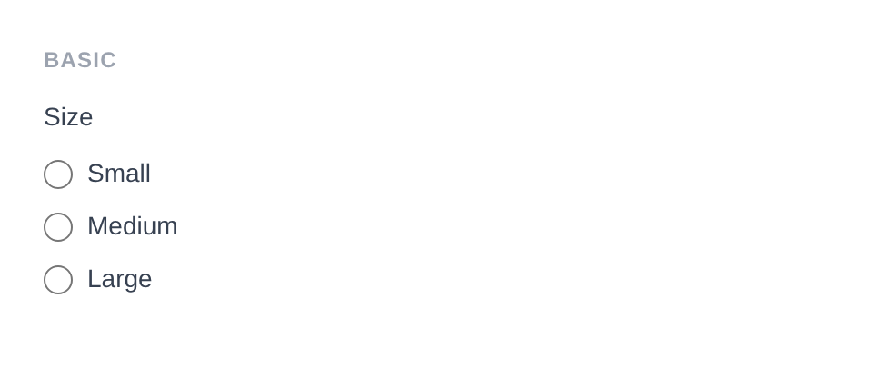
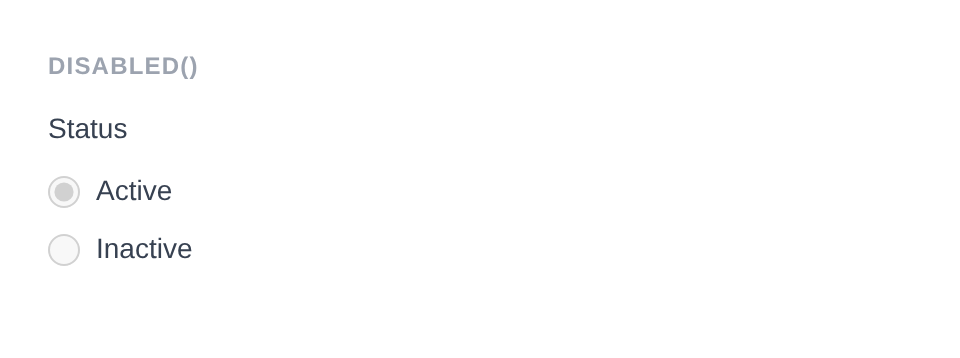
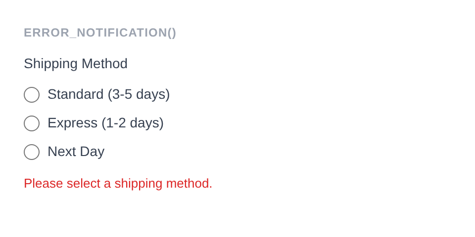
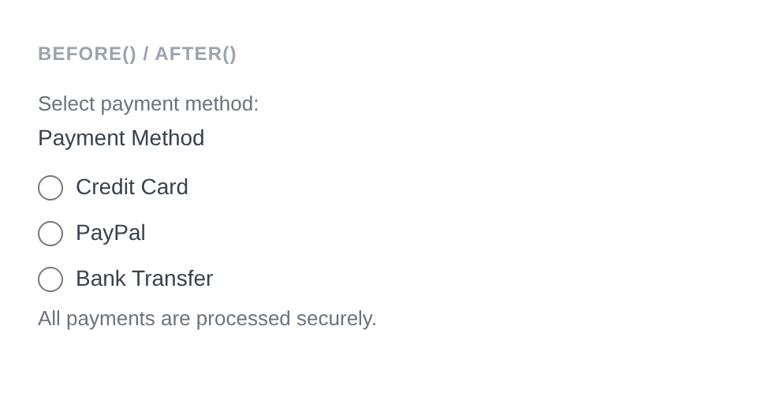

# Radio Group

Renders a group of `<input type="radio">` elements from an options array, allowing a single selection. Uses `<legend>` for the label instead of `<label>`.

**Class:** `PinkCrab\Form_Components\Element\Field\Group\Radio_Group`  
**Make helper:** `Make::radio_group( 'name', fn(Radio_Group $f) => $f->... )`

---

## Basic Usage

```php
$this->component( new Radio_Group_Component(
		Radio_Group::make( 'size' )
			->label( 'Size' )
			->options( array(
				'small'  => 'Small',
				'medium' => 'Medium',
				'large'  => 'Large',
			) )
	) )
```



<details>
<summary>Generated HTML</summary>

```html
<div id="form-field_size" class="pc-form__element pc-form__element--radio_group">
    <legend>Size</legend>
        <label class="radio-group__option">
            <input type="radio" name="size" value="small" /> Small </label>
            <label class="radio-group__option">
                <input type="radio" name="size" value="medium" /> Medium </label>
                <label class="radio-group__option">
                    <input type="radio" name="size" value="large" /> Large </label>
                </div>
```
</details>

---

## Using Make Helper

```php
use PinkCrab\Form_Components\Util\Make;

$this->component( Make::radio_group( 'gender', fn( $f ) => $f
    ->label( 'Gender' )
    ->options( array(
        'male'   => 'Male',
        'female' => 'Female',
        'other'  => 'Other',
    ) )
) );
```

---

## Methods

### label( string $label )

Sets the visible label text above the radio group. Rendered as a `<legend>` element.

```php
Radio_Group::make( 'gender' )->label( 'Gender' )
```

<details>
<summary>Generated HTML</summary>

```html
<div id="form-field_gender" class="pc-form__element pc-form__element--radio_group">
    <legend>Gender</legend>
</div>
```
</details>

### options( array $options )

Sets the available radio buttons as a `value => label` associative array.

```php
Radio_Group::make( 'plan' )
    ->label( 'Plan' )
    ->options( array(
        'free'       => 'Free',
        'pro'        => 'Professional',
        'enterprise' => 'Enterprise',
    ) )
```

<details>
<summary>Generated HTML</summary>

```html
<div id="form-field_plan" class="pc-form__element pc-form__element--radio_group">
    <legend>Plan</legend>
    <label class="radio-group__option">
        <input type="radio" name="plan" value="free" />
        Free
    </label>
    <label class="radio-group__option">
        <input type="radio" name="plan" value="pro" />
        Professional
    </label>
    <label class="radio-group__option">
        <input type="radio" name="plan" value="enterprise" />
        Enterprise
    </label>
</div>
```
</details>

### selected( string $selected )

Sets which radio button is selected by passing a single value string.

```php
Radio_Group::make( 'plan' )
			->label( 'Plan' )
			->options( array(
				'free' => 'Free',
				'pro'  => 'Professional',
				'ent'  => 'Enterprise',
			) )
			->selected( 'pro' )
```


<details>
<summary>Generated HTML</summary>

```html
<div id="form-field_plan" class="pc-form__element pc-form__element--radio_group">
    <legend>Plan</legend>
        <label class="radio-group__option">
            <input type="radio" name="plan" value="free" /> Free </label>
            <label class="radio-group__option">
                <input type="radio" name="plan" value="pro" checked /> Professional </label>
                <label class="radio-group__option">
                    <input type="radio" name="plan" value="ent" /> Enterprise </label>
                </div>
```
</details>

### set_existing( mixed $value )

Sets the selected value from existing data. Accepts a single value.

```php
Radio_Group::make( 'plan' )
    ->label( 'Plan' )
    ->options( array( 'free' => 'Free', 'pro' => 'Professional' ) )
    ->set_existing( 'free' )
```

<details>
<summary>Generated HTML</summary>

```html
<div id="form-field_plan" class="pc-form__element pc-form__element--radio_group">
    <legend>Plan</legend>
    <label class="radio-group__option">
        <input type="radio" name="plan" value="free" checked />
        Free
    </label>
    <label class="radio-group__option">
        <input type="radio" name="plan" value="pro" />
        Professional
    </label>
</div>
```
</details>

### is_selected( string $value )

Check if a specific radio value is currently selected.

```php
$group = Radio_Group::make( 'plan' )
    ->options( array( 'free' => 'Free', 'pro' => 'Professional' ) )
    ->selected( 'pro' );

$group->is_selected( 'pro' );  // true
$group->is_selected( 'free' ); // false
```

### required( bool $required = true )

Marks the field as required. The label displays a `*` indicator via CSS.

```php
Radio_Group::make( 'plan' )
    ->label( 'Plan' )
    ->options( array( 'free' => 'Free', 'pro' => 'Professional' ) )
    ->required( true )
```

<details>
<summary>Generated HTML</summary>

```html
<div id="form-field_plan" class="pc-form__element pc-form__element--radio_group">
    <legend>Plan</legend>
    <label class="radio-group__option">
        <input type="radio" name="plan" value="free" />
        Free
    </label>
    <label class="radio-group__option">
        <input type="radio" name="plan" value="pro" />
        Professional
    </label>
</div>
```
</details>

### disabled( bool $disabled = true )

Disables the entire radio group. Each individual radio button receives the `disabled` attribute.

```php
Radio_Group::make( 'locked_choice' )
			->label( 'Status' )
			->options( array(
				'active'   => 'Active',
				'inactive' => 'Inactive',
			) )
			->selected( 'active' )
			->disabled( true )
```



<details>
<summary>Generated HTML</summary>

```html
<div id="form-field_locked_choice" class="pc-form__element pc-form__element--radio_group">
    <legend>Status</legend>
        <label class="radio-group__option">
            <input type="radio" name="locked_choice" value="active" checked disabled /> Active </label>
            <label class="radio-group__option">
                <input type="radio" name="locked_choice" value="inactive" disabled /> Inactive </label>
            </div>
```
</details>

### error_notification( string $message )

Displays an error message below the group.

```php
Radio_Group::make( 'required_choice' )
			->label( 'Shipping Method' )
			->options( array(
				'standard' => 'Standard (3-5 days)',
				'express'  => 'Express (1-2 days)',
				'next_day' => 'Next Day',
			) )
			->error_notification( 'Please select a shipping method.' )
```



<details>
<summary>Generated HTML</summary>

```html
<div id="form-field_required_choice" class="pc-form__element pc-form__element--radio_group pc-form__element pc-form__element--radio_group notification-error">
    <legend>Shipping Method</legend>
        <label class="radio-group__option">
            <input type="radio" name="required_choice" value="standard" /> Standard (3-5 days) </label>
            <label class="radio-group__option">
                <input type="radio" name="required_choice" value="express" /> Express (1-2 days) </label>
                <label class="radio-group__option">
                    <input type="radio" name="required_choice" value="next_day" /> Next Day </label>
                    <div class="pc-form__notification pc-form__notification--error">Please select a shipping method.</div>
                    </div>
```
</details>

### warning_notification( string $message )

Displays a warning message below the group.

```php
Radio_Group::make( 'plan' )
    ->label( 'Plan' )
    ->options( array( 'free' => 'Free', 'pro' => 'Professional' ) )
    ->warning_notification( 'Plan cannot be downgraded later.' )
```

<details>
<summary>Generated HTML</summary>

```html
<div id="form-field_plan" class="pc-form__element pc-form__element--radio_group notification-warning">
    <legend>Plan</legend>
    <label class="radio-group__option">
        <input type="radio" name="plan" value="free" />
        Free
    </label>
    <label class="radio-group__option">
        <input type="radio" name="plan" value="pro" />
        Professional
    </label>
    <div class="pc-form__notification pc-form__notification--warning">Plan cannot be downgraded later.</div>
</div>
```
</details>

### success_notification( string $message )

Displays a success message below the group.

```php
Radio_Group::make( 'plan' )
    ->label( 'Plan' )
    ->options( array( 'free' => 'Free', 'pro' => 'Professional' ) )
    ->selected( 'pro' )
    ->success_notification( 'Plan confirmed.' )
```

<details>
<summary>Generated HTML</summary>

```html
<div id="form-field_plan" class="pc-form__element pc-form__element--radio_group notification-success">
    <legend>Plan</legend>
    <label class="radio-group__option">
        <input type="radio" name="plan" value="free" />
        Free
    </label>
    <label class="radio-group__option">
        <input type="radio" name="plan" value="pro" checked />
        Professional
    </label>
    <div class="pc-form__notification pc-form__notification--success">Plan confirmed.</div>
</div>
```
</details>

### info_notification( string $message )

Displays an info message below the group.

```php
Radio_Group::make( 'plan' )
    ->label( 'Plan' )
    ->options( array( 'free' => 'Free', 'pro' => 'Professional' ) )
    ->info_notification( 'You can change your plan at any time.' )
```

<details>
<summary>Generated HTML</summary>

```html
<div id="form-field_plan" class="pc-form__element pc-form__element--radio_group notification-info">
    <legend>Plan</legend>
    <label class="radio-group__option">
        <input type="radio" name="plan" value="free" />
        Free
    </label>
    <label class="radio-group__option">
        <input type="radio" name="plan" value="pro" />
        Professional
    </label>
    <div class="pc-form__notification pc-form__notification--info">You can change your plan at any time.</div>
</div>
```
</details>

### pre_description( string $description )

Sets a description or hint displayed before the radio options.

```php
Radio_Group::make( 'priority' )
    ->label( 'Priority' )
    ->pre_description( 'Choose one option.' )
```

### post_description( string $description )

Sets a description or help text displayed after the radio options, before any notification.

```php
Radio_Group::make( 'priority' )
    ->label( 'Priority' )
    ->post_description( 'This affects response time.' )
```

### before( string $html ) / after( string $html )

HTML content before or after the radio group within the wrapper.

```php
Radio_Group::make( 'payment' )
			->label( 'Payment Method' )
			->options( array(
				'card'   => 'Credit Card',
				'paypal' => 'PayPal',
				'bank'   => 'Bank Transfer',
			) )
			->before( '<span style="color:#6b7280;font-size:13px;">Select payment method:</span>' )
			->after( '<span style="color:#6b7280;font-size:13px;">All payments are processed securely.</span>' )
```



<details>
<summary>Generated HTML</summary>

```html
<div id="form-field_payment" class="pc-form__element pc-form__element--radio_group">
    <span style="color:#6b7280;font-size:13px">Select payment method:</span>
        <legend>Payment Method</legend>
            <label class="radio-group__option">
                <input type="radio" name="payment" value="card" /> Credit Card </label>
                <label class="radio-group__option">
                    <input type="radio" name="payment" value="paypal" /> PayPal </label>
                    <label class="radio-group__option">
                        <input type="radio" name="payment" value="bank" /> Bank Transfer </label>
                        <span style="color:#6b7280;font-size:13px">All payments are processed securely.</span>
                        </div>
```
</details>

### id( string $id )

Sets a custom HTML `id` on the radio group element.

```php
Radio_Group::make( 'plan' )
    ->id( 'my-custom-group-id' )
```

<details>
<summary>Generated HTML</summary>

```html
<div id="form-field_plan" class="pc-form__element pc-form__element--radio_group">
</div>
```
</details>

### wrapper_id( string $id )

Sets a custom HTML `id` on the wrapper div.

```php
Radio_Group::make( 'plan' )
    ->wrapper_id( 'my-custom-wrapper-id' )
```

<details>
<summary>Generated HTML</summary>

```html
<div id="my-custom-wrapper-id" class="pc-form__element pc-form__element--radio_group">
</div>
```
</details>

### data( string $key, string $value )

Adds a `data-*` attribute to the radio group element.

```php
Radio_Group::make( 'plan' )
    ->data( 'pricing', 'dynamic' )
```

<details>
<summary>Generated HTML</summary>

```html
<div id="form-field_plan" class="pc-form__element pc-form__element--radio_group">
</div>
```
</details>

### wrapper_data( string $key, string $value )

Adds a `data-*` attribute to the wrapper div.

```php
Radio_Group::make( 'plan' )
    ->wrapper_data( 'section', 'billing' )
```

<details>
<summary>Generated HTML</summary>

```html
<div id="form-field_plan" class="pc-form__element pc-form__element--radio_group" data-section="billing">
</div>
```
</details>

### add_class( string $class )

Adds a CSS class to the radio group element.

```php
Radio_Group::make( 'plan' )
    ->add_class( 'my-group-class' )
```

<details>
<summary>Generated HTML</summary>

```html
<div id="form-field_plan" class="pc-form__element pc-form__element--radio_group">
</div>
```
</details>

### add_wrapper_class( string $class )

Adds a CSS class to the wrapper div.

```php
Radio_Group::make( 'plan' )
    ->add_wrapper_class( 'my-wrapper-class' )
```

<details>
<summary>Generated HTML</summary>

```html
<div id="form-field_plan" class="pc-form__element pc-form__element--radio_group my-wrapper-class">
</div>
```
</details>

### show_wrapper( bool $show = true )

Controls whether the wrapping `<div>` is rendered.

```php
Radio_Group::make( 'plan' )
    ->options( array( 'free' => 'Free', 'pro' => 'Professional' ) )
    ->show_wrapper( false )
```

<details>
<summary>Generated HTML</summary>

```html
<label class="radio-group__option">
    <input type="radio" name="plan" value="free" />
    Free
</label>
<label class="radio-group__option">
    <input type="radio" name="plan" value="pro" />
    Professional
</label>
```
</details>

### attribute( string $key, mixed $value )

Sets an arbitrary HTML attribute on the radio group.

```php
Radio_Group::make( 'plan' )
    ->attribute( 'aria-label', 'Select your plan' )
```

<details>
<summary>Generated HTML</summary>

```html
<div id="form-field_plan" class="pc-form__element pc-form__element--radio_group">
</div>
```
</details>

### attributes( array $attrs )

Sets multiple arbitrary HTML attributes at once.

```php
Radio_Group::make( 'plan' )
    ->attributes( array(
        'title'    => 'Plan selection',
        'tabindex' => '3',
    ) )
```

<details>
<summary>Generated HTML</summary>

```html
<div id="form-field_plan" class="pc-form__element pc-form__element--radio_group">
</div>
```
</details>

### style( Style $style )

Sets a custom style for the field, overriding the default.

```php
use PinkCrab\Form_Components\Style\Default_Style;

Radio_Group::make( 'plan' )
    ->style( new Default_Style() )
```

---

## Traits

| Trait | Methods |
|-------|---------|
| Label | `label()`, `get_label()`, `has_label()` |
| Options | `options()`, `get_options()` |
| Notification | `error_notification()`, `warning_notification()`, `success_notification()`, `info_notification()` |
| Disabled | `disabled()`, `is_disabled()` |
| Required | `required()`, `is_required()` |
| Description | `pre_description()`, `post_description()`, `get_pre_description()`, `get_post_description()`, `has_pre_description()`, `has_post_description()` |
