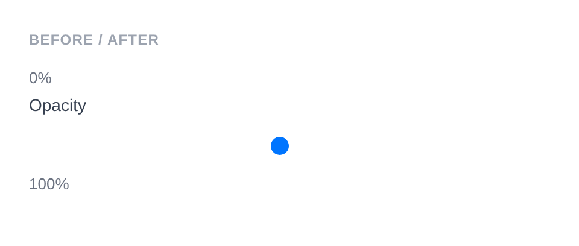

# Range Input

Renders `<input type="range">` as a slider control. Uses a numeric sanitizer by default.

**Class:** `PinkCrab\Form_Components\Element\Field\Input\Range`  
**Make helper:** `Make::range( 'name', fn(Range $f) => $f->... )`

---

## Basic Usage

```php
$this->component( new Input_Component(
        Range::make( 'volume' )
            ->label( 'Volume' )
            ->min( 0 )
            ->max( 100 )
            ->set_existing( '50' )
    ) )
```


<details markdown="1">
<summary>Generated HTML</summary>

```html
<div id="form-field_volume" class="pc-form__element pc-form__element--range_input">
    <label for="volume" class="pc-form__label">Volume</label>
        <input type="range" name="volume" class="form-control range-input pc-form__element__field pc-form__element__field--range_input" list="_volume__list" min="0" max="100" value="50" />
    </div>
```
</details>

---

## Using Make Helper

```php
use PinkCrab\Form_Components\Util\Make;

$this->component( Make::range( 'volume', fn( $f ) => $f
    ->label( 'Volume' )
    ->min( 0 )
    ->max( 100 )
    ->set_existing( '50' )
) );
```

---

## Methods

### label( string $label )

Sets the visible label text above the input.

```php
Range::make( 'volume' )->label( 'Volume' )
```

<details markdown="1">
<summary>Generated HTML</summary>

```html
<div id="form-field_volume" class="pc-form__element pc-form__element--range_input">
    <label for="volume" class="pc-form__label">Volume</label>
    <input type="range" name="volume"
        class="form-control range-input pc-form__element__field pc-form__element__field--range_input"
    />
</div>
```
</details>

### set_existing( mixed $value )

Sets the current value. Runs through the numeric sanitizer (`Sanitize::NUMBER`) by default.

```php
Range::make( 'volume' )
    ->label( 'Volume' )
    ->min( 0 )
    ->max( 100 )
    ->set_existing( '75' )
```

<details markdown="1">
<summary>Generated HTML</summary>

```html
<div id="form-field_volume" class="pc-form__element pc-form__element--range_input">
    <label for="volume" class="pc-form__label">Volume</label>
    <input type="range" name="volume"
        class="form-control range-input pc-form__element__field pc-form__element__field--range_input"
        min="0" max="100" value="75"
    />
</div>
```
</details>

### min( int|float|string|null $min )

Sets the minimum value for the slider.

```php
Range::make( 'brightness' )
    ->label( 'Brightness' )
    ->min( 0 )
```

<details markdown="1">
<summary>Generated HTML</summary>

```html
<div id="form-field_brightness" class="pc-form__element pc-form__element--range_input">
    <label for="brightness" class="pc-form__label">Brightness</label>
    <input type="range" name="brightness"
        class="form-control range-input pc-form__element__field pc-form__element__field--range_input"
        min="0"
    />
</div>
```
</details>

### max( int|float|string|null $max )

Sets the maximum value for the slider.

```php
Range::make( 'brightness' )
    ->label( 'Brightness' )
    ->max( 100 )
```

<details markdown="1">
<summary>Generated HTML</summary>

```html
<div id="form-field_brightness" class="pc-form__element pc-form__element--range_input">
    <label for="brightness" class="pc-form__label">Brightness</label>
    <input type="range" name="brightness"
        class="form-control range-input pc-form__element__field pc-form__element__field--range_input"
        max="100"
    />
</div>
```
</details>

### range( int|float|string $min, int|float|string $max )

Sets both min and max in a single call.

```php
Range::make( 'brightness' )
    ->label( 'Brightness' )
    ->range( 0, 100 )
```

<details markdown="1">
<summary>Generated HTML</summary>

```html
<div id="form-field_brightness" class="pc-form__element pc-form__element--range_input">
    <label for="brightness" class="pc-form__label">Brightness</label>
    <input type="range" name="brightness"
        class="form-control range-input pc-form__element__field pc-form__element__field--range_input"
        min="0" max="100"
    />
</div>
```
</details>

### step( int|float|string|null $step )

Sets the step increment for the slider.

```php
Range::make( 'brightness' )
    ->label( 'Brightness' )
    ->min( 0 )
    ->max( 100 )
    ->step( 10 )
    ->set_existing( '70' )
```


<details markdown="1">
<summary>Generated HTML</summary>

```html
<div id="form-field_brightness" class="pc-form__element pc-form__element--range_input">
    <label for="brightness" class="pc-form__label">Brightness</label>
        <input type="range" name="brightness" class="form-control range-input pc-form__element__field pc-form__element__field--range_input" list="_brightness__list" min="0" max="100" step="10" value="70" />
    </div>
```
</details>

### required( bool $required = true )

Marks the field as required.

```php
Range::make( 'volume' )
    ->label( 'Volume' )
    ->required( true )
```

<details markdown="1">
<summary>Generated HTML</summary>

```html
<div id="form-field_volume" class="pc-form__element pc-form__element--range_input">
    <label for="volume" class="pc-form__label">Volume</label>
    <input type="range" name="volume"
        class="form-control range-input pc-form__element__field pc-form__element__field--range_input"
        required=""
    />
</div>
```
</details>

### autocomplete( string $value )

HTML `autocomplete` attribute to help browsers autofill.

```php
Range::make( 'volume' )
    ->label( 'Volume' )
    ->autocomplete( 'off' )
```

<details markdown="1">
<summary>Generated HTML</summary>

```html
<div id="form-field_volume" class="pc-form__element pc-form__element--range_input">
    <label for="volume" class="pc-form__label">Volume</label>
    <input type="range" name="volume"
        class="form-control range-input pc-form__element__field pc-form__element__field--range_input"
        autocomplete="off"
    />
</div>
```
</details>

Common values:

| Value | Description |
|-------|-------------|
| `off` | Disable autocomplete |
| `on` | Enable autocomplete (browser decides) |
| `name` | Full name |
| `given-name` | First name |
| `family-name` | Last name |
| `email` | Email address |
| `username` | Username |
| `new-password` | New password (password managers) |
| `current-password` | Current password |
| `organization` | Company/organisation name |
| `street-address` | Street address |
| `address-line1` | Address line 1 |
| `address-line2` | Address line 2 |
| `address-level2` | City |
| `address-level1` | State/province/region |
| `country` | Country code |
| `country-name` | Country name |
| `postal-code` | Postcode / ZIP |
| `tel` | Full phone number |
| `tel-national` | Phone without country code |
| `url` | URL |
| `bday` | Full date of birth |
| `bday-day` | Day of birth |
| `bday-month` | Month of birth |
| `bday-year` | Year of birth |
| `sex` | Gender |
| `cc-name` | Cardholder name |
| `cc-number` | Card number |
| `cc-exp` | Card expiry |
| `cc-csc` | Card security code |


### datalist_items( array $items )

Adds tick marks to the slider via an HTML `<datalist>` element.

```php
Range::make( 'volume' )
    ->label( 'Volume' )
    ->min( 0 )
    ->max( 100 )
    ->datalist_items( array( '0', '25', '50', '75', '100' ) )
```

<details markdown="1">
<summary>Generated HTML</summary>

```html
<div id="form-field_volume" class="pc-form__element pc-form__element--range_input">
    <label for="volume" class="pc-form__label">Volume</label>
    <input type="range" name="volume"
        class="form-control range-input pc-form__element__field pc-form__element__field--range_input"
        min="0" max="100" list="_volume__list"
    />
    <datalist id="_volume__list">
        <option value="0"></option>
        <option value="25"></option>
        <option value="50"></option>
        <option value="75"></option>
        <option value="100"></option>
    </datalist>
</div>
```
</details>

### error_notification( string $message )

Displays an error message below the field.

```php
Range::make( 'invalid_vol' )
    ->label( 'Volume' )
    ->error_notification( 'Volume must be set.' )
```

<details markdown="1">
<summary>Generated HTML</summary>

```html
<div id="form-field_invalid_vol" class="pc-form__element pc-form__element--range_input notification-error">
    <label for="invalid_vol" class="pc-form__label">Volume</label>
    <input type="range" name="invalid_vol"
        class="form-control range-input pc-form__element__field pc-form__element__field--range_input notification-error"
    />
    <div class="pc-form__notification pc-form__notification--error">Volume must be set.</div>
</div>
```
</details>

### warning_notification( string $message )

Displays a warning message below the field.

```php
Range::make( 'loud_vol' )
    ->label( 'Volume' )
    ->set_existing( '100' )
    ->warning_notification( 'Volume is at maximum.' )
```

<details markdown="1">
<summary>Generated HTML</summary>

```html
<div id="form-field_loud_vol" class="pc-form__element pc-form__element--range_input notification-warning">
    <label for="loud_vol" class="pc-form__label">Volume</label>
    <input type="range" name="loud_vol"
        class="form-control range-input pc-form__element__field pc-form__element__field--range_input notification-warning"
        value="100"
    />
    <div class="pc-form__notification pc-form__notification--warning">Volume is at maximum.</div>
</div>
```
</details>

### success_notification( string $message )

Displays a success message below the field.

```php
Range::make( 'ok_vol' )
    ->label( 'Volume' )
    ->set_existing( '50' )
    ->success_notification( 'Volume set.' )
```

<details markdown="1">
<summary>Generated HTML</summary>

```html
<div id="form-field_ok_vol" class="pc-form__element pc-form__element--range_input notification-success">
    <label for="ok_vol" class="pc-form__label">Volume</label>
    <input type="range" name="ok_vol"
        class="form-control range-input pc-form__element__field pc-form__element__field--range_input notification-success"
        value="50"
    />
    <div class="pc-form__notification pc-form__notification--success">Volume set.</div>
</div>
```
</details>

### info_notification( string $message )

Displays an info message below the field.

```php
Range::make( 'info_vol' )
    ->label( 'Volume' )
    ->info_notification( 'Drag the slider to adjust volume.' )
```

<details markdown="1">
<summary>Generated HTML</summary>

```html
<div id="form-field_info_vol" class="pc-form__element pc-form__element--range_input notification-info">
    <label for="info_vol" class="pc-form__label">Volume</label>
    <input type="range" name="info_vol"
        class="form-control range-input pc-form__element__field pc-form__element__field--range_input notification-info"
    />
    <div class="pc-form__notification pc-form__notification--info">Drag the slider to adjust volume.</div>
</div>
```
</details>

### pre_description( string $description )

Sets a description or hint displayed before the input.

```php
Range::make( 'volume' )
    ->label( 'Volume' )
    ->pre_description( 'Adjust the volume level.' )
```

### post_description( string $description )

Sets a description or help text displayed after the input, before any notification.

```php
Range::make( 'volume' )
    ->label( 'Volume' )
    ->post_description( 'Drag the slider to set volume.' )
```

### before( string $html ) / after( string $html )

HTML content before or after the input; renders whether or not the wrapper is shown. Useful for showing min/max labels alongside the slider.

```php
Range::make( 'labeled_range' )
    ->label( 'Opacity' )
    ->min( 0 )
    ->max( 100 )
    ->set_existing( '75' )
    ->before( '<span style="color:#6b7280;font-size:13px;">0%</span>' )
    ->after( '<span style="color:#6b7280;font-size:13px;">100%</span>' )
```



<details markdown="1">
<summary>Generated HTML</summary>

```html
<div id="form-field_labeled_range" class="pc-form__element pc-form__element--range_input">
    <span style="color:#6b7280;font-size:13px">0%</span>
        <label for="labeled_range" class="pc-form__label">Opacity</label>
            <input type="range" name="labeled_range" class="form-control range-input pc-form__element__field pc-form__element__field--range_input" list="_labeled_range__list" min="0" max="100" value="75" />
            <span style="color:#6b7280;font-size:13px">100%</span>
            </div>
```
</details>

### id( string $id )

Sets a custom HTML `id` on the input element.

```php
Range::make( 'volume' )->id( 'my-slider' )
```

<details markdown="1">
<summary>Generated HTML</summary>

```html
<div id="form-field_volume" class="pc-form__element pc-form__element--range_input">
    <input type="range" name="volume" id="my-slider"
        class="form-control range-input pc-form__element__field pc-form__element__field--range_input"
    />
</div>
```
</details>

### wrapper_id( string $id )

Sets a custom HTML `id` on the wrapper div.

```php
Range::make( 'volume' )->wrapper_id( 'volume-wrapper' )
```

<details markdown="1">
<summary>Generated HTML</summary>

```html
<div id="volume-wrapper" class="pc-form__element pc-form__element--range_input">
    <input type="range" name="volume"
        class="form-control range-input pc-form__element__field pc-form__element__field--range_input"
    />
</div>
```
</details>

### data( string $key, string $value )

Adds a `data-*` attribute to the input.

```php
Range::make( 'volume' )->data( 'output', 'volume-display' )
```

<details markdown="1">
<summary>Generated HTML</summary>

```html
<div id="form-field_volume" class="pc-form__element pc-form__element--range_input">
    <input type="range" name="volume"
        class="form-control range-input pc-form__element__field pc-form__element__field--range_input"
        data-output="volume-display"
    />
</div>
```
</details>

### wrapper_data( string $key, string $value )

Adds a `data-*` attribute to the wrapper div.

```php
Range::make( 'volume' )->wrapper_data( 'section', 'audio' )
```

<details markdown="1">
<summary>Generated HTML</summary>

```html
<div id="form-field_volume" class="pc-form__element pc-form__element--range_input" data-section="audio">
    <input type="range" name="volume"
        class="form-control range-input pc-form__element__field pc-form__element__field--range_input"
    />
</div>
```
</details>

### add_class( string $class )

Adds a CSS class to the input element.

```php
Range::make( 'volume' )->add_class( 'slider-lg' )
```

<details markdown="1">
<summary>Generated HTML</summary>

```html
<div id="form-field_volume" class="pc-form__element pc-form__element--range_input">
    <input type="range" name="volume"
        class="form-control range-input pc-form__element__field pc-form__element__field--range_input slider-lg"
    />
</div>
```
</details>

### add_wrapper_class( string $class )

Adds a CSS class to the wrapper div.

```php
Range::make( 'volume' )->add_wrapper_class( 'range-wrapper' )
```

<details markdown="1">
<summary>Generated HTML</summary>

```html
<div id="form-field_volume" class="pc-form__element pc-form__element--range_input range-wrapper">
    <input type="range" name="volume"
        class="form-control range-input pc-form__element__field pc-form__element__field--range_input"
    />
</div>
```
</details>

### show_wrapper( bool $show = true )

Controls whether the wrapping `<div>` is rendered.

```php
Range::make( 'volume' )->show_wrapper( false )
```

<details markdown="1">
<summary>Generated HTML</summary>

```html
<input type="range" name="volume"
    class="form-control range-input pc-form__element__field pc-form__element__field--range_input"
/>
```
</details>

### tabindex( int $index )

Sets the tab order of the input.

```php
Range::make( 'volume' )->tabindex( 2 )
```

<details markdown="1">
<summary>Generated HTML</summary>

```html
<div id="form-field_volume" class="pc-form__element pc-form__element--range_input">
    <input type="range" name="volume"
        class="form-control range-input pc-form__element__field pc-form__element__field--range_input"
        tabindex="2"
    />
</div>
```
</details>

### attribute( string $key, mixed $value )

Sets an arbitrary HTML attribute on the input.

```php
Range::make( 'volume' )->attribute( 'aria-label', 'Adjust volume' )
```

<details markdown="1">
<summary>Generated HTML</summary>

```html
<div id="form-field_volume" class="pc-form__element pc-form__element--range_input">
    <input type="range" name="volume"
        class="form-control range-input pc-form__element__field pc-form__element__field--range_input"
        aria-label="Adjust volume"
    />
</div>
```
</details>

### attributes( array $attrs )

Sets multiple arbitrary HTML attributes at once.

```php
Range::make( 'volume' )->attributes( array(
    'title' => 'Drag to adjust',
    'tabindex' => '2',
) )
```

<details markdown="1">
<summary>Generated HTML</summary>

```html
<div id="form-field_volume" class="pc-form__element pc-form__element--range_input">
    <input type="range" name="volume"
        class="form-control range-input pc-form__element__field pc-form__element__field--range_input"
        title="Drag to adjust" tabindex="2"
    />
</div>
```
</details>

### sanitizer( callable $fn )

Sets a sanitization callback applied when `set_existing()` is called. Default: `Sanitize::NUMBER` which parses to int or float.

**Using the default (automatic):**

```php
Range::make( 'volume' )
    ->set_existing( '75' ) // Sanitized to numeric value
```

**Using a custom callable:**

```php
Range::make( 'volume' )
    ->sanitizer( function( $value ) {
        return max( 0, min( 100, intval( $value ) ) );
    } )
    ->set_existing( '150' )
```

**Built-in sanitizer helpers:**

| Constant | Function | Description |
|----------|----------|-------------|
| `Sanitize::TEXT` | `sanitize_text_field()` | Strips tags, removes extra whitespace |
| `Sanitize::TEXTAREA` | `sanitize_textarea_field()` | Like TEXT but preserves line breaks |
| `Sanitize::URL` | `esc_url_raw()` | Sanitises a URL for database storage |
| `Sanitize::EMAIL` | `sanitize_email()` | Strips invalid email characters |
| `Sanitize::HEX_COLOR` | `sanitize_hex_color()` | Validates hex colour (#fff or #ffffff) |
| `Sanitize::NUMBER` | Custom numeric parser | Parses to int or float |
| `Sanitize::NOOP` | Pass-through | No sanitization applied |

### validator( Validator $validator )

Sets a Respect\Validation validator for server-side validation.

```php
use Respect\Validation\Validator as v;

Range::make( 'volume' )->validator( v::intVal()->between( 0, 100 ) )
```

### style( Style $style )

Sets a custom style for the field, overriding the default.

```php
use PinkCrab\Form_Components\Style\Default_Style;

Range::make( 'volume' )->style( new Default_Style() )
```

---

## Traits

| Trait | Methods |
|-------|---------|
| Label | `label()`, `get_label()`, `has_label()` |
| Single_Value | `value()`, `get_value()`, `has_value()` |
| Range | `min()`, `max()`, `range()`, `get_min()`, `get_max()` |
| Step | `step()`, `get_step()`, `has_step()`, `clear_step()` |
| Required | `required()`, `is_required()` |
| Autocomplete | `autocomplete()`, `get_autocomplete()`, `has_autocomplete()` |
| Datalist | `datalist_items()`, `get_datalist_key()`, `get_datalist_items()` |
| Description | `pre_description()`, `post_description()`, `get_pre_description()`, `get_post_description()`, `has_pre_description()`, `has_post_description()` |
| Notification | `error_notification()`, `warning_notification()`, `success_notification()`, `info_notification()` |
