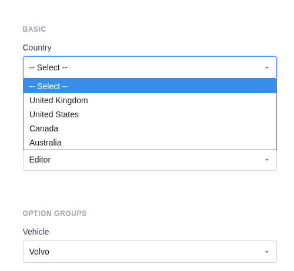
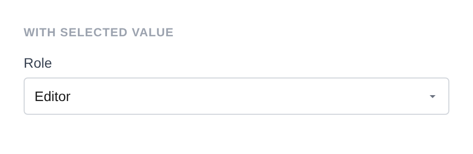
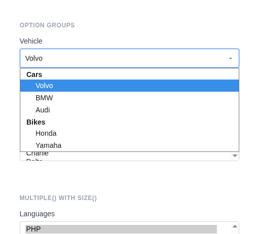
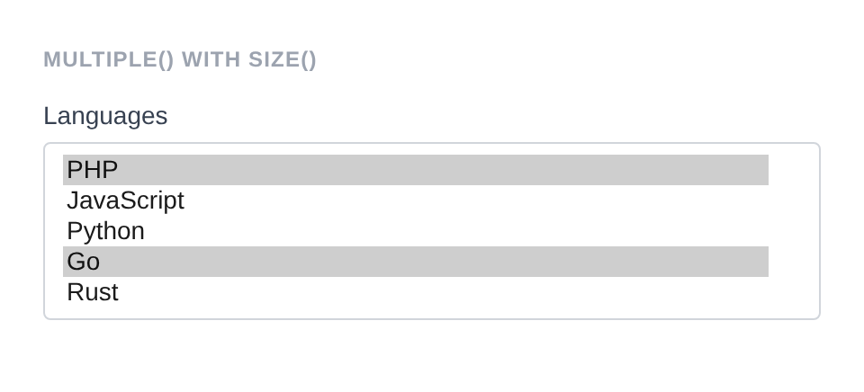
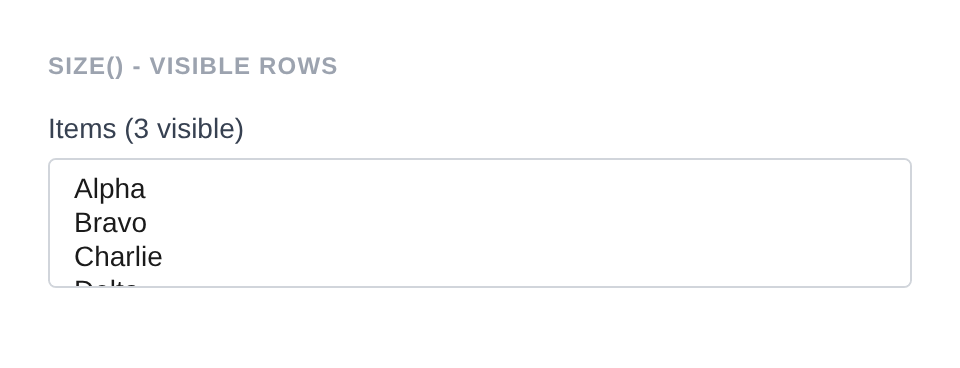
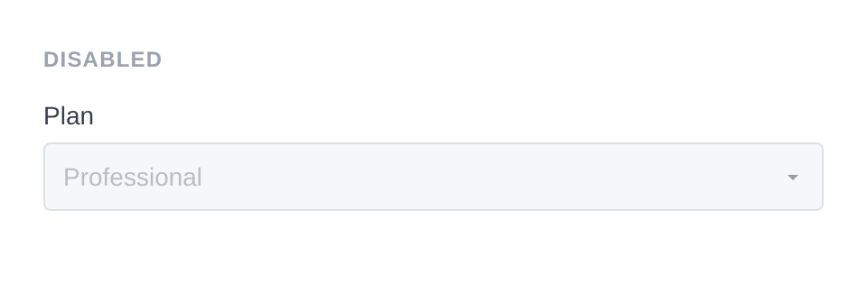
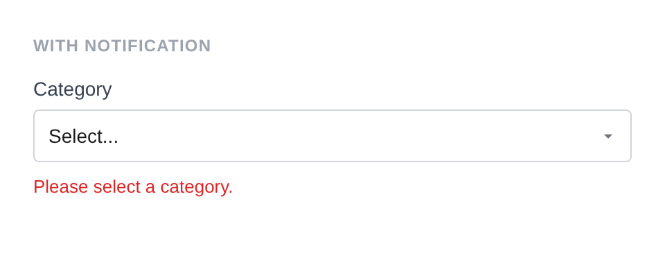

# Select

Renders a `<select>` dropdown with options and optional optgroups.

**Class:** `PinkCrab\Form_Components\Element\Field\Select`  
**Make helper:** `Make::select( 'name', fn(Select $f) => $f->... )`

---

## Basic Usage

```php
$this->component( new Select_Component(
		Select::make( 'country' )
			->label( 'Country' )
			->options( array(
				''   => '-- Select --',
				'uk' => 'United Kingdom',
				'us' => 'United States',
				'ca' => 'Canada',
				'au' => 'Australia',
			) )
	) )
```



<details markdown="1">
<summary>Generated HTML</summary>

```html
<div id="form-field_country" class="pc-form__element pc-form__element--select">
    <label for="country" class="pc-form__label">Country</label>
        <select name="country" class="form-control select pc-form__element__field pc-form__element__field--select" >
            <option value="" >-- Select --</option>
            <option value="uk" >United Kingdom</option>
            <option value="us" >United States</option>
            <option value="ca" >Canada</option>
            <option value="au" >Australia</option>
        </select>
    </div>
```
</details>

---

## Using Make Helper

```php
use PinkCrab\Form_Components\Util\Make;

$this->component( Make::select( 'country', fn( $f ) => $f
    ->label( 'Country' )
    ->options( array(
        'gb' => 'United Kingdom',
        'us' => 'United States',
        'de' => 'Germany',
    ) )
) );
```

---

## Methods

### label( string $label )

Sets the visible label text above the select.

```php
Select::make( 'country' )->label( 'Country' )
```

<details markdown="1">
<summary>Generated HTML</summary>

```html
<div id="form-field_country" class="pc-form__element pc-form__element--select">
    <label for="country" class="pc-form__label">Country</label>
    <select name="country"
        class="form-control select pc-form__element__field pc-form__element__field--select"
    >
    </select>
</div>
```
</details>

### options( array $options )

Sets the available options as a `value => label` associative array.

```php
Select::make( 'colour' )
    ->label( 'Colour' )
    ->options( array(
        'red'   => 'Red',
        'green' => 'Green',
        'blue'  => 'Blue',
    ) )
```

<details markdown="1">
<summary>Generated HTML</summary>

```html
<div id="form-field_colour" class="pc-form__element pc-form__element--select">
    <label for="colour" class="pc-form__label">Colour</label>
    <select name="colour"
        class="form-control select pc-form__element__field pc-form__element__field--select"
    >
        <option value="red">Red</option>
        <option value="green">Green</option>
        <option value="blue">Blue</option>
    </select>
</div>
```
</details>

### set_existing( mixed $value )

Sets the current value. Runs through the sanitizer if one is set. When `multiple()` is enabled, accepts an array of values.

```php
Select::make( 'role' )
			->label( 'Role' )
			->options( array(
				'admin'      => 'Administrator',
				'editor'     => 'Editor',
				'author'     => 'Author',
				'subscriber' => 'Subscriber',
			) )
			->set_existing( 'editor' )
```



<details markdown="1">
<summary>Generated HTML</summary>

```html
<div id="form-field_role" class="pc-form__element pc-form__element--select">
    <label for="role" class="pc-form__label">Role</label>
        <select name="role" class="form-control select pc-form__element__field pc-form__element__field--select" >
            <option value="admin" >Administrator</option>
            <option value="editor" selected >Editor</option>
            <option value="author" >Author</option>
            <option value="subscriber" >Subscriber</option>
        </select>
    </div>
```
</details>

**Multiple select with array:**

```php
Select::make( 'colours' )
    ->label( 'Colours' )
    ->options( array( 'red' => 'Red', 'green' => 'Green', 'blue' => 'Blue' ) )
    ->multiple()
    ->set_existing( array( 'red', 'blue' ) )
```

<details markdown="1">
<summary>Generated HTML</summary>

```html
<div id="form-field_colours" class="pc-form__element pc-form__element--select">
    <label for="colours" class="pc-form__label">Colours</label>
    <select name="colours[]"
        class="form-control select pc-form__element__field pc-form__element__field--select"
        multiple=""
    >
        <option value="red" selected>Red</option>
        <option value="green">Green</option>
        <option value="blue" selected>Blue</option>
    </select>
</div>
```
</details>

### is_selected( string $option_value )

Check if a given option value is currently selected. Works with both single and multiple selects.

```php
$select = Select::make( 'colour' )
    ->options( array( 'red' => 'Red', 'green' => 'Green' ) )
    ->set_existing( 'red' );

$select->is_selected( 'red' );   // true
$select->is_selected( 'green' ); // false

// With multiple values
$multi = Select::make( 'colours' )
    ->options( array( 'red' => 'Red', 'green' => 'Green', 'blue' => 'Blue' ) )
    ->multiple()
    ->set_existing( array( 'red', 'blue' ) );

$multi->is_selected( 'red' );   // true
$multi->is_selected( 'green' ); // false
$multi->is_selected( 'blue' );  // true
```

### optgroup( string $label, array $options )

Adds an optgroup with its own set of options. Can be called multiple times to add several groups.

```php
Select::make( 'vehicle' )
			->label( 'Vehicle' )
			->optgroup( 'Cars', array(
				'volvo' => 'Volvo',
				'bmw'   => 'BMW',
				'audi'  => 'Audi',
			) )
			->optgroup( 'Bikes', array(
				'honda'  => 'Honda',
				'yamaha' => 'Yamaha',
			) )
```



<details markdown="1">
<summary>Generated HTML</summary>

```html
<div id="form-field_vehicle" class="pc-form__element pc-form__element--select">
    <label for="vehicle" class="pc-form__label">Vehicle</label>
        <select name="vehicle" class="form-control select pc-form__element__field pc-form__element__field--select" >
            <optgroup label="Cars">
                <option value="volvo" >Volvo</option>
                <option value="bmw" >BMW</option>
                <option value="audi" >Audi</option>
            </optgroup>
            <optgroup label="Bikes">
                <option value="honda" >Honda</option>
                <option value="yamaha" >Yamaha</option>
            </optgroup>
        </select>
    </div>
```
</details>

### multiple( bool $multiple = true )

Enables multi-select. When enabled, the `name` attribute gets a `[]` suffix and `set_existing()` accepts an array of values.

```php
Select::make( 'languages' )
			->label( 'Languages' )
			->options( array(
				'php'    => 'PHP',
				'js'     => 'JavaScript',
				'python' => 'Python',
				'go'     => 'Go',
				'rust'   => 'Rust',
			) )
			->multiple( true )
			->size( 5 )
			->set_existing( array( 'php', 'go' ) )
```



<details markdown="1">
<summary>Generated HTML</summary>

```html
<div id="form-field_languages" class="pc-form__element pc-form__element--select">
    <label for="languages" class="pc-form__label">Languages</label>
        <select name="languages[]" class="form-control select pc-form__element__field pc-form__element__field--select" multiple="" size="5" >
            <option value="php" selected >PHP</option>
            <option value="js" >JavaScript</option>
            <option value="python" >Python</option>
            <option value="go" selected >Go</option>
            <option value="rust" >Rust</option>
        </select>
    </div>
```
</details>

### size( int $size )

Sets the number of visible rows in the dropdown (useful with `multiple()`).

```php
Select::make( 'visible_list' )
			->label( 'Items (3 visible)' )
			->options( array(
				'a' => 'Alpha',
				'b' => 'Bravo',
				'c' => 'Charlie',
				'd' => 'Delta',
				'e' => 'Echo',
			) )
			->size( 3 )
```



<details markdown="1">
<summary>Generated HTML</summary>

```html
<div id="form-field_visible_list" class="pc-form__element pc-form__element--select">
    <label for="visible_list" class="pc-form__label">Items (3 visible)</label>
        <select name="visible_list" class="form-control select pc-form__element__field pc-form__element__field--select" size="3" >
            <option value="a" >Alpha</option>
            <option value="b" >Bravo</option>
            <option value="c" >Charlie</option>
            <option value="d" >Delta</option>
            <option value="e" >Echo</option>
        </select>
    </div>
```
</details>

### required( bool $required = true )

Marks the field as required. The label displays a `*` indicator via CSS.

```php
Select::make( 'country' )
    ->label( 'Country' )
    ->options( array( 'gb' => 'United Kingdom', 'us' => 'United States' ) )
    ->required( true )
```

<details markdown="1">
<summary>Generated HTML</summary>

```html
<div id="form-field_country" class="pc-form__element pc-form__element--select">
    <label for="country" class="pc-form__label">Country</label>
    <select name="country"
        class="form-control select pc-form__element__field pc-form__element__field--select"
        required=""
    >
        <option value="gb">United Kingdom</option>
        <option value="us">United States</option>
    </select>
</div>
```
</details>

### disabled( bool $disabled = true )

Disables the select. Value is visible but cannot be changed or submitted.

```php
Select::make( 'locked_plan' )
			->label( 'Plan' )
			->options( array( 'pro' => 'Professional' ) )
			->set_existing( 'pro' )
			->disabled( true )
```



<details markdown="1">
<summary>Generated HTML</summary>

```html
<div id="form-field_locked_plan" class="pc-form__element pc-form__element--select">
    <label for="locked_plan" class="pc-form__label">Plan</label>
        <select name="locked_plan" class="form-control select pc-form__element__field pc-form__element__field--select" disabled="" >
            <option value="pro" selected >Professional</option>
        </select>
    </div>
```
</details>

### autocomplete( string $value )

HTML `autocomplete` attribute to help browsers autofill.

```php
Select::make( 'country' )
    ->label( 'Country' )
    ->options( array( 'gb' => 'United Kingdom', 'us' => 'United States' ) )
    ->autocomplete( 'country-name' )
```

<details markdown="1">
<summary>Generated HTML</summary>

```html
<div id="form-field_country" class="pc-form__element pc-form__element--select">
    <label for="country" class="pc-form__label">Country</label>
    <select name="country"
        class="form-control select pc-form__element__field pc-form__element__field--select"
        autocomplete="country-name"
    >
        <option value="gb">United Kingdom</option>
        <option value="us">United States</option>
    </select>
</div>
```
</details>

Common values:

| Value | Description |
|-------|-------------|
| `off` | Disable autocomplete |
| `on` | Enable autocomplete (browser decides) |
| `name` | Full name |
| `given-name` | First name |
| `family-name` | Last name |
| `email` | Email address |
| `username` | Username |
| `new-password` | New password (password managers) |
| `current-password` | Current password |
| `organization` | Company/organisation name |
| `street-address` | Street address |
| `address-line1` | Address line 1 |
| `address-line2` | Address line 2 |
| `address-level2` | City |
| `address-level1` | State/province/region |
| `country` | Country code |
| `country-name` | Country name |
| `postal-code` | Postcode / ZIP |
| `tel` | Full phone number |
| `tel-national` | Phone without country code |
| `url` | URL |
| `bday` | Full date of birth |
| `bday-day` | Day of birth |
| `bday-month` | Month of birth |
| `bday-year` | Year of birth |
| `sex` | Gender |
| `cc-name` | Cardholder name |
| `cc-number` | Card number |
| `cc-exp` | Card expiry |
| `cc-csc` | Card security code |


### error_notification( string $message )

Displays an error message below the field.

```php
Select::make( 'bad_select' )
			->label( 'Category' )
			->options( array( '' => 'Select...', 'bug' => 'Bug', 'feature' => 'Feature' ) )
			->error_notification( 'Please select a category.' )
```



<details markdown="1">
<summary>Generated HTML</summary>

```html
<div id="form-field_bad_select" class="pc-form__element pc-form__element--select pc-form__element pc-form__element--select notification-error">
    <label for="bad_select" class="pc-form__label">Category</label>
        <select name="bad_select" class="form-control select pc-form__element__field pc-form__element__field--select pc-form__element__field pc-form__element__field--select notification-error" >
            <option value="" >Select...</option>
            <option value="bug" >Bug</option>
            <option value="feature" >Feature</option>
        </select>
        <div class="pc-form__notification pc-form__notification--error">Please select a category.</div>
        </div>
```
</details>

### warning_notification( string $message )

Displays a warning message below the field.

```php
Select::make( 'country' )
    ->label( 'Country' )
    ->options( array( 'gb' => 'United Kingdom', 'us' => 'United States' ) )
    ->warning_notification( 'This cannot be changed later.' )
```

<details markdown="1">
<summary>Generated HTML</summary>

```html
<div id="form-field_country" class="pc-form__element pc-form__element--select notification-warning">
    <label for="country" class="pc-form__label">Country</label>
    <select name="country"
        class="form-control select pc-form__element__field pc-form__element__field--select notification-warning"
    >
        <option value="gb">United Kingdom</option>
        <option value="us">United States</option>
    </select>
    <div class="pc-form__notification pc-form__notification--warning">This cannot be changed later.</div>
</div>
```
</details>

### success_notification( string $message )

Displays a success message below the field.

```php
Select::make( 'country' )
    ->label( 'Country' )
    ->options( array( 'gb' => 'United Kingdom', 'us' => 'United States' ) )
    ->set_existing( 'gb' )
    ->success_notification( 'Country confirmed.' )
```

<details markdown="1">
<summary>Generated HTML</summary>

```html
<div id="form-field_country" class="pc-form__element pc-form__element--select notification-success">
    <label for="country" class="pc-form__label">Country</label>
    <select name="country"
        class="form-control select pc-form__element__field pc-form__element__field--select notification-success"
    >
        <option value="gb" selected>United Kingdom</option>
        <option value="us">United States</option>
    </select>
    <div class="pc-form__notification pc-form__notification--success">Country confirmed.</div>
</div>
```
</details>

### info_notification( string $message )

Displays an info message below the field.

```php
Select::make( 'country' )
    ->label( 'Country' )
    ->options( array( 'gb' => 'United Kingdom', 'us' => 'United States' ) )
    ->info_notification( 'Used for shipping calculations.' )
```

<details markdown="1">
<summary>Generated HTML</summary>

```html
<div id="form-field_country" class="pc-form__element pc-form__element--select notification-info">
    <label for="country" class="pc-form__label">Country</label>
    <select name="country"
        class="form-control select pc-form__element__field pc-form__element__field--select notification-info"
    >
        <option value="gb">United Kingdom</option>
        <option value="us">United States</option>
    </select>
    <div class="pc-form__notification pc-form__notification--info">Used for shipping calculations.</div>
</div>
```
</details>

### pre_description( string $description )

Sets a description or hint displayed before the select.

```php
Select::make( 'country' )
    ->label( 'Country' )
    ->pre_description( 'Where are you based?' )
```

### post_description( string $description )

Sets a description or help text displayed after the select, before any notification.

```php
Select::make( 'country' )
    ->label( 'Country' )
    ->post_description( 'Used for shipping calculations.' )
```

### before( string $html ) / after( string $html )

HTML content before or after the select within the wrapper.

```php
Select::make( 'country' )
    ->label( 'Country' )
    ->options( array( 'gb' => 'United Kingdom', 'us' => 'United States' ) )
    ->before( '<span>Choose your country</span>' )
    ->after( '<span>Used for tax calculations</span>' )
```

<details markdown="1">
<summary>Generated HTML</summary>

```html
<div id="form-field_country" class="pc-form__element pc-form__element--select">
    <span>Choose your country</span>
    <label for="country" class="pc-form__label">Country</label>
    <select name="country"
        class="form-control select pc-form__element__field pc-form__element__field--select"
    >
        <option value="gb">United Kingdom</option>
        <option value="us">United States</option>
    </select>
    <span>Used for tax calculations</span>
</div>
```
</details>

### id( string $id )

Sets a custom HTML `id` on the select element.

```php
Select::make( 'country' )
    ->id( 'my-custom-select-id' )
```

<details markdown="1">
<summary>Generated HTML</summary>

```html
<div id="form-field_country" class="pc-form__element pc-form__element--select">
    <select name="country" id="my-custom-select-id"
        class="form-control select pc-form__element__field pc-form__element__field--select"
    >
    </select>
</div>
```
</details>

### wrapper_id( string $id )

Sets a custom HTML `id` on the wrapper div.

```php
Select::make( 'country' )
    ->wrapper_id( 'my-custom-wrapper-id' )
```

<details markdown="1">
<summary>Generated HTML</summary>

```html
<div id="my-custom-wrapper-id" class="pc-form__element pc-form__element--select">
    <select name="country"
        class="form-control select pc-form__element__field pc-form__element__field--select"
    >
    </select>
</div>
```
</details>

### data( string $key, string $value )

Adds a `data-*` attribute to the select element.

```php
Select::make( 'country' )
    ->data( 'region', 'europe' )
```

<details markdown="1">
<summary>Generated HTML</summary>

```html
<div id="form-field_country" class="pc-form__element pc-form__element--select">
    <select name="country"
        class="form-control select pc-form__element__field pc-form__element__field--select"
        data-region="europe"
    >
    </select>
</div>
```
</details>

### wrapper_data( string $key, string $value )

Adds a `data-*` attribute to the wrapper div.

```php
Select::make( 'country' )
    ->wrapper_data( 'section', 'address' )
```

<details markdown="1">
<summary>Generated HTML</summary>

```html
<div id="form-field_country" class="pc-form__element pc-form__element--select" data-section="address">
    <select name="country"
        class="form-control select pc-form__element__field pc-form__element__field--select"
    >
    </select>
</div>
```
</details>

### add_class( string $class )

Adds a CSS class to the select element.

```php
Select::make( 'country' )
    ->add_class( 'my-select-class' )
```

<details markdown="1">
<summary>Generated HTML</summary>

```html
<div id="form-field_country" class="pc-form__element pc-form__element--select">
    <select name="country"
        class="form-control select pc-form__element__field pc-form__element__field--select my-select-class"
    >
    </select>
</div>
```
</details>

### add_wrapper_class( string $class )

Adds a CSS class to the wrapper div.

```php
Select::make( 'country' )
    ->add_wrapper_class( 'my-wrapper-class' )
```

<details markdown="1">
<summary>Generated HTML</summary>

```html
<div id="form-field_country" class="pc-form__element pc-form__element--select my-wrapper-class">
    <select name="country"
        class="form-control select pc-form__element__field pc-form__element__field--select"
    >
    </select>
</div>
```
</details>

### show_wrapper( bool $show = true )

Controls whether the wrapping `<div>` is rendered.

```php
Select::make( 'country' )
    ->options( array( 'gb' => 'United Kingdom', 'us' => 'United States' ) )
    ->show_wrapper( false )
```

<details markdown="1">
<summary>Generated HTML</summary>

```html
<select name="country"
    class="form-control select pc-form__element__field pc-form__element__field--select"
>
    <option value="gb">United Kingdom</option>
    <option value="us">United States</option>
</select>
```
</details>

### tabindex( int $index )

Sets the tab order of the select.

```php
Select::make( 'country' )
    ->tabindex( 5 )
```

<details markdown="1">
<summary>Generated HTML</summary>

```html
<div id="form-field_country" class="pc-form__element pc-form__element--select">
    <select name="country"
        class="form-control select pc-form__element__field pc-form__element__field--select"
        tabindex="5"
    >
    </select>
</div>
```
</details>

### attribute( string $key, mixed $value )

Sets an arbitrary HTML attribute on the select element.

```php
Select::make( 'country' )
    ->attribute( 'aria-label', 'Select your country' )
```

<details markdown="1">
<summary>Generated HTML</summary>

```html
<div id="form-field_country" class="pc-form__element pc-form__element--select">
    <select name="country"
        class="form-control select pc-form__element__field pc-form__element__field--select"
        aria-label="Select your country"
    >
    </select>
</div>
```
</details>

### attributes( array $attrs )

Sets multiple arbitrary HTML attributes at once.

```php
Select::make( 'country' )
    ->attributes( array(
        'title'    => 'Country selector',
        'tabindex' => '2',
    ) )
```

<details markdown="1">
<summary>Generated HTML</summary>

```html
<div id="form-field_country" class="pc-form__element pc-form__element--select">
    <select name="country"
        class="form-control select pc-form__element__field pc-form__element__field--select"
        title="Country selector" tabindex="2"
    >
    </select>
</div>
```
</details>

### sanitizer( callable $fn )

Sets a sanitization callback applied when `set_existing()` is called. Defaults to `Sanitize::TEXT`.

**Using a built-in helper:**

```php
use PinkCrab\Form_Components\Util\Sanitize;

Select::make( 'country' )
    ->sanitizer( Sanitize::TEXT )
    ->set_existing( $user_input )
```

**Using a custom callable:**

```php
Select::make( 'country' )
    ->sanitizer( function( $value ) {
        return strtolower( trim( $value ) );
    } )
    ->set_existing( ' GB ' ) // Stores: "gb"
```

**Built-in sanitizer helpers:**

| Constant | Function | Description |
|----------|----------|-------------|
| `Sanitize::TEXT` | `sanitize_text_field()` | Strips tags, removes extra whitespace |
| `Sanitize::TEXTAREA` | `sanitize_textarea_field()` | Like TEXT but preserves line breaks |
| `Sanitize::URL` | `esc_url_raw()` | Sanitises a URL for database storage |
| `Sanitize::EMAIL` | `sanitize_email()` | Strips invalid email characters |
| `Sanitize::HEX_COLOR` | `sanitize_hex_color()` | Validates hex colour (#fff or #ffffff) |
| `Sanitize::NUMBER` | Custom numeric parser | Parses to int or float |
| `Sanitize::NOOP` | Pass-through | No sanitization applied |

### validator( Validator $validator )

Sets a Respect\Validation validator for server-side validation.

```php
use Respect\Validation\Validator as v;

Select::make( 'country' )
    ->validator( v::in( array( 'gb', 'us', 'de' ) ) )
```

### style( Style $style )

Sets a custom style for the field, overriding the default.

```php
use PinkCrab\Form_Components\Style\Default_Style;

Select::make( 'country' )
    ->style( new Default_Style() )
```

---

## Traits

| Trait | Methods |
|-------|---------|
| Label | `label()`, `get_label()`, `has_label()` |
| Single_Value | `value()`, `get_value()`, `has_value()` |
| Options | `options()`, `get_options()` |
| Notification | `error_notification()`, `warning_notification()`, `success_notification()`, `info_notification()` |
| Disabled | `disabled()`, `is_disabled()` |
| Required | `required()`, `is_required()` |
| Multiple | `multiple()`, `is_multiple()` |
| Autocomplete | `autocomplete()`, `get_autocomplete()`, `has_autocomplete()` |
| Size | `size()`, `get_size()`, `has_size()` |
| Description | `pre_description()`, `post_description()`, `get_pre_description()`, `get_post_description()`, `has_pre_description()`, `has_post_description()` |
