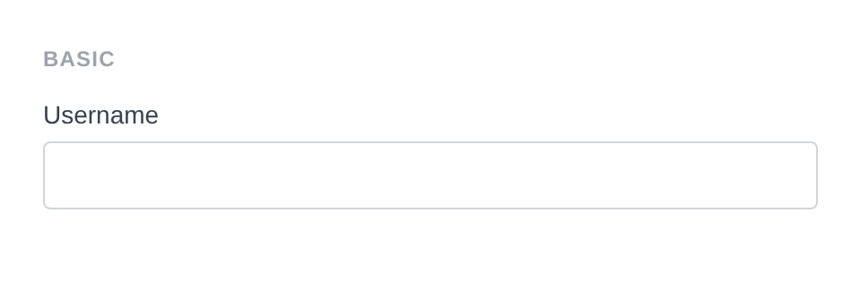
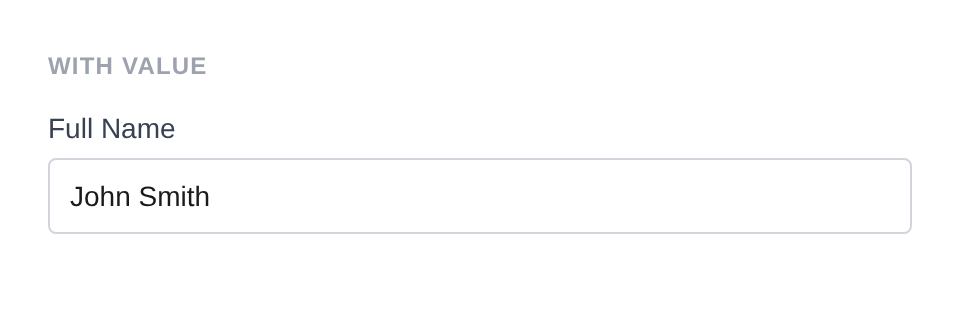
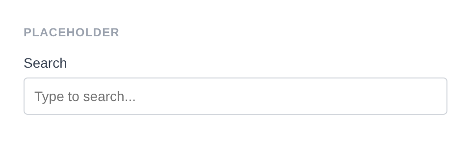
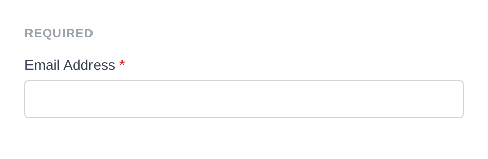
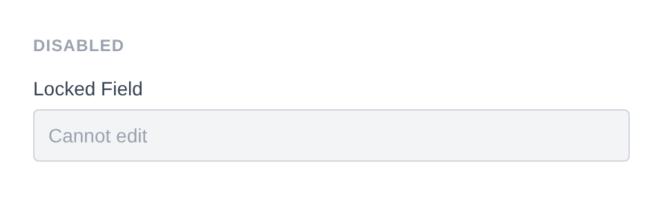
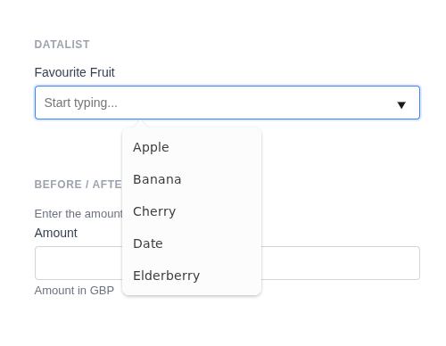
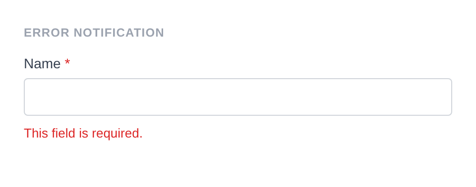
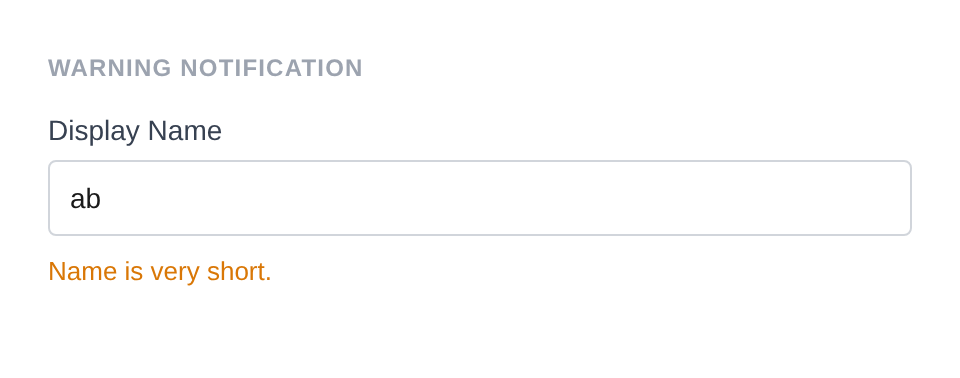
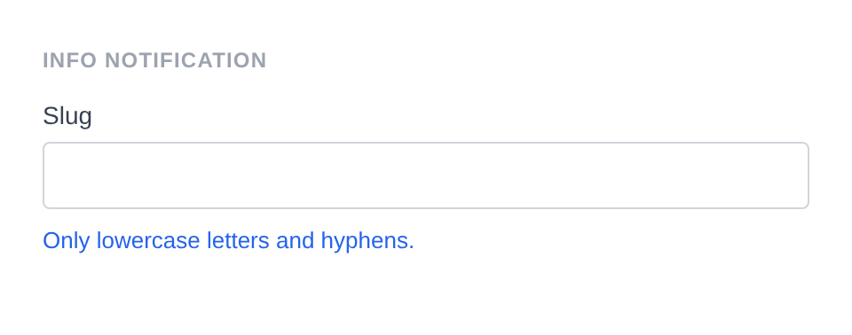
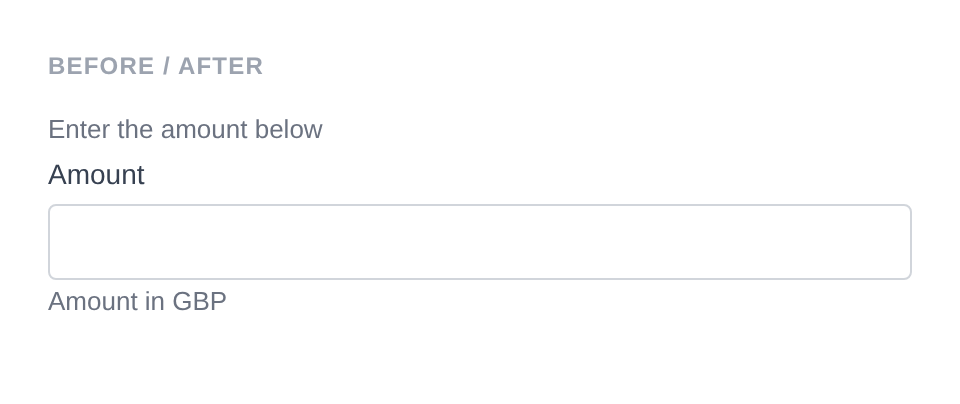

# Text Input

Renders `<input type="text">`. The most common input type with the widest range of traits.

**Class:** `PinkCrab\Form_Components\Element\Field\Input\Text`  
**Make helper:** `Make::text( 'name', fn(Text $f) => $f->... )`

---

## Basic Usage

```php
$this->component( new Input_Component(
		Text::make( 'username' )
			->label( 'Username' )
	) )
```



<details>
<summary>Generated HTML</summary>

```html
<div id="form-field_username" class="pc-form__element pc-form__element--text_input">
    <label for="username" class="pc-form__label">Username</label>
        <input type="text" name="username" class="form-control text-input pc-form__element__field pc-form__element__field--text_input" list="_username__list" />
    </div>
```
</details>

---

## Using Make Helper

```php
use PinkCrab\Form_Components\Util\Make;

$this->component( Make::text( 'username', fn( $f ) => $f
    ->label( 'Username' )
    ->required( true )
) );
```

---

## Methods

### label( string $label )

Sets the visible label text above the input.

```php
Text::make( 'username' )->label( 'Username' )
```

### set_existing( mixed $value )

Sets the current value. Runs through the sanitizer if one is set.

```php
Text::make( 'fullname' )
			->label( 'Full Name' )
			->set_existing( 'John Smith' )
```



<details>
<summary>Generated HTML</summary>

```html
<div id="form-field_fullname" class="pc-form__element pc-form__element--text_input">
    <label for="fullname" class="pc-form__label">Full Name</label>
        <input type="text" name="fullname" class="form-control text-input pc-form__element__field pc-form__element__field--text_input" list="_fullname__list" value="John Smith" />
    </div>
```
</details>

### placeholder( string $text )

Placeholder text shown when the field is empty.

```php
Text::make( 'search_query' )
			->label( 'Search' )
			->placeholder( 'Type to search...' )
```



<details>
<summary>Generated HTML</summary>

```html
<div id="form-field_search_query" class="pc-form__element pc-form__element--text_input">
    <label for="search_query" class="pc-form__label">Search</label>
        <input type="text" name="search_query" class="form-control text-input pc-form__element__field pc-form__element__field--text_input" list="_search_query__list" placeholder="Type to search..." />
    </div>
```
</details>

### required( bool $required = true )

Marks the field as required. The label displays a `*` indicator via CSS.

```php
Text::make( 'email_addr' )
			->label( 'Email Address' )
			->required( true )
```



<details>
<summary>Generated HTML</summary>

```html
<div id="form-field_email_addr" class="pc-form__element pc-form__element--text_input">
    <label for="email_addr" class="pc-form__label">Email Address</label>
        <input type="text" name="email_addr" class="form-control text-input pc-form__element__field pc-form__element__field--text_input" list="_email_addr__list" required="" />
    </div>
```
</details>

### disabled( bool $disabled = true )

Disables the input. Value is visible but cannot be changed or submitted.

```php
Text::make( 'locked_field' )
			->label( 'Locked Field' )
			->set_existing( 'Cannot edit' )
			->disabled( true )
```



<details>
<summary>Generated HTML</summary>

```html
<div id="form-field_locked_field" class="pc-form__element pc-form__element--text_input">
    <label for="locked_field" class="pc-form__label">Locked Field</label>
        <input type="text" name="locked_field" class="form-control text-input pc-form__element__field pc-form__element__field--text_input" list="_locked_field__list" disabled="" value="Cannot edit" />
    </div>
```
</details>

### readonly( bool $readonly = true )

Makes the field read-only. Value can be selected and copied but not changed.

```php
Text::make( 'readonly_field' )
    ->label( 'Read Only' )
    ->set_existing( 'Read only value' )
    ->readonly( true )
```

<details>
<summary>Generated HTML</summary>

```html
<div id="form-field_readonly_field" class="pc-form__element pc-form__element--text_input">
    <label for="readonly_field" class="pc-form__label">Read Only</label>
    <input type="text" name="readonly_field"
        class="form-control text-input pc-form__element__field pc-form__element__field--text_input"
        readonly="" value="Read only value"
    />
</div>
```
</details>

### pattern( string $regex )

HTML5 validation pattern (regex) the value must match.

```php
Text::make( 'postcode' )
    ->label( 'Postcode' )
    ->pattern( '[A-Z]{1,2}[0-9][0-9A-Z]?\s?[0-9][A-Z]{2}' )
    ->placeholder( 'e.g. SW1A 1AA' )
```

<details>
<summary>Generated HTML</summary>

```html
<div id="form-field_postcode" class="pc-form__element pc-form__element--text_input">
    <label for="postcode" class="pc-form__label">Postcode</label>
    <input type="text" name="postcode"
        class="form-control text-input pc-form__element__field pc-form__element__field--text_input"
        pattern="[A-Z]{1,2}[0-9][0-9A-Z]?\s?[0-9][A-Z]{2}" placeholder="e.g. SW1A 1AA"
    />
</div>
```
</details>

### minlength( int $min ) / maxlength( int $max )

Minimum and maximum character length constraints.

```php
Text::make( 'nickname' )
    ->label( 'Nickname' )
    ->minlength( 3 )
    ->maxlength( 20 )
```

<details>
<summary>Generated HTML</summary>

```html
<div id="form-field_nickname" class="pc-form__element pc-form__element--text_input">
    <label for="nickname" class="pc-form__label">Nickname</label>
    <input type="text" name="nickname"
        class="form-control text-input pc-form__element__field pc-form__element__field--text_input"
        minlength="3" maxlength="20"
    />
</div>
```
</details>

### size( int $size )

Visible width of the input in characters.

```php
Text::make( 'code' )
    ->label( 'Short Code' )
    ->size( 10 )
```

<details>
<summary>Generated HTML</summary>

```html
<div id="form-field_code" class="pc-form__element pc-form__element--text_input">
    <label for="code" class="pc-form__label">Short Code</label>
    <input type="text" name="code"
        class="form-control text-input pc-form__element__field pc-form__element__field--text_input"
        size="10"
    />
</div>
```
</details>

### autocomplete( string $value )

HTML `autocomplete` attribute to help browsers autofill.

```php
Text::make( 'given_name' )
    ->label( 'First Name' )
    ->autocomplete( 'given-name' )
```

<details>
<summary>Generated HTML</summary>

```html
<div id="form-field_given_name" class="pc-form__element pc-form__element--text_input">
    <label for="given_name" class="pc-form__label">First Name</label>
    <input type="text" name="given_name"
        class="form-control text-input pc-form__element__field pc-form__element__field--text_input"
        autocomplete="given-name"
    />
</div>
```
</details>

Common values:

| Value | Description |
|-------|-------------|
| `off` | Disable autocomplete |
| `on` | Enable autocomplete (browser decides) |
| `name` | Full name |
| `given-name` | First name |
| `family-name` | Last name |
| `email` | Email address |
| `username` | Username |
| `new-password` | New password (password managers) |
| `current-password` | Current password |
| `organization` | Company/organisation name |
| `street-address` | Street address |
| `address-line1` | Address line 1 |
| `address-line2` | Address line 2 |
| `address-level2` | City |
| `address-level1` | State/province/region |
| `country` | Country code |
| `country-name` | Country name |
| `postal-code` | Postcode / ZIP |
| `tel` | Full phone number |
| `tel-national` | Phone without country code |
| `url` | URL |
| `bday` | Full date of birth |
| `bday-day` | Day of birth |
| `bday-month` | Month of birth |
| `bday-year` | Year of birth |
| `sex` | Gender |
| `cc-name` | Cardholder name |
| `cc-number` | Card number |
| `cc-exp` | Card expiry |
| `cc-csc` | Card security code |

### inputmode( string $mode )

Hints to mobile browsers which keyboard to display.

```php
Text::make( 'pin_code' )
    ->label( 'PIN Code' )
    ->inputmode( 'numeric' )
```

<details>
<summary>Generated HTML</summary>

```html
<div id="form-field_pin_code" class="pc-form__element pc-form__element--text_input">
    <label for="pin_code" class="pc-form__label">PIN Code</label>
    <input type="text" name="pin_code"
        class="form-control text-input pc-form__element__field pc-form__element__field--text_input"
        inputmode="numeric"
    />
</div>
```
</details>

Valid values:

| Value | Keyboard |
|-------|----------|
| `none` | No virtual keyboard |
| `text` | Standard text keyboard (default) |
| `decimal` | Numbers with decimal point |
| `numeric` | Numbers only |
| `tel` | Telephone keypad |
| `search` | Search-optimised keyboard |
| `email` | Email-optimised keyboard |
| `url` | URL-optimised keyboard |

### spellcheck( string $value )

Enables or disables browser spell checking.

```php
Text::make( 'code_field' )
    ->label( 'Code' )
    ->spellcheck( 'false' )
```

<details>
<summary>Generated HTML</summary>

```html
<div id="form-field_code_field" class="pc-form__element pc-form__element--text_input">
    <label for="code_field" class="pc-form__label">Code</label>
    <input type="text" name="code_field"
        class="form-control text-input pc-form__element__field pc-form__element__field--text_input"
        spellcheck="false"
    />
</div>
```
</details>

### datalist_items( array $items )

Autocomplete suggestions via an HTML `<datalist>` element.

```php
Text::make( 'fruit' )
			->label( 'Favourite Fruit' )
			->datalist_items( array( 'Apple', 'Banana', 'Cherry', 'Date', 'Elderberry' ) )
			->placeholder( 'Start typing...' )
```



<details>
<summary>Generated HTML</summary>

```html
<div id="form-field_fruit" class="pc-form__element pc-form__element--text_input">
    <label for="fruit" class="pc-form__label">Favourite Fruit</label>
        <input type="text" name="fruit" class="form-control text-input pc-form__element__field pc-form__element__field--text_input" list="_fruit__list" placeholder="Start typing..." />
        <datalist id="_fruit__list">
            <option value="Apple">
        </option>
        <option value="Banana">
    </option>
    <option value="Cherry">
</option>
<option value="Date">
</option>
<option value="Elderberry">
</option>
</datalist>
</div>
```
</details>

### error_notification( string $message )

Displays an error message below the field.

```php
Text::make( 'name_error' )
			->label( 'Name' )
			->required( true )
			->error_notification( 'This field is required.' )
```



<details>
<summary>Generated HTML</summary>

```html
<div id="form-field_name_error" class="pc-form__element pc-form__element--text_input pc-form__element pc-form__element--text_input notification-error">
    <label for="name_error" class="pc-form__label">Name</label>
        <input type="text" name="name_error" class="form-control text-input pc-form__element__field pc-form__element__field--text_input pc-form__element__field pc-form__element__field--text_input notification-error" list="_name_error__list" required="" />
        <div class="pc-form__notification pc-form__notification--error">This field is required.</div>
        </div>
```
</details>

### warning_notification( string $message )

Displays a warning message below the field.

```php
Text::make( 'name_warning' )
			->label( 'Display Name' )
			->set_existing( 'ab' )
			->warning_notification( 'Name is very short.' )
```



<details>
<summary>Generated HTML</summary>

```html
<div id="form-field_name_warning" class="pc-form__element pc-form__element--text_input pc-form__element pc-form__element--text_input notification-warning">
    <label for="name_warning" class="pc-form__label">Display Name</label>
        <input type="text" name="name_warning" class="form-control text-input pc-form__element__field pc-form__element__field--text_input pc-form__element__field pc-form__element__field--text_input notification-warning" list="_name_warning__list" value="ab" />
        <div class="pc-form__notification pc-form__notification--warning">Name is very short.</div>
        </div>
```
</details>

### success_notification( string $message )

Displays a success message below the field.

```php
Text::make( 'name_success' )
			->label( 'Username' )
			->set_existing( 'johndoe' )
			->success_notification( 'Username is available!' )
```


<details>
<summary>Generated HTML</summary>

```html
<div id="form-field_name_success" class="pc-form__element pc-form__element--text_input pc-form__element pc-form__element--text_input notification-success">
    <label for="name_success" class="pc-form__label">Username</label>
        <input type="text" name="name_success" class="form-control text-input pc-form__element__field pc-form__element__field--text_input pc-form__element__field pc-form__element__field--text_input notification-success" list="_name_success__list" value="johndoe" />
        <div class="pc-form__notification pc-form__notification--success">Username is available!</div>
        </div>
```
</details>

### info_notification( string $message )

Displays an info message below the field.

```php
Text::make( 'name_info' )
			->label( 'Slug' )
			->info_notification( 'Only lowercase letters and hyphens.' )
```



<details>
<summary>Generated HTML</summary>

```html
<div id="form-field_name_info" class="pc-form__element pc-form__element--text_input pc-form__element pc-form__element--text_input notification-info">
    <label for="name_info" class="pc-form__label">Slug</label>
        <input type="text" name="name_info" class="form-control text-input pc-form__element__field pc-form__element__field--text_input pc-form__element__field pc-form__element__field--text_input notification-info" list="_name_info__list" />
        <div class="pc-form__notification pc-form__notification--info">Only lowercase letters and hyphens.</div>
        </div>
```
</details>

### pre_description( string $description )

Sets a description or hint displayed before the input.

```php
Text::make( 'username' )
    ->label( 'Username' )
    ->pre_description( 'Choose a unique username.' )
```

### post_description( string $description )

Sets a description or help text displayed after the input, before any notification.

```php
Text::make( 'username' )
    ->label( 'Username' )
    ->post_description( 'Must be between 3 and 20 characters.' )
```

### before( string $html ) / after( string $html )

HTML content before or after the input within the wrapper.

```php
Text::make( 'wrapped_field' )
			->label( 'Amount' )
			->before( '<span style="color:#6b7280;font-size:13px;">Enter the amount below</span>' )
			->after( '<span style="color:#6b7280;font-size:13px;">Amount in GBP</span>' )
```



<details>
<summary>Generated HTML</summary>

```html
<div id="form-field_wrapped_field" class="pc-form__element pc-form__element--text_input">
    <span style="color:#6b7280;font-size:13px">Enter the amount below</span>
        <label for="wrapped_field" class="pc-form__label">Amount</label>
            <input type="text" name="wrapped_field" class="form-control text-input pc-form__element__field pc-form__element__field--text_input" list="_wrapped_field__list" />
            <span style="color:#6b7280;font-size:13px">Amount in GBP</span>
            </div>
```
</details>

### id( string $id )

Sets a custom HTML `id` on the input element.

```php
Text::make( 'field' )
    ->id( 'my-custom-input-id' )
```

<details>
<summary>Generated HTML</summary>

```html
<div id="form-field_field" class="pc-form__element pc-form__element--text_input">
    <input type="text" name="field" id="my-custom-input-id"
        class="form-control text-input pc-form__element__field pc-form__element__field--text_input"
    />
</div>
```
</details>

### wrapper_id( string $id )

Sets a custom HTML `id` on the wrapper div.

```php
Text::make( 'field' )
    ->wrapper_id( 'my-custom-wrapper-id' )
```

<details>
<summary>Generated HTML</summary>

```html
<div id="my-custom-wrapper-id" class="pc-form__element pc-form__element--text_input">
    <input type="text" name="field"
        class="form-control text-input pc-form__element__field pc-form__element__field--text_input"
    />
</div>
```
</details>

### data( string $key, string $value )

Adds a `data-*` attribute to the input.

```php
Text::make( 'field' )
    ->data( 'validate', 'alphanumeric' )
    ->data( 'max-words', '100' )
```

<details>
<summary>Generated HTML</summary>

```html
<div id="form-field_field" class="pc-form__element pc-form__element--text_input">
    <input type="text" name="field"
        class="form-control text-input pc-form__element__field pc-form__element__field--text_input"
        data-validate="alphanumeric" data-max-words="100"
    />
</div>
```
</details>

### wrapper_data( string $key, string $value )

Adds a `data-*` attribute to the wrapper div.

```php
Text::make( 'field' )
    ->wrapper_data( 'section', 'personal' )
```

<details>
<summary>Generated HTML</summary>

```html
<div id="form-field_field" class="pc-form__element pc-form__element--text_input" data-section="personal">
    <input type="text" name="field"
        class="form-control text-input pc-form__element__field pc-form__element__field--text_input"
    />
</div>
```
</details>

### add_class( string $class )

Adds a CSS class to the input element.

```php
Text::make( 'field' )
    ->add_class( 'my-input-class' )
```

<details>
<summary>Generated HTML</summary>

```html
<div id="form-field_field" class="pc-form__element pc-form__element--text_input">
    <input type="text" name="field"
        class="form-control text-input pc-form__element__field pc-form__element__field--text_input my-input-class"
    />
</div>
```
</details>

### add_wrapper_class( string $class )

Adds a CSS class to the wrapper div.

```php
Text::make( 'field' )
    ->add_wrapper_class( 'my-wrapper-class' )
```

<details>
<summary>Generated HTML</summary>

```html
<div id="form-field_field" class="pc-form__element pc-form__element--text_input my-wrapper-class">
    <input type="text" name="field"
        class="form-control text-input pc-form__element__field pc-form__element__field--text_input"
    />
</div>
```
</details>

### show_wrapper( bool $show = true )

Controls whether the wrapping `<div>` is rendered.

```php
Text::make( 'bare' )
    ->show_wrapper( false )
```

<details>
<summary>Generated HTML</summary>

```html
<input type="text" name="bare"
    class="form-control text-input pc-form__element__field pc-form__element__field--text_input"
/>
```
</details>

### tabindex( int $index )

Sets the tab order of the input.

```php
Text::make( 'field' )
    ->tabindex( 5 )
```

<details>
<summary>Generated HTML</summary>

```html
<div id="form-field_field" class="pc-form__element pc-form__element--text_input">
    <input type="text" name="field"
        class="form-control text-input pc-form__element__field pc-form__element__field--text_input"
        tabindex="5"
    />
</div>
```
</details>

### attribute( string $key, mixed $value )

Sets an arbitrary HTML attribute on the input.

```php
Text::make( 'field' )
    ->attribute( 'aria-label', 'Custom accessible label' )
```

<details>
<summary>Generated HTML</summary>

```html
<div id="form-field_field" class="pc-form__element pc-form__element--text_input">
    <input type="text" name="field"
        class="form-control text-input pc-form__element__field pc-form__element__field--text_input"
        aria-label="Custom accessible label"
    />
</div>
```
</details>

### attributes( array $attrs )

Sets multiple arbitrary HTML attributes at once.

```php
Text::make( 'field' )
    ->attributes( array(
        'title'    => 'Hover tooltip',
        'tabindex' => '3',
    ) )
```

<details>
<summary>Generated HTML</summary>

```html
<div id="form-field_field" class="pc-form__element pc-form__element--text_input">
    <input type="text" name="field"
        class="form-control text-input pc-form__element__field pc-form__element__field--text_input"
        title="Hover tooltip" tabindex="3"
    />
</div>
```
</details>

### sanitizer( callable $fn )

Sets a sanitization callback applied when `set_existing()` is called. Accepts any `callable` - a built-in helper constant, a WordPress function name, a closure, or any invokable.

**Using a built-in helper:**

```php
use PinkCrab\Form_Components\Util\Sanitize;

Text::make( 'name' )
    ->sanitizer( Sanitize::TEXT )
    ->set_existing( '<script>alert("xss")</script>Hello' ) // Stores: "Hello"
```

**Using a custom callable:**

```php
Text::make( 'slug' )
    ->sanitizer( function( $value ) {
        return strtolower( preg_replace( '/[^a-z0-9\-]/', '', $value ) );
    } )
    ->set_existing( 'My Post Title!' ) // Stores: "myposttitle"
```

**Using a WordPress function:**

```php
Text::make( 'title' )
    ->sanitizer( 'sanitize_title' )
    ->set_existing( 'My Post Title' ) // Stores: "my-post-title"
```

**Built-in sanitizer helpers:**

| Constant | Function | Description |
|----------|----------|-------------|
| `Sanitize::TEXT` | `sanitize_text_field()` | Strips tags, removes extra whitespace |
| `Sanitize::TEXTAREA` | `sanitize_textarea_field()` | Like TEXT but preserves line breaks |
| `Sanitize::URL` | `esc_url_raw()` | Sanitises a URL for database storage |
| `Sanitize::EMAIL` | `sanitize_email()` | Strips invalid email characters |
| `Sanitize::HEX_COLOR` | `sanitize_hex_color()` | Validates hex colour (#fff or #ffffff) |
| `Sanitize::NUMBER` | Custom numeric parser | Parses to int or float |
| `Sanitize::NOOP` | Pass-through | No sanitization applied |

Each helper can also be called as a static method:

```php
$clean = Sanitize::text( '<b>Hello</b>' );    // "Hello"
$clean = Sanitize::email( 'bad@@email' );      // "bad@email"
$clean = Sanitize::number( '42.5abc' );         // 42.5
```

### validator( Validator $validator )

Sets a Respect\Validation validator for server-side validation.

```php
use Respect\Validation\Validator as v;

Text::make( 'email' )
    ->validator( v::email() )
```

### style( Style $style )

Sets a custom style for the field, overriding the default.

```php
use PinkCrab\Form_Components\Style\Default_Style;

Text::make( 'field' )
    ->style( new Default_Style() )
```

---

## Traits

| Trait | Methods |
|-------|---------|
| Label | `label()`, `get_label()`, `has_label()` |
| Single_Value | `value()`, `get_value()`, `has_value()` |
| Placeholder | `placeholder()`, `get_placeholder()`, `has_placeholder()` |
| Required | `required()`, `is_required()` |
| Disabled | `disabled()`, `is_disabled()` |
| Read_Only | `readonly()`, `is_read_only()` |
| Pattern | `pattern()`, `get_pattern()`, `has_pattern()` |
| Datalist | `datalist_items()`, `get_datalist_key()`, `get_datalist_items()` |
| Length | `minlength()`, `maxlength()`, `get_min_length()`, `get_max_length()` |
| Size | `size()`, `get_size()`, `has_size()` |
| Autocomplete | `autocomplete()`, `get_autocomplete()`, `has_autocomplete()` |
| Input_Mode | `inputmode()`, `get_input_mode()`, `has_input_mode()` |
| Spellcheck | `spellcheck()`, `is_spellcheck()` |
| Description | `pre_description()`, `post_description()`, `get_pre_description()`, `get_post_description()`, `has_pre_description()`, `has_post_description()` |
| Notification | `error_notification()`, `warning_notification()`, `success_notification()`, `info_notification()` |
