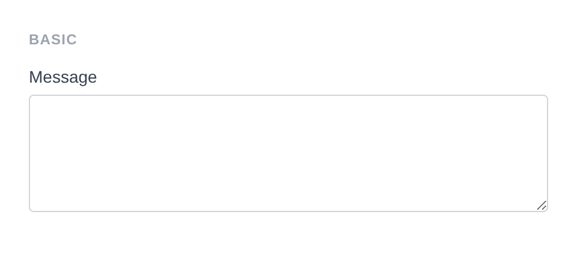
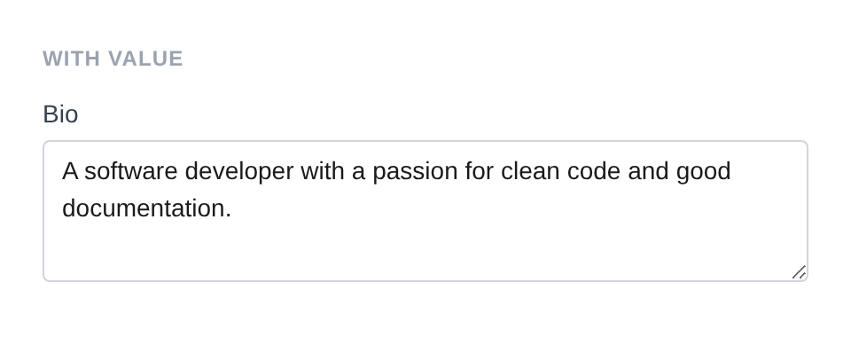
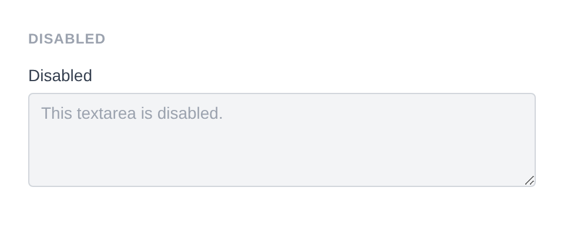
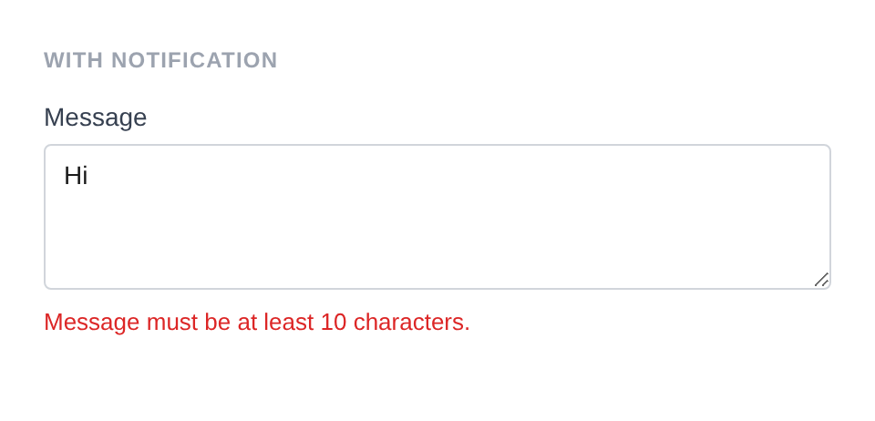

# Textarea

Renders a `<textarea>` element for multi-line text input.

**Class:** `PinkCrab\Form_Components\Element\Field\Textarea`  
**Make helper:** `Make::textarea( 'name', fn(Textarea $f) => $f->... )`

---

## Basic Usage

```php
$this->component( new Textarea_Component(
        Textarea::make( 'message' )
            ->label( 'Message' )
            ->rows( 4 )
    ) )
```



<details markdown="1">
<summary>Generated HTML</summary>

```html
<div id="form-field_message" class="pc-form__element pc-form__element--textarea">
    <label for="message" class="pc-form__label">Message</label>
        <textarea name="message" class="form-control textarea pc-form__element__field pc-form__element__field--textarea" rows="4" >
        </textarea>
    </div>
```
</details>

---

## Using Make Helper

```php
use PinkCrab\Form_Components\Util\Make;

$this->component( Make::textarea( 'bio', fn( $f ) => $f
    ->label( 'Biography' )
    ->rows( 5 )
    ->placeholder( 'Tell us about yourself...' )
) );
```

---

## Methods

### label( string $label )

Sets the visible label text above the textarea.

```php
Textarea::make( 'bio' )->label( 'Biography' )
```

<details markdown="1">
<summary>Generated HTML</summary>

```html
<div id="form-field_bio" class="pc-form__element pc-form__element--textarea">
    <label for="bio" class="pc-form__label">Biography</label>
    <textarea name="bio"
        class="form-control textarea pc-form__element__field pc-form__element__field--textarea"
    ></textarea>
</div>
```
</details>

### set_existing( mixed $value )

Sets the current value. Runs through the sanitizer if one is set.

```php
Textarea::make( 'bio' )
    ->label( 'Bio' )
    ->set_existing( 'A software developer with a passion for clean code and good documentation.' )
    ->rows( 3 )
```



<details markdown="1">
<summary>Generated HTML</summary>

```html
<div id="form-field_bio" class="pc-form__element pc-form__element--textarea">
    <label for="bio" class="pc-form__label">Bio</label>
        <textarea name="bio" class="form-control textarea pc-form__element__field pc-form__element__field--textarea" rows="3" >A software developer with a passion for clean code and good documentation.</textarea>
        </div>
```
</details>

### placeholder( string $text )

Placeholder text shown when the textarea is empty.

```php
Textarea::make( 'notes' )
    ->label( 'Notes' )
    ->placeholder( 'Enter your notes here...' )
    ->rows( 3 )
```


<details markdown="1">
<summary>Generated HTML</summary>

```html
<div id="form-field_notes" class="pc-form__element pc-form__element--textarea">
    <label for="notes" class="pc-form__label">Notes</label>
        <textarea name="notes" class="form-control textarea pc-form__element__field pc-form__element__field--textarea" placeholder="Enter your notes here..." rows="3" >
        </textarea>
    </div>
```
</details>

### rows( int $rows )

Sets the number of visible text rows (height).

```php
Textarea::make( 'bio' )
    ->label( 'Biography' )
    ->rows( 8 )
```

<details markdown="1">
<summary>Generated HTML</summary>

```html
<div id="form-field_bio" class="pc-form__element pc-form__element--textarea">
    <label for="bio" class="pc-form__label">Biography</label>
    <textarea name="bio"
        class="form-control textarea pc-form__element__field pc-form__element__field--textarea"
        rows="8"
    ></textarea>
</div>
```
</details>

### cols( int $cols )

Sets the number of visible text columns (width).

```php
Textarea::make( 'bio' )
    ->label( 'Biography' )
    ->cols( 40 )
```

<details markdown="1">
<summary>Generated HTML</summary>

```html
<div id="form-field_bio" class="pc-form__element pc-form__element--textarea">
    <label for="bio" class="pc-form__label">Biography</label>
    <textarea name="bio"
        class="form-control textarea pc-form__element__field pc-form__element__field--textarea"
        cols="40"
    ></textarea>
</div>
```
</details>

### required( bool $required = true )

Marks the field as required. The label displays a `*` indicator via CSS.

```php
Textarea::make( 'bio' )
    ->label( 'Biography' )
    ->required( true )
```

<details markdown="1">
<summary>Generated HTML</summary>

```html
<div id="form-field_bio" class="pc-form__element pc-form__element--textarea">
    <label for="bio" class="pc-form__label">Biography</label>
    <textarea name="bio"
        class="form-control textarea pc-form__element__field pc-form__element__field--textarea"
        required=""
    ></textarea>
</div>
```
</details>

### disabled( bool $disabled = true )

Disables the textarea. Value is visible but cannot be changed or submitted.

```php
Textarea::make( 'disabled_ta' )
    ->label( 'Disabled' )
    ->set_existing( 'This textarea is disabled.' )
    ->disabled( true )
    ->rows( 2 )
```



<details markdown="1">
<summary>Generated HTML</summary>

```html
<div id="form-field_disabled_ta" class="pc-form__element pc-form__element--textarea">
    <label for="disabled_ta" class="pc-form__label">Disabled</label>
        <textarea name="disabled_ta" class="form-control textarea pc-form__element__field pc-form__element__field--textarea" disabled="" rows="2" >This textarea is disabled.</textarea>
        </div>
```
</details>

### readonly( bool $readonly = true )

Makes the textarea read-only. Value can be selected and copied but not changed.

```php
Textarea::make( 'bio' )
    ->label( 'Biography' )
    ->set_existing( 'Read only content.' )
    ->readonly( true )
```

<details markdown="1">
<summary>Generated HTML</summary>

```html
<div id="form-field_bio" class="pc-form__element pc-form__element--textarea">
    <label for="bio" class="pc-form__label">Biography</label>
    <textarea name="bio"
        class="form-control textarea pc-form__element__field pc-form__element__field--textarea"
        readonly=""
    >Read only content.</textarea>
</div>
```
</details>

### minlength( int $min ) / maxlength( int $max )

Minimum and maximum character length constraints.

```php
Textarea::make( 'bio' )
    ->label( 'Biography' )
    ->minlength( 10 )
    ->maxlength( 500 )
```

<details markdown="1">
<summary>Generated HTML</summary>

```html
<div id="form-field_bio" class="pc-form__element pc-form__element--textarea">
    <label for="bio" class="pc-form__label">Biography</label>
    <textarea name="bio"
        class="form-control textarea pc-form__element__field pc-form__element__field--textarea"
        minlength="10" maxlength="500"
    ></textarea>
</div>
```
</details>

### spellcheck( string $value )

Enables or disables browser spell checking.

```php
Textarea::make( 'code' )
    ->label( 'Code Snippet' )
    ->spellcheck( 'false' )
```

<details markdown="1">
<summary>Generated HTML</summary>

```html
<div id="form-field_code" class="pc-form__element pc-form__element--textarea">
    <label for="code" class="pc-form__label">Code Snippet</label>
    <textarea name="code"
        class="form-control textarea pc-form__element__field pc-form__element__field--textarea"
        spellcheck="false"
    ></textarea>
</div>
```
</details>

### autocomplete( string $value )

HTML `autocomplete` attribute to help browsers autofill.

```php
Textarea::make( 'address' )
    ->label( 'Address' )
    ->autocomplete( 'street-address' )
```

<details markdown="1">
<summary>Generated HTML</summary>

```html
<div id="form-field_address" class="pc-form__element pc-form__element--textarea">
    <label for="address" class="pc-form__label">Address</label>
    <textarea name="address"
        class="form-control textarea pc-form__element__field pc-form__element__field--textarea"
        autocomplete="street-address"
    ></textarea>
</div>
```
</details>

Common values:

| Value | Description |
|-------|-------------|
| `off` | Disable autocomplete |
| `on` | Enable autocomplete (browser decides) |
| `name` | Full name |
| `given-name` | First name |
| `family-name` | Last name |
| `email` | Email address |
| `username` | Username |
| `new-password` | New password (password managers) |
| `current-password` | Current password |
| `organization` | Company/organisation name |
| `street-address` | Street address |
| `address-line1` | Address line 1 |
| `address-line2` | Address line 2 |
| `address-level2` | City |
| `address-level1` | State/province/region |
| `country` | Country code |
| `country-name` | Country name |
| `postal-code` | Postcode / ZIP |
| `tel` | Full phone number |
| `tel-national` | Phone without country code |
| `url` | URL |
| `bday` | Full date of birth |
| `bday-day` | Day of birth |
| `bday-month` | Month of birth |
| `bday-year` | Year of birth |
| `sex` | Gender |
| `cc-name` | Cardholder name |
| `cc-number` | Card number |
| `cc-exp` | Card expiry |
| `cc-csc` | Card security code |


### error_notification( string $message )

Displays an error message below the field.

```php
Textarea::make( 'short_msg' )
    ->label( 'Message' )
    ->set_existing( 'Hi' )
    ->error_notification( 'Message must be at least 10 characters.' )
    ->rows( 3 )
```



<details markdown="1">
<summary>Generated HTML</summary>

```html
<div id="form-field_short_msg" class="pc-form__element pc-form__element--textarea pc-form__element pc-form__element--textarea notification-error">
    <label for="short_msg" class="pc-form__label">Message</label>
        <textarea name="short_msg" class="form-control textarea pc-form__element__field pc-form__element__field--textarea pc-form__element__field pc-form__element__field--textarea notification-error" rows="3" >Hi</textarea>
            <div class="pc-form__notification pc-form__notification--error">Message must be at least 10 characters.</div>
            </div>
```
</details>

### warning_notification( string $message )

Displays a warning message below the field.

```php
Textarea::make( 'bio' )
    ->label( 'Biography' )
    ->warning_notification( 'This will be publicly visible.' )
```

<details markdown="1">
<summary>Generated HTML</summary>

```html
<div id="form-field_bio" class="pc-form__element pc-form__element--textarea notification-warning">
    <label for="bio" class="pc-form__label">Biography</label>
    <textarea name="bio"
        class="form-control textarea pc-form__element__field pc-form__element__field--textarea notification-warning"
    ></textarea>
    <div class="pc-form__notification pc-form__notification--warning">This will be publicly visible.</div>
</div>
```
</details>

### success_notification( string $message )

Displays a success message below the field.

```php
Textarea::make( 'bio' )
    ->label( 'Biography' )
    ->set_existing( 'Saved text.' )
    ->success_notification( 'Biography saved successfully.' )
```

<details markdown="1">
<summary>Generated HTML</summary>

```html
<div id="form-field_bio" class="pc-form__element pc-form__element--textarea notification-success">
    <label for="bio" class="pc-form__label">Biography</label>
    <textarea name="bio"
        class="form-control textarea pc-form__element__field pc-form__element__field--textarea notification-success"
    >Saved text.</textarea>
    <div class="pc-form__notification pc-form__notification--success">Biography saved successfully.</div>
</div>
```
</details>

### info_notification( string $message )

Displays an info message below the field.

```php
Textarea::make( 'bio' )
    ->label( 'Biography' )
    ->info_notification( 'Maximum 500 characters.' )
```

<details markdown="1">
<summary>Generated HTML</summary>

```html
<div id="form-field_bio" class="pc-form__element pc-form__element--textarea notification-info">
    <label for="bio" class="pc-form__label">Biography</label>
    <textarea name="bio"
        class="form-control textarea pc-form__element__field pc-form__element__field--textarea notification-info"
    ></textarea>
    <div class="pc-form__notification pc-form__notification--info">Maximum 500 characters.</div>
</div>
```
</details>

### pre_description( string $description )

Sets a description or hint displayed before the textarea.

```php
Textarea::make( 'bio' )
    ->label( 'Biography' )
    ->pre_description( 'Tell us about yourself.' )
```

### post_description( string $description )

Sets a description or help text displayed after the textarea, before any notification.

```php
Textarea::make( 'bio' )
    ->label( 'Biography' )
    ->post_description( 'Maximum 500 characters.' )
```

### before( string $html ) / after( string $html )

HTML content before or after the textarea; renders whether or not the wrapper is shown.

```php
Textarea::make( 'bio' )
    ->label( 'Biography' )
    ->before( '<span>Write a short bio</span>' )
    ->after( '<span>Markdown supported</span>' )
```

<details markdown="1">
<summary>Generated HTML</summary>

```html
<div id="form-field_bio" class="pc-form__element pc-form__element--textarea">
    <span>Write a short bio</span>
    <label for="bio" class="pc-form__label">Biography</label>
    <textarea name="bio"
        class="form-control textarea pc-form__element__field pc-form__element__field--textarea"
    ></textarea>
    <span>Markdown supported</span>
</div>
```
</details>

### id( string $id )

Sets a custom HTML `id` on the textarea element.

```php
Textarea::make( 'bio' )
    ->id( 'my-custom-textarea-id' )
```

<details markdown="1">
<summary>Generated HTML</summary>

```html
<div id="form-field_bio" class="pc-form__element pc-form__element--textarea">
    <textarea name="bio" id="my-custom-textarea-id"
        class="form-control textarea pc-form__element__field pc-form__element__field--textarea"
    ></textarea>
</div>
```
</details>

### wrapper_id( string $id )

Sets a custom HTML `id` on the wrapper div.

```php
Textarea::make( 'bio' )
    ->wrapper_id( 'my-custom-wrapper-id' )
```

<details markdown="1">
<summary>Generated HTML</summary>

```html
<div id="my-custom-wrapper-id" class="pc-form__element pc-form__element--textarea">
    <textarea name="bio"
        class="form-control textarea pc-form__element__field pc-form__element__field--textarea"
    ></textarea>
</div>
```
</details>

### data( string $key, string $value )

Adds a `data-*` attribute to the textarea element.

```php
Textarea::make( 'bio' )
    ->data( 'char-count', 'true' )
```

<details markdown="1">
<summary>Generated HTML</summary>

```html
<div id="form-field_bio" class="pc-form__element pc-form__element--textarea">
    <textarea name="bio"
        class="form-control textarea pc-form__element__field pc-form__element__field--textarea"
        data-char-count="true"
    ></textarea>
</div>
```
</details>

### wrapper_data( string $key, string $value )

Adds a `data-*` attribute to the wrapper div.

```php
Textarea::make( 'bio' )
    ->wrapper_data( 'section', 'profile' )
```

<details markdown="1">
<summary>Generated HTML</summary>

```html
<div id="form-field_bio" class="pc-form__element pc-form__element--textarea" data-section="profile">
    <textarea name="bio"
        class="form-control textarea pc-form__element__field pc-form__element__field--textarea"
    ></textarea>
</div>
```
</details>

### add_class( string $class )

Adds a CSS class to the textarea element.

```php
Textarea::make( 'bio' )
    ->add_class( 'my-textarea-class' )
```

<details markdown="1">
<summary>Generated HTML</summary>

```html
<div id="form-field_bio" class="pc-form__element pc-form__element--textarea">
    <textarea name="bio"
        class="form-control textarea pc-form__element__field pc-form__element__field--textarea my-textarea-class"
    ></textarea>
</div>
```
</details>

### add_wrapper_class( string $class )

Adds a CSS class to the wrapper div.

```php
Textarea::make( 'bio' )
    ->add_wrapper_class( 'my-wrapper-class' )
```

<details markdown="1">
<summary>Generated HTML</summary>

```html
<div id="form-field_bio" class="pc-form__element pc-form__element--textarea my-wrapper-class">
    <textarea name="bio"
        class="form-control textarea pc-form__element__field pc-form__element__field--textarea"
    ></textarea>
</div>
```
</details>

### show_wrapper( bool $show = true )

Controls whether the wrapping `<div>` is rendered.

```php
Textarea::make( 'bio' )
    ->show_wrapper( false )
```

<details markdown="1">
<summary>Generated HTML</summary>

```html
<textarea name="bio"
    class="form-control textarea pc-form__element__field pc-form__element__field--textarea"
></textarea>
```
</details>

### tabindex( int $index )

Sets the tab order of the textarea.

```php
Textarea::make( 'bio' )
    ->tabindex( 5 )
```

<details markdown="1">
<summary>Generated HTML</summary>

```html
<div id="form-field_bio" class="pc-form__element pc-form__element--textarea">
    <textarea name="bio"
        class="form-control textarea pc-form__element__field pc-form__element__field--textarea"
        tabindex="5"
    ></textarea>
</div>
```
</details>

### attribute( string $key, mixed $value )

Sets an arbitrary HTML attribute on the textarea element.

```php
Textarea::make( 'bio' )
    ->attribute( 'aria-label', 'Enter your biography' )
```

<details markdown="1">
<summary>Generated HTML</summary>

```html
<div id="form-field_bio" class="pc-form__element pc-form__element--textarea">
    <textarea name="bio"
        class="form-control textarea pc-form__element__field pc-form__element__field--textarea"
        aria-label="Enter your biography"
    ></textarea>
</div>
```
</details>

### attributes( array $attrs )

Sets multiple arbitrary HTML attributes at once.

```php
Textarea::make( 'bio' )
    ->attributes( array(
        'title'    => 'Biography field',
        'tabindex' => '3',
    ) )
```

<details markdown="1">
<summary>Generated HTML</summary>

```html
<div id="form-field_bio" class="pc-form__element pc-form__element--textarea">
    <textarea name="bio"
        class="form-control textarea pc-form__element__field pc-form__element__field--textarea"
        title="Biography field" tabindex="3"
    ></textarea>
</div>
```
</details>

### sanitizer( callable $fn )

Sets a sanitization callback applied when `set_existing()` is called. Defaults to `Sanitize::TEXTAREA`.

**Using a built-in helper:**

```php
use PinkCrab\Form_Components\Util\Sanitize;

Textarea::make( 'bio' )
    ->sanitizer( Sanitize::TEXTAREA )
    ->set_existing( $user_input )
```

**Using a custom callable:**

```php
Textarea::make( 'bio' )
    ->sanitizer( function( $value ) {
        return strip_tags( $value, '<b><i><a>' );
    } )
    ->set_existing( '<script>alert("xss")</script><b>Bold</b>' ) // Stores: "<b>Bold</b>"
```

**Built-in sanitizer helpers:**

| Constant | Function | Description |
|----------|----------|-------------|
| `Sanitize::TEXT` | `sanitize_text_field()` | Strips tags, removes extra whitespace |
| `Sanitize::TEXTAREA` | `sanitize_textarea_field()` | Like TEXT but preserves line breaks |
| `Sanitize::URL` | `esc_url_raw()` | Sanitises a URL for database storage |
| `Sanitize::EMAIL` | `sanitize_email()` | Strips invalid email characters |
| `Sanitize::HEX_COLOR` | `sanitize_hex_color()` | Validates hex colour (#fff or #ffffff) |
| `Sanitize::NUMBER` | Custom numeric parser | Parses to int or float |
| `Sanitize::NOOP` | Pass-through | No sanitization applied |

### validator( Validator $validator )

Sets a Respect\Validation validator for server-side validation.

```php
use Respect\Validation\Validator as v;

Textarea::make( 'bio' )
    ->validator( v::length( 10, 500 ) )
```

### style( Style $style )

Sets a custom style for the field, overriding the default.

```php
use PinkCrab\Form_Components\Style\Default_Style;

Textarea::make( 'bio' )
    ->style( new Default_Style() )
```

---

## Traits

| Trait | Methods |
|-------|---------|
| Label | `label()`, `get_label()`, `has_label()` |
| Single_Value | `value()`, `get_value()`, `has_value()` |
| Placeholder | `placeholder()`, `get_placeholder()`, `has_placeholder()` |
| Notification | `error_notification()`, `warning_notification()`, `success_notification()`, `info_notification()` |
| Disabled | `disabled()`, `is_disabled()` |
| Read_Only | `readonly()`, `is_read_only()` |
| Required | `required()`, `is_required()` |
| Length | `minlength()`, `maxlength()`, `get_min_length()`, `get_max_length()` |
| Spellcheck | `spellcheck()`, `is_spellcheck()` |
| Autocomplete | `autocomplete()`, `get_autocomplete()`, `has_autocomplete()` |
| Description | `pre_description()`, `post_description()`, `get_pre_description()`, `get_post_description()`, `has_pre_description()`, `has_post_description()` |
