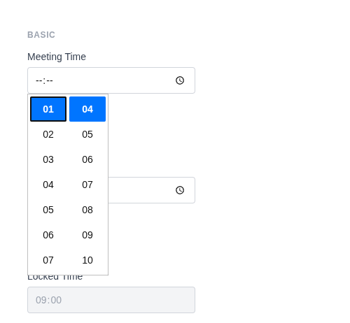
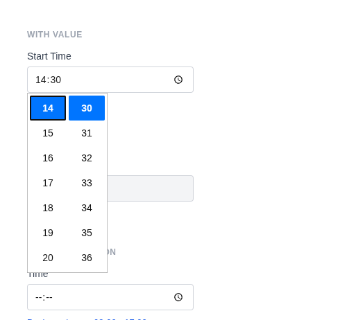

# Time Input

Renders `<input type="time">` with a browser-native time picker. Values are formatted as `HH:MM:SS`. Uses a custom time sanitizer by default.

**Class:** `PinkCrab\Form_Components\Element\Field\Input\Time`  
**Make helper:** `Make::time( 'name', fn(Time $f) => $f->... )`

---

## Basic Usage

```php
$this->component( new Input_Component(
        Time::make( 'meeting_time' )
            ->label( 'Meeting Time' )
    ) )
```



<details markdown="1">
<summary>Generated HTML</summary>

```html
<div id="form-field_meeting_time" class="pc-form__element pc-form__element--time_input">
    <label for="meeting_time" class="pc-form__label">Meeting Time</label>
        <input type="time" name="meeting_time" class="form-control time-input pc-form__element__field pc-form__element__field--time_input" list="_meeting_time__list" />
    </div>
```
</details>

---

## Using Make Helper

```php
use PinkCrab\Form_Components\Util\Make;

$this->component( Make::time( 'start_time', fn( $f ) => $f
    ->label( 'Start Time' )
    ->required( true )
    ->min( '08:00' )
    ->max( '18:00' )
) );
```

---

## Methods

### label( string $label )

Sets the visible label text above the input.

```php
Time::make( 'start_time' )->label( 'Start Time' )
```

<details markdown="1">
<summary>Generated HTML</summary>

```html
<div id="form-field_start_time" class="pc-form__element pc-form__element--time_input">
    <label for="start_time" class="pc-form__label">Start Time</label>
    <input type="time" name="start_time"
        class="form-control time-input pc-form__element__field pc-form__element__field--time_input"
    />
</div>
```
</details>

### set_existing( mixed $value )

Sets the current value. Runs through a time format sanitizer (`H:i:s`) by default, accepting both `H:i` and `H:i:s` formats.

```php
Time::make( 'start_time' )
            ->label( 'Start Time' )
            ->set_existing( '14:30' )
```



<details markdown="1">
<summary>Generated HTML</summary>

```html
<div id="form-field_start_time" class="pc-form__element pc-form__element--time_input">
    <label for="start_time" class="pc-form__label">Start Time</label>
        <input type="time" name="start_time" class="form-control time-input pc-form__element__field pc-form__element__field--time_input" list="_start_time__list" value="14:30:00" />
    </div>
```
</details>

### min( int|float|string|null $min )

Sets the earliest allowed time.

```php
Time::make( 'start_time' )
    ->label( 'Start Time' )
    ->min( '08:00' )
```

<details markdown="1">
<summary>Generated HTML</summary>

```html
<div id="form-field_start_time" class="pc-form__element pc-form__element--time_input">
    <label for="start_time" class="pc-form__label">Start Time</label>
    <input type="time" name="start_time"
        class="form-control time-input pc-form__element__field pc-form__element__field--time_input"
        min="08:00"
    />
</div>
```
</details>

### max( int|float|string|null $max )

Sets the latest allowed time.

```php
Time::make( 'start_time' )
    ->label( 'Start Time' )
    ->max( '18:00' )
```

<details markdown="1">
<summary>Generated HTML</summary>

```html
<div id="form-field_start_time" class="pc-form__element pc-form__element--time_input">
    <label for="start_time" class="pc-form__label">Start Time</label>
    <input type="time" name="start_time"
        class="form-control time-input pc-form__element__field pc-form__element__field--time_input"
        max="18:00"
    />
</div>
```
</details>

### range( int|float|string $min, int|float|string $max )

Sets both min and max times in a single call.

```php
Time::make( 'meeting_time' )
    ->label( 'Meeting Time' )
    ->range( '09:00', '17:00' )
```

<details markdown="1">
<summary>Generated HTML</summary>

```html
<div id="form-field_meeting_time" class="pc-form__element pc-form__element--time_input">
    <label for="meeting_time" class="pc-form__label">Meeting Time</label>
    <input type="time" name="meeting_time"
        class="form-control time-input pc-form__element__field pc-form__element__field--time_input"
        min="09:00" max="17:00"
    />
</div>
```
</details>

### step( int|float|string|null $step )

Sets the step increment in seconds.

```php
Time::make( 'alarm' )
    ->label( 'Alarm' )
    ->step( 60 )
```

<details markdown="1">
<summary>Generated HTML</summary>

```html
<div id="form-field_alarm" class="pc-form__element pc-form__element--time_input">
    <label for="alarm" class="pc-form__label">Alarm</label>
    <input type="time" name="alarm"
        class="form-control time-input pc-form__element__field pc-form__element__field--time_input"
        step="60"
    />
</div>
```
</details>

### step_by_seconds( int $seconds )

Convenience method to step by a number of seconds.

```php
Time::make( 'precise_time' )
    ->label( 'Precise Time' )
    ->step_by_seconds( 30 )
```

<details markdown="1">
<summary>Generated HTML</summary>

```html
<div id="form-field_precise_time" class="pc-form__element pc-form__element--time_input">
    <label for="precise_time" class="pc-form__label">Precise Time</label>
    <input type="time" name="precise_time"
        class="form-control time-input pc-form__element__field pc-form__element__field--time_input"
        step="30"
    />
</div>
```
</details>

### step_by_minutes( int $minutes )

Convenience method to step by a number of minutes (multiplied by 60 internally).

```php
Time::make( 'appointment' )
    ->label( 'Appointment Time' )
    ->step_by_minutes( 15 )
```

<details markdown="1">
<summary>Generated HTML</summary>

```html
<div id="form-field_appointment" class="pc-form__element pc-form__element--time_input">
    <label for="appointment" class="pc-form__label">Appointment Time</label>
    <input type="time" name="appointment"
        class="form-control time-input pc-form__element__field pc-form__element__field--time_input"
        step="900"
    />
</div>
```
</details>

### step_by_hours( int $hours )

Convenience method to step by a number of hours (multiplied by 3600 internally).

```php
Time::make( 'shift' )
    ->label( 'Shift Start' )
    ->step_by_hours( 1 )
```

<details markdown="1">
<summary>Generated HTML</summary>

```html
<div id="form-field_shift" class="pc-form__element pc-form__element--time_input">
    <label for="shift" class="pc-form__label">Shift Start</label>
    <input type="time" name="shift"
        class="form-control time-input pc-form__element__field pc-form__element__field--time_input"
        step="3600"
    />
</div>
```
</details>

### required( bool $required = true )

Marks the field as required. The label displays a `*` indicator via CSS.

```php
Time::make( 'start_time' )
    ->label( 'Start Time' )
    ->required( true )
```

<details markdown="1">
<summary>Generated HTML</summary>

```html
<div id="form-field_start_time" class="pc-form__element pc-form__element--time_input">
    <label for="start_time" class="pc-form__label">Start Time</label>
    <input type="time" name="start_time"
        class="form-control time-input pc-form__element__field pc-form__element__field--time_input"
        required=""
    />
</div>
```
</details>

### disabled( bool $disabled = true )

Disables the input. Value is visible but cannot be changed or submitted.

```php
Time::make( 'locked_time' )
            ->label( 'Locked Time' )
            ->set_existing( '09:00' )
            ->disabled( true )
```


<details markdown="1">
<summary>Generated HTML</summary>

```html
<div id="form-field_locked_time" class="pc-form__element pc-form__element--time_input">
    <label for="locked_time" class="pc-form__label">Locked Time</label>
        <input type="time" name="locked_time" class="form-control time-input pc-form__element__field pc-form__element__field--time_input" list="_locked_time__list" disabled="" value="09:00:00" />
    </div>
```
</details>

### readonly( bool $readonly = true )

Makes the field read-only. Value can be selected and copied but not changed.

```php
Time::make( 'created_at' )
    ->label( 'Created At' )
    ->set_existing( '10:30' )
    ->readonly( true )
```

<details markdown="1">
<summary>Generated HTML</summary>

```html
<div id="form-field_created_at" class="pc-form__element pc-form__element--time_input">
    <label for="created_at" class="pc-form__label">Created At</label>
    <input type="time" name="created_at"
        class="form-control time-input pc-form__element__field pc-form__element__field--time_input"
        readonly="" value="10:30:00"
    />
</div>
```
</details>

### autocomplete( string $value )

HTML `autocomplete` attribute to help browsers autofill.

```php
Time::make( 'start_time' )
    ->label( 'Start Time' )
    ->autocomplete( 'off' )
```

<details markdown="1">
<summary>Generated HTML</summary>

```html
<div id="form-field_start_time" class="pc-form__element pc-form__element--time_input">
    <label for="start_time" class="pc-form__label">Start Time</label>
    <input type="time" name="start_time"
        class="form-control time-input pc-form__element__field pc-form__element__field--time_input"
        autocomplete="off"
    />
</div>
```
</details>

Common values:

| Value | Description |
|-------|-------------|
| `off` | Disable autocomplete |
| `on` | Enable autocomplete (browser decides) |
| `name` | Full name |
| `given-name` | First name |
| `family-name` | Last name |
| `email` | Email address |
| `username` | Username |
| `new-password` | New password (password managers) |
| `current-password` | Current password |
| `organization` | Company/organisation name |
| `street-address` | Street address |
| `address-line1` | Address line 1 |
| `address-line2` | Address line 2 |
| `address-level2` | City |
| `address-level1` | State/province/region |
| `country` | Country code |
| `country-name` | Country name |
| `postal-code` | Postcode / ZIP |
| `tel` | Full phone number |
| `tel-national` | Phone without country code |
| `url` | URL |
| `bday` | Full date of birth |
| `bday-day` | Day of birth |
| `bday-month` | Month of birth |
| `bday-year` | Year of birth |
| `sex` | Gender |
| `cc-name` | Cardholder name |
| `cc-number` | Card number |
| `cc-exp` | Card expiry |
| `cc-csc` | Card security code |


### inputmode( string $mode )

Hints to mobile browsers which keyboard to display.

```php
Time::make( 'start_time' )
    ->label( 'Start Time' )
    ->inputmode( 'numeric' )
```

<details markdown="1">
<summary>Generated HTML</summary>

```html
<div id="form-field_start_time" class="pc-form__element pc-form__element--time_input">
    <label for="start_time" class="pc-form__label">Start Time</label>
    <input type="time" name="start_time"
        class="form-control time-input pc-form__element__field pc-form__element__field--time_input"
        inputmode="numeric"
    />
</div>
```
</details>

Valid values:

| Value | Keyboard |
|-------|----------|
| `none` | No virtual keyboard |
| `text` | Standard text keyboard (default) |
| `decimal` | Numbers with decimal point |
| `numeric` | Numbers only |
| `tel` | Telephone keypad |
| `search` | Search-optimised keyboard |
| `email` | Email-optimised keyboard |
| `url` | URL-optimised keyboard |


### datalist_items( array $items )

Autocomplete suggestions via an HTML `<datalist>` element.

```php
Time::make( 'meeting_time' )
    ->label( 'Meeting Time' )
    ->datalist_items( array( '09:00', '10:00', '11:00', '14:00', '15:00' ) )
```

<details markdown="1">
<summary>Generated HTML</summary>

```html
<div id="form-field_meeting_time" class="pc-form__element pc-form__element--time_input">
    <label for="meeting_time" class="pc-form__label">Meeting Time</label>
    <input type="time" name="meeting_time"
        class="form-control time-input pc-form__element__field pc-form__element__field--time_input"
        list="_meeting_time__list"
    />
    <datalist id="_meeting_time__list">
        <option value="09:00"></option>
        <option value="10:00"></option>
        <option value="11:00"></option>
        <option value="14:00"></option>
        <option value="15:00"></option>
    </datalist>
</div>
```
</details>

### error_notification( string $message )

Displays an error message below the field.

```php
Time::make( 'notif_time' )
            ->label( 'Time' )
            ->info_notification( 'Business hours: 09:00 - 17:00' )
```


<details markdown="1">
<summary>Generated HTML</summary>

```html
<div id="form-field_notif_time" class="pc-form__element pc-form__element--time_input pc-form__element pc-form__element--time_input notification-info">
    <label for="notif_time" class="pc-form__label">Time</label>
        <input type="time" name="notif_time" class="form-control time-input pc-form__element__field pc-form__element__field--time_input pc-form__element__field pc-form__element__field--time_input notification-info" list="_notif_time__list" />
        <div class="pc-form__notification pc-form__notification--info">Business hours: 09:00 - 17:00</div>
        </div>
```
</details>

### warning_notification( string $message )

Displays a warning message below the field.

```php
Time::make( 'late_time' )
    ->label( 'Start Time' )
    ->set_existing( '23:00' )
    ->warning_notification( 'This is outside working hours.' )
```

<details markdown="1">
<summary>Generated HTML</summary>

```html
<div id="form-field_late_time" class="pc-form__element pc-form__element--time_input notification-warning">
    <label for="late_time" class="pc-form__label">Start Time</label>
    <input type="time" name="late_time"
        class="form-control time-input pc-form__element__field pc-form__element__field--time_input notification-warning"
        value="23:00:00"
    />
    <div class="pc-form__notification pc-form__notification--warning">This is outside working hours.</div>
</div>
```
</details>

### success_notification( string $message )

Displays a success message below the field.

```php
Time::make( 'ok_time' )
    ->label( 'Start Time' )
    ->set_existing( '09:00' )
    ->success_notification( 'Time slot available.' )
```

<details markdown="1">
<summary>Generated HTML</summary>

```html
<div id="form-field_ok_time" class="pc-form__element pc-form__element--time_input notification-success">
    <label for="ok_time" class="pc-form__label">Start Time</label>
    <input type="time" name="ok_time"
        class="form-control time-input pc-form__element__field pc-form__element__field--time_input notification-success"
        value="09:00:00"
    />
    <div class="pc-form__notification pc-form__notification--success">Time slot available.</div>
</div>
```
</details>

### info_notification( string $message )

Displays an info message below the field.

```php
Time::make( 'info_time' )
    ->label( 'Start Time' )
    ->info_notification( 'All times are in UTC.' )
```

<details markdown="1">
<summary>Generated HTML</summary>

```html
<div id="form-field_info_time" class="pc-form__element pc-form__element--time_input notification-info">
    <label for="info_time" class="pc-form__label">Start Time</label>
    <input type="time" name="info_time"
        class="form-control time-input pc-form__element__field pc-form__element__field--time_input notification-info"
    />
    <div class="pc-form__notification pc-form__notification--info">All times are in UTC.</div>
</div>
```
</details>

### pre_description( string $description )

Sets a description or hint displayed before the input.

```php
Time::make( 'start_time' )
    ->label( 'Start Time' )
    ->pre_description( 'Select your preferred time.' )
```

### post_description( string $description )

Sets a description or help text displayed after the input, before any notification.

```php
Time::make( 'start_time' )
    ->label( 'Start Time' )
    ->post_description( 'All times are in UTC.' )
```

### before( string $html ) / after( string $html )

HTML content before or after the input; renders whether or not the wrapper is shown.

```php
Time::make( 'wrapped_time' )
            ->label( 'Appointment' )
            ->before( '<span style="color:#6b7280;font-size:13px;">Select appointment time</span>' )
            ->after( '<span style="color:#6b7280;font-size:13px;">Times shown in GMT</span>' )
```


<details markdown="1">
<summary>Generated HTML</summary>

```html
<div id="form-field_wrapped_time" class="pc-form__element pc-form__element--time_input">
    <span style="color:#6b7280;font-size:13px">Select appointment time</span>
        <label for="wrapped_time" class="pc-form__label">Appointment</label>
            <input type="time" name="wrapped_time" class="form-control time-input pc-form__element__field pc-form__element__field--time_input" list="_wrapped_time__list" />
            <span style="color:#6b7280;font-size:13px">Times shown in GMT</span>
            </div>
```
</details>

### id( string $id )

Sets a custom HTML `id` on the input element.

```php
Time::make( 'start_time' )->id( 'my-time-picker' )
```

<details markdown="1">
<summary>Generated HTML</summary>

```html
<div id="form-field_start_time" class="pc-form__element pc-form__element--time_input">
    <input type="time" name="start_time" id="my-time-picker"
        class="form-control time-input pc-form__element__field pc-form__element__field--time_input"
    />
</div>
```
</details>

### wrapper_id( string $id )

Sets a custom HTML `id` on the wrapper div.

```php
Time::make( 'start_time' )->wrapper_id( 'time-wrapper' )
```

<details markdown="1">
<summary>Generated HTML</summary>

```html
<div id="time-wrapper" class="pc-form__element pc-form__element--time_input">
    <input type="time" name="start_time"
        class="form-control time-input pc-form__element__field pc-form__element__field--time_input"
    />
</div>
```
</details>

### data( string $key, string $value )

Adds a `data-*` attribute to the input.

```php
Time::make( 'start_time' )->data( 'timezone', 'UTC' )
```

<details markdown="1">
<summary>Generated HTML</summary>

```html
<div id="form-field_start_time" class="pc-form__element pc-form__element--time_input">
    <input type="time" name="start_time"
        class="form-control time-input pc-form__element__field pc-form__element__field--time_input"
        data-timezone="UTC"
    />
</div>
```
</details>

### wrapper_data( string $key, string $value )

Adds a `data-*` attribute to the wrapper div.

```php
Time::make( 'start_time' )->wrapper_data( 'section', 'schedule' )
```

<details markdown="1">
<summary>Generated HTML</summary>

```html
<div id="form-field_start_time" class="pc-form__element pc-form__element--time_input" data-section="schedule">
    <input type="time" name="start_time"
        class="form-control time-input pc-form__element__field pc-form__element__field--time_input"
    />
</div>
```
</details>

### add_class( string $class )

Adds a CSS class to the input element.

```php
Time::make( 'start_time' )->add_class( 'time-picker' )
```

<details markdown="1">
<summary>Generated HTML</summary>

```html
<div id="form-field_start_time" class="pc-form__element pc-form__element--time_input">
    <input type="time" name="start_time"
        class="form-control time-input pc-form__element__field pc-form__element__field--time_input time-picker"
    />
</div>
```
</details>

### add_wrapper_class( string $class )

Adds a CSS class to the wrapper div.

```php
Time::make( 'start_time' )->add_wrapper_class( 'time-field' )
```

<details markdown="1">
<summary>Generated HTML</summary>

```html
<div id="form-field_start_time" class="pc-form__element pc-form__element--time_input time-field">
    <input type="time" name="start_time"
        class="form-control time-input pc-form__element__field pc-form__element__field--time_input"
    />
</div>
```
</details>

### show_wrapper( bool $show = true )

Controls whether the wrapping `<div>` is rendered.

```php
Time::make( 'start_time' )->show_wrapper( false )
```

<details markdown="1">
<summary>Generated HTML</summary>

```html
<input type="time" name="start_time"
    class="form-control time-input pc-form__element__field pc-form__element__field--time_input"
/>
```
</details>

### tabindex( int $index )

Sets the tab order of the input.

```php
Time::make( 'start_time' )->tabindex( 5 )
```

<details markdown="1">
<summary>Generated HTML</summary>

```html
<div id="form-field_start_time" class="pc-form__element pc-form__element--time_input">
    <input type="time" name="start_time"
        class="form-control time-input pc-form__element__field pc-form__element__field--time_input"
        tabindex="5"
    />
</div>
```
</details>

### attribute( string $key, mixed $value )

Sets an arbitrary HTML attribute on the input.

```php
Time::make( 'start_time' )->attribute( 'aria-label', 'Choose start time' )
```

<details markdown="1">
<summary>Generated HTML</summary>

```html
<div id="form-field_start_time" class="pc-form__element pc-form__element--time_input">
    <input type="time" name="start_time"
        class="form-control time-input pc-form__element__field pc-form__element__field--time_input"
        aria-label="Choose start time"
    />
</div>
```
</details>

### attributes( array $attrs )

Sets multiple arbitrary HTML attributes at once.

```php
Time::make( 'start_time' )->attributes( array(
    'title' => 'Pick a time',
    'tabindex' => '5',
) )
```

<details markdown="1">
<summary>Generated HTML</summary>

```html
<div id="form-field_start_time" class="pc-form__element pc-form__element--time_input">
    <input type="time" name="start_time"
        class="form-control time-input pc-form__element__field pc-form__element__field--time_input"
        title="Pick a time" tabindex="5"
    />
</div>
```
</details>

### sanitizer( callable $fn )

Sets a sanitization callback applied when `set_existing()` is called. Default: custom time sanitizer that validates `H:i` or `H:i:s` format and outputs as `H:i:s`.

**Using the default (automatic):**

```php
Time::make( 'start_time' )
    ->set_existing( '09:30' ) // Validates and stores as H:i:s
```

**Using a custom callable:**

```php
Time::make( 'start_time' )
    ->sanitizer( function( $value ) {
        $time = DateTimeImmutable::createFromFormat( 'H:i', $value );
        return $time ? $time->format( 'H:i' ) : '';
    } )
    ->set_existing( '09:30' )
```

**Built-in sanitizer helpers:**

| Constant | Function | Description |
|----------|----------|-------------|
| `Sanitize::TEXT` | `sanitize_text_field()` | Strips tags, removes extra whitespace |
| `Sanitize::TEXTAREA` | `sanitize_textarea_field()` | Like TEXT but preserves line breaks |
| `Sanitize::URL` | `esc_url_raw()` | Sanitises a URL for database storage |
| `Sanitize::EMAIL` | `sanitize_email()` | Strips invalid email characters |
| `Sanitize::HEX_COLOR` | `sanitize_hex_color()` | Validates hex colour (#fff or #ffffff) |
| `Sanitize::NUMBER` | Custom numeric parser | Parses to int or float |
| `Sanitize::NOOP` | Pass-through | No sanitization applied |

### validator( Validator $validator )

Sets a Respect\Validation validator for server-side validation.

```php
use Respect\Validation\Validator as v;

Time::make( 'start_time' )->validator( v::time( 'H:i:s' ) )
```

### style( Style $style )

Sets a custom style for the field, overriding the default.

```php
use PinkCrab\Form_Components\Style\Default_Style;

Time::make( 'start_time' )->style( new Default_Style() )
```

---

## Traits

| Trait | Methods |
|-------|---------|
| Label | `label()`, `get_label()`, `has_label()` |
| Single_Value | `value()`, `get_value()`, `has_value()` |
| Range | `min()`, `max()`, `range()`, `get_min()`, `get_max()` |
| Step | `step()`, `get_step()`, `has_step()`, `clear_step()` |
| Required | `required()`, `is_required()` |
| Disabled | `disabled()`, `is_disabled()` |
| Read_Only | `readonly()`, `is_read_only()` |
| Autocomplete | `autocomplete()`, `get_autocomplete()`, `has_autocomplete()` |
| Input_Mode | `inputmode()`, `get_inputmode()`, `has_inputmode()`, `clear_inputmode()` |
| Datalist | `datalist_items()`, `get_datalist_key()`, `get_datalist_items()` |
| Description | `pre_description()`, `post_description()`, `get_pre_description()`, `get_post_description()`, `has_pre_description()`, `has_post_description()` |
| Notification | `error_notification()`, `warning_notification()`, `success_notification()`, `info_notification()` |
