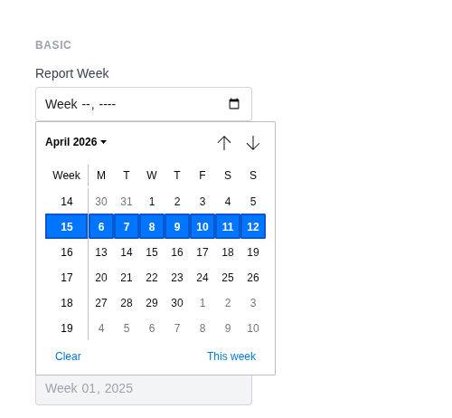
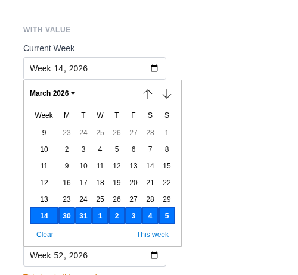
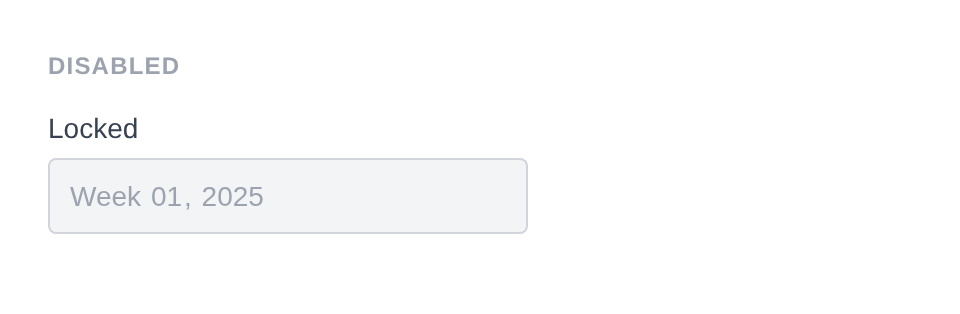
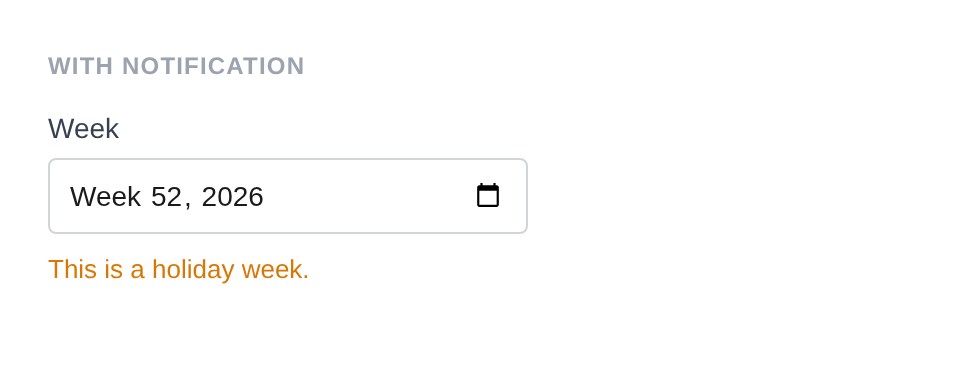
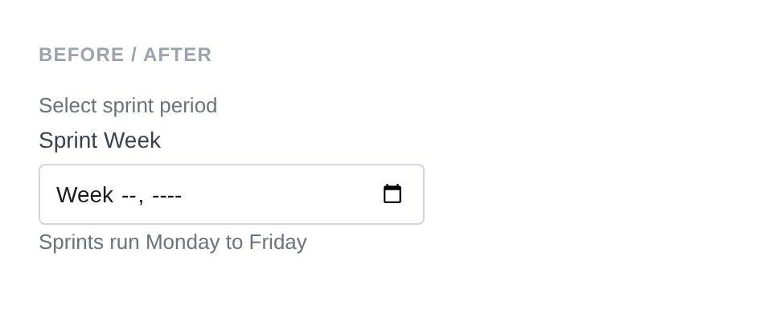

# Week Input

Renders `<input type="week">` with a browser-native week/year picker. Values are formatted as `YYYY-Wnn` (e.g. `2026-W26`). Uses a custom week sanitizer by default.

**Class:** `PinkCrab\Form_Components\Element\Field\Input\Week`  
**Make helper:** `Make::week( 'name', fn(Week $f) => $f->... )`

---

## Basic Usage

```php
$this->component( new Input_Component(
		Week::make( 'report_week' )
			->label( 'Report Week' )
	) )
```



<details markdown="1">
<summary>Generated HTML</summary>

```html
<div id="form-field_report_week" class="pc-form__element pc-form__element--week_input">
    <label for="report_week" class="pc-form__label">Report Week</label>
        <input type="week" name="report_week" class="form-control week-input pc-form__element__field pc-form__element__field--week_input" list="_report_week__list" />
    </div>
```
</details>

---

## Using Make Helper

```php
use PinkCrab\Form_Components\Util\Make;

$this->component( Make::week( 'delivery_week', fn( $f ) => $f
    ->label( 'Delivery Week' )
    ->required( true )
    ->min( '2026-W01' )
    ->max( '2026-W52' )
) );
```

---

## Methods

### label( string $label )

Sets the visible label text above the input.

```php
Week::make( 'delivery_week' )->label( 'Delivery Week' )
```

<details markdown="1">
<summary>Generated HTML</summary>

```html
<div id="form-field_delivery_week" class="pc-form__element pc-form__element--week_input">
    <label for="delivery_week" class="pc-form__label">Delivery Week</label>
    <input type="week" name="delivery_week"
        class="form-control week-input pc-form__element__field pc-form__element__field--week_input"
    />
</div>
```
</details>

### set_existing( mixed $value )

Sets the current value. Runs through a week format sanitizer (`Y-\WW`) by default.

```php
Week::make( 'current_week' )
			->label( 'Current Week' )
			->set_existing( '2026-W14' )
```



<details markdown="1">
<summary>Generated HTML</summary>

```html
<div id="form-field_current_week" class="pc-form__element pc-form__element--week_input">
    <label for="current_week" class="pc-form__label">Current Week</label>
        <input type="week" name="current_week" class="form-control week-input pc-form__element__field pc-form__element__field--week_input" list="_current_week__list" value="2026-W14" />
    </div>
```
</details>

### min( int|float|string|null $min )

Sets the earliest allowed week.

```php
Week::make( 'delivery_week' )
    ->label( 'Delivery Week' )
    ->min( '2026-W01' )
```

<details markdown="1">
<summary>Generated HTML</summary>

```html
<div id="form-field_delivery_week" class="pc-form__element pc-form__element--week_input">
    <label for="delivery_week" class="pc-form__label">Delivery Week</label>
    <input type="week" name="delivery_week"
        class="form-control week-input pc-form__element__field pc-form__element__field--week_input"
        min="2026-W01"
    />
</div>
```
</details>

### max( int|float|string|null $max )

Sets the latest allowed week.

```php
Week::make( 'delivery_week' )
    ->label( 'Delivery Week' )
    ->max( '2026-W52' )
```

<details markdown="1">
<summary>Generated HTML</summary>

```html
<div id="form-field_delivery_week" class="pc-form__element pc-form__element--week_input">
    <label for="delivery_week" class="pc-form__label">Delivery Week</label>
    <input type="week" name="delivery_week"
        class="form-control week-input pc-form__element__field pc-form__element__field--week_input"
        max="2026-W52"
    />
</div>
```
</details>

### step_by_weeks( int $step = 1 )

Sets the step increment in weeks. Wrapper around `step()`.

```php
Week::make( 'biweekly' )
    ->label( 'Bi-weekly Check' )
    ->step_by_weeks( 2 )
```

<details markdown="1">
<summary>Generated HTML</summary>

```html
<div id="form-field_biweekly" class="pc-form__element pc-form__element--week_input">
    <label for="biweekly" class="pc-form__label">Bi-weekly Check</label>
    <input type="week" name="biweekly"
        class="form-control week-input pc-form__element__field pc-form__element__field--week_input"
        step="2"
    />
</div>
```
</details>

### required( bool $required = true )

Marks the field as required. The label displays a `*` indicator via CSS.

```php
Week::make( 'delivery_week' )
    ->label( 'Delivery Week' )
    ->required( true )
```

<details markdown="1">
<summary>Generated HTML</summary>

```html
<div id="form-field_delivery_week" class="pc-form__element pc-form__element--week_input">
    <label for="delivery_week" class="pc-form__label">Delivery Week</label>
    <input type="week" name="delivery_week"
        class="form-control week-input pc-form__element__field pc-form__element__field--week_input"
        required=""
    />
</div>
```
</details>

### disabled( bool $disabled = true )

Disables the input. Value is visible but cannot be changed or submitted.

```php
Week::make( 'locked_week' )
			->label( 'Locked' )
			->set_existing( '2026-W01' )
			->disabled( true )
```



<details markdown="1">
<summary>Generated HTML</summary>

```html
<div id="form-field_locked_week" class="pc-form__element pc-form__element--week_input">
    <label for="locked_week" class="pc-form__label">Locked</label>
        <input type="week" name="locked_week" class="form-control week-input pc-form__element__field pc-form__element__field--week_input" list="_locked_week__list" disabled="" value="2025-W01" />
    </div>
```
</details>

### readonly( bool $readonly = true )

Makes the field read-only.

```php
Week::make( 'confirmed' )
    ->label( 'Confirmed Week' )
    ->set_existing( '2026-W26' )
    ->readonly( true )
```

<details markdown="1">
<summary>Generated HTML</summary>

```html
<div id="form-field_confirmed" class="pc-form__element pc-form__element--week_input">
    <label for="confirmed" class="pc-form__label">Confirmed Week</label>
    <input type="week" name="confirmed"
        class="form-control week-input pc-form__element__field pc-form__element__field--week_input"
        readonly="" value="2026-W26"
    />
</div>
```
</details>

### autocomplete( string $value )

HTML `autocomplete` attribute to help browsers autofill.

```php
Week::make( 'delivery_week' )
    ->label( 'Delivery Week' )
    ->autocomplete( 'off' )
```

<details markdown="1">
<summary>Generated HTML</summary>

```html
<div id="form-field_delivery_week" class="pc-form__element pc-form__element--week_input">
    <label for="delivery_week" class="pc-form__label">Delivery Week</label>
    <input type="week" name="delivery_week"
        class="form-control week-input pc-form__element__field pc-form__element__field--week_input"
        autocomplete="off"
    />
</div>
```
</details>

Common values:

| Value | Description |
|-------|-------------|
| `off` | Disable autocomplete |
| `on` | Enable autocomplete (browser decides) |
| `name` | Full name |
| `given-name` | First name |
| `family-name` | Last name |
| `email` | Email address |
| `username` | Username |
| `new-password` | New password (password managers) |
| `current-password` | Current password |
| `organization` | Company/organisation name |
| `street-address` | Street address |
| `address-line1` | Address line 1 |
| `address-line2` | Address line 2 |
| `address-level2` | City |
| `address-level1` | State/province/region |
| `country` | Country code |
| `country-name` | Country name |
| `postal-code` | Postcode / ZIP |
| `tel` | Full phone number |
| `tel-national` | Phone without country code |
| `url` | URL |
| `bday` | Full date of birth |
| `bday-day` | Day of birth |
| `bday-month` | Month of birth |
| `bday-year` | Year of birth |
| `sex` | Gender |
| `cc-name` | Cardholder name |
| `cc-number` | Card number |
| `cc-exp` | Card expiry |
| `cc-csc` | Card security code |


### inputmode( string $mode )

Hints to mobile browsers which keyboard to display.

```php
Week::make( 'delivery_week' )
    ->label( 'Delivery Week' )
    ->inputmode( 'numeric' )
```

<details markdown="1">
<summary>Generated HTML</summary>

```html
<div id="form-field_delivery_week" class="pc-form__element pc-form__element--week_input">
    <label for="delivery_week" class="pc-form__label">Delivery Week</label>
    <input type="week" name="delivery_week"
        class="form-control week-input pc-form__element__field pc-form__element__field--week_input"
        inputmode="numeric"
    />
</div>
```
</details>

Valid values:

| Value | Keyboard |
|-------|----------|
| `none` | No virtual keyboard |
| `text` | Standard text keyboard (default) |
| `decimal` | Numbers with decimal point |
| `numeric` | Numbers only |
| `tel` | Telephone keypad |
| `search` | Search-optimised keyboard |
| `email` | Email-optimised keyboard |
| `url` | URL-optimised keyboard |


### datalist_items( array $items )

Suggested week values via an HTML `<datalist>` element.

```php
Week::make( 'sprint' )
    ->label( 'Sprint' )
    ->datalist_items( array( '2026-W01', '2026-W03', '2026-W05', '2026-W07' ) )
```

<details markdown="1">
<summary>Generated HTML</summary>

```html
<div id="form-field_sprint" class="pc-form__element pc-form__element--week_input">
    <label for="sprint" class="pc-form__label">Sprint</label>
    <input type="week" name="sprint"
        class="form-control week-input pc-form__element__field pc-form__element__field--week_input"
        list="_sprint__list"
    />
    <datalist id="_sprint__list">
        <option value="2026-W01"></option>
        <option value="2026-W03"></option>
        <option value="2026-W05"></option>
        <option value="2026-W07"></option>
    </datalist>
</div>
```
</details>

### error_notification( string $message )

Displays an error message below the field.

```php
Week::make( 'notif_week' )
			->label( 'Week' )
			->set_existing( '2026-W52' )
			->warning_notification( 'This is a holiday week.' )
```



<details markdown="1">
<summary>Generated HTML</summary>

```html
<div id="form-field_notif_week" class="pc-form__element pc-form__element--week_input pc-form__element pc-form__element--week_input notification-warning">
    <label for="notif_week" class="pc-form__label">Week</label>
        <input type="week" name="notif_week" class="form-control week-input pc-form__element__field pc-form__element__field--week_input pc-form__element__field pc-form__element__field--week_input notification-warning" list="_notif_week__list" value="2026-W52" />
        <div class="pc-form__notification pc-form__notification--warning">This is a holiday week.</div>
        </div>
```
</details>

### warning_notification( string $message )

Displays a warning message below the field.

```php
Week::make( 'past_week' )
    ->label( 'Week' )
    ->set_existing( '2024-W01' )
    ->warning_notification( 'This week has passed.' )
```

<details markdown="1">
<summary>Generated HTML</summary>

```html
<div id="form-field_past_week" class="pc-form__element pc-form__element--week_input notification-warning">
    <label for="past_week" class="pc-form__label">Week</label>
    <input type="week" name="past_week"
        class="form-control week-input pc-form__element__field pc-form__element__field--week_input notification-warning"
        value="2024-W01"
    />
    <div class="pc-form__notification pc-form__notification--warning">This week has passed.</div>
</div>
```
</details>

### success_notification( string $message )

Displays a success message below the field.

```php
Week::make( 'ok_week' )
    ->label( 'Week' )
    ->set_existing( '2026-W26' )
    ->success_notification( 'Week confirmed for delivery.' )
```

<details markdown="1">
<summary>Generated HTML</summary>

```html
<div id="form-field_ok_week" class="pc-form__element pc-form__element--week_input notification-success">
    <label for="ok_week" class="pc-form__label">Week</label>
    <input type="week" name="ok_week"
        class="form-control week-input pc-form__element__field pc-form__element__field--week_input notification-success"
        value="2026-W26"
    />
    <div class="pc-form__notification pc-form__notification--success">Week confirmed for delivery.</div>
</div>
```
</details>

### info_notification( string $message )

Displays an info message below the field.

```php
Week::make( 'info_week' )
    ->label( 'Week' )
    ->info_notification( 'Format: YYYY-Wnn (e.g. 2026-W26)' )
```

<details markdown="1">
<summary>Generated HTML</summary>

```html
<div id="form-field_info_week" class="pc-form__element pc-form__element--week_input notification-info">
    <label for="info_week" class="pc-form__label">Week</label>
    <input type="week" name="info_week"
        class="form-control week-input pc-form__element__field pc-form__element__field--week_input notification-info"
    />
    <div class="pc-form__notification pc-form__notification--info">Format: YYYY-Wnn (e.g. 2026-W26)</div>
</div>
```
</details>

### pre_description( string $description )

Sets a description or hint displayed before the input.

```php
Week::make( 'delivery_week' )
    ->label( 'Delivery Week' )
    ->pre_description( 'Select your preferred delivery week.' )
```

### post_description( string $description )

Sets a description or help text displayed after the input, before any notification.

```php
Week::make( 'delivery_week' )
    ->label( 'Delivery Week' )
    ->post_description( 'Format: YYYY-Wnn (e.g. 2026-W26)' )
```

### before( string $html ) / after( string $html )

HTML content before or after the input; renders whether or not the wrapper is shown.

```php
Week::make( 'wrapped_week' )
			->label( 'Sprint Week' )
			->before( '<span style="color:#6b7280;font-size:13px;">Select sprint period</span>' )
			->after( '<span style="color:#6b7280;font-size:13px;">Sprints run Monday to Friday</span>' )
```



<details markdown="1">
<summary>Generated HTML</summary>

```html
<div id="form-field_wrapped_week" class="pc-form__element pc-form__element--week_input">
    <span style="color:#6b7280;font-size:13px">Select sprint period</span>
        <label for="wrapped_week" class="pc-form__label">Sprint Week</label>
            <input type="week" name="wrapped_week" class="form-control week-input pc-form__element__field pc-form__element__field--week_input" list="_wrapped_week__list" />
            <span style="color:#6b7280;font-size:13px">Sprints run Monday to Friday</span>
            </div>
```
</details>

### id( string $id )

Sets a custom HTML `id` on the input element.

```php
Week::make( 'delivery_week' )->id( 'my-week-picker' )
```

<details markdown="1">
<summary>Generated HTML</summary>

```html
<div id="form-field_delivery_week" class="pc-form__element pc-form__element--week_input">
    <input type="week" name="delivery_week" id="my-week-picker"
        class="form-control week-input pc-form__element__field pc-form__element__field--week_input"
    />
</div>
```
</details>

### wrapper_id( string $id )

Sets a custom HTML `id` on the wrapper div.

```php
Week::make( 'delivery_week' )->wrapper_id( 'week-wrapper' )
```

<details markdown="1">
<summary>Generated HTML</summary>

```html
<div id="week-wrapper" class="pc-form__element pc-form__element--week_input">
    <input type="week" name="delivery_week"
        class="form-control week-input pc-form__element__field pc-form__element__field--week_input"
    />
</div>
```
</details>

### data( string $key, string $value )

Adds a `data-*` attribute to the input.

```php
Week::make( 'delivery_week' )->data( 'format', 'week' )
```

<details markdown="1">
<summary>Generated HTML</summary>

```html
<div id="form-field_delivery_week" class="pc-form__element pc-form__element--week_input">
    <input type="week" name="delivery_week"
        class="form-control week-input pc-form__element__field pc-form__element__field--week_input"
        data-format="week"
    />
</div>
```
</details>

### wrapper_data( string $key, string $value )

Adds a `data-*` attribute to the wrapper div.

```php
Week::make( 'delivery_week' )->wrapper_data( 'section', 'shipping' )
```

<details markdown="1">
<summary>Generated HTML</summary>

```html
<div id="form-field_delivery_week" class="pc-form__element pc-form__element--week_input" data-section="shipping">
    <input type="week" name="delivery_week"
        class="form-control week-input pc-form__element__field pc-form__element__field--week_input"
    />
</div>
```
</details>

### add_class( string $class )

Adds a CSS class to the input element.

```php
Week::make( 'delivery_week' )->add_class( 'week-picker' )
```

<details markdown="1">
<summary>Generated HTML</summary>

```html
<div id="form-field_delivery_week" class="pc-form__element pc-form__element--week_input">
    <input type="week" name="delivery_week"
        class="form-control week-input pc-form__element__field pc-form__element__field--week_input week-picker"
    />
</div>
```
</details>

### add_wrapper_class( string $class )

Adds a CSS class to the wrapper div.

```php
Week::make( 'delivery_week' )->add_wrapper_class( 'week-field' )
```

<details markdown="1">
<summary>Generated HTML</summary>

```html
<div id="form-field_delivery_week" class="pc-form__element pc-form__element--week_input week-field">
    <input type="week" name="delivery_week"
        class="form-control week-input pc-form__element__field pc-form__element__field--week_input"
    />
</div>
```
</details>

### show_wrapper( bool $show = true )

Controls whether the wrapping `<div>` is rendered.

```php
Week::make( 'delivery_week' )->show_wrapper( false )
```

<details markdown="1">
<summary>Generated HTML</summary>

```html
<input type="week" name="delivery_week"
    class="form-control week-input pc-form__element__field pc-form__element__field--week_input"
/>
```
</details>

### tabindex( int $index )

Sets the tab order of the input.

```php
Week::make( 'delivery_week' )->tabindex( 6 )
```

<details markdown="1">
<summary>Generated HTML</summary>

```html
<div id="form-field_delivery_week" class="pc-form__element pc-form__element--week_input">
    <input type="week" name="delivery_week"
        class="form-control week-input pc-form__element__field pc-form__element__field--week_input"
        tabindex="6"
    />
</div>
```
</details>

### attribute( string $key, mixed $value )

Sets an arbitrary HTML attribute on the input.

```php
Week::make( 'delivery_week' )->attribute( 'aria-label', 'Select delivery week' )
```

<details markdown="1">
<summary>Generated HTML</summary>

```html
<div id="form-field_delivery_week" class="pc-form__element pc-form__element--week_input">
    <input type="week" name="delivery_week"
        class="form-control week-input pc-form__element__field pc-form__element__field--week_input"
        aria-label="Select delivery week"
    />
</div>
```
</details>

### attributes( array $attrs )

Sets multiple arbitrary HTML attributes at once.

```php
Week::make( 'delivery_week' )->attributes( array(
    'title' => 'Pick a week',
    'tabindex' => '6',
) )
```

<details markdown="1">
<summary>Generated HTML</summary>

```html
<div id="form-field_delivery_week" class="pc-form__element pc-form__element--week_input">
    <input type="week" name="delivery_week"
        class="form-control week-input pc-form__element__field pc-form__element__field--week_input"
        title="Pick a week" tabindex="6"
    />
</div>
```
</details>

### sanitizer( callable $fn )

Sets a sanitization callback applied when `set_existing()` is called. Default: custom week sanitizer that validates `Y-\WW` format by parsing the year and week number.

**Using the default (automatic):**

```php
Week::make( 'delivery_week' )
    ->set_existing( '2026-W26' ) // Validates and stores as Y-Wnn
```

**Using a custom callable:**

```php
Week::make( 'delivery_week' )
    ->sanitizer( function( $value ) {
        $year = substr( $value, 0, 4 );
        $week = substr( $value, 6 );
        if ( ! is_numeric( $year ) || ! is_numeric( $week ) || $week > 53 || $week < 1 ) {
            return '';
        }
        $date = ( new DateTimeImmutable() )->setISODate( (int) $year, (int) $week );
        return $date ? $date->format( 'Y-\WW' ) : '';
    } )
    ->set_existing( '2026-W26' )
```

**Built-in sanitizer helpers:**

| Constant | Function | Description |
|----------|----------|-------------|
| `Sanitize::TEXT` | `sanitize_text_field()` | Strips tags, removes extra whitespace |
| `Sanitize::TEXTAREA` | `sanitize_textarea_field()` | Like TEXT but preserves line breaks |
| `Sanitize::URL` | `esc_url_raw()` | Sanitises a URL for database storage |
| `Sanitize::EMAIL` | `sanitize_email()` | Strips invalid email characters |
| `Sanitize::HEX_COLOR` | `sanitize_hex_color()` | Validates hex colour (#fff or #ffffff) |
| `Sanitize::NUMBER` | Custom numeric parser | Parses to int or float |
| `Sanitize::NOOP` | Pass-through | No sanitization applied |

### validator( Validator $validator )

Sets a Respect\Validation validator for server-side validation.

```php
use Respect\Validation\Validator as v;

Week::make( 'delivery_week' )->validator( v::stringType()->regex( '/^\d{4}-W\d{2}$/' ) )
```

### style( Style $style )

Sets a custom style for the field, overriding the default.

```php
use PinkCrab\Form_Components\Style\Default_Style;

Week::make( 'delivery_week' )->style( new Default_Style() )
```

---

## Traits

| Trait | Methods |
|-------|---------|
| Label | `label()`, `get_label()`, `has_label()` |
| Single_Value | `value()`, `get_value()`, `has_value()` |
| Range | `min()`, `max()`, `get_min()`, `get_max()` |
| Required | `required()`, `is_required()` |
| Disabled | `disabled()`, `is_disabled()` |
| Read_Only | `readonly()`, `is_read_only()` |
| Autocomplete | `autocomplete()`, `get_autocomplete()`, `has_autocomplete()` |
| Input_Mode | `inputmode()`, `get_inputmode()`, `has_inputmode()`, `clear_inputmode()` |
| Datalist | `datalist_items()`, `get_datalist_key()`, `get_datalist_items()` |
| Description | `pre_description()`, `post_description()`, `get_pre_description()`, `get_post_description()`, `has_pre_description()`, `has_post_description()` |
| Notification | `error_notification()`, `warning_notification()`, `success_notification()`, `info_notification()` |
