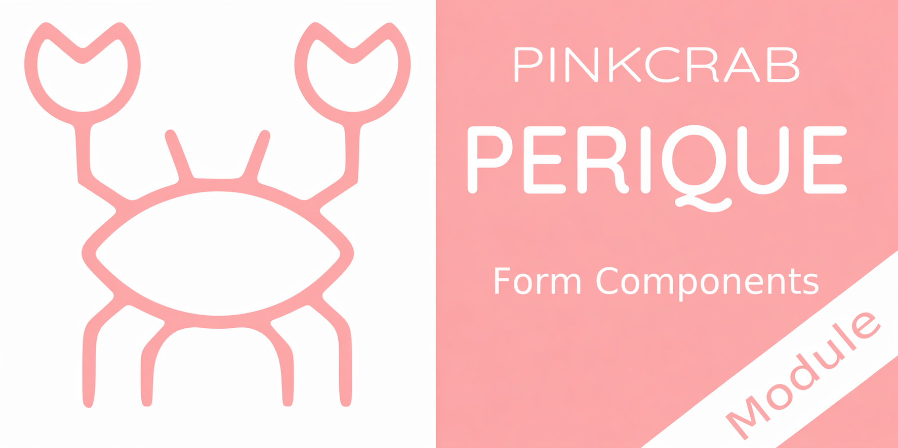

# Perique - Form Components

A collection of View Components for rendering form fields in the Perique Framework. Build forms with a fluent PHP API, automatic HTML rendering, built-in sanitization and validation.

[](https://packagist.org/packages/pinkcrab/form-components) [](https://packagist.org/packages/pinkcrab/form-components) [](https://packagist.org/packages/pinkcrab/form-components) [](https://packagist.org/packages/pinkcrab/form-components) [](https://packagist.org/packages/pinkcrab/form-components)


[![WordPress 6.6 Test Suite [PHP8.0-8.4]](https://github.com/Pink-Crab/Perique-Form-Components/actions/workflows/WP_6_6.yaml/badge.svg)](https://github.com/Pink-Crab/Perique-Form-Components/actions/workflows/WP_6_6.yaml)
[![WordPress 6.7 Test Suite [PHP8.0-8.4]](https://github.com/Pink-Crab/Perique-Form-Components/actions/workflows/WP_6_7.yaml/badge.svg)](https://github.com/Pink-Crab/Perique-Form-Components/actions/workflows/WP_6_7.yaml)
[![WordPress 6.8 Test Suite [PHP8.0-8.4]](https://github.com/Pink-Crab/Perique-Form-Components/actions/workflows/WP_6_8.yaml/badge.svg)](https://github.com/Pink-Crab/Perique-Form-Components/actions/workflows/WP_6_8.yaml)
[![WordPress 6.9 Test Suite [PHP8.0-8.4]](https://github.com/Pink-Crab/Perique-Form-Components/actions/workflows/WP_6_9.yaml/badge.svg)](https://github.com/Pink-Crab/Perique-Form-Components/actions/workflows/WP_6_9.yaml)
[](https://github.com/Pink-Crab/Perique-Form-Components/actions/workflows/E2E.yaml)
[](https://codecov.io/gh/Pink-Crab/Perique-Form-Components)
[](https://scrutinizer-ci.com/g/Pink-Crab/Perique-Form-Components/?branch=master)

****

## Setup

```bash
$ composer require pinkcrab/form-components
```

Register the module in your Perique bootstrap:

```php
use PinkCrab\Form_Components\Module\Form_Components;

( new App_Factory() )
    ->default_setup()
    ->module( Form_Components::class )
    ->boot();
```

****

## Quick Start

Render fields in any Perique view template:

```php
use PinkCrab\Form_Components\Component\Field\Input_Component;
use PinkCrab\Form_Components\Element\Field\Input\Text;

$this->component( new Input_Component(
    Text::make( 'username' )
        ->label( 'Username' )
        ->placeholder( 'Enter your username' )
        ->required( true )
) );
```

Or use the `Make` helper for a more concise syntax:

```php
use PinkCrab\Form_Components\Util\Make;

$this->component( Make::text( 'username', fn( $f ) => $f
    ->label( 'Username' )
    ->placeholder( 'Enter your username' )
    ->required( true )
) );
```

### Building a Complete Form

```php
use PinkCrab\Form_Components\Util\Make;
use PinkCrab\Form_Components\Element\Field\Input\{Text, Email, Tel, Hidden};
use PinkCrab\Form_Components\Element\Field\{Select, Textarea};
use PinkCrab\Form_Components\Element\Field\Group\Radio_Group;
use PinkCrab\Form_Components\Element\{Fieldset, Form, Nonce, Button, Raw_HTML};

$this->component( Make::form( 'enquiry', fn( $f ) => $f
    ->method( 'POST' )
    ->action( '/submit' )
    ->fields(
        // Raw HTML for intro text
        Raw_HTML::make( 'intro' )
            ->html( '<p>Fill in the form below and we will get back to you.</p>' ),

        // Fieldset groups related fields
        Fieldset::make( 'personal' )
            ->legend( 'Your Details' )
            ->fields(
                Text::make( 'name' )->label( 'Name' )->required( true ),
                Email::make( 'email' )->label( 'Email' )->required( true ),
                Tel::make( 'phone' )->label( 'Phone' )->placeholder( '+44 7700 900000' )
            ),

        // Select and radio group
        Select::make( 'subject' )
            ->label( 'Subject' )
            ->options( array(
                ''        => 'Select...',
                'sales'   => 'Sales Enquiry',
                'support' => 'Support',
                'other'   => 'Other',
            ) )
            ->required( true ),

        Radio_Group::make( 'priority' )
            ->label( 'Priority' )
            ->options( array(
                'low'    => 'Low',
                'medium' => 'Medium',
                'high'   => 'High',
            ) )
            ->selected( 'medium' ),

        Textarea::make( 'message' )
            ->label( 'Message' )
            ->rows( 5 )
            ->required( true ),

        // Hidden field and nonce for security
        Hidden::make( 'form_id' )->set_existing( 'enquiry-v1' ),
        Nonce::make( 'submit_enquiry', '_enquiry_nonce' ),

        Button::make( 'submit' )->type( 'submit' )->text( 'Send Enquiry' )
    )
) );
```

<details markdown="1">
<summary>Generated HTML</summary>

```html
<!-- Classes abbreviated with ".." for readability. See field docs for full class output. -->
<form class=".." method="POST" action="/submit">
    <p>Fill in the form below and we will get back to you.</p>

    <fieldset>
        <legend class="..">Your Details</legend>
        <div id="form-field_name" class="..">
            <label for="name" class="..">Name</label>
            <input type="text" name="name" class=".." required="" />
        </div>
        <div id="form-field_email" class="..">
            <label for="email" class="..">Email</label>
            <input type="email" name="email" class=".." required="" />
        </div>
        <div id="form-field_phone" class="..">
            <label for="phone" class="..">Phone</label>
            <input type="tel" name="phone" class=".." placeholder="+44 7700 900000" />
        </div>
    </fieldset>

    <div id="form-field_subject" class="..">
        <label for="subject" class="..">Subject</label>
        <select name="subject" class=".." required="">
            <option value="">Select...</option>
            <option value="sales">Sales Enquiry</option>
            <option value="support">Support</option>
            <option value="other">Other</option>
        </select>
    </div>

    <div id="form-field_priority" class="..">
        <legend>Priority</legend>
        <label class="..">
            <input type="radio" name="priority" value="low" /> Low
        </label>
        <label class="..">
            <input type="radio" name="priority" value="medium" checked /> Medium
        </label>
        <label class="..">
            <input type="radio" name="priority" value="high" /> High
        </label>
    </div>

    <div id="form-field_message" class="..">
        <label for="message" class="..">Message</label>
        <textarea name="message" class=".." rows="5" required=""></textarea>
    </div>

    <input type="hidden" name="form_id" value="enquiry-v1" />
    <input type="hidden" name="_enquiry_nonce" value="..." />

    <div id="form-field_submit" class="..">
        <button type="submit" name="submit" class="..">Send Enquiry</button>
    </div>
</form>
```
</details>

****

## Field Types

### Text Inputs

| Field | Class | Make Helper | Docs |
|-------|-------|-------------|------|
| Text | `Input\Text` | `Make::text()` | [View](docs/fields/text) |
| Email | `Input\Email` | `Make::email()` | [View](docs/fields/email) |
| Password | `Input\Password` | `Make::password()` | [View](docs/fields/password) |
| Search | `Input\Search` | `Make::search()` | [View](docs/fields/search) |
| Tel | `Input\Tel` | `Make::tel()` | [View](docs/fields/tel) |
| URL | `Input\Url` | `Make::url()` | [View](docs/fields/url) |

### Numeric Inputs

| Field | Class | Make Helper | Docs |
|-------|-------|-------------|------|
| Number | `Input\Number` | `Make::number()` | [View](docs/fields/number) |
| Range | `Input\Range` | `Make::range()` | [View](docs/fields/range) |

### Date & Time Inputs

| Field | Class | Make Helper | Docs |
|-------|-------|-------------|------|
| Date | `Input\Date` | `Make::date()` | [View](docs/fields/date) |
| Time | `Input\Time` | `Make::time()` | [View](docs/fields/time) |
| Datetime | `Input\Datetime` | `Make::datetime()` | [View](docs/fields/datetime) |
| Month | `Input\Month` | `Make::month()` | [View](docs/fields/month) |
| Week | `Input\Week` | `Make::week()` | [View](docs/fields/week) |

### Special Inputs

| Field | Class | Make Helper | Docs |
|-------|-------|-------------|------|
| Color | `Input\Color` | `Make::color()` | [View](docs/fields/color) |
| File | `Input\File` | `Make::file()` | [View](docs/fields/file) |
| Hidden | `Input\Hidden` | `Make::hidden()` | [View](docs/fields/hidden) |
| Checkbox | `Input\Checkbox` | `Make::checkbox()` | [View](docs/fields/checkbox) |
| Radio | `Input\Radio` | `Make::radio()` | [View](docs/fields/radio) |

### Selection Groups

| Field | Class | Make Helper | Docs |
|-------|-------|-------------|------|
| Select | `Field\Select` | `Make::select()` | [View](docs/fields/select) |
| Checkbox Group | `Group\Checkbox_Group` | `Make::checkbox_group()` | [View](docs/fields/checkbox-group) |
| Radio Group | `Group\Radio_Group` | `Make::radio_group()` | [View](docs/fields/radio-group) |

### Other Elements

| Element | Class | Make Helper | Docs |
|---------|-------|-------------|------|
| Textarea | `Field\Textarea` | `Make::textarea()` | [View](docs/fields/textarea) |
| Button | `Element\Button` | `Make::button()` | [View](docs/fields/button) |
| Form | `Element\Form` | `Make::form()` | [View](docs/fields/form) |
| Fieldset | `Element\Fieldset` | `Make::fieldset()` | [View](docs/fields/fieldset) |
| Custom Field | `Element\Custom_Field` | `Make::custom()` | [View](docs/fields/custom-field) |

****

## Change Log

* 2.1.5 - Field templates no longer pass a `null` `before_field` / `after_field` to `wp_kses_post()` when `before()` / `after()` weren't called — the strict empty-string check introduced in 2.1.4 didn't account for the unset (null) case, which triggered a `preg_replace(): Passing null` deprecation on PHP 8.1+. Fixed by checking for both null and empty string. (Issue #25)
* 2.1.4 - Field names containing PHP-style brackets (e.g. `wm_loc_coordinates[0][latlong]`) and case-sensitive characters are now preserved verbatim rather than being mangled by `sanitize_title()`. `before()` / `after()` adornments now render whether `show_wrapper(false)` or `show_wrapper(true)` is set — they were previously dropped when the wrapper was off. (Issue #23)
*2.1.3 - Adds description pre and post fields within the field wrapper.
* 2.1.2 - Fixed label/input accessibility, wrapper class duplication and unnecessary `list` attribute rendering.
* 2.1.1 - Added Custom_Field element for rendering arbitrary HTML with full field treatment (wrapper, label, notifications, configurable kses filtering)
* 2.1.0 - Initial release for Perique 2.1.*
