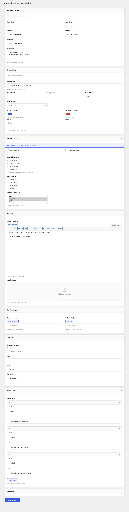
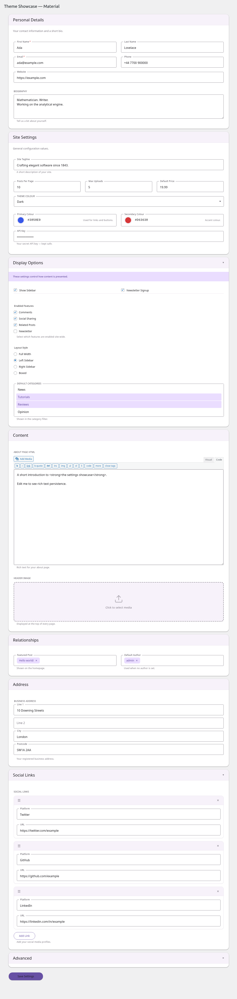
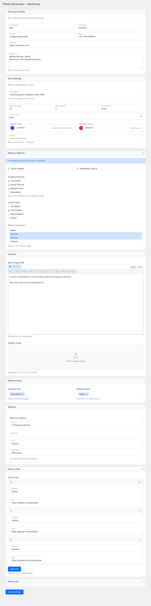
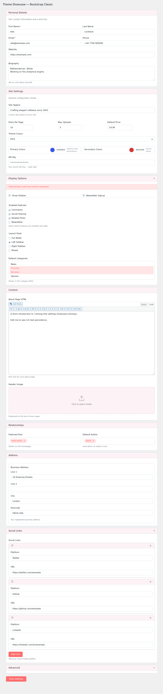
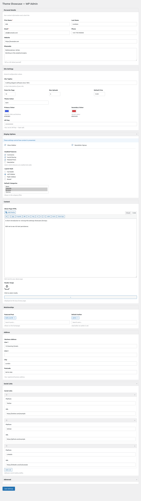
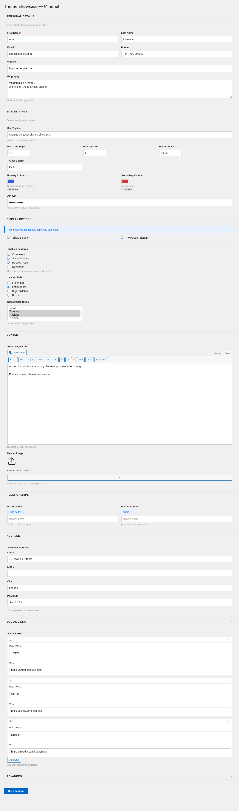

# Themes

Perique Settings Page ships with six bundled visual themes. Each one is a single CSS file layered on top of the always-loaded `core.css` (which only handles structural layout). A theme controls colours, borders, spacing, typography, shadows — all the decorative concerns.

## Picking a theme

Set the theme on any `Settings_Page` subclass via the `$theme_stylesheet` property:

```php
use PinkCrab\Perique_Settings_Page\Page\Settings_Page;

class My_Page extends Settings_Page {

    protected string $theme_stylesheet = Settings_Page::STYLE_MATERIAL;

    // ...
}
```

Available constants on `Settings_Page`:

| Constant | File | Description |
|---|---|---|
| `STYLE_VANILLA` | `assets/themes/vanilla.css` | Default clean modern look |
| `STYLE_MATERIAL` | `assets/themes/material.css` | Material Design 3 with floating labels |
| `STYLE_BOOTSTRAP` | `assets/themes/bootstrap.css` | Bootstrap 5 with floating labels |
| `STYLE_BOOTSTRAP_CLASSIC` | `assets/themes/bootstrap-classic.css` | Bootstrap 5 with classic labels above |
| `STYLE_WP_ADMIN` | `assets/themes/wp-admin.css` | Native WordPress admin |
| `STYLE_MINIMAL` | `assets/themes/minimal.css` | Bare-bones, maximum density |
| `STYLE_NONE` | `''` | No theme — structural only |

You can also pass an absolute file path or a URL for a completely custom theme:

```php
// Absolute path (must be under WP_CONTENT_DIR)
protected string $theme_stylesheet = __DIR__ . '/assets/my-theme.css';

// External URL
protected string $theme_stylesheet = 'https://cdn.example.com/my-theme.css';
```

---

## Vanilla

**Default theme.** Clean, neutral palette with a blue accent, subtle borders, gentle shadows, and static labels above inputs. Intended to look "reasonably modern" without committing to any particular design system.



**Accent:** `#3858e9` (indigo-blue)
**Labels:** static, above inputs
**Sections:** bordered card, subtle shadow
**Radius:** `8px`

---

## Material

**Material Design 3** inspired. Outlined text fields with floating labels that animate to the top border on focus or when the field has a value. Purple accent, soft elevated surfaces, rounded 16px sections.



**Accent:** `#6750a4` (Material purple)
**Labels:** **floating** (inside input → on border)
**Sections:** card with MD3 elevation shadow, no border
**Radius:** `4px` inputs, `16px` sections
**Error icon:** red circle with `!` in the trailing end of failed inputs
**Required:** red asterisk after label

---

## Bootstrap (floating)

**Bootstrap 5** styled with the `.form-floating` pattern. Labels scale and translate to sit inside the top of the input on focus/filled. Standard Bootstrap colour palette and focus rings.



**Accent:** `#0d6efd` (Bootstrap primary)
**Labels:** **floating** (inside input, scales down on focus/filled)
**Sections:** Bootstrap card style
**Radius:** `0.375rem`
**Focus ring:** `0.25rem` outer glow (matches Bootstrap)

---

## Bootstrap Classic

**Bootstrap 5** with traditional non-floating labels (labels above inputs, always visible). Pink accent for a softer, friendlier feel than the blue default.



**Accent:** `#ff6e6e` (pink)
**Labels:** static, above inputs
**Sections:** Bootstrap card style
**Radius:** `0.375rem`
**Best for:** forms where immediate label visibility matters (accessibility audits, older users, dense forms)

---

## WP Admin

Blends with the native WordPress admin look. Small font sizes, WP blue accent, postbox-style sections, left-border notices. Best for plugins that want to feel like part of core WP.



**Accent:** `#2271b1` (WP admin blue)
**Labels:** static, above inputs
**Sections:** WP postbox style (subtle border, no shadow)
**Radius:** `4px`
**Fonts:** 13px WP admin scale
**Best for:** plugin settings that live inside a WP admin menu and should match surrounding core pages

---

## Minimal

Bare-bones visual layer — no shadows, no rounded corners, no background tints. Uppercase section headings, maximum content density. Use when you want structural layout without visual decoration.



**Accent:** `#0066cc`
**Labels:** static, above inputs
**Sections:** single-border rectangle
**Radius:** `0` (sharp corners)
**Best for:** embedded admin tools, internal dashboards, places where the form is one piece of a larger interface

---

## Core vs theme split

Every theme sits on top of `assets/core.css` which handles structural concerns only — layout, flex, grid, positioning, drag states. Visual decoration (colours, borders, shadows, typography) lives entirely in the theme file.

That split means a broken theme can only break how the form *looks*, not how it works. Validation still runs, repeater rows still add/remove, pickers still search, dropdowns still position correctly.

If you write a custom theme, you only need to style the visual layer — don't re-implement any of the layout rules from core.

---

## Regenerating screenshots

The screenshots above are produced by `tests/e2e/specs/admin/theme-screenshots.spec.js`. To rebuild:

```
WP_BASE_URL=http://localhost:57894 npm run test:e2e -- -g "Screenshot:"
```

Output lands in `docs/screenshots/`.
