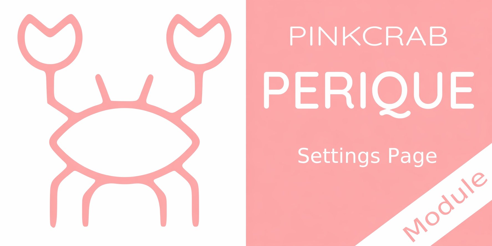

# Perique - Settings Page

Build admin settings pages for the Perique Framework with a fluent PHP API. Define fields, layouts, themes and validation in pure PHP; the library handles persistence, sanitisation and rendering via Form Components.



[](https://packagist.org/packages/pinkcrab/perique-settings-page) [](https://packagist.org/packages/pinkcrab/perique-settings-page) [](https://packagist.org/packages/pinkcrab/perique-settings-page) [](https://packagist.org/packages/pinkcrab/perique-settings-page) [](https://packagist.org/packages/pinkcrab/perique-settings-page)


[![WordPress 6.6 Test Suite [PHP8.0-8.4]](https://github.com/Pink-Crab/Perique-Settings-Page/actions/workflows/WP_6_6.yaml/badge.svg)](https://github.com/Pink-Crab/Perique-Settings-Page/actions/workflows/WP_6_6.yaml)
[![WordPress 6.7 Test Suite [PHP8.0-8.4]](https://github.com/Pink-Crab/Perique-Settings-Page/actions/workflows/WP_6_7.yaml/badge.svg)](https://github.com/Pink-Crab/Perique-Settings-Page/actions/workflows/WP_6_7.yaml)
[![WordPress 6.8 Test Suite [PHP8.0-8.4]](https://github.com/Pink-Crab/Perique-Settings-Page/actions/workflows/WP_6_8.yaml/badge.svg)](https://github.com/Pink-Crab/Perique-Settings-Page/actions/workflows/WP_6_8.yaml)
[![WordPress 6.9 Test Suite [PHP8.0-8.4]](https://github.com/Pink-Crab/Perique-Settings-Page/actions/workflows/WP_6_9.yaml/badge.svg)](https://github.com/Pink-Crab/Perique-Settings-Page/actions/workflows/WP_6_9.yaml)
[](https://github.com/Pink-Crab/Perique-Settings-Page/actions/workflows/E2E.yaml)
[](https://codecov.io/gh/Pink-Crab/Perique-Settings-Page)
[](https://scrutinizer-ci.com/g/Pink-Crab/Perique-Settings-Page/?branch=master)

****

> Requires Perique Framework **2.1.\*** or newer. Not compatible with older versions.

## Setup

```bash
$ composer require pinkcrab/perique-settings-page
```

Register the module in your Perique bootstrap:

```php
use PinkCrab\Perique\Application\App_Factory;
use PinkCrab\Perique_Admin_Menu\Module\Admin_Menu;
use PinkCrab\Form_Components\Module\Form_Components;
use PinkCrab\Perique_Settings_Page\Registration\Settings_Page_Module;

( new App_Factory() )
    ->default_setup()
    ->module( Form_Components::class )
    ->module( Admin_Menu::class )
    ->module( Settings_Page_Module::class )
    ->boot();
```

### Depends on

* [PinkCrab Perique Framework](https://github.com/Pink-Crab/Perique-Framework) `2.1.*`
* [PinkCrab Perique Admin Menu](https://github.com/Pink-Crab/Perique-Admin-Menu) `2.1.*`
* [PinkCrab Form Components](https://github.com/Pink-Crab/Perique-Form-Components) `2.1.*`

****

## Quick Start

Two classes are required: an `Abstract_Settings` subclass holding the field definitions, and a `Settings_Page` subclass that renders the admin page.

**Settings class:**

```php
use PinkCrab\Perique_Settings_Page\Setting\Abstract_Settings;
use PinkCrab\Perique_Settings_Page\Setting\Setting_Collection;
use PinkCrab\Perique_Settings_Page\Setting\Field\Text;
use PinkCrab\Perique_Settings_Page\Setting\Field\Select;

class Acme_Settings extends Abstract_Settings {

    protected function is_grouped(): bool {
        return true;
    }

    public function group_key(): string {
        return 'acme_settings';
    }

    protected function fields( Setting_Collection $settings ): Setting_Collection {
        return $settings->push(
            Text::new( 'site_name' )
                ->set_label( 'Site Name' )
                ->set_required(),

            Select::new( 'theme' )
                ->set_label( 'Default Theme' )
                ->set_option( 'light', 'Light' )
                ->set_option( 'dark', 'Dark' )
        );
    }
}
```

**Page class:**

```php
use PinkCrab\Perique_Settings_Page\Page\Settings_Page;

class Acme_Settings_Page extends Settings_Page {

    protected $parent_slug = 'options-general.php';
    protected $page_slug   = 'acme_settings';
    protected $menu_title  = 'Acme Settings';
    protected $page_title  = 'Acme Plugin Settings';

    protected string $theme_stylesheet = Settings_Page::STYLE_VANILLA;

    public function settings_class_name(): string {
        return Acme_Settings::class;
    }
}
```

Register the page through the Admin Menu module as normal. The settings object is resolved via the DI container, so you can type-hint dependencies on the constructor.

### Registering inside an Abstract_Group

A `Settings_Page` may live inside an [`Abstract_Group`](https://github.com/Pink-Crab/Perique_Admin_Menu/blob/master/docs/group.md) (`$primary_page` or `$pages`) without also being listed in `App::registration_classes()`. The module subscribes to admin-menu's `Hooks::GROUPS_PROCESSED` action and auto-wires the same DI rules (`shared` settings instance + `set_settings()` call rule) for every `Settings_Page` subclass it discovers inside a Group.

```php
use PinkCrab\Perique_Admin_Menu\Group\Abstract_Group;

class Acme_Group extends Abstract_Group {
    protected $group_title  = 'Acme';
    protected $primary_page = Acme_Settings_Page::class;
    protected $pages        = array( Acme_Settings_Page::class, Acme_Help_Page::class );
}

// In your plugin bootstrap — only the Group needs to be registered.
$app->registration_classes( array( Acme_Group::class ) );
```

A page may appear in both `registration_classes()` AND inside a Group's `$pages` without registering twice — admin-menu's `Group_Page_Registry` (introduced in `pinkcrab/perique-admin-menu` 2.1.1) claims the page on the Group's behalf and the single-page registration path short-circuits.

> Requires `pinkcrab/perique-admin-menu` 2.1.1 or later. Plain `Menu_Page` subclasses inside a Group are unaffected — only `Settings_Page` subclasses receive the auto-wiring.

****

## Building a Complete Settings Page

A fuller example using layouts, a custom theme, a repeater and field validation.

```php
use PinkCrab\Perique_Settings_Page\Setting\Abstract_Settings;
use PinkCrab\Perique_Settings_Page\Setting\Setting_Collection;
use PinkCrab\Perique_Settings_Page\Setting\Field\{ Text, Email, Phone, Select, Checkbox, Repeater, Media_Library, Colour };
use PinkCrab\Perique_Settings_Page\Setting\Layout\{ Section, Row, Grid, Stack, Divider, Notice };
use Respect\Validation\Validator as v;

class Contact_Settings extends Abstract_Settings {

    protected function is_grouped(): bool {
        return true;
    }

    public function group_key(): string {
        return 'acme_contact';
    }

    protected function fields( Setting_Collection $settings ): Setting_Collection {
        return $settings->push(
            Notice::info( 'These details appear in the site footer.' ),

            Section::of(
                Row::of(
                    Text::new( 'company_name' )->set_label( 'Company Name' )->set_required(),
                    Email::new( 'support_email' )
                        ->set_label( 'Support Email' )
                        ->set_validate( v::email() )
                )->sizes( 2, 1 ),

                Phone::new( 'support_phone' )->set_label( 'Support Phone' )
            )
                ->title( 'Contact Information' )
                ->description( 'Primary channels for customer support.' ),

            Section::of(
                Grid::of(
                    Media_Library::new( 'logo' )->set_label( 'Brand Logo' ),
                    Colour::new( 'brand_colour' )->set_label( 'Brand Colour' )
                )->columns( 2 ),

                Divider::make(),

                Repeater::new( 'social_links' )
                    ->set_label( 'Social Links' )
                    ->add_field( Text::new( 'label' )->set_label( 'Label' ) )
                    ->add_field( Text::new( 'url' )->set_label( 'URL' ) )
            )
                ->title( 'Branding' )
                ->collapsible()
        );
    }
}
```

****

## Settings API

All settings classes extend `Abstract_Settings` and implement three required methods.

### Required methods

| Method | Description |
|---|---|
| `fields( Setting_Collection $settings ): Setting_Collection` | Return the collection with all fields and layouts pushed in. |
| `is_grouped(): bool` | `true` to save under a single option key, `false` to save each field as its own option. |
| `group_key(): string` | When grouped, the option name. When not grouped, the key prefix. |

```php
use PinkCrab\Perique_Settings_Page\Setting\Abstract_Settings;
use PinkCrab\Perique_Settings_Page\Setting\Setting_Collection;
use PinkCrab\Perique_Settings_Page\Setting\Field\{ Text, Number };

class My_Settings extends Abstract_Settings {

    // true  → stored as one associative array under group_key().
    // false → each field stored as its own option, prefixed with group_key().
    protected function is_grouped(): bool {
        return true;
    }

    // When grouped: the wp_options name that holds the whole array.
    // When ungrouped: the prefix added to every field's option name.
    public function group_key(): string {
        return 'acme_settings';
    }

    // Build the field collection. Runs once at construction.
    protected function fields( Setting_Collection $settings ): Setting_Collection {
        return $settings->push(
            Text::new( 'site_name' )->set_label( 'Site Name' )->set_required(),
            Number::new( 'api_limit' )->set_label( 'API Limit' )->set_min( 1 )
        );
    }
}
```

### Value access methods

| Method | Description |
|---|---|
| `get( string $key, $fallback = null )` | Return the current value for a field, or the fallback. |
| `set( string $key, $data ): bool` | Persist a new value for a field. Returns `true` on success. |
| `has( string $key ): bool` | Whether a field with that key exists. |
| `find( string $key ): Field\|Field_Group\|null` | Return the field instance, or `null`. |
| `delete( string $key ): ?bool` | Remove the stored value. Returns `null` if the field doesn't exist. |
| `get_keys(): array` | All field keys, including those nested inside layouts. |
| `get_all_fields(): array` | All `Field` / `Field_Group` instances, flattened. |
| `export(): array` | The full `Setting_Collection` as an array (layouts intact). |
| `refresh_settings(): void` | Re-hydrate every field from the repository. |
| `prefix_key( string $key ): string` | Returns `"{group_key}_{key}"`. |


****

## Settings Page API

All pages extend `Settings_Page` (which extends `Menu_Page` from the Admin Menu module).

### Properties

| Property | Type | Description |
|---|---|---|
| `$parent_slug` | `string` | Parent menu slug (e.g. `options-general.php`). Inherited from `Menu_Page`. |
| `$page_slug` | `string` | Unique page slug. Inherited from `Menu_Page`. |
| `$menu_title` | `string` | Label in the admin menu. Inherited from `Menu_Page`. |
| `$page_title` | `string` | `<title>` and `<h1>` for the page. Inherited from `Menu_Page`. |
| `$position` | `int` | Menu position. Inherited from `Menu_Page`. |
| `$capability` | `string` | Required capability. Inherited from `Menu_Page`. |
| `$theme_stylesheet` | `string` | Theme identifier. One of the `STYLE_*` constants, or an absolute path / URL. Default `STYLE_VANILLA`. |
| `$method` | `string` | `'POST'` or `'GET'`. Default `'POST'`. |
| `$pre_template` | `?string` | View template rendered inside `.wrap`, above the form. |
| `$pre_data` | `array` | Data passed to `$pre_template`. |
| `$post_template` | `?string` | View template rendered inside `.wrap`, below the form. |
| `$post_data` | `array` | Data passed to `$post_template`. |

```php
use PinkCrab\Perique_Settings_Page\Page\Settings_Page;

class My_Settings_Page extends Settings_Page {

    // From Menu_Page — where this page sits in the admin menu.
    protected $parent_slug = 'options-general.php';
    protected $page_slug   = 'acme_settings';
    protected $menu_title  = 'Acme Settings';
    protected $page_title  = 'Acme Plugin Settings';
    protected $position    = 25;
    protected $capability  = 'manage_options';

    // Which bundled theme to load — STYLE_* constant, absolute path, or URL.
    protected string $theme_stylesheet = Settings_Page::STYLE_MATERIAL;

    // Form method. POST is the default and what you'll want 99% of the time.
    protected string $method = 'POST';

    // Optional view templates rendered inside .wrap (above and below the form).
    protected ?string $pre_template = 'admin/intro';
    protected array   $pre_data     = array( 'version' => '2.1' );
    protected ?string $post_template = 'admin/footer';
    protected array   $post_data     = array();

    public function settings_class_name(): string {
        return My_Settings::class;
    }
}
```

### Theme constants

| Constant | File |
|---|---|
| `Settings_Page::STYLE_VANILLA` | `assets/themes/vanilla.css` |
| `Settings_Page::STYLE_MATERIAL` | `assets/themes/material.css` |
| `Settings_Page::STYLE_BOOTSTRAP` | `assets/themes/bootstrap.css` |
| `Settings_Page::STYLE_BOOTSTRAP_CLASSIC` | `assets/themes/bootstrap-classic.css` |
| `Settings_Page::STYLE_WP_ADMIN` | `assets/themes/wp-admin.css` |
| `Settings_Page::STYLE_MINIMAL` | `assets/themes/minimal.css` |
| `Settings_Page::STYLE_NONE` | No theme (structural CSS only). |

See [docs/themes.md](docs/themes) for the full visual guide.

### Methods

| Method | Description |
|---|---|
| `settings_class_name(): string` | **Abstract.** Fully qualified class name of the matching `Abstract_Settings` subclass. |
| `scripts(): void` | Override to enqueue custom scripts. |
| `styles(): void` | Override to enqueue custom styles. |
| `before_render(): void` | Override to populate `$pre_template` / `$post_template` at render time. |
| `set_pre_template( string $template, array $data = [] ): static` | Fluent setter for the above-form template. |
| `set_post_template( string $template, array $data = [] ): static` | Fluent setter for the below-form template. |
| `get_method(): string` | Current form method. |
| `get_submit_label(): string` | Label on the submit button (override to change). |
| `get_form_action(): string` | Form `action` attribute (defaults to empty — posts to self). |
| `get_nonce_handle(): string` | Nonce handle used for form verification. |
| `get_nonce_field_name(): string` | Nonce field name (`pc_settings_nonce`). |
| `get_settings(): ?Abstract_Settings` | Access the injected settings instance. |
| `get_theme_stylesheet(): string` | Current theme identifier. |

```php
use PinkCrab\Perique_Settings_Page\Page\Settings_Page;

class My_Settings_Page extends Settings_Page {

    protected $page_slug = 'acme_settings';

    // Required — the Abstract_Settings subclass this page renders.
    // Constructed via the DI container so you can type-hint dependencies.
    public function settings_class_name(): string {
        return My_Settings::class;
    }

    // Override the default 'Save Settings' label.
    public function get_submit_label(): string {
        return 'Save Acme Configuration';
    }

    // Send the form to a custom endpoint. Default '' posts to self.
    public function get_form_action(): string {
        return admin_url( 'admin-post.php?action=acme_save' );
    }

    // Enqueue extra scripts for this page.
    protected function scripts(): void {
        wp_enqueue_script(
            'acme-admin',
            plugins_url( 'assets/admin.js', __FILE__ ),
            array( 'pc-settings-page' ),
            '1.0.0',
            true
        );
    }

    // Enqueue extra styles for this page.
    protected function styles(): void {
        wp_enqueue_style(
            'acme-admin',
            plugins_url( 'assets/admin.css', __FILE__ ),
            array( 'pc-settings-page-theme' ),
            '1.0.0'
        );
    }

    // Runs inside render_view(), before any HTML is emitted.
    // Use it to populate the pre/post templates with runtime data.
    protected function before_render(): void {
        $settings = $this->get_settings();

        $this->set_pre_template(
            'admin/acme-intro',
            array(
                'site_name' => $settings?->get( 'site_name', 'Acme' ),
            )
        );

        $this->set_post_template(
            'admin/acme-footer',
            array(
                'nonce_name' => $this->get_nonce_field_name(),
                'nonce_key'  => $this->get_nonce_handle(),
            )
        );
    }
}
```

See [docs/settings-facade-pattern.md](docs/settings-facade-pattern) for the rationale behind the split between `Abstract_Settings` (data) and `Settings_Page` (rendering).

****

## Layouts

Layouts are composable containers that control how fields are arranged. All layouts implement `Renderable` and can be nested.

```php
use PinkCrab\Perique_Settings_Page\Setting\Layout\{ Section, Row, Grid, Stack, Divider, Notice };
```

### Section

Visual grouping with title, description and optional collapse behaviour.

```php
Section::of( $field_a, $field_b )
    ->title( 'General' )
    ->description( 'Main configuration.' )
    ->collapsible()         // allow collapse
    ->collapsed()           // start collapsed (implies collapsible)
    ->rtl()                 // right-to-left header layout
    ->gap( '24px' );        // CSS gap between children
```

### Row

Horizontal arrangement using CSS grid.

```php
Row::of( $field_a, $field_b, $field_c )
    ->sizes( 1, 2, 1 )      // fractional column widths (1fr 2fr 1fr)
    ->align( 'center' )     // 'start' | 'center' | 'end' | 'stretch'
    ->gap( '16px' );
```

### Grid

Fixed-column grid.

```php
Grid::of( $a, $b, $c, $d )
    ->columns( 2 )          // number of columns
    ->gap( '16px' );
```

### Stack

Vertical stack (default gap `0`).

```php
Stack::of( $a, $b, $c )
    ->gap( '8px' );
```

### Divider

Horizontal rule between fields.

```php
Divider::make();
```

### Notice

Info, warning, error or success message inside the form.

```php
Notice::info( 'This page only appears on multisite installs.' );
Notice::warning( 'These changes take effect immediately.' );
Notice::error( 'API key is missing.' );
Notice::success( 'Connection verified.' );
```

****

## Field Types

19 fields, all extending `Field`. See [docs/fields.md](docs/fields) for the full method reference.

| Field | Class | Summary |
|---|---|---|
| Text | `Field\Text` | Single-line text input. |
| Email | `Field\Email` | Email input with browser validation. |
| Phone | `Field\Phone` | Tel input. |
| Url | `Field\Url` | URL input. |
| Password | `Field\Password` | Password input. |
| Textarea | `Field\Textarea` | Multi-line text. |
| Number | `Field\Number` | Numeric input with min/max/step. |
| Hidden | `Field\Hidden` | Hidden value. |
| Select | `Field\Select` | Dropdown, single or multiple. |
| Checkbox | `Field\Checkbox` | Single on/off. |
| Checkbox_Group | `Field\Checkbox_Group` | Multiple checkboxes sharing one key. |
| Radio | `Field\Radio` | Radio group. |
| Colour | `Field\Colour` | HTML5 colour picker. |
| Media_Library | `Field\Media_Library` | WP media library selector. |
| WP_Editor | `Field\WP_Editor` | Full TinyMCE / block editor instance. |
| User_Picker | `Field\User_Picker` | Search and pick one or more users. |
| Post_Picker | `Field\Post_Picker` | Search and pick one or more posts. |
| Repeater | `Field\Repeater` | Repeating set of sub-fields. |
| Field_Group | `Field\Field_Group` | Named group of related fields saved as an array. |

****

## Themes

Six bundled themes, each a single CSS file layered over `core.css`.

| Theme | Constant | Style |
|---|---|---|
| Vanilla | `STYLE_VANILLA` | Neutral default with static labels. |
| Material | `STYLE_MATERIAL` | Material Design 3 with floating labels. |
| Bootstrap | `STYLE_BOOTSTRAP` | Bootstrap 5 with floating labels. |
| Bootstrap Classic | `STYLE_BOOTSTRAP_CLASSIC` | Bootstrap 5 with static labels. |
| WP Admin | `STYLE_WP_ADMIN` | Native WordPress admin look. |
| Minimal | `STYLE_MINIMAL` | Bare-bones, maximum density. |

Custom themes can be loaded via absolute path or URL. See [docs/themes.md](docs/themes) for screenshots and details.

****

## Repositories

Persistence is handled by an implementation of `Setting_Repository`. Four are bundled.

| Repository | Purpose |
|---|---|
| `Repository\WP_Options_Settings_Repository` | Default. Stores each setting as its own row in `wp_options`, or as a grouped array when `is_grouped()` returns `true`. |
| `Repository\WP_Options_Individual_Repository` | Always stores each field as its own option (ignores grouping). |
| `Repository\WP_Options_Named_Groups_Repository` | Always groups all fields under a single option. |
| `Repository\WP_Site_Options_Decorator` | Wraps another repository to read/write via `get_site_option()` / `update_site_option()` for multisite. |

Implement `Setting_Repository` for a custom backend (transients, custom tables, remote API, etc.).

### Default binding & per-class overrides

`Settings_Page_Module` binds `Setting_Repository` to `WP_Options_Settings_Repository` as the default in `pre_boot()`, so a settings class with no constructor override (the example at the top of this README) gets it auto-injected.

Override per settings class via a DI `substitutions` rule — that wins over the default for that one class only:

```php
$container->addRule( My_Settings::class, array(
    'substitutions' => array(
        Setting_Repository::class => WP_Options_Individual_Repository::class,
    ),
) );
```

Decorator stacks compose naturally — substituting `WP_Site_Options_Decorator` for one settings class injects it with the default repo as its inner:

```php
$container->addRule( My_Multisite_Settings::class, array(
    'substitutions' => array(
        Setting_Repository::class => WP_Site_Options_Decorator::class,
    ),
) );
```

If a settings class needs a repository with required constructor args (e.g. `WP_Options_Named_Groups_Repository`), or a hand-built decorator chain, the alternative is to override the settings class's own `__construct()` and pass the built repo to `parent::__construct()`.

> Re-binding `Setting_Repository` itself (`addRule( Setting_Repository::class, [...] )`) is **not** the override path — `pre_boot` runs after consumer DI rules, so an interface-level rebinding gets clobbered. Use per-class `substitutions` instead.

****

## Change Log

* **2.1.1** — Default DI binding for `Setting_Repository` → `WP_Options_Settings_Repository` in `Settings_Page_Module::pre_boot()` (per-class `substitutions` remain the override path). Subscribes to `pinkcrab/perique-admin-menu` 2.1.1's `Hooks::GROUPS_PROCESSED` action so a `Settings_Page` declared only inside an `Abstract_Group`'s `$pages` is auto-wired with `set_settings()` and no longer renders the "Settings not initialised" fallback. Suppresses the WP 6.8 `wp_is_block_theme` notice in the test harness so integration boots stop crashing.
* 2.1.0 — Full rewrite for Perique Framework 2.1. Rendering moved to [Form Components](https://github.com/Pink-Crab/Perique-Form-Components). New layout helpers (Section, Row, Grid, Stack, Divider, Notice). Six bundled themes. Pickers backed by a REST endpoint. Repeater with add / remove / drag-reorder. Full jQuery removal — everything runs on vanilla JS. 648+ unit and integration tests (100% coverage), 70+ Playwright end-to-end tests. Drops support for Perique Framework `< 2.1`.
* 0.1.0 — Initial recreation of the legacy settings page module on top of `WP_Settings_API`.

## License

MIT — http://www.opensource.org/licenses/mit-license.html
