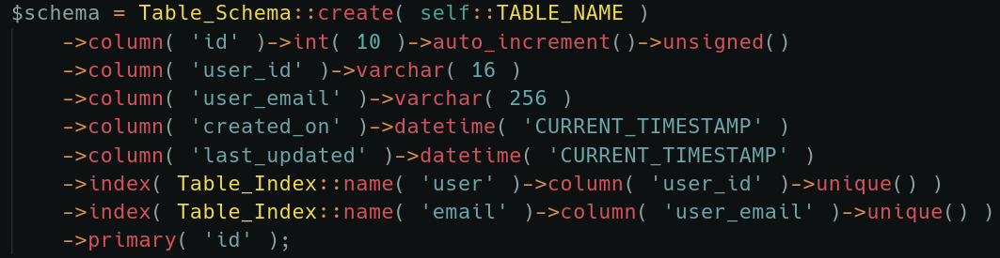

# Table Builder

### **About**

The Table Builder module adds in a more expressive way to create tables in the database. Comes with a handy DB\_Delta builder, making it easy to create tables using WPDB. Both the schema and builders come with Interfaces, so these can be extended to create tables with Mongo, SQLite and more.



[View on GitHub](https://github.com/Pink-Crab/Table-Builder)

### Installation

Table Builder has no other dependencies and can be used outside of WordPress if a custom builder is used over DB\_Delta.

```bash
$ composer require pinkcrab/table_builder
```








